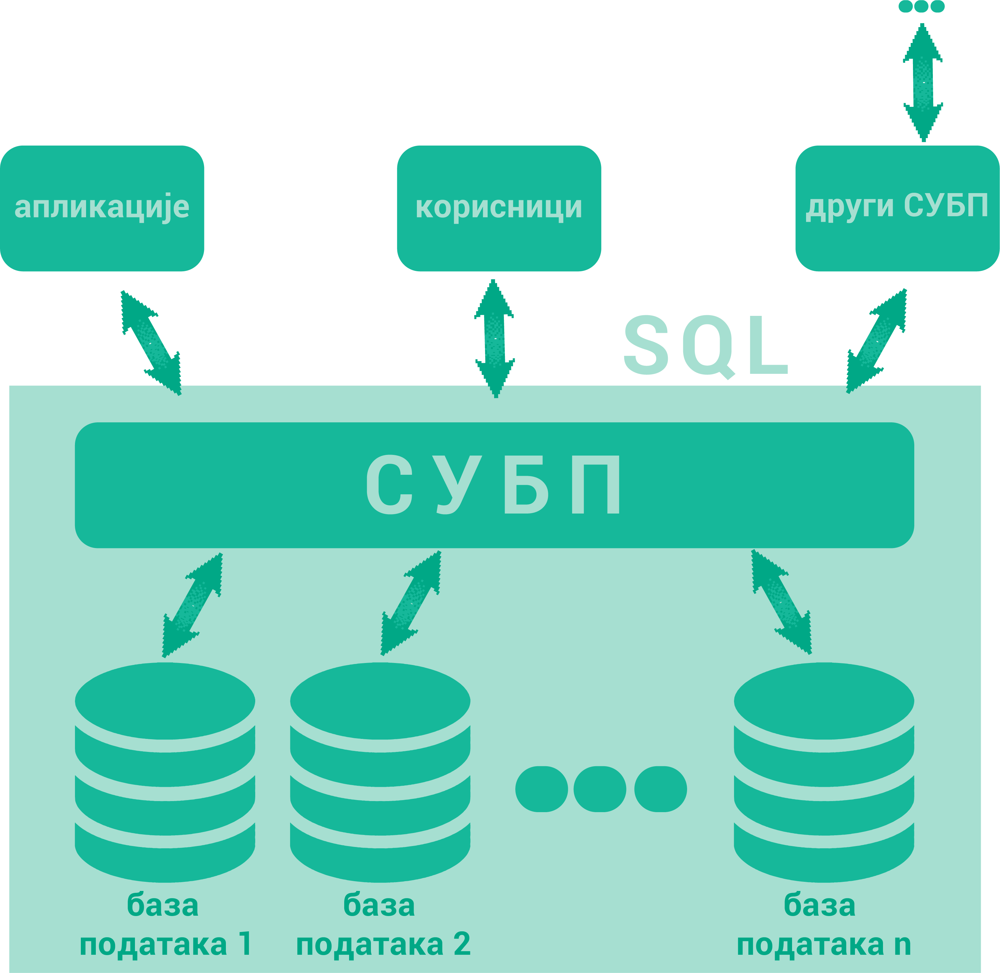

.. -*- mode: rst -*-

Шта су базе података?
=====================

Сигурно користиш неку веб-платформу за гледање филмова, серија или за слушање музике. Да ли ти је некада „искочила“ препорука за неки нови филм, серију или песму, 
a да је то било баш оно што се и теби потом допало? Није у питању случајност. Сваки од ових система проучава велике количине података – прати навике корисника и анализира, 
на пример, које је још филмове и серије гледао неко ко је погледао све што и ти пратиш, и онда ти препоручи баш оно што ће ти се свидети. Ово би био само неки од 
примера употребе база података. Има их још прилично много. Да ли можеш да препознаш где си све дошао у додир са базама података?

О значају података у данашњем свету је било речи и у ранијим разредима. Видели сте да се подаци често записују у табеларном облику. 
Упознали сте се са програмима за табеларна израчунавања (Microsoft Excel, Libreoffice Calc, …), а видели сте и да се табеларно записани подаци 
могу обрађивати и из програмских језика коришћењем специјализованих библиотека (нпр. Pandas) и окружења (нпр. Jupyter). Тиме се подаци обрађују 
много једноставније него када се читају из обичних датотека и складиште у обичним низовима и матрицама.
Ипак озбиљне пословне апликације обично користе податке организоване на посебан начин, тако да различите апликације могу истовремено да користе и 
модификују податке, а подаци могу да се посматрају независно од појединачне апликације. Тако организоване податке зовемо **базом података**. 
Софтверски систем помоћу кога се формира и користи база података се назива **систем за управљање базама података**, скраћено **СУБП** 
(енгл. *database management system*, скраћено *DBMS*). Најпознатији системи за управљање базама података су:

- Oracle Database,
- MySql,
- Microsoft SQL Server,
- PostgreSQL,
- IBM DB2,
- Redis,
- SQLite итд.

Ти системи својим корисницима пружају све услуге рада са подацима. Корисници СУБП су најчешће други програми тј. апликације (на пример пословне, 
мобилне или веб-апликације), али и појединци који приступају подацима у облику у коме су подаци записани у бази (на пример, стручњаци за анализу 
података који у неким случајевима непосредно прегледају и користе податке из базе). Могућ је и сценарио у којима неколико СУБП међусобно комуницирају тј. да један СУБП 
приступа подацима из другог СУБП.

Системи за управљање се брину о смештању података на начин који обезбеђује:

- могућност што ефикаснијег приступа тим подацима у циљу њихове анализе, обраде и ажурирања,
- интегритет тих података (спречавају настанак грешака попут смештања неконзистентних и некоректних података).
- могућност да већи број корисника истовремено користи податке,
- могућност заштите приступа подацима и слично.

Корисници база комуницирају са СУБП коришћењем специјализованих језика у којима формулишу захтеве (тзв. **упите**) на које СУБП одговара. 
Такви језици се називају **упитним језицима**, а најпознатији и најраспрострањенији упитни језик је **SQL** (енгл. *structured query language*).

СУБП уводи поделу посла између програмера који праве сам СУБП и програмера који праве апликације (апликативни програмери). 
То значи да апликативни програмер упите формулише на апстрактном нивоу и не мора да зна све детаље о томе како СУБП те 
податке држи у меморији и датотекама. Апликативни програмер не мора да се бави детаљима ефикасног смештања података и алгоритмима приступа подацима, 
јер је СУБП тај који на основу упита одређује најефикаснији начин да се одређен упит изврши и да апликација добије податке које је захтевала.

Упитни језици су **декларативни**, што значи да се само описује који су подаци потребни, а СУБП је тај који аутоматски одређује како је најбоље доћи до тих података.

Модерни СУБП-и су у стању могу да чувају огромне количине података на начин којитако да је омогућава великом броју корисника омогућено практично истовремено коришћење тих података, 
често коришћењем уз помоћ разнородних рачунарских система. На пример, централизовани електронски дневник на нивоу целе Србије чува податке о стотинама хиљада ученика и милионима 
њихових оцена тако да хиљаде наставника, ученика и родитеља, са својих рачунара, мобилних телефона, таблета и слично, имају практично готово тренутни приступ жељеним подацима 
са својих рачунара, мобилних телефона, таблета и слично.

