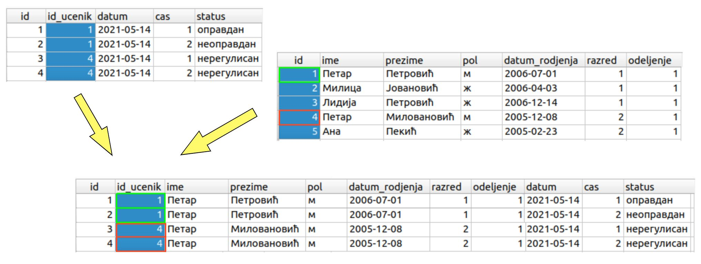
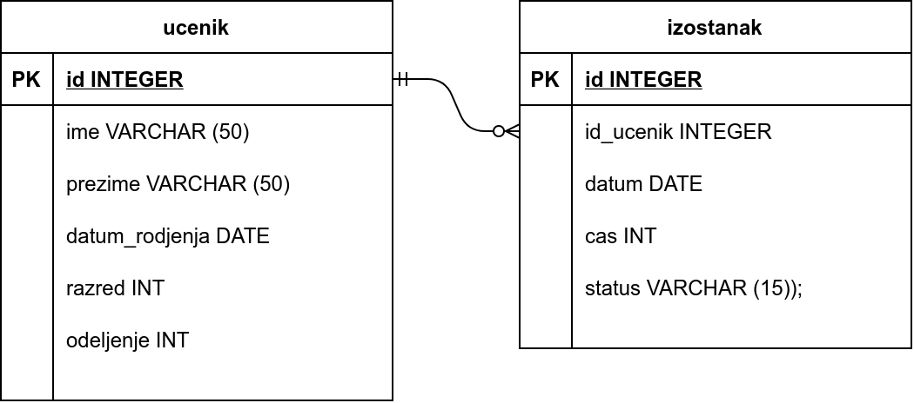
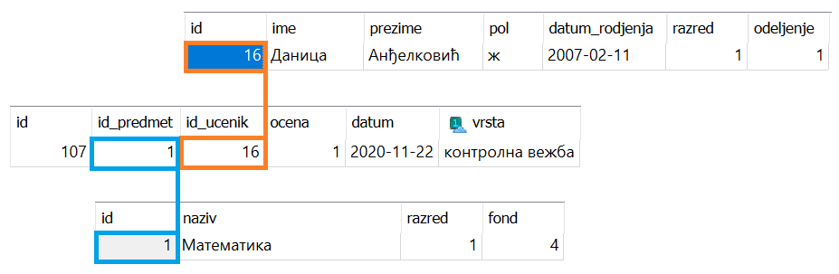
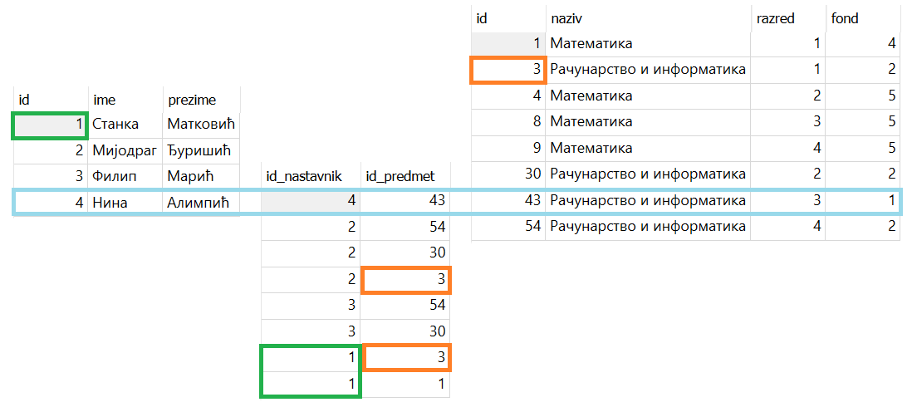

Повезане табеле
---------------

Размислимо како бисмо могли табеларно да представимо све изостанке
које је неки ученик направио током текуће школске године. За сваки
изостанак желимо да прикажемо што више детаља: који је датум у питању,
о ком се часу ради и који је статус тог изостанка (оправдан,
неоправдан, нерегулисан). Проширивање табеле ученика колоном за
изостанке не решава проблем јер, као што смо већ рекли, у ћелијама те
колоне не можемо да истовремено чувамо податке о већем броју
изостанака. Ни додавање више колона није решење. Наиме, свака табела
мора да има фиксиран број колона, па да бисмо покрили све случајеве,
било би потребно онолико колона колико је изостанака могуће
направити.  Ово је врло нерационално коришћење ресурса, јер би ћелије
у тим колонама биле углавном празне. Стога се просто намеће потреба за
тим да изостанке памтимо у посебној табели, где ће се у свакој врсти
бележити подаци тачно о једном изостанку. Поред наведених података о
самом изостанку, врста мора да садржи податке и о ученику који је тај
изостанак направио.

Први покушај једне такве табеле може бити следећи.

.. csv-table::
   :header: "id", "ime", "prezime", "datum", "cas", "status"
   :align: left

   1, Петар, Петровић, 2021-06-09, 1, оправдан
   2, Петар, Петровић, 2021-06-09, 2, оправдан
   3, Петар, Петровић, 2021-06-09, 3, оправдан
   4, Милица, Јовановић, 2021-06-09, 1, неоправдан
   ..., ..., ..., ..., ...

Међутим, овде постоји озбиљан проблем. Наиме, чим се у школи појаве
два ученика који имају исто име и презиме (што је сасвим реална
ситуација), постаје нејасно који је од тих ученика направио изостанак.
Зато делује да у табелу изостанака треба да додамо што више података о
ученику, тј. све што о њему знамо.

.. csv-table::
   :header: "id", "ime", "prezime", "datum_rodjenja", "razred", "odeljenje", "datum", "cas", "status"
   :align: left

   1, Петар, Петровић, 2006-07-01, 1, 1, 2021-06-09, 1, оправдан
   2, Петар, Петровић, 2006-07-01, 1, 1, 2021-06-09, 2, оправдан
   3, Петар, Петровић, 2006-07-01, 1, 1, 2021-06-09, 3, оправдан
   4, Милица, Јовановић, 2006-04-03, 1, 1, 2021-06-09, 1, неоправдан
   ..., ..., ..., ..., ...

Овим смо само увели додатне проблеме, док главни проблем и даље нисмо
у потпуности решили. Наиме, иако је вероватноћа да се у неком одељењу
нађу два ученика који се исто зову и рођени су на исти дан мала, она
није у потпуности занемарива (а ми желимо да наша база података буде
исправна у свим могућим ситуацијама). Осим тога, примећујемо да се
многи подаци непотребно дуплирају. На пример, датум рођења ученика
наведен је уз сваки његов изостанак. Да смо памтили и имена родитеља
ученика, адресу становања и слично, ствар би била још неповољнија. Са
једне стране ово је неефикасно, а са друге стране уводи се могућност
грешке и нарушавања интегритета података (није јасно који је датум
рођења исправан, ако се уз истог ученика у две врсте нађу два
различита датума рођења).

Ако мало боље размотримо овај проблем, онда увиђамо да уз изостанак не
треба памтити све податке о ученику, већ само оне податке који нам
омогућавају да једнозначно одредимо о ком се ученику ради. На овом
месту увиђамо важност примарног кључа који смо увели, јер је у табели
изостанака за сваки изостанак довољно само упамтити примарни кључ
ученика који је направио тај изостанак. У нашем случају то је редни
број, тј. јединствени идентификатор (вредност колоне ``id``) из табеле
ученика.

.. csv-table::
   :header: "id", "id_ucenik", "datum", "cas", "status"
   :align: left

   1, 1, 2021-06-09, 1, оправдан
   2, 1, 2021-06-09, 2, оправдан
   3, 1, 2021-06-09, 3, оправдан
   4, 2, 2021-06-09, 1, неоправдан
   ..., ..., ..., ..., ...

Страни кључ
...........
   
Приликом дефинисања оваквих табела у СУБП јако је важно нагласити да
су вредности у некој колони табеле примарни кључеви унутар
неке друге табеле. Каже се да колоне попут ``id_ucenik`` у табели
изостанака чине **страни кључ**. Дефинисањем страних кључева унутар
СУБП може се осигурати да није могуће да у табели изостанака постоји
изостанак који је придружен ученику који не постоји у табели ученика
(могуће је, на пример, аутоматски забранити да се обрише ученик из
табеле ученика док год постоје изостанци који су му придружени, или да
се приликом брисања тог ученика из табеле ученика и сви његови
изостанци аутоматски избришу).

Иако се подаци о ученицима и изостанцима памте у одвојеним табелама,
подаци из тих табела се, ако је потребно, могу приказати спојено 
коришћењем одговарајућег упита (што ћемо касније учити како се ради).

   Спајање података из две табеле

Нагласимо и да регистровање статуса у облику ниске може довести до
одређених проблема. Осим што текстуални статуси заузимају мало више
меморије него када би се памтили у облику малих целих бројева, они
повећавају вероватноћу да се приликом уноса или претраживања направи
грешка услед погрешног уноса текста, тј. услед грешке у куцању. Могуће
би било направити посебну табелу у којој се статусима придружују
бројеви (нпр. 1 за нерегулисан, 2 за оправдан и 3 за неоправдан), а
онда у табели изостанака памтити бројеве. Ипак, једноставности ради,
то нећемо радити у нашој бази.

Табеле у бази и везе између њих се често представљају
дијаграмима. Једна врста дијаграма која се често користи приликом
пројектовања база података су **дијаграми ентитета и веза**
(енгл. entity-relationship diagram, ERD). На наредној слици је
приказан дијаграм који приказује ученике, изостанке и везу између њих
(што практично директно одговара табелама у нашој бази).

   

Приметимо да између ученика и изостанака постоји следећа веза: сваком
изостанку одговара тачно један ученик (који је направио тај
изостанак), док сваком ученику може да одговара нула или више
изостанака. Овај тип везе називамо веза
**један-према-више**. Најједноставнији начин да се у табелама базе
оствари веза један-према-више између две врсте ентитета је тај да се у
табелу којом се представља једна врста ентитета упише примарни кључ из
табеле којом се представља друга врста ентитета (тј. успостављањем
страног кључа). Још један пример везе *један-према-више* је веза
између ученика и одељења (сваком ученику одговара тачно једно одељење,
док сваком одељењу одговара више ученика). Пошто о одељењима не
памтимо никакве посебне податке, не постоји посебна табела са подацима
о одељењима. Са друге стране, табела ученика садржи колоне „разред“ и
„одељење“, које заправо представљају примарни кључ одељења коме ученик
припада.

Електронски дневник, поред евиденције изостанака, мора да чува и
податке о оценама ученика. Пошто свака оцена припада неком предмету,
јасно је да у нашој бази желимо да чувамо и податке о предметима. Зато
ћемо да оформимо посебну табелу. За сваки предмет знамо назив, разред
у којем се предаје и недељни фонд часова. Назив предмета не може да
буде примарни кључ, јер се неки предмети предају у различитим
разредима (и са различитим фондом часова), а и због типа податка који је текстуални, па ћемо додати 
посебно поље ``id`` у ком ћемо чувати вештачки уведен
јединствени идентификатор (редни број предмета у табели). Пример
садржаја табеле предмета је следећи:

.. csv-table::
   :header: "id", "naziv", "razred", "fond"
   :align: left

   1, Математика, 1, 5
   2, Математика, 2, 4
   3, Српски језик, 1, 3
   4, Биологија, 1, 2
   ..., ..., ..., ...

Рецимо и да је овај модел донекле упрошћен у односу на реалну
ситуацију у нашим средњим школама, јер се предмети могу предавати на
различитим смеровима и образовним профилима, са различитим фондом
часова, но моделовање реалног електронског дневника је компликованији
задатак, који превазилази овај предмет.

На крају, размислимо и о томе како можемо да представимо оцене. Сваки
ученик може да има нула или више оцена, па се намеће да оцене памтимо
у посебној табели, где ће свака врста одговарати једној оцени. За
сваку оцену треба да знамо који ученик ју је добио, из ког предмета,
ког датума и која је врста те оцене (писмени задатак, контролни
задатак, одговарање, итд). Веома слично као и у случају изостанака, у
табели оцена је довољно само чувати примарни кључ табеле ученика,
тј. јединствени идентификатор ученика. Потпуно аналогно, довољно је да
у табели оцена чувамо само примарни кључ, тј. јединствени идентификатор
предмета. Дакле, табела oцена може да има следећи садржај:

.. csv-table::
   :header: "id", "id_ucenik", "id_predmet", "ocena", "datum", "vrsta"
   :align: left

   1, 1, 1, 5, 2021-05-10, писмени задатак
   2, 2, 1, 3, 2021-05-10, писмени задатак
   3, 3, 1, 4, 2021-05-10, писмени задатак
   4, 4, 1, 4, 2021-05-10, писмени задатак
   ..., ..., ..., ..., ..., ...

Прва колона ``id`` је вештачки уведен примарни кључ, тј. јединствени
идентификатор сваке оцене, док су колоне ``id_ucenik`` и
``id_predmet`` страни кључеви у односу на колоне ``id`` у табелама
ученика и предмета.

Дијаграмом ентитета и веза, оваква организација базе се може
представити на следећи начин.

.. image:: ../../_images/ocene_erd.png
   :width: 780
   :align: center
   :alt: Дијаграм ентитета и односа за табелу оцена
   
Између оцена и ученика постоји веза *један-према-више* (свакој оцени
одговара један ученик, док ученик може имати нула или више
оцена). Између оцена и предмета такође постоји веза *један-према-више*
(свакој оцени одговара тачно један предмет, док из сваког предмета
може постојати нула или више оцена). По раније описаном моделу, везе
један-према-више се реализују успостављањем страних кључева (што је и
урађено у табели оцена). 

Ситуација коју смо описали је заправо позната као веза **више-према-више**. 
Један ученик може да добија оцене из више предмета, и из истог предмета више ученика може да буде оцењено. 
За разлику од везе један-према-више, за коју смо видели да се имплементира 
додавањем колоне која је страни кључ у једну од две табеле, оваква веза се увек реализује као засебна табела - 
у овом случају, табела ``ocena``. Поред комбинације кључева која приказује везу више-према-више, 
у овом случају идентификациони број предмета и идентификациони број ученика, ова табела 
садржи и друге податке који описују везу, као што су: коју оцену је добио, ког датума, и путем какве 
врсте оцењивања (да ли је контролна вежба, писмени задатак, усмено одговарање, пројектни рад, домаћи задатак итд).

На следећој слици можемо да видимо како је у бази забележено да је Даница Анђелковић 
добила недовољну оцену на контролној вежби из Математике, 22. новембра 2020. године. 
Као што знате, недовољне оцене се посебно истичу у електронском дневнику и тиме се благовремено скреће пажња ученику, 
родитељу и наставнику да је потребан додатан труд и рад, најчешће у виду добро организоване и осмишљене допунске наставе.
 

Још један пример везе више-према-више је веза између предмета и наставника. 
Типично сваки предмет предаје више наставника, а сваки наставник предаје више предмета. 
Како није могуће у табелу наставника уписати примарни кључ предмета, 
јер наставник може да предаје више предмета, па би за сваки предмет била потребна по једна колона. 
Већ смо видели да таква организација података није добра. Исто тако, није могуће ни у табелу предмета 
уписати примарни кључ наставника, јер исти предмет може да предаје више наставника у различитим одељењима.

Као што смо видели, веза више-према-више се обично реализује увођењем помоћне табеле која садржи два страна кључа 
и остварује две везе један-према-више. На пример, у случају наставника и предмета можемо да уведемо табелу ``predaje``, 
која би садржала примарни кључ наставника и примарни предмета. Ова табела не мора да има додатне колоне које 
описују везу, а не мора да има и посебан идентификатор већ примарни кључ може да буде сложен и да се састоји 
од комбинације идентификационог броја наставника и идентификационог броја предмета. 

На следећој слици је приказан део података из табела ``nastavnik``, ``predaje`` и ``predmet``, а обележено је плавом бојом 
како је у овој релационој бази сачуван податак о томе како наставница Нина Алимпић са идентификатором 4 
предаје Рачунарство и информатику у трећем разреду, предмет са идентификатором 43. Такође је обележено, 
зеленом бојом, да наставница Станка Матковић предаје два предмета и то предмете са идентификаторима 1 и 3, 
а то су редом Математика и Рачунарство и информатика у првом разреду. Наранџастом бојом је обележено да два наставника, 
у различитим одељењима, предају исти предмет са идентификатором 3, а то је  Рачунарство и информатика у првом разреду. 
Уколико погледамо све приказане податке, можемо да видимо да је овим делом базе података приказана следећа подела 
предмета по наставницима. Станка Матковић предаје два предмета, а Нина Алимпић предаје један, како је већ објашњено. 
Филип Марић такође предаје два предмета, Рачунарство и информатику у другом и у трећем разреду. Мијодраг Ђуришић предаје 
три предмета - Рачунарство и информатику у првом, другом и четвртом разреду. 

Наравно, исти принцип важи и у другим базама (не само у електронском дневнику). 
На пример, у случају базе података која, између осталог, садржи и податке о продаји одређених производа, 
веза између рачуна и производа је такође више-према-више. Другим речима, на сваком рачуну може да се 
појави више производа, а сваки производ може да се појави на више рачуна. Зато се за евиденцију продаје 
уводи посебна табела за ставке разних рачуна, а врсте те табеле садрже идентификатор рачуна и идентификатор 
производа као стране кључеве.

Рецимо и да је могуће да се јави и веза један-према-један између две врсте ентитета. У том случају је могуће да 
се они представе јединственом табелом, а могуће је и да се стави страни кључ у једну од те две табеле, 
али тако да се у тој колони не понављају вредности.

