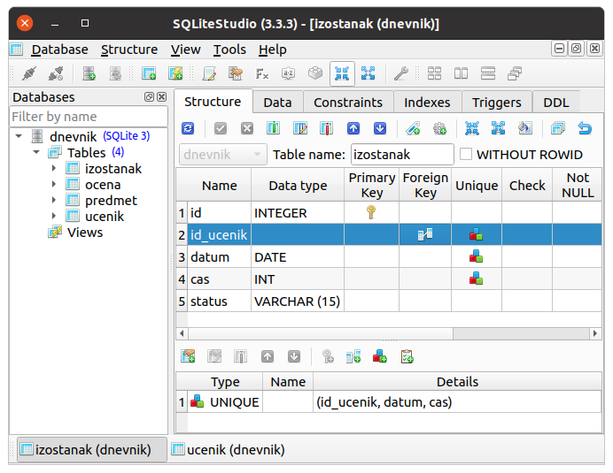

.. -*- mode: rst -*-

SQLite и SQLite Studio
----------------------

Као што смо рекли, постоји велики број што бесплатних, што
комерцијалних СУБП који се користе у развоју савремених апликација. У
наставку ћемо користити СУБП који се назива SQLite,
(https://www.sqlite.org/). Ово је бесплатан софтвер, отвореног кода,
који је због једноставности коришћења и квалитета имплементације данас
у најмасовнијој употреби.

.. learnmorenote:: **Ко жели да зна више...**

   Сваки *Android* и сваки *iPhone* телефон, сваки
   *Windows 10* или *Mac* рачунар, сваки *Firefox*, *Chrome* или *Safari*
   прегледач у својој интерној имплементацији користе SQLite. У
   јуну 2021. године се процењивало да постоји преко :math:`10^{12}` SQLite
   база података које се активно користе.

Систем SQLite целу базу података чува у једном фајлу, тј. за сваку базу података 
коју користимо имамо по један фајл и по називу фајла бирамо базу са којом радимо. 
Друга карактеристичност система SQLite је да може да буде уграђен у апликацију која га користи, 
што значи да корисник не мора да посебно инсталира SQLite, па чак не мора 
ни да зна да апликација користи SQLite.

Начини интеракције са СУБП
..........................

**Апликативни интерфејс**

Сваки сајт за пуштање музике, свака онлајн продавница, електронски дневник, 
свака апликација на мобилном уређају путем које се плаћају рачуни и тако даље, 
користи неку базу података. Уколико размислимо о томе, схватићемо да је сваки 
корисник рачунара и телефона готово свакодневно и корисник неке базе. 
Начин на који ми, корисници рачунара и телефона, приступамо базама података 
је тако што користимо неку апликацију која заправо обавља интеракцију са самом базом.  

Да би то било могуће, неопходно је да постоји начин интеракције са СУБП који ће 
се уградити у апликацију која се креира. Када из својих програма 
приступају базама података, програмери користе апликативни програмски интерфејс, **АПИ**
(енгл. *application programming interface*). И ми ћемо (у склопу изучавања 
веб програмирања коришћењем програмског језика Python) показати како се из Python 
програма приступа SQLite базама података.

Да би наши програми преко АПИ могли да приступају СУБП, обично је потребно да у 
програм укључимо посебан модул односно програмску библиотеку (како се већ зове, зависно о 
ком програмском језику говоримо) која имплементира АПИ за приступ бази. 
Постоје стандардизовани АПИ који омогућавају да апликативни програмер на исти начин 
иницира конекцију према различитим базама или да покрене извршавање упита, али и даље 
обично мора да се у апликацију укључи посебан модул који омогућава рад са конкретним СУБП.

Када је у питању програмски језик Python, већ у стандардној инсталацији програмског 
језика долази модул зa SQLite који се зове ``sqlite3``, и то са уграђеним СУБП за SQLite. 
То значи да, ако програмирате у програмском језику Python није потребно ништа додатно 
да инсталирате да бисте користили SQLite. Модул ``sqlite3`` имплементира стандадну 
спецификацију АПИ-ја за приступ бази која се зове DB-API 2.0, што значи да када научите 
како у Python-у да користите SQLite, на сличан начин ћете моћи да користите и друге релационе базе.

**Кориснички интерфејс**

Сваки СУБП подразумева неколико начина интеракције са својим корисницима. 
Већ смо рекли да СУБП пре свега служи да пружи услугу коришћења база другим програмима, 
па се СУБП заиста најчешће користе путем апликативног програмског интерфејса. Ипак, 
АПИ није и једини начин коришћења базе података преко СУБП. Приликом администрације базе података 
(креирања и подешавања табела, подешавања корисничких налога и права приступа подацима и слично), 
користе се специјализовани административни интерфејси. Они могу бити било **команднолинијски интерфејси**, 
**КЛИ** (енгл. *command line interface*, *CLI*), било **графички кориснички интерфејси**, **ГКИ** (engl. *graphic user interface*, 
*GUI*). С обзиром на то да је коришћење ГКИ удобније и једноставније, нарочито за почетнике, у наставку ћемо се 
бавити искључиво тим начином рада. Сам систем SQLite не пружа ГКИ, међутим, постоји систем који се назива 
SQLite Studio (https://sqlitestudio.pl/), који је бесплатан и који се може једноставно преузети и користити. 

.. technicalnote::

   Током израде овог курса, коришћена је тада актуелна верзија система  `SQLite Studio 3.3.3 <https://github.com/pawelsalawa/sqlitestudio/releases/tag/3.3.3>`_. Курс можете несметано пратити и коришћењем новијих верзија овог система. 

.. technicalnote:: Инсталација

   Систем SQLite Studio који пружа ГКИ за администрирање SQL база података може се бесплатно преузети 
   са веба и инсталирати на разним оперативним системима. SQLite Studio у себи садржи уграђен СУБП за SQLite, 
   тако да не треба ништа додатно инсталирати да бисте могли да креирате нову или приступите постојећој 
   SQLite бази података.

   1. На следећој адреси је можете преузети инсталациони фајл кликом на *Download*: https://sqlitestudio.pl

   .. image:: ../../_images/sql_dl.png
      :width: 600
      :align: center
   
   2. Покрените инсталациони фајл након успешног преузимања и кликните на дугме *Next*.

   .. image:: ../../_images/sql_next.png
      :width: 500
      :align: center

   3. Прихватите уговор о лиценци и кликните на *Next*.

   .. image:: ../../_images/sql_next2.png
      :width: 500
      :align: center

   4. На следећем прозору такође клините на *Next*.

   .. image:: ../../_images/sql_next3.png
      :width: 500
      :align: center

   5. Изаберите директоријум где ће SQLite Studio бити инсталиран и кликните на *Next*. Након тога, опет притисните на *Next* како бисте покренули инсталацију. 

   .. image:: ../../_images/sql_next4.png
      :width: 500
      :align: center

   6. Након успешне инсталације, кликните на *Finish*. Ово ће покренути SQLite Studio уколико је инсталација успешно завршена. 