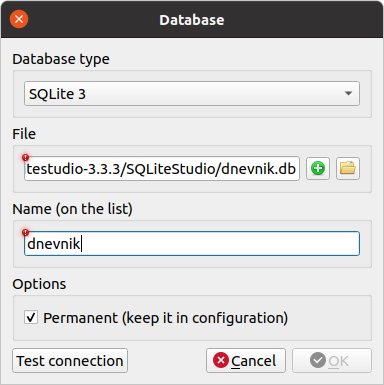
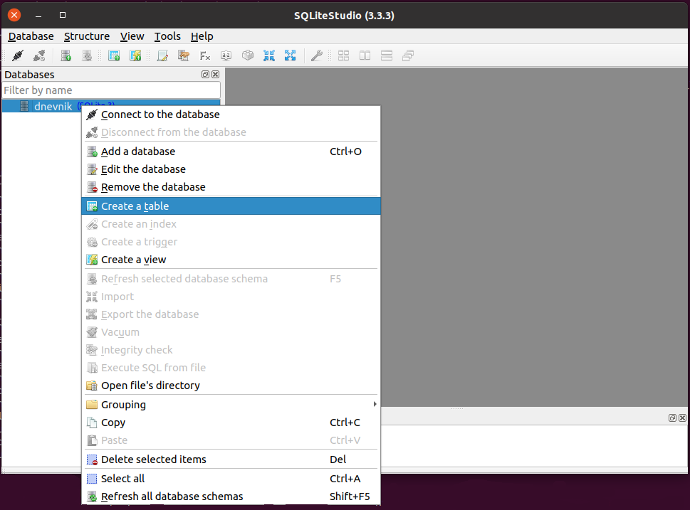
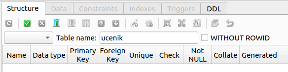
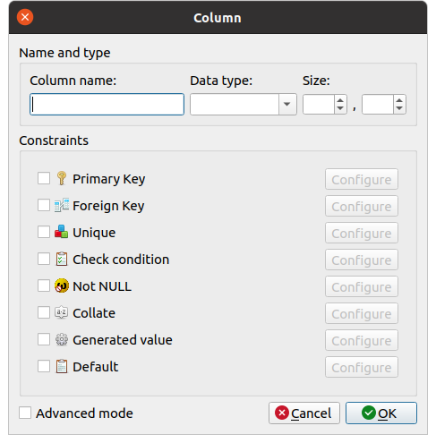
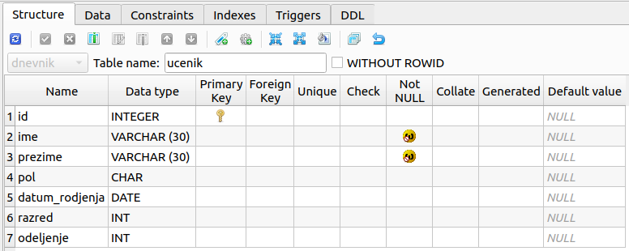
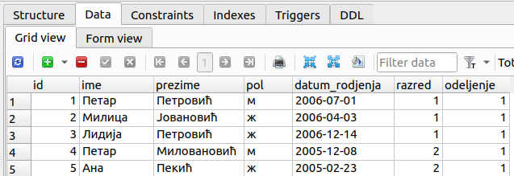
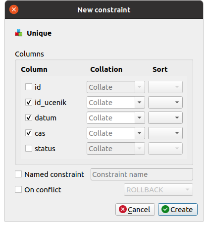

.. -*- mode: rst -*-

Креирање базе података у SQLite Studio
--------------------------------------

SQLite базу података можемо да креирамо из програма SQLite Studio
командом менија ``Database → Add a database``. Приликом креирања базе
потребно је одабрати датотеку у којој ће се та база чувати (ове
датотеке обично имају екстензију ``.db``) и назив под којим ће се база
приказивати у корисничком интерфејсу. Ми ћемо креирати базу у датотеци
``dnevnik.db`` и приказиваће се под називом ``dnevnik``.

Уместо да креирамо нову базу, командом менија ``Database → Add a
database`` можемо и отворити неку постојећу (довољно је одабрати
постојећу датотеку на диску и уписати назив под којим ће се та база
видети у нашем систему).
         
Креирање табела
...............
         
Након креирања базе креираћемо табеле у њој. То се може урадити
командом менија ``Structure → Create a table`` или командом ``Create a
table`` контекстног менија (који се појави након десног клика на назив
базе на паноу ``Databases``).

Након тога се у централном делу прозора појављује пано са неколико
картица који је посвећен уређивању табеле. Подразумевано се приказује
прва картица (``Structure``) која је намењена дефинисању структуре
табеле.

Прво је потребно дефинисати назив табеле (за почетак креирамо табелу
``ucenik``), попуњавањем поља ``Table name``. Измене које се направе
се не уносе у базу одмах, већ тек након команде ``Commit structure
changes``, односно клика на дугме |button_commit|.  Препоручујемо вам
да ово дугме често користите и тиме често уписујете измене у базу, да
их не бисте случајно изгубили, али и да бисте што пре уочили ако
направите неку грешку).

Командом ``Add column`` (која се може покренути кликом на дугме
|button_add_column| или притиском на тастер ``Ins``) додаје се нова
колона у табелу. Приликом додавања сваке нове колоне у табелу потребно
је обавезно одредити јој назив (``Column name``) и тип података у тој
колони (``Data type``).

Постоји велики број различитих типова података, међутим, описаћемо
само неколико најчешће коришћених:

- ``INTEGER`` -- цели бројеви
- ``DOUBLE`` -- реални бројеви (записани у покретном зарезу)
- ``VARCHAR`` -- текстулани подаци (ниске карактера) за које је
  позната максимална дужина
- ``DATE``, ``TIME``, ``DATETIME`` -- датум, време у току дана
  тј. датум и време.

  
Код неких типова података (на пример, код типа ``VARCHAR``) потребно
је навести и величину типа и уписати је у поље ``SIZE``.

Након три основна параметра (``Column name``, ``Data type`` и
``Size``) могуће је конфигурисати додатне опције колона. Опишимо
неколико опција које ћемо користити у наставку.

- ``Primary key`` --- овом опцијом колону која се додаје можемо да
  прогласимо за примарни кључ табеле (ако више колона чини примарни
  кључ, онда се то подешава тек након додавања свих тих
  колона). Додатне опције су доступне након притиска на дугме
  ``Configure``. Једна, прилично често коришћена је ``Autoincrement``
  која се користи код целобројних примарних кључева и која омогућава
  да се приликом уноса врсте у табелу не наведе вредност примарног
  кључа, него да се та вредност аутоматски додели као прва наредна
  слободна вредност. На тај начин се имплементирају генерисани
  идентификатори које смо помињали у претходним лекцијама.

  .. image:: ../../_images/sqlitestudio_primary_key.png
     :width: 300
     :align: center
     :alt: Подешавање примарног кључа у систему SQLite Studio
  
- ``Foreign key`` --- овом опцијом колону која се додаје можемо да
  прогласимо за страни кључ (ако више колона чини исти страни кључ,
  онда се то подешава тек након додавања свих тих колона). Подсетимо
  се, колона је страни кључ ако је свака вредност у тој колони
  примарни кључ у некој другој табели. Зато се приликом подешавања да
  је колона страни кључ бира табела и колона која је њен примарни кључ
  (подразумева се да је та табела већ креирана). Детаљније објашњење
  подешавања страног кључа биће дато кроз пример креирања табеле
  изостанака, мало касније у тексту.

  .. image:: ../../_images/sqlitestudio_foreign_key.png
     :width: 300
     :align: center
     :alt: Подешавање страног кључа у систему SQLite Studio

  
- ``Not null`` --- одабиром ове опције се забрањује да колона садржи
  специјалне недостајуће вредности (``NULL``), које се користе да се
  нагласи да је неки податак непознат (кључеви аутоматски не могу да
  садрже недостајуће вредности, па ову опцију углавном користимо за
  колоне које нису кључеви).
- ``Collate`` --- овом опцијом се подешава поредак текстуалних
  података (тзв. **колациона секвенца**) што директно одређује и
  редослед сортирања елемената колоне. Ако се у колони смештају и
  карактери који нису део енглеске абецеде (тј. који не припадају
  таблици ASCII), тада је пожељно подесити ``Collation name`` да буде
  ``UNICODE`` (то ћемо увек радити када у колони желимо да памтимо
  текст на српском језику, било да је записан латиницом, било
  ћирилицом).

  .. image:: ../../_images/sqlitestudio_collate.png
     :width: 300
     :align: center
     :alt: Подешавање колационе секвенце у систему SQLite Studio
  
- ``Default`` --- одабиром ове опције можемо задати подразумевану
  вредност, која ће бити уписана ако се приликом додавања нове врсте
  вредност ове колоне не наведе.

Користећи описани поступак, можемо да креирамо табелу ``ucenik`` у
нашем минијатурном електронском дневнику.

- Додајемо колону ``id`` за коју бирамо тип ``INTEGER``, штриклирамо
  опцију ``PRIMARY KEY`` и конфигуришемо је тако да буде
  ``AUTOINCREMENT``.
- Додајемо колону ``ime`` за коју бирамо тип ``VARCHAR`` и величину 30
  (чиме ограничавамо дужину имена на 30 карактера), штриклирамо опцију
  ``NOT NULL`` (јер име ученика не сме да буде непознато) и опцију
  ``Collate``, конфигуришући је тако да ``Collation name`` буде
  ``UNICODE`` (јер планирамо да користимо ћирилички запис, као и да
  поредимо и сортирамо ученике на основу имена и презимена у азбучном
  редоследу).
- Додајемо колону ``prezime`` за коју бирамо тип ``VARCHAR`` и
  величину 30 (чиме ограничавамо дужину презимена на 30 карактера),
  штриклирамо опцију ``NOT NULL`` (јер презиме ученика не сме да буде
  непознато) и подешавамо ``Collate`` тако да се користи ``UNICODE``.
- Додајемо колону ``datum_rodjenja`` за коју бирамо тип ``DATE``.
- Додајемо колону ``razred`` за коју бирамо тип ``INTEGER``.
- Додајемо колону ``odeljenje`` за коју бирамо тип ``INTEGER``.

Не треба заборавити да након додавања свих колона (а можда и чешће)
упишемо све измене у базу (дугметом ``Commit structure changes``).

Ако је све прошло како треба, на картици ``Structure`` видеће се
следећи списак колона.

Креирање табеле помоћу језика SQL
.................................

У досадашњем тексту смо описали како изгледа поступак дефинисања
табела у бази помоћу графичког корисничког интерфејса. За почетнике је
овај начин дефинисања табеле сигурно најједноставнији и у наставку
ћемо претпоставити да ће све табеле бити креиране на тај
начин. Међутим, табеле је могуће креирати и коришћењем упитног језика
SQL (и то његовог посебног подскупа који се назива **SQL Data
Definition Language, DDL**). Након креирања табеле помоћу ГКИ, на
картици ``DDL`` можемо да видимо како би се табела могла креирати и
помоћу упита у језику SQL. За табелу ученик то би изгледало овако:

.. code-block:: sql

   CREATE TABLE ucenik (
      id             INTEGER      PRIMARY KEY AUTOINCREMENT,
      ime            VARCHAR (30) NOT NULL COLLATE UNICODE,
      prezime        VARCHAR (30) NOT NULL COLLATE UNICODE,
      pol            CHAR,
      datum_rodjenja DATE,
      razred         INTEGER,
      odeljenje      INTEGER
   );
                

Приметимо да је овај упит облика ``CREATE TABLE naziv (kolone);``, при чему
се за сваку колону наводи назив, тип података и затим додатни услови и
ограничења.
   
Рад са подацима у табели
........................
         
Када је структура табеле дефинисана, могу се у њу уписати и неки
подаци. То се врши на картици ``DATA``.

Додавање врста се врши командом ``Insert row`` (доступном путем
дугмета |button_insert_row| или путем тастера ``insert`` на
тастатури). Када се врста дода, може се попунити подацима (при чему,
оне колоне које имају подешену опцију ``AUTOINCREMENT`` или
подразумевану вредност могу да остану и празне).

Постојеће врсте могу да се ажурирају тако што се просто измени њихов
садржај.

Одабрана (селектована) врста може да се избрише командом ``Delete
selected row`` (доступном путем дугмета |button_delete_row|
или путем тастера ``delete`` на тастатури).

Након што смо задовољни садржајем табеле, потребно је да промене
упишемо у базу, што се врши помоћу команде ``Commit`` (која је
доступна путем дугмета |button_commit| или путем комбинације тастера
``Ctrl`` и ``Enter``).

Командом ``Rollback`` (која је доступна путем дугмета
|button_rollback|, или путем комбинације тастера ``Ctrl`` и
``Backspace``) врши се поништавање свих направљених измена и враћање
табеле у полазно стање.

Пошто је могуће да се стање табеле промени и ван програма SQLite
studio, командом ``Refresh table data`` (која је доступна путем
дугмета |button_refresh| или путем тастера ``F5``) можемо извршити
поновно учитавање свих података у табели из датотеке на диску у којој
се чува база података.

Подешавање додатних ограничења
..............................

Покажимо сада на примеру креирања табеле ``izostanak`` како можемо да
подесимо додатна, сложенија ограничења табеле. Наиме, у табели ученика
подесили смо само примарни кључ и забранили недостајуће вредности у
колонама које садрже име и презиме ученика. У табели изостанака јавља
се страни кључ, а наметнућемо и додатни услов да ученик на једном
школском часу може направити највише један изостанак.

- Креирамо табелу ``izostanak``
 
- Додајемо колону ``id`` типа ``INTEGER``, штриклирамо опцију
  ``PRIMARY KEY`` и конфигуришемо је тако да буде ``AUTOINCREMENT``.
  
- Додајемо колону ``id_ucenik`` типа ``INTEGER`` и подешавамо је тако
  да буде страни кључ у односу на колону ``id`` табеле ``ucenik``.
  Приликом конфигурисања страног кључа бирамо да нам систем забрани да
  обришемо ученика док у табели изостанака постоје његови изостанци
  (опцијом ``ON DELETE RESTRICT``), а да када ажурирамо (изменимо)
  примарни кључ ученика, и у табели изостанака подаци за тог ученика
  буду аутоматски ажурирани (опцијом ``ON UPDATE CASCADE``). Опишимо
  све могуће типове акција које систем може да изврши када примети да
  се нарушава интегритет страног кључа (када се на неки начин мења или
  брише ученик чији изостанци постоје у табели изостанака).

  - Опција ``RESTRICT`` забрањује извођење акције над табелом која би
    нарушила интегритет страног кључа.
  - Опција ``CАSCADE`` подразумева да ће се све промене пропагирати
    (у облику каскаде, тј. степеница), све док се не задовољи
    интегритет страног кључа. Каскадно брисање би подразумевало да
    се у случају брисања ученика аутоматски обришу и сви подаци о
    његовим изостанцима.
  - Опција ``SET NULL`` налаже систему да у табели изостанака на место
    идентификатора ученика упише специјалну недостајућу вредност
    ``NULL``.
  - Опција ``SET DEFAULT`` налаже да у табели изостанака на место
    идентификатора ученика упише подразумевану вредност (под
    претпоставком да је она подешена).
  - Опција ``NO ACTION`` налаже систему да све остави како јесте,
    тј. да не врши никакву акцију у случају да је интегритет страног
    кључа нарушен (ово би требало избегавати, осим ако за то не
    постоји неки посебан разлог).
  
- Додајемо колону ``datum`` типа ``DATE``.
- Додајемо колону ``cas`` типа ``INTEGER``.
- Додајемо колону ``status`` типа ``VARCHAR``, величине 15.
  
Једно ограничење које се природно намеће је то да ученик не може да
током једног часа оствари више од једног изостанка. Можемо, дакле,
гарантовати да не могу да постоје две врсте у табели изостанака у
којима би тројка колона ``(id_ucenik, datum, cas)`` била једнака. Та
тројка једнозначно идентификује изостанак и могла би да буде његов
примарни кључ, међутим, пошто смо увели посебну колону ``id`` у којој
чувамо јединствени идентификатор изостанка, коју смо прогласили за
примарни кључ, поставићемо посебан услов **јединствености** вредности
у ове три колоне (сваки примарни кључ аутоматски има постављен услов
јединствености). То можемо урадити тако што у доњем делу картице
``STRUCTURE`` пронађемо команду ``Add table unique constraint`` (која
је доступна помоћу дугмета |button_unique|) и затим штриклирамо колоне
``id_ucenik``, ``datum`` и ``cas``.

Након креирања табеле ``izostanak`` на картици ``DDL`` можемо да видимо
да је њена дефиниција у језику SQL једнака следећој.

.. code-block:: sql

   CREATE TABLE izostanak (
      id        INTEGER      PRIMARY KEY AUTOINCREMENT,
      id_ucenik              REFERENCES ucenik (id) ON DELETE RESTRICT
                                                    ON UPDATE CАSCADE,
      datum     DATE,
      cas       INT,
      status    VARCHAR (15),
      UNIQUE (id_ucenik, datum, cas)
   );

Преузимање попуњене базе
........................

На основу претходне анализе креирана је и попуњена мала база података.
Она се у овом курсу користи директно користи из прегледача. Са друге
стране, можеш је `преузети <https://petljamediastorage.blob.core.windows.net/root/Media/Default/Kursevi/OnlineNastava/kurs-gim-cetvrti-inf/_static/db/dnevnik.db>`_ и отворити у програму SQLite
Studio.
