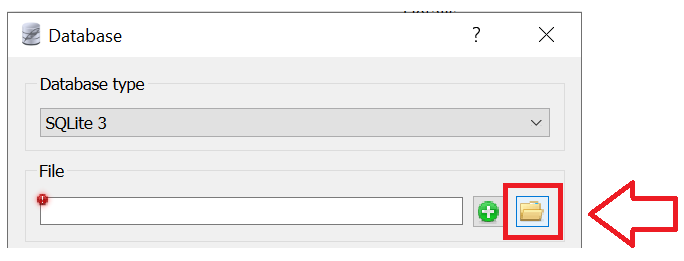

.. -*- mode: rst -*-

Креирање базе података у SQLite Studio - задаци за вежбу
........................................................

Ако још ниси, креирај сада базу података *dnevnik* и у њој табеле *ucenik* и 
*izostanci*, онако како је претходно објашњено.

1. Унеси у табелу ученика податке о следећим ученицима:

   - Петар Петровић, одељење I1, рођен првог јула 2006. године,
   - Милица Јовановић, одељење I1, рођена трећег априла 2006. године,
   - Ана Пекић, одељење II1, рођена двадесет и трећег фебруара 2005. године.

|

2. Унеси у табелу изостанака следеће податке о изостанцима та три ученика:

   - Петар Петровић је оправдано изостао 20. 5. 2021. године са прва
     два часа.
   - Милица Јовановић је неоправдано изостала 21. 5. 2021. године са
     седмог часа.
   - Ана Пекић је изостала са свих седам часова 21. 5. 2021. године и
     ти изостанци су још нерегулисани.

|

3. Креирај табелу ``predmet`` у систему SQLite Studio, у бази
   ``dnevnik``:
   
   - Креирај колону ``id`` целобројног типа и постави је као примарни
     кључ у табели, уз аутоматско увећавање.
   - Креирај колону ``naziv`` чије ћелије садрже карактере (највише 30
     карактера у ћелији).
   - Креирај колону ``razred`` чије ћелије садрже целе бројеве.
   - Креирај колону ``fond`` чије ћелије садрже целе бројеве.
   - Осигурај да ниједна колона не сме да садржи недостајуће
     вредности.

   Унеси у табелу податке о бар неколико предмета (на пример,
   математику, српски језик и физику за сваки од 4. разреда, при чему
   фондове часова одреди онако како је на твом смеру у твојој
   гимназији).

|

4. Креирај табелу ``ocena`` у систему SQLite Studio, у бази
   ``dnevnik``:

   - Креирај колону ``id`` и постави је као примарни кључ у табели, уз
     аутоматско увећавање.
   - Креирај колону ``id_ucenik`` која је страни кључ у односу на
     колону ``id`` у табели ``ucenik``.
   - Креирај колону ``id_predmet`` која је страни кључ у односу на
     колону ``id`` у табели ``predmet``.
   - Креирај колону ``ocena`` целобројног типа.
   - Креирај колону ``datum`` која треба да садржи датум када је
     ученик добио оцену.
   - Креирај колону ``vrsta`` која садржи текстуални опис врсте оцене
     (највише 20 карактера).

|

5. Унеси у табелу оцена податак о томе да је Петар Петровић (раније
   унет у табелу ученика као ученик одељења I1)
   добио 12. 10. 2020. године из математике оцену 4 на контролном
   задатку.

Преузимање попуњене базе
........................

На основу урађене претходне анализе и у складу са овим примерима података креирана је и попуњена мала база података. 
Она се у овом курсу користи директно из прегледача. Са друге стране, можеш је преузети и отворити у програму 
SQLite Studio. 

Након избора команде менија ``Database → Add a database`` одабрати постојећи фајл на диску и уписати назив под 
којим ће се та база видети у нашем систему. Како систем не дозвољава две базе података са истим називом, уколико 
си већ креирао базу података са називом ``dnevnik``, када се преузме нова база, њен назив ће вероватно бити 
аутоматски постављен на ``dnevnik0``. 

Није потребно да обришеш базу коју си креирао да би користио пример који овде можеш да преузмеш, 
али те две базе морају да имају различите називе. 