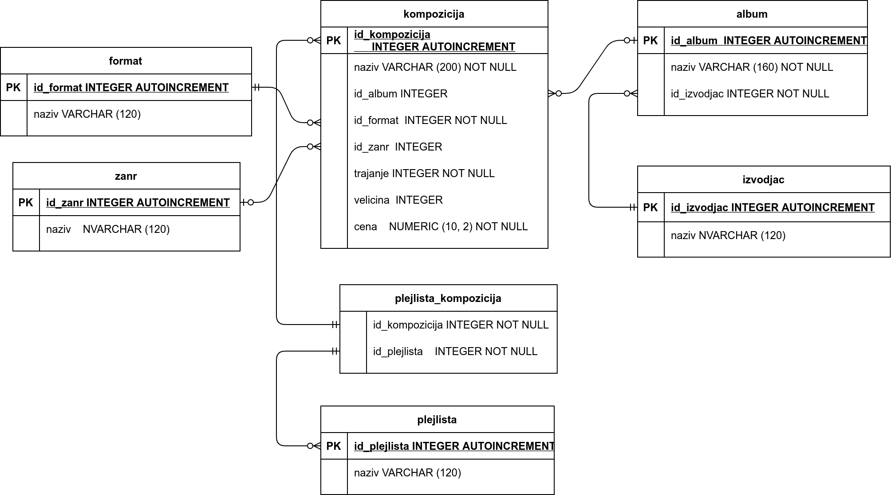
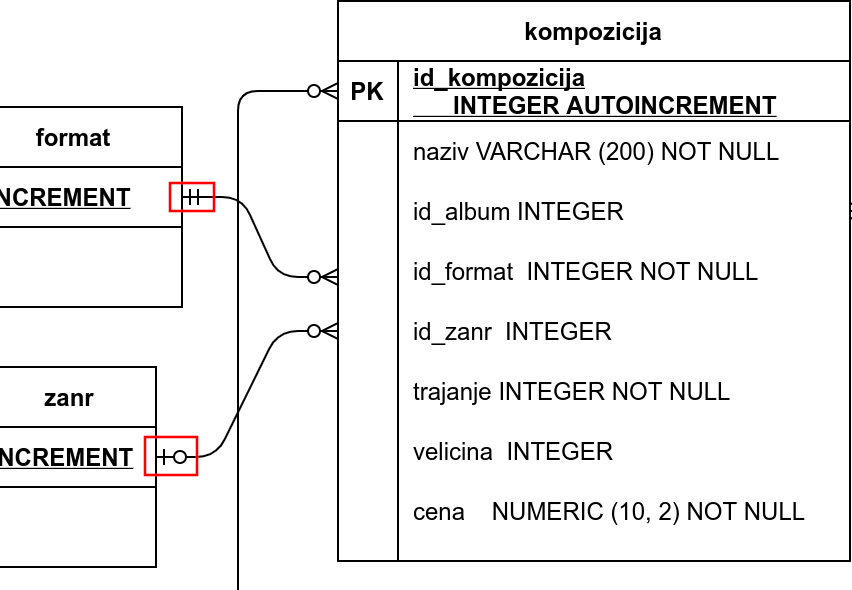
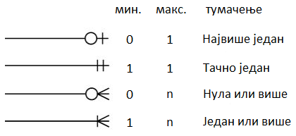
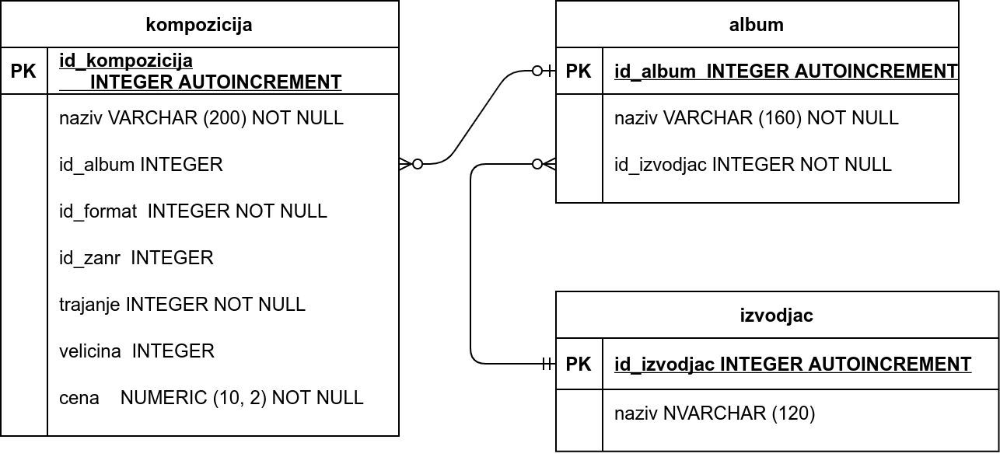

.. -*- mode: rst -*-

База компаније за продају дигиталних композиција -- подаци о композицијама
--------------------------------------------------------------------------

Овде ћемо приказати како може да тече осмишљавање структуре садржаја
једне базе података, што зовемо дизајнирање или пројектовање базе. Као
пример смо искористили базу података фиктивне компаније за продају
музичких композиција (углавном песама).

Сâм процес дизајнирања је јако важан и претходи креирању сваке базе података. 
Након што се овај процес заврши, база података са свим табелама може да се креира у систему 
SQLite Studio, као што смо видели на примеру креирања базе података за школски дневник. 
Ово је теоријска тема и током њене обраде нећемо практично радити у изабраном СУБП-u, 
али ћемо објаснити шта је све потребно да се припреми пре практичног креирања базе 
података фиктивне компаније за продају музичких композиција. На крају лекције ћете 
моћи да преузмете комплетну базу и учитате је у систем SQLite Studio, да бисте кроз наредне 
лекције могли практично са њом да радите. 

Спецификација
.............

Пре свега, у бази треба да чувамо податке о композицијама. За сваку
композицију чувамо неке основне податке:

- назив,
- трајање (у милисекундама),
- дигитални формат (MP3, AAC, итд),
- величина (у бајтовима),
- жанр и
- цена.

Подразумеваћемо да је број жанрова ограничен и да жанр може да буде
само неки од унапред дефинисаних жанрова, или да је композиција
евентуално неког непознатог жанра. Слично, подразумеваћемо и да је
дигитални формат неки са листе подржаних формата (на пример, mp3 или
aac), при чему је формат сваке композиције обавезно неки са те листе
(не може да буде непознат).

База треба да садржи и податке о албумима који се, нормално, састоје
од више композиција. Претпоставља се да није могуће да се иста
композиција нађе на два различита албума, али је допуштено да неке
композиције нису део ниједног албума (издате су као
тзв. синглови). Даље, претпоставља се да се на сваком албуму налазе
композиције само једног извођача и да је за сваки албум познат назив
албума и извођач. За сваког извођача je познато име.

У бази су дефинисане и листе композиција (тзв. плејлисте,
енгл. playlist). Може постојати више различитих листа и свака листа
може садржати произвољан број композиција.

Превођење спецификације у табеле
................................

Покушајмо да на основу ове спецификације осмислимо табеле релационе
базе података. Размотримо ентитете и њихове односе, тј. везе.

Ентитети који се одмах јасно препознају су *композиција*,
*албум*, *извођач* и *плејлиста*. Све ове ентитете ћемо
представити табелама. Свакој од њих ћемо, поред атрибута који тај
ентитет природно описују, да придружимо по један вештачки целобројни
примарни кључ, односно ``id``. Тиме добијамо почетну листу табела и
њихових колона (коју ћемо успут дорађивати):

- Табела ``kompozicija`` ће да садржи следеће колоне:
    - ``id_kompozicija`` као примарни кључ
    - ``naziv`` као назив композиције
    - ``trajanje`` као трајање композиције у милисекундама
    - ``velicina`` као меморијска величина композиције у бајтовима
    - ``cena`` као цена једног примерка

- Табела ``album`` ће да садржи следеће колоне:
    - ``id_album`` као примарни кључ
    - ``naziv`` као назив албума

- Табела ``izvodjac`` ће да садржи следеће колоне:
    - ``id_izvodjac`` као примарни кључ
    - ``naziv`` као назив извођача

- Табела ``plejlista`` ће да садржи следеће колоне:
    - ``id_plejlista`` као примарни кључ
    - ``naziv`` као назив листе

Овде још нисмо укључили у разматрање податке о жанровима композиција и
дигиталном формату.

Код композиција истог жанра не желимо да понављамо податке о жанру,
чак ни када је једини податак о жанру његов назив. Један од разлога је
уштеда простора (идентификатор жанра заузима мање места него назив
жанра). Још важније, понављањем назива жанра ризикујемо словне грешке,
које нарушавају интегритет података и воде ка погрешним резултатима
претраге. Због свега тога, прогласићемо и жанр за посебну врсту
ентитета, којој ће да одговара табела ``zanr``, са колоном ``id_zanr``
као примарним кључем и колоном ``naziv`` као називом жанра. Да бисмо за
дату композицију имали информацију о њеном жанру, додаћемо и у табелу
``kompozicija`` колону ``id_zanr`` као страни кључ, за који
дозвољавамо и вредност ``NULL``.

Слична је ситуација са дигиталним форматом. Да бисмо избегли понављање
назива формата, дигитални формат ће бити још једна врста ентитета,
којој ће да одговара табела ``format`` са колонама ``id_format``
(примарни кључ) и ``naziv`` (назив формата). Слично као код жанра, и
овај пут у табелу ``kompozicija`` додајемо нову колону као страни
кључ. Сада је то колона ``id_format``, али овај пут не допуштамо
вредност ``NULL``, јер по спецификацији за сваку композицију мора да
буде познат њен дигитални формат.

Веза између композиција и албума је *један-према-више* (свака
композиција припада највише једном албуму, сваки албум садржи нула или
више композиција).  Везу остварујемо додавањем колоне ``id_album`` у
табели ``kompozicija``. Пошто композиција може да не припада ни једном
албуму, дозволићемо да вредност колоне ``id_album`` у табели
``kompozicija`` недостаје (тј. да буде ``NULL``).

Веза између албума и извођача је такође *један-према-више* (према
спецификацији, сваки албум има тачно једног извођача, а сваки извођач
може да има нула или више албума). Према томе, везу остварујемо
додавањем колоне ``id_izvodjac`` у табели ``album``. Међутим, пошто
албум мора да има тачно једног извођача, овај пут нећемо дозволити да
вредност колоне ``id_izvodjac`` у табели ``album`` недостаје (да буде
``NULL``).

Остаје још да осмислимо како да чувамо податке о листама
композиција. Пошто свака листа може да садржи више композиција, а
свака композиција може да се нађе на више листи, реч је о вези
*више-према-више*. Као што је раније речено, такву везу обично
остварујемо помоћу нове табеле. У овом случају та нова табела ће се
звати ``plejlista_kompozicija`` и она треба да садржи идентификатор
листе ``id_plejlista`` и идентификатор композиције ``id_kompozicija``
као стране кључеве. При томе ни један од ова два страна кључа не сме
да има вредност ``NULL``.

Сада можемо да напишемо допуњену листу табела и њихових колона. За
сваку колону ћемо да наведемо назив и значење. Називе колона у којима је 
вредност обавезна (тј. не сме да буде ``NULL``) означићемо звездицом, 
овако '*'.

- Колоне табеле zanr:
    - id_zanr*, примарни кључ
    - naziv, назив жанра

- Колоне табеле format:
    - id_format*, примарни кључ
    - naziv*, назив формата

- Колоне табеле izvodjac:
    - id_izvodjac*, примарни кључ
    - naziv*, назив извођача

- Колоне табеле album:
    - id_album*, примарни кључ
    - naziv*, наслов албума
    - id_izvodjac*, идентификатор извођача (страни кључ)

- Колоне табеле kompozicija:
    - id_kompozicija*, примарни кључ
    - naziv*, наслов композиције
    - id_album, идентификатор албума (страни кључ)
    - id_format*, идентификатор формата (страни кључ)
    - id_zanr, идентификатор жанра (страни кључ)
    - trajanje*, трајање
    - velicina*, величина
    - cena*, цена

- Колоне табеле plejlista:
    - id_plejlista*, примарни кључ
    - naziv, назив листе

- Колоне табеле plejlista_kompozicija:
    - id_plejlista*, идентификатор листе (страни кључ)
    - id_kompozicija*, идентификатор композиције (страни кључ)

.. comment

    **Табела zanr**:

    .. csv-table::
        :header:  назив колоне, тип, величина, значење, NULL
        :widths: 20, 20, 20, 20, 20
        :align: left

        id_zanr*, целобројни, --, примарни кључ, ❌
        naziv, текст, 120, назив жанра, ✔

    ~~~~

    **Табела format**:

    .. csv-table::
        :header:  назив колоне, тип, величина, значење, NULL
        :widths: 20, 20, 20, 20, 20
        :align: left

        id_format\ :math:`^✱`, целобројни, --, примарни кључ, ❌
        naziv\ :math:`^✱`, текст, 120, назив формата, ❌

    ~~~~

    **Табела izvodjac**:

    .. csv-table::
        :header:  назив колоне, тип, величина, значење, NULL
        :widths: 20, 20, 20, 20, 20
        :align: left

        id_izvodjac\ :math:`^✱`, целобројни, --, примарни кључ, ❌
        naziv\ :math:`^✱`, текст, 120, назив извођача, ❌

    ~~~~

    **Табела album**:

    .. csv-table::
        :header:  назив колоне, тип, величина, значење, NULL
        :widths: 20, 20, 20, 20, 20
        :align: left

        id_album\ :math:`^✱`, целобројни, --, примарни кључ, ❌
        naziv\ :math:`^✱`, текст, 160, наслов албума, ❌
        id_izvodjac\ :math:`^✱`, целобројни, --, идентификатор извођача (страни кључ), ❌

    ~~~~

    **Табела kompozicija**:

    .. csv-table::
        :header:  назив колоне, тип, величина, значење, NULL
        :widths: 20, 20, 20, 20, 20
        :align: left

        id_kompozicija\ :math:`^✱`, целобројни, --, примарни кључ, ❌
        naziv\ :math:`^✱`, текст, 200, наслов композиције, ❌
        id_album, целобројни, --, идентификатор албума (страни кључ), ✔
        id_format\ :math:`^✱`, целобројни, --, идентификатор формата (страни кључ), ❌
        id_zanr, целобројни, --, идентификатор жанра (страни кључ), ✔
        trajanje\ :math:`^✱`, целобројни, --, трајање, ❌
        velicina\ :math:`^✱`, целобројни, --, величина, ❌
        cena\ :math:`^✱`, децимални, 10, цена, ❌

    ~~~~

    **Табела plejlista**:

    .. csv-table::
        :header:  назив колоне, тип, величина, значење, NULL
        :widths: 20, 20, 20, 20, 20
        :align: left

        id_plejlista\ :math:`^✱`, целобројни, --, примарни кључ, ❌
        naziv, текст, 120, назив листе, ✔

    ~~~~

    **Табела plejlista_kompozicija**:

    .. csv-table::
        :header:  назив колоне, тип, величина, значење, NULL
        :widths: 20, 20, 20, 20, 20
        :align: left

        id_plejlista\ :math:`^✱`, целобројни, --, идентификатор листе (страни кључ), ❌
        id_kompozicija\ :math:`^✱`, целобројни, --, идентификатор композиције (страни кључ), ❌

Дизајн базе до којег смо дошли може да се прикаже и следећим дијаграмом:

|

На дијаграму су приказани ентитети са својим атрибутима (табеле са
својим колонама) и везе које постоје између ентитета. Све приказане
везе су типа *један-према-више* и остварене су помоћу страног кључа,
као што је већ објашњено. Међутим, током анализе смо могли да уочимо
да везе између ентитета ипак нису потпуно исте. На пример, композиција
може, а не мора да има придружен жанр, али мора да има придружен
дигитални формат. Овакви детаљи су такође приказани на
дијаграму. Погледајмо пажљивије крајеве линија које представљају везе
између поменутих ентитета (уоквирене црвено).

Рекли смо да свакој композицији може да одговара нула или један
жанр. Управо то је симболички приказано на крају линије која повезује
ентитете ``kompozicija`` и ``zanr``, на страни ентитета ``zanr`` (означено
доњим црвеним оквиром).  За разлику од тога, горњи црвени оквир истиче
да у вези између ентитета ``kompozicija`` и ``format`` свакој
композицији одговара тачно један формат.

На крају сваке линије приказана су по два симбола. Симбол ближи средини 
линије означава најмањи могућ број повезаних елемената (доњу границу) и 
може да буде *нула* (опциона веза) или *један* (обавезна веза). Симбол ближи 
крају линије означава највећи могућ број повезаних елемената (горњу 
границу), а може да буде *један* или *више*. 

Тако разликујемо наредне могућности за сваки крај везе:

Увежбајмо читање ових ознака на још једном детаљу дијаграма.

Приказану везу између композиција и албума читамо овако:

- сваком албуму одговара нула или више композиција
- свакој композицији одговара нула или један (највише један) албум

Слично томе, приказану везу између албума и извођача читамо овако:

- сваком албуму одговара тачно један извођач
- сваком извођачу одговара нула или више албума

Комбинација горњих граница на оба краја везе одређује општи тип везе:
*један-према-један*, *један-према-више*, *више-према-један*, 
*више-према-више*. Ова комбинација је веома значајна, јер на основу ње 
одлучујемо да ли ће се у једној табели чувати примарни кључ друге 
(веза *један-према-више*) или ће бити потребно правити посебну додатну
табелу (веза *више-према-више*). 

Доње границе (нула или један) типично одређују да ли ће у некој колони 
табеле бити допуштена вредност ``NULL``.

Следе *SQL* дефиниције табела које треба да се креирају у СУБП, а које одговарају урађеном дизајну:

.. code-block:: sql

   CREATE TABLE zanr (
      id_zanr INTEGER        PRIMARY KEY AUTOINCREMENT
                             NOT NULL,
      naziv    VARCHAR (120) 
   );

   CREATE TABLE format (
      id_format INTEGER        PRIMARY KEY AUTOINCREMENT
                               NOT NULL,
      naziv     VARCHAR (120) 
   );

   CREATE TABLE izvodjac (
      id_izvodjac INTEGER        PRIMARY KEY AUTOINCREMENT
                                 NOT NULL,
      naziv       VARCHAR (120) 
   );
   
   CREATE TABLE album (
      id_album  INTEGER         PRIMARY KEY AUTOINCREMENT
                                NOT NULL,
      naziv       VARCHAR (160) NOT NULL,
      id_izvodjac INTEGER       NOT NULL,
      FOREIGN KEY id_izvodjac
      REFERENCES izvodjac (id_izvodjac) ON DELETE RESTRICT
                                        ON UPDATE RESTRICT
  );

  CREATE TABLE kompozicija (
      id_kompozicija  INTEGER         PRIMARY KEY AUTOINCREMENT
                                      NOT NULL,
      naziv           VARCHAR (200)   NOT NULL,
      id_album        INTEGER,
      id_format       INTEGER         NOT NULL,
      id_zanr         INTEGER,
      trajanje        INTEGER         NOT NULL,
      velicina        INTEGER,
      cena            NUMERIC (10, 2) NOT NULL,
      FOREIGN KEY id_album
      REFERENCES album id_album ON DELETE RESTRICT
                                ON UPDATE RESTRICT,
      FOREIGN KEY id_zanr
      REFERENCES zanr id_zanr ON DELETE RESTRICT
                              ON UPDATE RESTRICT,
      FOREIGN KEY id_format
      REFERENCES format id_format ON DELETE RESTRICT
                                  ON UPDATE RESTRICT
  );

  CREATE TABLE plejlista (
      id_plejlista INTEGER       PRIMARY KEY AUTOINCREMENT
                                 NOT NULL,
      naziv       VARCHAR (120) 
  );

  CREATE TABLE plejlista_kompozicija (
      id_plejlista    INTEGER NOT NULL,
      id_kompozicija  INTEGER NOT NULL,
      CONSTRAINT PRIMARY KEY (
           id_plejlista,
           id_kompozicija
      ),
      FOREIGN KEY id_plejlista
      REFERENCES plejlista (id_plejlista) ON DELETE RESTRICT
                                          ON UPDATE RESTRICT,
      FOREIGN KEY id_kompozicija
      REFERENCES kompozicija (id_kompozicija) ON DELETE RESTRICT
                                              ON UPDATE RESTRICT
  );
  
