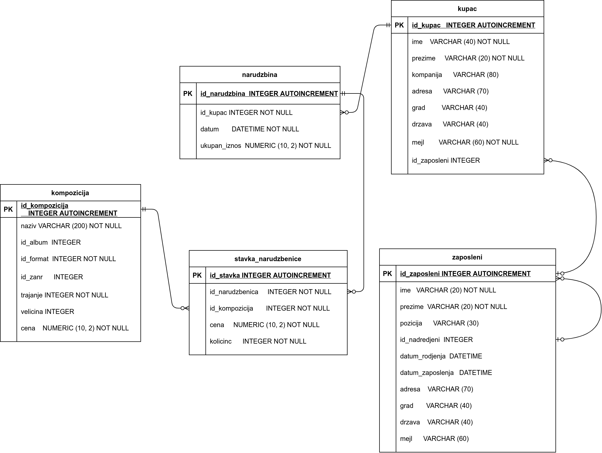

База компаније за продају дигиталних композиција -- подаци о продаји
--------------------------------------------------------------------

У претходном поглављу смо приказали организацију дела базе података
која се тиче композиција, албума, извођача и листа песама. У овом
поглављу ћемо надоградити ту базу података информацијама релевантним
за продају композиција. Кренимо од спецификације.

Спецификација
.............

У компанији постоји неколико запослених особа. За сваког запосленог
познати су следећи подаци:

- име, презиме
- титула тј. назив запослења
- датум рођења
- датум запослења
- адреса
- град
- држава/покрајина
- поштански кôд
- број телефона
- факс
- мејл

Запослени имају свог надређеног и на тај начин су организовани у
хијерархијску, дрволику структуру.

Чува се листа свих купаца. За сваког купца су познати следећи подаци.

- име, презиме
- компанија у чије име купује (ако не купује сам за себе)
- адреса
- град
- држава/покрајина
- поштански кôд
- телефон
- факс
- мејл

За купца може бити задужен неко од запослених (он му пружа комплетну
кориснчику подршку).

Корисници врше наруџбине и у склопу сваке наруџбине могу да наруче и
више композиција. За сваку наруџбину познати су следећи подаци.

- датум наруџбине
- адреса наплате
- град наплате
- поштански кôд наплате
- држава/покрајина наплате
- укупна цена наруџбине

За сваку наруџбину познат је и списак свих композиција на тој
наруџбини.

Превођење спецификације у табеле
................................

Јасно препознајмо врсту ентитета *запослени*, *купац* и
*наруџбеница*. Све ове врсте ентитета ћемо представити
табелама. Свакој од њих ћемо, поред атрибута који тај ентитет природно
описују, да придружимо по један вештачки целобројни примарни кључ,
односно ``id``. Тиме добијамо почетну листу табела и њихових колона
(коју ћемо успут дорађивати):

- Табела ``zaposleni`` ће да садржи следеће колоне:
    - ``id_zaposleni`` као примарни кључ
    - ``ime``, име запосленог
    - ``prezime``, презиме запосленог
    - ``pozicija``, титула тј. назив запослења
    - ``datum_rodjenja``, датум рођења
    - ``datum_zaposlenja``, датум запослења
    - ``adresa``, адреса
    - ``grad``, град
    - ``drzava``, земља
    - ``mejl``, мејл адреса

- Табела ``kupac`` ће да садржи следеће колоне:
    - ``id_kupac`` као примарни кључ,
    - ``ime``, име купца
    - ``prezime``, презиме купца
    - ``kompanija``, компанија у чије име купује (ако не купује сам за себе)
    - ``adresa``, адреса купца
    - ``grad``, град
    - ``drzava``, држава
    - ``mejl``, мејл адреса.

- Табела ``narudzbenica`` ће да садржи следеће колоне:
    - ``id_narudzbenica`` као примарни кључ,
    - ``datum``, датум наруџбине,
    - ``ukupan_iznos``, укупан износ наруџбине.
  
Сваки запослени има *нула или једног* надређеног, а може бити
надређени за *нула или више* запослених. Дакле, постоји веза
*један-према-више* од ентитета запослени до њега самог, међутим, та
веза није ни по чему значајном различита од веза између два различита
ентитета. Ову везу можемо реализовати додавањем колоне
``id_nadredjeni`` у табелу ``zaposleni`` којој се чува примарни кључ
запосленог (који може бити и ``NULL``). Та колона је уједно страни
кључ у односу на табелу запослених.

Сваки купац може имати *нула или једног* запосленог који брине о њему,
док сваки запослени може имати *нула или више* купаца о којима
брине. Ова се веза може реализовати додавањем колоне ``id_zaposleni``
у табели купаца ``kupac`` која чува примарни кључ за њега задуженог
запосленог (та колона је страни кључ у односу на табелу запослених).

Свакој наруџбеници одговара *тачно један* купац, док сваки купац може
имати *нула или више* наруџбеница. Ову везу реализујемо тако што у
табели наруџбеница ``narudzbenica`` додајемо колону ``id_kupac`` која
садржи примарни кључ купца (та колона је страни кључ у односу на
табелу купаца).

На крају, свака наруџбеница садржи нула или више композиција, док се
свака композиција може налазити на нула или више наруџбеница. Ову везу
типа *више-према-више* морамо реализовати креирањем посебне табеле
``stavka_narudzbenice``.

- Табела ``stavka_narudzbenice`` ће да садржи следеће колоне:
    - ``id_kompozicija``, примарни кључ композиције,
    - ``id_narudzbenica``, примарни кључ наруџбенице,
    - ``kolicina``, број тих композиција које се наручују,
    - ``cena``, јединична цена те композиције у склопу те наруџбине
      (она може бити и различита у односу на тренутну јединичну цену
      те композиције).

Дизајн базе до којег смо дошли може да се прикаже и следећим дијаграмом:

SQL дефиниције којима се креирају све наведене табеле и подешавају сви наведени услови интегритета 
(примарни и страни кључеви, недостајуће вредности) су следеће:

.. code-block:: sql

   CREATE TABLE id_zaposleni (
      id_zaposleni     INTEGER     PRIMARY KEY AUTOINCREMENT
                                   NOT NULL,
      prezime          VARCHAR (20) NOT NULL,
      ime              VARCHAR (20) NOT NULL,
      naziv            VARCHAR (30),
      id_nadredjeni    INTEGER,
      datum_rodjenja   DATETIME,
      datum_zaposlenja DATETIME,
      adresa           VARCHAR (70),
      grad             VARCHAR (40),
      drzava           VARCHAR (40),
      mejl             VARCHAR (60),
      FOREIGN KEY (id_nadredjeni)
      REFERENCES zaposleni (id_zaposleni) ON DELETE RESTRICT
                                          ON UPDATE RESTRICT
   );

   CREATE TABLE kupac (
       id_kupac     INTEGER       PRIMARY KEY AUTOINCREMENT
                                  NOT NULL,
       ime          VARCHAR (40) NOT NULL,
       prezime      VARCHAR (20) NOT NULL,
       kompanija    VARCHAR (80),
       adresa       VARCHAR (70),
       grad         VARCHAR (40),
       drzava       VARCHAR (40),
       mejl         VARCHAR (60) NOT NULL,
       id_zaposleni INTEGER,
       FOREIGN KEY (id_zaposleni)
       REFERENCES zaposleni (id_zaposleni) ON DELETE RESTRICT
                                           ON UPDATE RESTRICT
   );

   
   CREATE TABLE narudzbenica (
       id_narudzbenica       INTEGER     PRIMARY KEY AUTOINCREMENT
                                         NOT NULL,
       id_kupac              INTEGER         NOT NULL,
       datum                 DATETIME        NOT NULL,
       ukupan_iznos          NUMERIC (10, 2) NOT NULL,
       FOREIGN KEY (id_kupac)
       REFERENCES kupac ON DELETE RESTRICT
                        ON UPDATE RESTRICT
   );
   
   CREATE TABLE stavka_narudzbenice (
       id_stavka       INTEGER         PRIMARY KEY AUTOINCREMENT
                                       NOT NULL,
       id_narudzbenica INTEGER         NOT NULL,
       id_kompozicija  INTEGER         NOT NULL,
       cena            NUMERIC (10, 2) NOT NULL,
       kolicina        INTEGER         NOT NULL,
       FOREIGN KEY (id_narudzbenica)
               REFERENCES invoice ON DELETE NO ACTION
                                  ON UPDATE NO ACTION,
       FOREIGN KEY (id_kompozicija)
               REFERENCES kompozicija ON DELETE NO ACTION
                                      ON UPDATE NO ACTION
   );

Преузимање попуњене базе
........................

На основу урађене анализе, спецификације и завршеног процеса дизајнирања, креирана је и конкретна база која садржи описане табеле, попуњене подацима, 
а може се `преузети <https://petljamediastorage.blob.core.windows.net/root/Media/Default/Kursevi/OnlineNastava/kurs-gim-cetvrti-inf/_static/db/music.db>`_ 
и отворити у програму SQLite Studio.

Након избора команде менија ``Database → Add`` a database одабрати постојећи фајл на диску. Након избора фајла, назив под којим ће се та база видети у нашем систему ће се попунити сам. 

.. image:: ../../_images/database.png
   :width: 600
   :align: center
   :alt: Креирање нове базе у систему SQLite Studio

