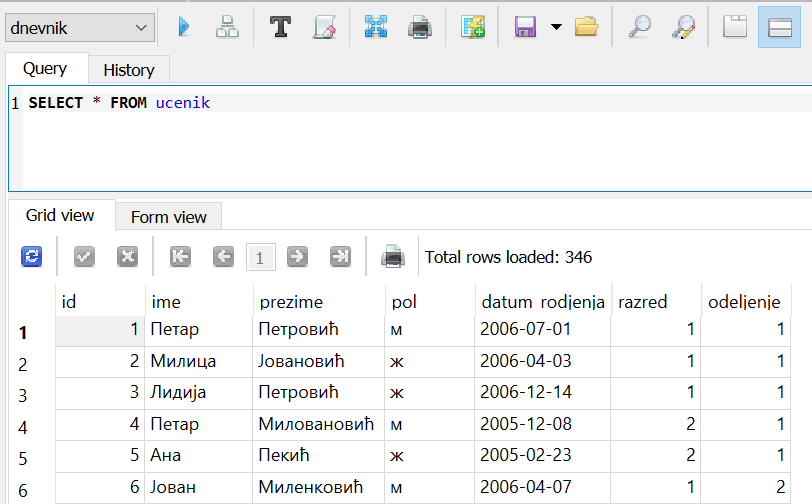

.. -*- mode: rst -*-

SQL: Читање података из базе
============================

Упити језика SQL
................

Упитни језик SQL омогућава корисницима да изврше све потребне операције 
над базом података, од креирања саме базе и табела у њој, уписивања, 
мењања и претраживања података, до брисања неких података, табела или целе базе.

Команде језика SQL се традиционално називају упитима. Прва реч у сваком 
SQL упиту одређује врсту акције коју корисник захтева од система. Најчешће
коришћени упити су:

- Упити ``SELECT``, који служе да се из базе прочитају жељени подаци,
- Упити ``INSERT``, који служе да се у базу упишу нови подаци,
- Упити ``DELETE``, који служе да се из базе обришу неки подаци, и
- Упити ``UPDATE``, који служе да се неки подаци у бази ажурирају (измене).

.. learnmorenote::  **Други типови SQL упита:**

 Постоје и други типови упита, који се ређе користе. Ми смо, на пример, 
 у претходном делу креирали две базе и неколико табела у њима користећи
 графички кориснички интерфејс (КГИ), а СУБП нам је омогућио да видимо и 
 одговарајуће SQL упите, помоћу којих могу да се креирају такве базе и 
 табеле у њима. Сваки од тих упита је почињао кључном речју ``CREATE``. 

 Слично креирању, ГКИ можемо да употребимо и да бисмо изменили структуру 
 неке табеле (нпр. додали или обрисали одређене колоне), или чак обрисали 
 табелу која нам није потребна. Исте акције можемо да извршимо и помоћу 
 SQL упита (упит ``ALTER`` за мењање структуре табеле, а упит ``DROP`` 
 за њено брисање). Помоћу SQL упита могу да се обаве и разна подешавања и 
 друге операције над базом података.

 Мада су ови типови упита такође веома важни, јасно је да се они користе 
 знатно ређе него, на пример, читање података из базе. Осим тога, упите
 за креирање, измену структуре или брисање табела обично користе само 
 неки корисници базе (администратори, систем архитекти, програмери), док
 преглед података може да буде потребан знатно ширем кругу корисника 
 различитих занимања.

Од свих поменутих типова упита, за нас је најзначајнији упит ``SELECT``,
помоћу којег веома брзо можемо да дођемо до података који су нам потребни. 
Зато ћемо у овом поглављу детаљније да упознамо могућности упита ``SELECT``, а
у следећем поглављу ћемо да обрадимо упите ``INSERT``, ``DELETE`` и ``UPDATE``.

Упит SELECT
...........

Сваки, па и најједноставнији упит ``SELECT`` мора да садржи следеће
елементе:

.. code-block:: sql

   SELECT kolone
   FROM tabele;

Овим се систему налаже да нам из наведене табеле (или више табела)
издвоји све податке који су дати у наведеним колонама. Језик није
осетљив на разлику између великих и малих слова (могуће је писати и
``select`` и ``from``), али ћемо ми у складу са устаљеном праксом, у
наставку све кључне речи писати великим словима. Све белине у упиту се
занемарују, па самим тим није битно да ли се упит пише у једном или
више редова. Прегледности ради, ми ћемо све упите писати у више редова.

За почетак ћемо увек читати податке само из једне
табеле. Најједноставнији случај је онај у коме се жели читање свих
података из једне табеле. Тада се уместо имена свих колона може
навести само симбол ``*``. Размотримо следећи пример. Тачка-зарез (;) може и не мора да се дода на крај упита.
   
.. questionnote::

   Приказати све податке о ученицима који су уписани у бази.

.. code-block:: sql

   SELECT *
   FROM ucenik;

Извршавањем упита добија се следећи резултат:

.. csv-table::
   :header:  "id", "ime", "prezime", "pol", "datum_rodjenja", "razred", "odeljenje"
   :align: left

   "1", "Петар", "Петровић", "м", "2006-07-01", "1", "1"
   "2", "Милица", "Јовановић", "ж", "2006-04-03", "1", "1"
   "3", "Лидија", "Петровић", "ж", "2006-12-14", "1", "1"
   "4", "Петар", "Миловановић", "м", "2005-12-08", "2", "1"
   "5", "Ана", "Пекић", "ж", "2005-02-23", "2", "1"
   ..., ..., ..., ..., ..., ..., ...

Овај упит значи: 

| **ОДАБЕРИ** све колоне
| **ИЗ РЕДОВА** табеле ученика
    
Он је функционално еквивалентан следећем упиту, али је од њега једноставнији за писање:

.. code-block:: sql

   SELECT id, ime, prezime, pol, datum_rodjenja, razred, odeljenje
   FROM ucenik;

Извршавањем упита добија се следећи резултат:

.. csv-table::
   :header:  "id", "ime", "prezime", "pol", "datum_rodjenja", "razred", "odeljenje"
   :align: left

   "1", "Петар", "Петровић", "м", "2006-07-01", "1", "1"
   "2", "Милица", "Јовановић", "ж", "2006-04-03", "1", "1"
   "3", "Лидија", "Петровић", "ж", "2006-12-14", "1", "1"
   "4", "Петар", "Миловановић", "м", "2005-12-08", "2", "1"
   "5", "Ана", "Пекић", "ж", "2005-02-23", "2", "1"
   ..., ..., ..., ..., ..., ..., ...

Облик упита ``SELECT`` који смо управо упознали садржи само обавезне
делове, па је то најкраћи могући облик овог упита. У наставку овог
поглавља ћемо обрадити различите сложеније облике упита ``SELECT``,
који нам омогућавају да од постојећих података одаберемо само неке, да
их пребројимо, да нађемо најмањи или највећи податак који испуњава
неки услов, да прикажемо једноставне статистике по групама података и
слично.

У систему SQLite Studio се упити пишу након што се кликне на креирану базу *dnevnik* у 
прозору``Databases`` и потом изабере команда менија ``Tools → Open SQL Editor``. 
Када се напише упит, кликне се на дугме ``Execute query (F9)`` (плави троуглић). 
Уколико се у простору за писање упита налази више њих, потребно је обележити онај коју желимо да покренемо. 
Уколико имамо више база података, обавезно провери да ли је поред овог дугмета назив базе у којој желиш
да вршите упите.

.. image:: ../../_images/execute_query.png
   :width: 500
   :align: center

.. suggestionnote::

   Савет је да се у прозору ``Databases`` увек прво провере тачни називи табела. 

.. image:: ../../_images/dnevnik.png
   :width: 500
   :align: center

Често ће нам код упита бити потребно да знамо и тачне називе колона. 
То можемо да видимо за сваку табелу појединачно тако што кликнемо на њу у прозору 
``Databases``, па се онда појави опис структуре табеле који садржи списак свих колона.

.. image:: ../../_images/ucenik.png
   :width: 780
   :align: center
 

Списак колона можемо да видимо и када извршимо основни SELECT упит: 

Вежба
.....

Пробај сада самостално да напишеш наредни упит. Тачност твог решења се аутоматски 
проверава притиском на дугме ``Тестирај упит``. Пробај овај упит и у систему SQLite 
Studio који си инсталирао код себе на рачунару и у оквиру којег си додао базу података са називом *dnevnik*.

.. questionnote::

 Приказати све податке из табеле предмета која има назив ``predmet``. 

.. dbpetlja:: db_uvod_01
   :dbfile: dnevnik.sql
   :solutionquery: SELECT *
                   FROM predmet