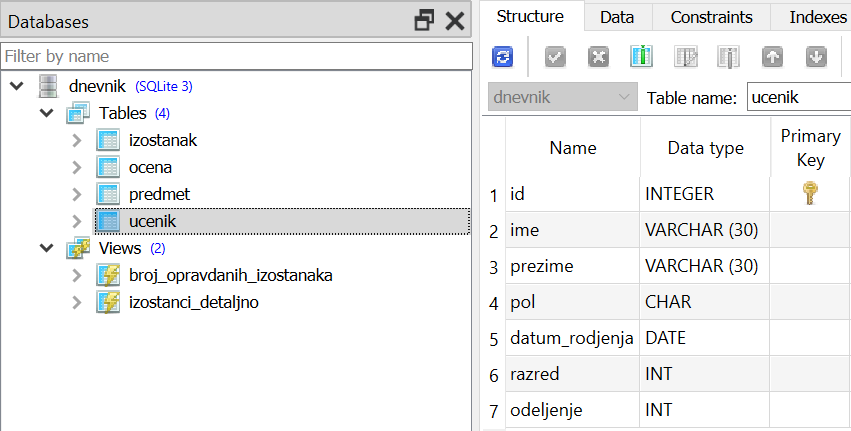

.. -*- mode: rst -*-

Пројекција
----------
   
Некада нам нису релевантни сви подаци који се налазе у табели. За
почетак, можемо да издвојимо само податке из неких колона. То радимо
тако што након кључне речи ``SELECT`` наведемо само називе оних колона
које нас занимају.

У теорији база података, операција којом се издвајају само неке колоне
из табеле назива се **пројекција**. 

.. infonote::

 **Упамтимо:**

 **Пројекцијом се из резултата упита издвајају изабране колоне**.

.. image:: ../../_images/projekcija.png
   :width: 780
   :align: center
   :alt: Пројекцијом се из табеле издвајају неке колоне

Иако је употреба звездице након ``SELECT`` веома једноставна и често се користи 
у интерактивном раду са базом и током развоја апликација, савет је да се у реалним 
апликацијама у свим упитима увек експлицитно наведу само потребне колоне (тиме се добија на ефикасности, 
јер се чита мање података из базе, а са друге стране добија се скрипт чији резултат се неће променити
и ако се табела у међувремену прошири додатним колонама или се редослед колона промени).

.. questionnote::

   Приказати имена и презимена свих ученика.

.. code-block:: sql

   SELECT ime, prezime 
   FROM ucenik;

Извршавањем упита добија се следећи резултат:

.. csv-table::
   :header:  "ime", "prezime"
   :align: left

   "Петар", "Петровић"
   "Милица", "Јовановић"
   "Лидија", "Петровић"
   "Петар", "Миловановић"
   "Ана", "Пекић"
   ..., ...

Значење овог упита је: 

| **ОДАБЕРИ** имена и презимена
| **ИЗ РЕДОВА** табеле ученика
 
У систему SQLite Studio се упити пишу након што се кликне на креирану базу *dnevnik* у прозору ``Databases`` 
и потом изабере команда менија ``Tools → Open SQL Editor``. 

Када се напише упит, кликне се на дугме ``Execute query (F9)`` (плави троуглић). 
Уколико се у простору за писање упита налази више њих, потребно је обележити онај коју желимо да покренемо. 
Уколико имамо више база података, обавезно проверити да ли је поред овог дугмета назив базе у којој желите да 
вршите упите.
 
.. image:: ../../_images/execute_query.png
   :width: 500
   :align: center

Савет је да се у прозору ``Databases`` увек прво провере тачни називи табела. 

.. image:: ../../_images/dnevnik.png
   :width: 500
   :align: center
   :class: screenshot-shadow

Често ће нам код упита бити потребно да знамо и тачне називе колона. 
То можемо да видимо за сваку табелу појединачно тако што кликнемо на њу у прозору ``Databases``, па се онда појави опис структуре табеле који садржи списак свих колона. 
Можемо и да напишемо прво најједноставнији упит са звездицом (*) 
који приказује целу табелу и тако проверимо називе колона. 
На следећој слици може да се види упит покренут у систему SQLite Studio. 
Види се само првих неколико редова и информација о томе да има укупно 346 
редова у овој табели. У овом случају је приказана комплетна база која је могла да се преузме 
у некој од претходних лекција. 

Списак колона можемо да видимо и када извршимо основни SELECT упит. 

.. image:: ../../_images/select.png
   :width: 780
   :align: center
   :class: screenshot-shadow

.. questionnote::

   Приказати идентификаторе и називе предмета и разреде у којима се ти
   предмети предају.

.. code-block:: sql

   SELECT id, naziv, razred 
   FROM predmet;

Извршавањем упита добија се следећи резултат:

.. csv-table::
   :header:  "id", "naziv", "razred"
   :align: left

   "1", "Математика", "1"
   "2", "Српски језик", "1"
   "3", "Рачунарство и информатика", "1"
   "4", "Математика", "2"
   "5", "Психологија", "2"
   ..., ..., ...

Вежба
.....
   
Пробај сада самостално да напишеш наредни упит.
   
.. questionnote::

 Приказати само називе свих предмета.
 
.. dbpetlja:: db_projekcija_01
   :dbfile: dnevnik.sql
   :solutionquery: SELECT naziv
                   FROM predmet
   :showresult:

.. learnmorenote::  **Зашто се ова операција зове „пројекција“?**

 Назив **пројекција** потиче из формализма који се назива **релациона 
 алгебра** и који представља теоријску основу релационих база података,
 а преузет је по следећој аналогији из геометрије. Сваки ред у табели 
 можемо да замислимо као објекат, који је у потпуности описан подацима 
 наведеним у колонама. Ово је веома слично тачкама у простору које су 
 описане помоћу својих координата. 
    
 .. image:: ../../_images/projekcija_pojam.png
       :width: 400
       :align: center
       :alt: Појам пројекција долази из геометрије
       
 Ако се у геометрији неке координате тачака изоставе, тиме се врши 
 пројекција на простор мање димензије. На пример, ако тачке имају 
 координате :math:`(x, y, z)`, изостављањем координате :math:`z` врши се пројекција из тродимензионог простора у дводимензиону раван. 
    
 Због тога се изостављање неких колона из било које табеле такође назива пројекција.
