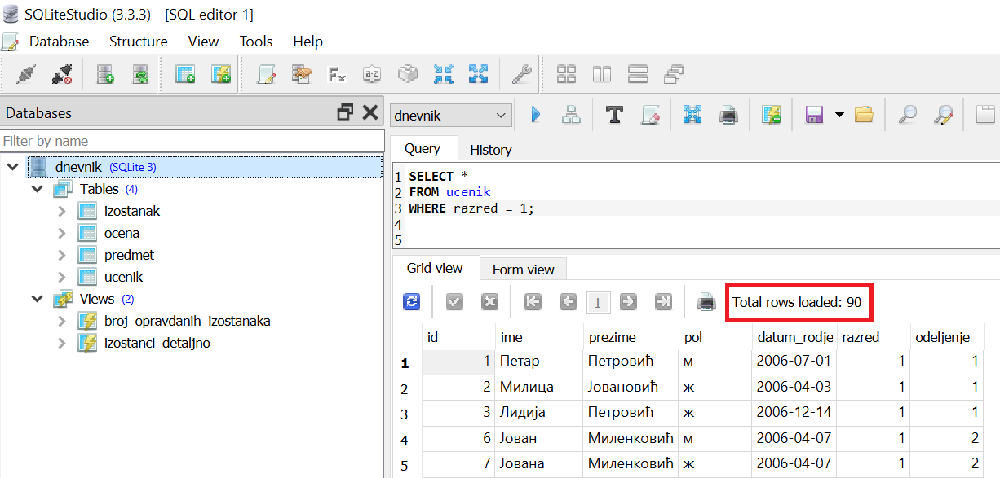

.. -*- mode: rst -*-

Селекција (WHERE)
-----------------

Као што смо могли да одаберемо само податке из неких колона, тако
можемо да одаберемо и само податке из неких врста, тј. да извршимо
филтрирање података на основу неког задатог услова. Тада је потребно
да користимо следећи облик упита ``SELECT``.

.. code-block:: sql

   SELECT kolone
   FROM tabele
   WHERE uslov;

Када наведемо клаузулу ``WHERE``, кажемо да је извршена **селекција**
врста табеле, тј. да смо извршили **филтрирање** података. За овакав 
упит се каже и да извршава **рестрикцију** табеле.

Пројекцијом, дакле, избацујемо одређене колоне из резултата, а 
селекцијом (рестрикцијом) одређене врсте.

.. image:: ../../_images/restrikcija.png
   :width: 780
   :align: center
   :alt: Селекцијом се из табеле издвајају само неке врсте

У наставку ћемо кроз низ примера илустровати различите облике
услова које можемо да користимо.

.. questionnote::

   Приказати све податке о ученицима првог разреда.

.. code-block:: sql

   SELECT *
   FROM ucenik
   WHERE razred = 1;

Извршавањем упита добија се следећи резултат:

.. csv-table::
   :header:  "id", "ime", "prezime", "pol", "datum_rodjenja", "razred", "odeljenje"
   :align: left

   "1", "Петар", "Петровић", "м", "2006-07-01", "1", "1"
   "2", "Милица", "Јовановић", "ж", "2006-04-03", "1", "1"
   "3", "Лидија", "Петровић", "ж", "2006-12-14", "1", "1"
   "6", "Јован", "Миленковић", "м", "2006-04-07", "1", "2"
   "7", "Јована", "Миленковић", "ж", "2006-04-07", "1", "2"
   ..., ..., ..., ..., ..., ..., ...

Овај упит може да се протумачи као: 

| **ОДАБЕРИ** све колоне
| **ИЗ РЕДОВА** табеле ученика
| **КОД КОЈИХ** је разред једнак 1

Услов у овом упиту је ``razred = 1``. Приметимо да у услову могу да се наводе називи 
колона табеле, као и константне вредности (у овом случају то је број 1), док се за
једнакост користи знак ``=``.

У систему SQLite Studio упити се пишу након што се кликне на креирану базу *dnevnik* 
у прозору ``Databases`` и потом изабере команда менија ``Tools → Open SQL Editor``. 
Када се напише упит, кликне се на дугме ``Execute query (F9)`` (плави троуглић). 
Уколико се у простору за писање упита налази више њих, потребно је обележити онај 
коју желимо да покренемо. Уколико имамо више база података, обавезно провери 
да ли је поред овог дугмета назив базе у којој желиш да вршиш упите.

На следећој слици може да се види упит покренут у систему SQLite Studio. 
Види се само првих неколико редова и информација о томе да има укупно 90 редова, 
односно толико има ученика који су први разред и налазе се у овој бази података. 
Када смо раније покренули упит којим се приказују сви редови у табели, могли само 
да видимо да их има 346, тако да је очигледно да је овде дошло до жељене селекције. 

.. questionnote::

 Приказати све податке о предметима у другом разреду.

.. code-block:: sql

   SELECT *
   FROM predmet
   WHERE razred = 2;

Извршавањем упита добија се следећи резултат:

.. csv-table::
   :header:  "id", "naziv", "razred", "fond"
   :align: left

   "4", "Математика", "2", "5"
   "5", "Психологија", "2", "2"
   "7", "Физика", "2", "3"
   "24", "Српски језик", "2", "3"
   "25", "Енглески језик", "2", "2"
   ..., ..., ..., ...

.. questionnote::

   Приказати све податке о ученицима који се зову ``Петар``.
   
.. code-block:: sql

   SELECT *
   FROM ucenik
   WHERE ime = 'Петар';

Извршавањем упита добија се следећи резултат:

.. csv-table::
   :header:  "id", "ime", "prezime", "pol", "datum_rodjenja", "razred", "odeljenje"
   :align: left

   "1", "Петар", "Петровић", "м", "2006-07-01", "1", "1"
   "4", "Петар", "Миловановић", "м", "2005-12-08", "2", "1"
   "50", "Петар", "Милић", "м", "2006-06-14", "1", "2"
   "163", "Петар", "Платиша", "м", "2005-05-30", "2", "3"

У овом упиту услов је ``ime = 'Петар'``. Приметимо да је овај пут
константна вредност ``'Петар'`` наведена под једноструким наводницима,
јер је у питању ниска карактера. Исти ефекат се може добити и ако се
употребе двоструки наводници тј. ако се наведе ``"Петар"``.

Када је потребно да се уради претрага текстуалних података, 
добро је да се прво покрене основни упит и погледа садржај табеле да би се видело 
да ли су подаци у табели записани нашим ћириличним словима, нашим латиничним 
словима или словима енглеске абецеде, која називамо и „шишана“ латиница када 
се користи за наше речи. У нашој бази података су имена написана ћирилицом. 

Извршавањем упита добија се следећи резултат:

.. csv-table::
   :header:  "id", "ime", "prezime", "pol", "datum_rodjenja", "razred", "odeljenje"
   :align: left

   "1", "Петар", "Петровић", "м", "2006-07-01", "1", "1"
   "4", "Петар", "Миловановић", "м", "2005-12-08", "2", "1"
   "50", "Петар", "Милић", "м", "2006-06-14", "1", "2"
   "163", "Петар", "Платиша", "м", "2005-05-30", "2", "3"

.. questionnote::

 Приказати све оцене добијене на писменим задацима.

.. code-block:: sql

   SELECT *
   FROM ocena
   WHERE vrsta = 'писмени задатак';

Када је потребно да се уради претрага текстуалних података, добро је да се прво покрене 
основни упит и погледа садржај целе табеле да би се видело како су написани подаци. 
У овом случају, када је оцена добијена на писменом задатку, у бази је за врсту 
оцене записано: 'писмени задатак'.

Извршавањем упита добија се следећи резултат:

.. csv-table::
   :header:  "id", "id_predmet", "id_ucenik", "ocena", "datum", "vrsta"
   :align: left

   "11", "1", "1", "3", "2020-10-15", "писмени задатак"
   "12", "1", "2", "3", "2020-10-15", "писмени задатак"
   "13", "1", "3", "2", "2020-10-15", "писмени задатак"
   "15", "1", "14", "3", "2020-10-15", "писмени задатак"
   "16", "1", "15", "1", "2020-10-15", "писмени задатак"
   ..., ..., ..., ..., ..., ...

.. questionnote::

 Проверити да ли међу ученицима постоји неко ко се зове исто као што
 се и презива (приказати све такве ученике).

.. code-block:: sql

   SELECT *
   FROM ucenik
   WHERE ime = prezime;

Извршавањем упита добија се следећи резултат:

.. csv-table::
   :header:  "id", "ime", "prezime", "pol", "datum_rodjenja", "razred", "odeljenje"
   :align: left

   "201", "Милић", "Милић", "м", "2004-11-21", "3", "1"
   "336", "Милош", "Милош", "м", "2003-08-09", "4", "3"

.. questionnote::

 Приказати све идентификаторе неоправданих изостанака.

У истом упиту се могу комбиновати пројекција и селекција, и ово је управо пример таквог упита. 

.. code-block:: sql
                
   SELECT id
   FROM izostanak
   WHERE status = 'неоправдан';

Извршавањем упита добија се следећи резултат:

.. csv-table::
   :header:  "id"
   :align: left

   "2"
   "5"
   "9"
   "10"
   "11"
   ...

.. questionnote::
 Приказати све идентификаторе ученика и статусе изостанака направљених 14. маја 2021. године.
 
.. code-block:: sql

	SELECT id_ucenik, status
	FROM izostanak
	WHERE datum='2021-05-14';

У овом упиту услов је ``datum='2021-05-14'``. Приметимо да је овај пут константна 
вредност која представља датум 14. мај 2021. године наведена под једноструким 
наводницима, и то тако да прво пише година са четири цифре, па цртица, 
па месец са две цифре, па цртица, па дан са две цифре, тј. у формату ``gggg-mm-dd``.

И у овом упиту су комбиновани пројекција и селекција.

У свим овим примерима вршили смо искључиво поређење коришћењем
једнакости. У даљем раду ћеш научити да језик SQL подржава и друге
релације.

Вежба
.....

Пробај сада да самостално напишеш наредних неколико упита. 

.. questionnote::

 Приказати све податке о предметима који имају недељни фонд од 2 часа.

. dbpetlja:: db_restrikcija_02
   :dbfile: dnevnik.sql
   :solutionquery: SELECT *
                   FROM predmet
                   WHERE fond = 2
   :showresult:
      

.. questionnote::

 Издвојити имена и презимена ученика рођених 1. јула 2006. године.

.. dbpetlja:: db_restrikcija_01
   :dbfile: dnevnik.sql
   :solutionquery: SELECT ime, prezime
                   FROM ucenik
                   WHERE datum_rodjenja = '2006-07-01'
   :showresult:

.. learnmorenote::  **Зашто се ова операција зове „селекција“, односно „рестрикција“?**

 И термини *селекција врста табеле* и *рестрикција табеле*
 долазе из формализма релационе алгебре. 
    
 Реч „селекција“ значи избор, а овде се односи на избор оних 
 врста табеле, које задовољавају дати услов.
    
 Реч „рестрикција“ значи ограничење, а у овом контексту говори да дату
 табелу ограничавамо само на оне врсте које задовољавају дати услов.