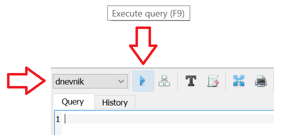
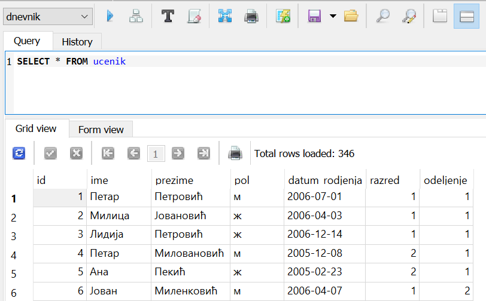

.. -*- mode: rst -*-

Пројекција и селекција -- задаци за вежбу (дневник)
---------------------------------------------------

Покушај самостално да решиш наредних неколико задатака.Решења можеш да тестираш овде, 
а можеш све задатке да урадиш и у систему SQLite Studio. Неопходно је, наравно, 
да је систем преузет на рачунар и је додата база података са називом *dnevnik*, како је описано у ранијим лекцијама.  
Упити се пишу након што се кликне на креирану базу у прозору ``Databases`` и потом 
изабере команда менија ``Tools → Open SQL Editor``. 

Када се напише упит, кликне се на дугме ``Execute query (F9)`` (плави троуглић) Уколико се у простору за писање упита налази више њих, потребно је обележити онај коју желимо да покренемо. Уколико имамо више база података, обавезно проверити да ли је поред овог дугмета назив базе у којој желите да вршите упите.

Савет је да се у прозору ``Databases`` увек прво провере тачни називи табела. 

.. image:: ../../_images/dnevnik.png
   :width: 500
   :align: center
   
Често ће нам код упита бити потребно да знамо и тачне називе колона, 
а понекад нам је значајно и да знамо како су неки подаци записани у бази 
(да ли су ћирилична слова, да ли су латинична, да ли имена и називи почињу 
великим словом, итд), па је добро да се пре писања коначног решења задатка 
прво напише и изврши основни SELECT упит који приказује све податке из табеле, 
како је приказано на следећој слици на примеру табеле са подацима о ученицима. 
 

   

.. questionnote::

   Напиши упит који из табеле ученика издваја ``id``, ``ime`` и
   ``prezime`` сваког ученика.

.. dbpetlja:: db_proj_restr_01
   :dbfile: dnevnik.sql
   :solutionquery:  SELECT id, ime, prezime
                    FROM ucenik
   :showresult:
  
  
.. questionnote::

   Напиши упит који из табеле изостанака приказује све податке о
   оправданим изостанцима.

   
.. dbpetlja:: db_proj_restr_02
   :dbfile: dnevnik.sql
   :solutionquery:  SELECT * FROM izostanak
                    WHERE status = 'оправдан'
   :showresult:

.. questionnote::

   Напиши упит који приказује назив и фонд часова сваког предмета из
   другог разреда.

.. dbpetlja:: db_proj_restr_03
   :dbfile: dnevnik.sql
   :solutionquery:     SELECT naziv, fond
                       FROM predmet
                       WHERE razred = 2
   :showresult:

