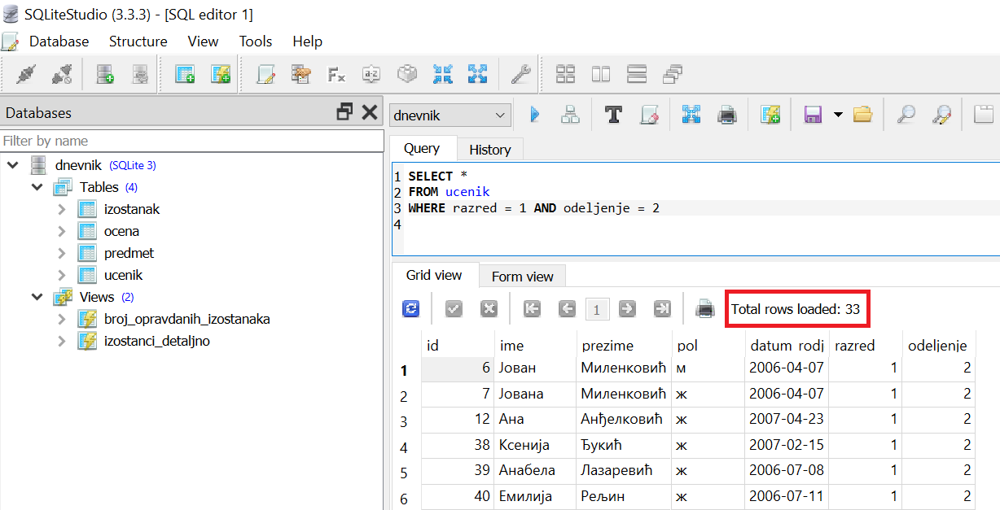

.. -*- mode: rst -*-

Логички оператори (AND, OR, NOT)
--------------------------------

Више логичких услова могуће је повезати уобичајеним логичким операторима:

- Оператор ``AND`` означава конјункцију тј. логичко *и*.
- Оператор ``OR`` означава дисјункцију тј. логичко *или*.
- Оператор ``NOT`` означава негацију тј. логичко *не*.

Прикажимо њихову употребу на неколико примера упита.

.. questionnote::

   Приказати све податке о ученицима одељења I2 (првог два).
   
.. code-block:: sql

   SELECT *
   FROM ucenik
   WHERE razred = 1 AND odeljenje = 2;

Извршавањем упита добија се следећи резултат:

.. csv-table::
   :header:  "id", "ime", "prezime", "pol", "datum_rodjenja", "razred", "odeljenje"
   :align: left

   "6", "Јован", "Миленковић", "м", "2006-04-07", "1", "2"
   "7", "Јована", "Миленковић", "ж", "2006-04-07", "1", "2"
   "12", "Ана", "Анђелковић", "ж", "2007-04-23", "1", "2"
   "38", "Ксенија", "Ђукић", "ж", "2007-02-15", "1", "2"
   "39", "Анабела", "Лазаревић", "ж", "2006-07-08", "1", "2"
   ..., ..., ..., ..., ..., ..., ...

Овај упит можемо да прочитамо као:

| **ОДАБЕРИ** све колоне
| **ИЗ РЕДОВА** табеле ученика
| **КОД КОЈИХ** је разред једнак 1 и одељење једнако 2

Приметимо да се у овом примеру захтева да ученик иде у први разред, као и да иде у 
друго одељење (пошто се тражи да су испуњени и први и други услов, употребљава се 
оператор ``AND``).

На следећој слици може да се види како изгледа овај упит покренут у систему SQLite Studio. 
Види се само првих неколико редова и информација о томе да има укупно 33 реда који задовољавају 
постављен услов. 

 

.. questionnote::

   Приказати све податке о ученицима који се зову Петар Петровић.

Нагласимо да је могуће да постоји више ученика који имају исто име и презиме.
   
.. code-block:: sql

   SELECT *
   FROM ucenik
   WHERE ime = 'Петар' AND prezime = 'Петровић';

Извршавањем упита добија се следећи резултат:

.. csv-table::
   :header:  "id", "ime", "prezime", "pol", "datum_rodjenja", "razred", "odeljenje"
   :align: left

   "1", "Петар", "Петровић", "м", "2006-07-01", "1", "1"

Структура овог упита је веома слична оном претходном (потребно је да
су задовољена оба наведена услова).

 
.. questionnote::
   
   Приказати све податке о ученицима који иду у непарну смену (то су
   ученици који иду у први и ученици који иду у трећи разред).

.. code-block:: sql
   
   SELECT *
   FROM ucenik
   WHERE razred = 1 OR razred = 3;

Извршавањем упита добија се следећи резултат:

.. csv-table::
   :header:  "id", "ime", "prezime", "pol", "datum_rodjenja", "razred", "odeljenje"
   :align: left

   "1", "Петар", "Петровић", "м", "2006-07-01", "1", "1"
   "2", "Милица", "Јовановић", "ж", "2006-04-03", "1", "1"
   "3", "Лидија", "Петровић", "ж", "2006-12-14", "1", "1"
   "6", "Јован", "Миленковић", "м", "2006-04-07", "1", "2"
   "7", "Јована", "Миленковић", "ж", "2006-04-07", "1", "2"
   ..., ..., ..., ..., ..., ..., ...

Овај упит можемо да прочитамо као:

| **ОДАБЕРИ** све колоне
| **ИЗ РЕДОВА** табеле ученика
| **КОД КОЈИХ** је разред једнак 1 или је разред једнак 3

У овом примеру је довољно да је задовољен било који од два наведена услова 
(подаци о ученику се приказују било да иде у први, било да иде у трећи разред),
па се користи оператор ``OR``.

.. questionnote::
   
   На екскурзију у октобру иду сви ученици, осим ученика првог разреда.
   Приказати њихова имена и презимена.

Тражи се списак ученика код којих је разред различит од 1. Задатак
можемо да решимо применом оператора ``NOT``.

.. code-block:: sql
   
   SELECT *
   FROM ucenik
   WHERE NOT (razred = 1);

Извршавањем упита добија се следећи резултат:

.. csv-table::
   :header:  "id", "ime", "prezime", "pol", "datum_rodjenja", "razred", "odeljenje"
   :align: left

   "4", "Петар", "Миловановић", "м", "2005-12-08", "2", "1"
   "5", "Ана", "Пекић", "ж", "2005-02-23", "2", "1"
   "8", "Гордана", "Сарић", "ж", "2005-01-03", "2", "1"
   "9", "Вања", "Савић", "м", "2004-11-13", "3", "1"
   "10", "Николина", "Јовановић", "ж", "2004-08-03", "3", "1"
   ..., ..., ..., ..., ..., ..., ...

Овај упит можемо протумачити као 

| **ОДАБЕРИ** све колоне
| **ИЗ РЕДОВА** табеле ученика
| **КОД КОЈИХ** разред није једнак 1

Ипак, још једноставније решење је да се употреби оператор различито ``!=``.

.. code-block:: sql
   
   SELECT *
   FROM ucenik
   WHERE razred != 1;

Извршавањем упита добија се следећи резултат:

.. csv-table::
   :header:  "id", "ime", "prezime", "pol", "datum_rodjenja", "razred", "odeljenje"
   :align: left

   "4", "Петар", "Миловановић", "м", "2005-12-08", "2", "1"
   "5", "Ана", "Пекић", "ж", "2005-02-23", "2", "1"
   "8", "Гордана", "Сарић", "ж", "2005-01-03", "2", "1"
   "9", "Вања", "Савић", "м", "2004-11-13", "3", "1"
   "10", "Николина", "Јовановић", "ж", "2004-08-03", "3", "1"
   ..., ..., ..., ..., ..., ..., ...

 
.. questionnote::

   Приказати све податке о ученицима који се презивају ``Петровић``,
   али се не зову ``Петар``.

И у овом случају можемо да употребимо оператор ``NOT``.

.. code-block:: sql

   SELECT *
   FROM ucenik
   WHERE NOT (ime = 'Петар') AND prezime = 'Петровић';

Извршавањем упита добија се следећи резултат:

.. csv-table::
   :header:  "id", "ime", "prezime", "pol", "datum_rodjenja", "razred", "odeljenje"
   :align: left

   "3", "Лидија", "Петровић", "ж", "2006-12-14", "1", "1"
   "47", "Душанка", "Петровић", "ж", "2006-09-28", "1", "2"
   "112", "Тамара", "Петровић", "ж", "2005-05-29", "2", "1"
   "126", "Марија", "Петровић", "ж", "2005-03-27", "2", "2"
   "285", "Илија", "Петровић", "м", "2003-10-27", "4", "1"

Задатак може да се реши и помоћу оператора различито.

.. code-block:: sql

   SELECT *
   FROM ucenik
   WHERE ime != 'Петар' AND prezime = 'Петровић';

Извршавањем упита добија се следећи резултат:

.. csv-table::
   :header:  "id", "ime", "prezime", "pol", "datum_rodjenja", "razred", "odeljenje"
   :align: left

   "3", "Лидија", "Петровић", "ж", "2006-12-14", "1", "1"
   "47", "Душанка", "Петровић", "ж", "2006-09-28", "1", "2"
   "112", "Тамара", "Петровић", "ж", "2005-05-29", "2", "1"
   "126", "Марија", "Петровић", "ж", "2005-03-27", "2", "2"
   "285", "Илија", "Петровић", "м", "2003-10-27", "4", "1"

Вежба
.....

Покушај сада да самостално решиш наредни задатак.
   
.. questionnote::

   Прикажи називе предмета из другог разреда који имају недељни фонд
   од два часа.

.. dbpetlja:: db_logicki_operatori_01
   :dbfile: dnevnik.sql
   :solutionquery:  SELECT naziv
                    FROM predmet
                    WHERE razred = 2 AND fond = 2
   :showresult:
  

