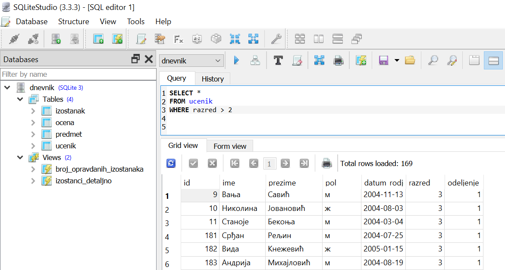

.. -*- mode: rst -*-

Релацијски оператори (<, <=, >, >=, BETWEEN, IN)
------------------------------------------------

До сада смо у свим упитима употребљавали само релацијске операторе
једнако (``=``) и различито (``!=``). Језик SQL подржава још неке
релацијске операторе. Над бројевима (као и на још неким типовима)
могу се употребљавати и релацијски оператори поретка ``<``, ``<=``, ``>``
и ``>=``.

.. questionnote::

   Приказати све ученике старијих разреда.

Приказујемо све ученике код којих је разред већи или једнак од 3.
   
.. code-block:: sql
                
   SELECT *
   FROM ucenik
   WHERE razred >= 3;

Извршавањем упита добија се следећи резултат:

.. csv-table::
   :header:  "id", "ime", "prezime", "pol", "datum_rodjenja", "razred", "odeljenje"
   :align: left

   "9", "Вања", "Савић", "м", "2004-11-13", "3", "1"
   "10", "Николина", "Јовановић", "ж", "2004-08-03", "3", "1"
   "11", "Станоје", "Бекоња", "м", "2004-03-04", "3", "1"
   "181", "Срђан", "Рељин", "м", "2004-07-25", "3", "1"
   "182", "Вида", "Кнежевић", "ж", "2005-01-15", "3", "1"
   ..., ..., ..., ..., ..., ..., ...

Овај упит можемо протумачити као:

| **ОДАБЕРИ** све колоне
| **ИЗ РЕДОВА** табеле ученика
| **КОД КОЈИХ** је разред већи или једнак 3.

На следећој слици може да се види како изгледа овај упит покренут у систему SQLite Studio. 
Види се само првих неколико редова и информација о томе да има укупно 169 редова који задовољавају 
постављен услов.

Алтернативно, приказујемо све ученике код којих је разред строго већи од два.
   
.. code-block:: sql

   SELECT *
   FROM ucenik
   WHERE razred > 2;

Извршавањем упита добија се следећи резултат:

.. csv-table::
   :header:  "id", "ime", "prezime", "pol", "datum_rodjenja", "razred", "odeljenje"
   :align: left

   "9", "Вања", "Савић", "м", "2004-11-13", "3", "1"
   "10", "Николина", "Јовановић", "ж", "2004-08-03", "3", "1"
   "11", "Станоје", "Бекоња", "м", "2004-03-04", "3", "1"
   "181", "Срђан", "Рељин", "м", "2004-07-25", "3", "1"
   "182", "Вида", "Кнежевић", "ж", "2005-01-15", "3", "1"
   ..., ..., ..., ..., ..., ..., ...

.. questionnote::
   
   Приказати све податке о предметима у прва два разреда.
   
.. code-block:: sql

   SELECT *
   FROM predmet
   WHERE razred <= 2;

Извршавањем упита добија се следећи резултат:

.. csv-table::
   :header:  "id", "naziv", "razred", "fond"
   :align: left

   "1", "Математика", "1", "4"
   "2", "Српски језик", "1", "4"
   "3", "Рачунарство и информатика", "1", "2"
   "4", "Математика", "2", "5"
   "5", "Психологија", "2", "2"
   ..., ..., ..., ...

Оператори поретка могу да се примене и на другим типовима података (на
пример, нискама и датумима).

.. questionnote::

   Приказати све податке о ученицима који су рођени после првог јуна 2006.

   
.. code-block:: sql

   SELECT *
   FROM ucenik
   WHERE datum_rodjenja > '2006-06-01';

Извршавањем упита добија се следећи резултат:

.. csv-table::
   :header:  "id", "ime", "prezime", "pol", "datum_rodjenja", "razred", "odeljenje"
   :align: left

   "1", "Петар", "Петровић", "м", "2006-07-01", "1", "1"
   "3", "Лидија", "Петровић", "ж", "2006-12-14", "1", "1"
   "12", "Ана", "Анђелковић", "ж", "2007-04-23", "1", "2"
   "13", "Дуња", "Травица", "ж", "2007-01-03", "1", "1"
   "14", "Јована", "Божић", "ж", "2006-09-06", "1", "1"
   ..., ..., ..., ..., ..., ..., ...

Подсетимо се да се датум наводи као ниска карактера, између једноструких
наводника, у формату ``gggg-mm-dd``.

.. questionnote::

   Приказати све податке о ученицима који су на време кренули у школу током
   2006. године (то су они који су рођени између 1. марта 2006. и 1. марта 
   2007. године, не укључујући последњи датум).

.. code-block:: sql
                
   SELECT *
   FROM ucenik
   WHERE '2006-03-01' <= datum_rodjenja AND datum_rodjenja < '2007-03-01';

Извршавањем упита добија се следећи резултат:

.. csv-table::
   :header:  "id", "ime", "prezime", "pol", "datum_rodjenja", "razred", "odeljenje"
   :align: left

   "1", "Петар", "Петровић", "м", "2006-07-01", "1", "1"
   "2", "Милица", "Јовановић", "ж", "2006-04-03", "1", "1"
   "3", "Лидија", "Петровић", "ж", "2006-12-14", "1", "1"
   "6", "Јован", "Миленковић", "м", "2006-04-07", "1", "2"
   "7", "Јована", "Миленковић", "ж", "2006-04-07", "1", "2"
   ..., ..., ..., ..., ..., ..., ...

Припадност интервалу може да се испитује и помоћу посебног оператора
``BETWEEN ... AND ...``. Обе границе које се наведу се укључују. На
пример, услов ``ocena BETWEEN 2 AND 4`` допушта вредности 2, 3, и 4.
Овај оператор може да се примени и на датуме.

.. code-block:: sql

   SELECT *
   FROM ucenik
   WHERE datum_rodjenja BETWEEN '2006-03-01' AND '2007-02-28';

Извршавањем упита добија се следећи резултат:

.. csv-table::
   :header:  "id", "ime", "prezime", "pol", "datum_rodjenja", "razred", "odeljenje"
   :align: left

   "1", "Петар", "Петровић", "м", "2006-07-01", "1", "1"
   "2", "Милица", "Јовановић", "ж", "2006-04-03", "1", "1"
   "3", "Лидија", "Петровић", "ж", "2006-12-14", "1", "1"
   "6", "Јован", "Миленковић", "м", "2006-04-07", "1", "2"
   "7", "Јована", "Миленковић", "ж", "2006-04-07", "1", "2"
   ..., ..., ..., ..., ..., ..., ...

Оператор ``BETWEEN`` може да се комбинује и са другим операторима.

.. questionnote::

   Приказати податке о свим регулисаним изостанцима на првом часу
   добијеним у 2021. години.

.. code-block:: sql

   SELECT *
   FROM izostanak
   WHERE datum BETWEEN '2021-01-01' AND '2021-12-01' AND
         status != 'нерегулисан' AND cas = 1;

Извршавањем упита добија се следећи резултат:

.. csv-table::
   :header:  "id", "id_ucenik", "datum", "cas", "status"
   :align: left

   "1", "1", "2021-05-14", "1", "оправдан"
   "5", "6", "2021-06-01", "1", "неоправдан"
   "7", "8", "2021-06-01", "1", "оправдан"
   "9", "100", "2021-03-02", "1", "неоправдан"
   "12", "100", "2021-03-10", "1", "неоправдан"
   ..., ..., ..., ..., ...

                
.. questionnote::

   Приказати све ученике који су у дневнику одељења I1 пре Петровића

.. code-block:: sql

   SELECT *
   FROM ucenik
   WHERE razred = 1 AND odeljenje = 1 AND prezime < 'Петровић';

Извршавањем упита добија се следећи резултат:

.. csv-table::
   :header:  "id", "ime", "prezime", "pol", "datum_rodjenja", "razred", "odeljenje"
   :align: left

   "2", "Милица", "Јовановић", "ж", "2006-04-03", "1", "1"
   "14", "Јована", "Божић", "ж", "2006-09-06", "1", "1"
   "15", "Елена", "Ђурђевић", "ж", "2007-01-16", "1", "1"
   "16", "Даница", "Анђелковић", "ж", "2007-02-11", "1", "1"
   "17", "Теодора", "Вучковић", "ж", "2007-02-25", "1", "1"
   ..., ..., ..., ..., ..., ..., ...

У овом упиту смо презиме упоредили са Петровић, помоћу оператора ``<``, 
и тада се поређење врши по азбучном редоследу (каже се,
лексикографски). За примену овог оператора над нискама је веома битно
да је за колону подешена одговарајућа колациона секвенца (подсетимо
се, у колони презиме поставили смо колациону секвенцу ``UNICODE``, што
омогућава да се и ћирилички карактери исправно пореде).

Још један често коришћен оператор који се примењује над текстуалним
подацима (нискама) је оператор ``LIKE``, којим може да се наметне облик
(шаблон) ниске који желимо да издвојимо (или изоставимо) из резултата.

.. questionnote::

   Приказати све ученике чије презиме почиње на слово ``П``.

.. code-block:: sql

   SELECT *
   FROM ucenik
   WHERE prezime LIKE 'П%';

Извршавањем упита добија се следећи резултат:

.. csv-table::
   :header:  "id", "ime", "prezime", "pol", "datum_rodjenja", "razred", "odeljenje"
   :align: left

   "1", "Петар", "Петровић", "м", "2006-07-01", "1", "1"
   "3", "Лидија", "Петровић", "ж", "2006-12-14", "1", "1"
   "5", "Ана", "Пекић", "ж", "2005-02-23", "2", "1"
   "24", "Ивана", "Пејчев", "ж", "2006-05-13", "1", "1"
   "47", "Душанка", "Петровић", "ж", "2006-09-28", "1", "2"
   ..., ..., ..., ..., ..., ..., ...

Шаблон презимена која се траже је описан у облику ``'П%'``, што значи
да она почињу словом П након чега следи произвољан низ карактера
(карактер ``%`` у склопу шаблона означава било какав низ карактера,
док карактер ``_`` означава било који појединачан карактер).
   
.. questionnote::

   Приказати све ученике чији су иницијали ``ПП``.
   

.. code-block:: sql

   SELECT *
   FROM ucenik
   WHERE ime LIKE 'П%' AND prezime LIKE 'П%';

Извршавањем упита добија се следећи резултат:

.. csv-table::
   :header:  "id", "ime", "prezime", "pol", "datum_rodjenja", "razred", "odeljenje"
   :align: left

   "1", "Петар", "Петровић", "м", "2006-07-01", "1", "1"
   "163", "Петар", "Платиша", "м", "2005-05-30", "2", "3"

|

.. questionnote::
   
   Приказати све ученице чије се име не завршава на слово `а`.

.. code-block:: sql

   SELECT *
   FROM ucenik
   WHERE pol = 'ж' AND NOT (ime LIKE '%а');

Извршавањем упита добија се следећи резултат:

.. csv-table::
   :header:  "id", "ime", "prezime", "pol", "datum_rodjenja", "razred", "odeljenje"
   :align: left

   "322", "Натали", "Ристић", "ж", "2003-03-06", "4", "3"

У овом примеру је употребљен оператор ``NOT`` да би се приказали само
они ученици чије се име НЕ уклапа у дати шаблон. Шаблон ``'%а'``
означава произвољан низ карактера иза којих следи ниска ``а``.

|

.. questionnote::

   Приказати имена и презимена ученика чије се презиме завршава на
   ``ић``, али не и на ``вић``.

.. code-block:: sql

   SELECT ime, prezime
   FROM ucenik
   WHERE (prezime LIKE '%ић') AND NOT (prezime LIKE '%вић');

Извршавањем упита добија се следећи резултат:

.. csv-table::
   :header:  "ime", "prezime"
   :align: left

   "Ана", "Пекић"
   "Гордана", "Сарић"
   "Јована", "Божић"
   "Тијана", "Божић"
   "Зоран", "Илић"
   ..., ...

Још један користан оператор може бити оператор ``IN``, којим се
проверава да ли вредност припада неком датом скупу
елемената. Приказаћемо његову употребу на следећем примеру.

|

.. questionnote::
           
   Издвојити податке о свим предметима који се зову ``Математика``,
   ``Физика`` или ``Рачунарство и информатика``.

.. code-block:: sql

   SELECT *
   FROM predmet
   WHERE naziv IN ('Математика', 'Физика', 'Рачунарство и информатика')

Извршавањем упита добија се следећи резултат:

.. csv-table::
   :header:  "id", "naziv", "razred", "fond"
   :align: left

   "1", "Математика", "1", "4"
   "3", "Рачунарство и информатика", "1", "2"
   "4", "Математика", "2", "5"
   "6", "Физика", "1", "2"
   "7", "Физика", "2", "3"
   ..., ..., ..., ...

   
Вежба
.....
   
Покушај сада да самостално решиш наредних неколико задатака.
   
.. questionnote::

   Приказати све податке о изостанцима добијеним током прва три часа.
   
.. dbpetlja:: db_relacijski_01
   :dbfile: dnevnik.sql
   :solutionquery: SELECT *
                   FROM izostanak
                   WHERE cas <= 3
   :showresult:

.. questionnote::

   Приказати сва имена и презимена ученика чија презимена почињу на „Ми“.
 
                   
.. dbpetlja:: db_relacijski_02
   :dbfile: dnevnik.sql
   :solutionquery: SELECT ime, prezime
                   FROM ucenik
                   WHERE prezime LIKE 'Ми%'
   :showresult:
                   