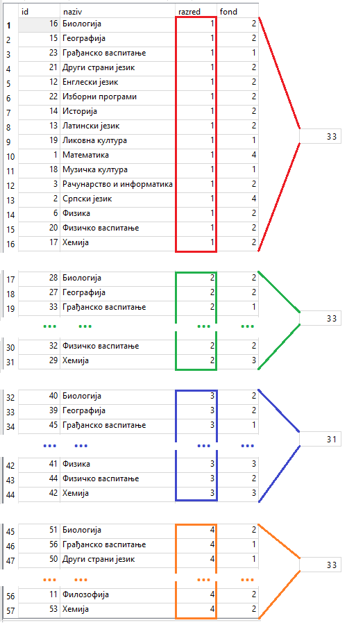

.. -*- mode: rst -*-

Груписање и израчунавање статистика појединачних група (GROUP BY)
-----------------------------------------------------------------

У претходном поглављу смо видели како агрегатне функције могу да се 
примене на филтриране податке (податке који задовољавају неки
услов). Видели смо, на пример, како можемо да израчунамо укупан фонд
часова предмета у првом разреду или како можемо да одредимо просек свих
датих оцена из неког појединачног предмета. Често се јавља потреба да
се иста врста упита понови за сваку вредност у некој колони. На
пример, сасвим је природно пожелети да се одреди фонд часова предмета
не само у првом, већ у сваком од четири разреда, или да се израчуна
просечна оцена из сваког појединачног предмета. Уместо да се поставља
више сродних упита, овакве статистике је могуће израчунати коришћењем
**груписања и израчунавања статистика по групама**. У језику SQL се за
то користи клаузула ``GROUP BY``. Прикажимо њену употребу на неколико
примера.

.. questionnote::
   
   Приказати укупан фонд часова у сваком од четири разреда.

.. code-block:: sql

   SELECT razred, SUM(fond) as fond_casova
   FROM predmet
   GROUP BY razred;

Извршавањем упита добија се следећи резултат:

.. csv-table::
   :header:  "razred", "fond_casova"
   :align: left

   "1", "33"
   "2", "33"
   "3", "31"
   "4", "33"

Извршавање овог упита можемо себи да представимо на следећи начин.

- Скуп свих врста у табели предмета (свака од њих одговара једном предмету) 
  се подели у групе које одговарају појединим разредима. При томе, за сваку 
  групу важи да сви редови те групе имају исту вредност колоне ``razred``. 
- Агрегатна функција ``SUM`` се примени засебно на сваку групу.
- За сваку групу се добија (и приказује) по један ред резултата.

У примеру приказаном на слици се добијају 4 групе, од којих свака одговара
по једном разреду.

Напоменимо да СУБП, може ради постизања веће ефикасности, да ове операције извршава 
и другачијим редоследом, али резултат мора да буде исти као када се рачунање 
обавља онако како је овде описано. На пример, могуће је да се формирање
група и рачунање збирова по групама извршава једновремено (користећи по 
потреби и неке напредније структуре података).

|

.. questionnote::
   
   Приказати најмању оцену из сваког предмета.
   
.. code-block:: sql
                
   SELECT id_predmet, MIN(ocena) as min_ocena
   FROM ocena
   GROUP BY id_predmet;

Извршавањем упита добија се следећи резултат:

.. csv-table::
   :header:  "id_predmet", "min_ocena"
   :align: left

   "1", "1"
   "2", "1"
   "3", "2"
   "4", "1"
   "5", "1"
   ..., ...

У овом упиту се врсте табеле ``ocena`` поделе у групе на основу
предмета, тј.  њихових идентификатора. У свакој групи се, дакле, налазе
све оцене из неког предмета. Затим се у оквиру сваке групе засебно
проналази минимална оцена и на крају резултат садржи идентификатор
предмета (заједнички за све оцене у групи) и минималну оцену у групи.
   
Груписање може да се изврши и по вредности н-торке колона.

|

.. questionnote::

   Приказати број ученика у сваком од одељења.

.. code-block:: sql
   
   SELECT razred, odeljenje, COUNT(*) as broj_ucenika
   FROM ucenik
   GROUP BY razred, odeljenje;

Извршавањем упита добија се следећи резултат:

.. csv-table::
   :header:  "razred", "odeljenje", "broj_ucenika"
   :align: left

   "1", "1", "28"
   "1", "2", "33"
   "1", "3", "29"
   "2", "1", "32"
   "2", "2", "26"
   ..., ..., ...

У овом случају се за сваки пар вредности ``(razred, odeljenje)``
креира посебна група врста и затим се одреди број елемената (врста) у
свакој од тих група.

Груписање и израчунавање статистика по групама може да се обави и
након филтрирања (тј. селекције неких врста).

|

.. questionnote::

   Приказати број девојчица у сваком разреду.
   
.. code-block:: sql
   
   SELECT razred, COUNT(*) as broj_devojcica
   FROM ucenik
   WHERE pol = 'ж'
   GROUP BY razred;

Извршавањем упита добија се следећи резултат:

.. csv-table::
   :header:  "razred", "broj_devojcica"
   :align: left

   "1", "56"
   "2", "51"
   "3", "34"
   "4", "44"

У овом упиту се из табеле ученика бирају само оне врсте које описују
девојчице (код којих је вредност у колони ``pol`` једнака ``ж``), а
затим се те врсте групишу у четири групе на основу разреда и затим се
одређује број елемената у свакој од те четири групе.

Груписани резултати се могу сортирати, може се ограничавати број врста
у резултату и слично.

.. questionnote::

   Приказати три најчешћа презимена.
    
.. code-block:: sql

   SELECT prezime, COUNT(*) AS broj_ucenika
   FROM ucenik
   GROUP BY prezime
   ORDER BY broj_ucenika DESC
   LIMIT 3;

Извршавањем упита добија се следећи резултат:

.. csv-table::
   :header:  "prezime", "broj_ucenika"
   :align: left

   "Милић", "8"
   "Цветковић", "7"
   "Ристић", "7"

Вежба
.....

Покушај да самостално напишеш наредних неколико упита. Решења можеш да тестираш овде, 
а можеш све задатке да урадиш и у систему SQLite Studio.

.. questionnote::

   Прикажи укупан број изостанака за сваки статус изостанака
   (оправдане, неоправдане, нерегулисане).

.. dbpetlja:: db_grupisanje_01
   :dbfile: dnevnik.sql
   :solutionquery: SELECT status, COUNT(*) AS broj_izostanaka
                   FROM izostanak
                   GROUP BY status
    :showresult:
                   
.. questionnote::

   Прикажи највећи фонд часова неког предмета за сваки од разреда
   (приказати редни број разреда и максимални фонд у колони под
   називом ``najveci_fond``).

.. dbpetlja:: db_grupisanje_02
   :dbfile: dnevnik.sql
   :solutionquery: SELECT razred, MAX(fond) AS najveci_fond
                   FROM predmet
                   GROUP BY razred
   :showresult:
   :checkcolumnname:

.. questionnote::

   Прикажи три датума у којима је остварено највише изостанака (уз
   датум приказати и број изостанака у колони под називом
   ``broj_izostanaka``).

.. dbpetlja:: db_grupisanje_03
   :dbfile: dnevnik.sql
   :solutionquery: SELECT datum, COUNT(*) AS broj_izostanaka
                   FROM izostanak
                   GROUP BY datum
                   ORDER BY broj_izostanaka DESC
                   LIMIT 3
   :showresult:
   :checkcolumnname:

   
    
