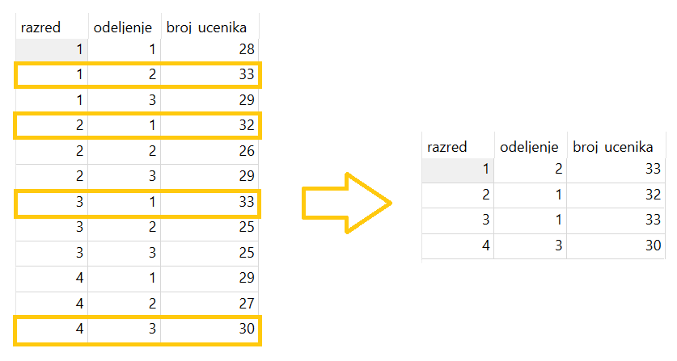
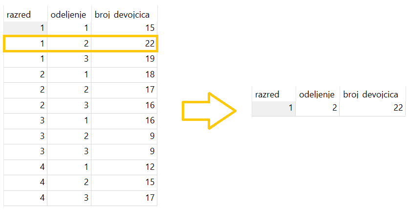

.. -*- mode: rst -*-

Селекција након груписања (HAVING)
----------------------------------

Када се израчунају статистике по групама, можемо пожелети да поново
филтрирамо податке, тј. да одаберемо које групе желимо да буду
приказане на основу вредности израчунатих статистика. На пример,
може да буде потребно да прикажемо само она одељења која имају више 
од 30 ученика. У овом случају филтрирање података може и треба да се 
обави тек након израчунавања броја ученика у свим групама.

За филтрирање након груписања се користи клаузула ``HAVING``. 

.. infonote::

    Када желимо да филтрирамо податке пре груписања, користимо
    клаузулу ``WHERE``.
    
    Када желимо да филтрирамо податке након груписања и 
    израчунавања агрегатних статистика, користимо клаузулу
    ``HAVING``.

.. questionnote::

   Приказати одељења у којима има више од 30 ученика.

 
.. code-block:: sql
   
   SELECT razred, odeljenje, COUNT(*) as broj_ucenika
   FROM ucenik
   GROUP BY razred, odeljenje
   HAVING broj_ucenika >= 30;

Извршавањем упита добија се следећи резултат:

.. csv-table::
   :header:  "razred", "odeljenje", "broj_ucenika"
   :align: left

   "1", "2", "33"
   "2", "1", "32"
   "3", "1", "33"
   "4", "3", "30"

Током извршавања овог упита било је потребно прво груписати редове 
по одељењима и пребројати их у свакој групи, а онда из резултата 
по групама издвојити (HAVING) одељења која имају тражени број ученика.

Упит може да садржи и двоструко филтрирање, тј. да користи и клаузулу 
``WHERE`` и клаузулу ``HAVING``. Наравно, помоћу клаузуле ``WHERE``
се подаци филтрирају пре груписања, а помоћу клаузуле ``HAVING``
после груписања. У клаузули ``HAVING`` се у услову увек појављује резултат рада агрегатне функције. 
   
.. questionnote::

   Приказати одељења у којима има више од 20 девојчица.
   
.. code-block:: sql
   
   SELECT razred, odeljenje, COUNT(*) as broj_devojcica
   FROM ucenik
   WHERE pol = 'ж'
   GROUP BY razred, odeljenje
   HAVING broj_devojcica > 20;

Извршавањем упита добија се следећи резултат:

.. csv-table::
   :header:  "razred", "odeljenje", "broj_devojcica"
   :align: left

   "1", "2", "22"

Током извршавања овог упита је било потребно прво издвојити 
редове који се односе на девојчице (``WHERE``), затим груписати 
те редове по одељењима и пребројати их у свакој групи, а на крају 
из резултата по групама издвојити (``HAVING``) одељења која имају 
тражени број девојчица.

   
И овде је могуће сортирање врста резултата, ограничавање броја врста и
слично.

.. questionnote::

   За свако женско име које носи више ученица приказати број ученица
   које носе то име (резултат сортирати опадајуће по броју ученица).

    
.. code-block:: sql

   SELECT ime, COUNT(*) AS broj
   FROM ucenik
   WHERE pol = 'ж'
   GROUP BY ime
   HAVING broj >= 2
   ORDER BY broj DESC;

Извршавањем упита добија се следећи резултат:

.. csv-table::
   :header:  "ime", "broj"
   :align: left

   "Милица", "5"
   "Весна", "5"
   "Маша", "4"
   "Магдалена", "4"
   "Лидија", "4"
   ..., ...

У примерима до сада смо у клаузули ``HAVING`` користили алијас који смо увели за резултат 
агрегатне функције. То није неопходно. Сама агрегатна функција може да се појави у клаузули ``HAVING``.

.. questionnote::

   Прикажи сва одељења четвртог разреда у којима има бар четири ученика
   рођена 2004. године.

.. code-block:: sql

   SELECT razred, odeljenje
   FROM ucenik
   WHERE razred = 4 AND strftime('%Y', datum_rodjenja) = '2004'
   GROUP BY razred, odeljenje
   HAVING COUNT(*) >= 2

Извршавањем упита добија се следећи резултат:

.. csv-table::
   :header:  "razred", "odeljenje"
   :align: left

   "4", "1"
   "4", "2"
   "4", "3"

Вежба
.....

Покушај да наредних неколико упита напишеш самостално. Решења можеш да тестираш овде, 
а можеш све задатке да урадиш и у систему SQLite Studio.
   

.. questionnote::

   Приказати све датуме за које постоје бар два нерегулисана изостанка
   (уз датум приказати и број нерегулисаних изостанака).

.. dbpetlja:: db_having_01
   :dbfile: dnevnik.sql
   :solutionquery: SELECT datum, COUNT(*) AS broj_neregulisanih
                   FROM izostanak
                   WHERE status = 'нерегулисан'
                   GROUP BY datum
                   HAVING broj_neregulisanih >= 2
   :showresult:
   
.. questionnote::

   Прикажи сва одељења четвртог разреда у којима има бар 15 дечака
   (приказати само разред и одељење).

.. dbpetlja:: db_having_02
   :dbfile: dnevnik.sql
   :solutionquery: SELECT razred, odeljenje
                   FROM ucenik
                   WHERE pol = 'м' AND razred = 4
                   GROUP BY razred, odeljenje
                   HAVING COUNT(*) >= 15
   :showresult:
