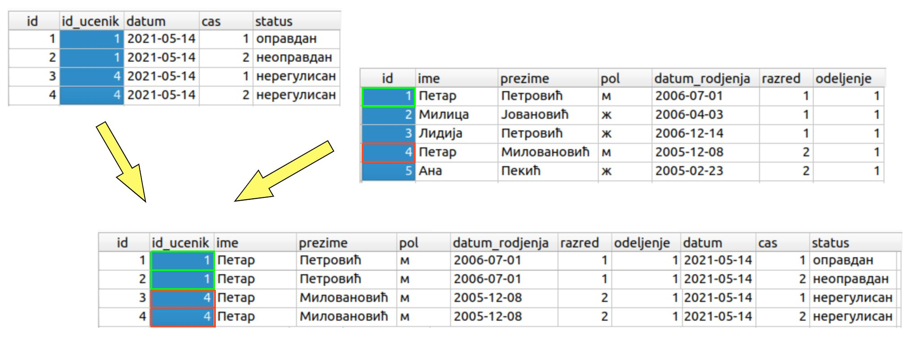

.. -*- mode: rst -*-

Спајање табела
--------------

На почетку поглавља о базама података смо видели да смештање свих података 
у једну велику табелу доводи до редундантности, неефикасности и повећава
могућност настанка грешака. Због тога су подаци у бази података организовани 
у више табела.

Са друге стране, сви досадашњи упити су читали податке искључиво из једне 
табеле. У многим ситуацијама нам то није довољно, већ јер потребно да се 
подаци из две или више табела повежу (помоћу страних кључева) и прикажу 
заједно у резултату.

.. questionnote::

   Приказати све изостанке на дан 14. 5. 2021.         

Први покушај може да буде просто читање свих података из табеле изостанака.
   
.. code-block:: sql

   SELECT *
   FROM izostanak
   WHERE datum = '2021-05-14';

Извршавањем упита добија се следећи резултат:

.. csv-table::
   :header:  "id", "id_ucenik", "datum", "cas", "status"
   :align: left

   "1", "1", "2021-05-14", "1", "оправдан"
   "2", "1", "2021-05-14", "2", "неоправдан"
   "3", "4", "2021-05-14", "1", "нерегулисан"
   "4", "4", "2021-05-14", "2", "нерегулисан"
   "6", "1", "2021-05-14", "3", "оправдан"
   ..., ..., ..., ..., ...

Кључни проблем са овим упитом је то што се не виде имена ученика, већ
само њихови идентификатори. Пошто желимо да добијемо што прегледнији
резултат, потребно је користимо податке и из табеле уеника и из табеле 
изостанака. Прецизније, за сваки идентификатор ученика који је
записан у табели изостанака, потребно је пронаћи и приказати податке о 
ученику са тим идентификатором (пре свега његово име и презиме).

Један начин да то урадимо је да употребимо оператор спајања
``... JOIN ... ON ...``.

.. code-block:: sql
                
   SELECT *
   FROM izostanak JOIN ucenik ON izostanak.id_ucenik = ucenik.id;

Извршавањем упита добија се следећи резултат:

.. csv-table::
   :header:  "id", "id_ucenik", "datum", "cas", "status", "id", "ime", "prezime", "pol", "datum_rodjenja", "razred", "odeljenje"
   :align: left

   "1", "1", "2021-05-14", "1", "оправдан", "1", "Петар", "Петровић", "м", "2006-07-01", "1", "1"
   "2", "1", "2021-05-14", "2", "неоправдан", "1", "Петар", "Петровић", "м", "2006-07-01", "1", "1"
   "3", "4", "2021-05-14", "1", "нерегулисан", "4", "Петар", "Миловановић", "м", "2005-12-08", "2", "1"
   "4", "4", "2021-05-14", "2", "нерегулисан", "4", "Петар", "Миловановић", "м", "2005-12-08", "2", "1"
   "5", "6", "2021-06-01", "1", "неоправдан", "6", "Јован", "Миленковић", "м", "2006-04-07", "1", "2"
   ..., ..., ..., ..., ..., ..., ..., ..., ..., ..., ..., ...

У овом упиту смо извршили спајање табеле изостанака и табеле ученика
коришћењем једнакости одговарајућих идентификатора. Резултат спајања
садржи све врсте које се добијају надовезивањем једне врсте из табеле
ученика на једну врсту из табеле изостанака, тако да је вредност колоне
``id_ucenik`` у врсти из табеле изостанака једнака вредности колоне 
``id`` у врсти из табеле ученика. 

На пример, претпоставимо да у табели изостанака
постоји ред ``(2, 1, 2021-05-14, 2, неоправдан)``, а у табели
ученика постоји ред``(1, Петар, Петровић, м, 2007-07-01, 1,
1)``. При том је други број у табели изостанака колона ``id_ucenik``
(идентификатор ученика који је направио изостанак), док је први број у
табели ученик заправо колона ``id`` (идентификатор ученика). Пошто се
у обе те колоне налази вредност 1 (ради се о истом ученику), у 
привременој табели добијеној спајањем ће постојати врста ``(2, 1, 
2021-05-14, 2, неоправдан, 1, Петар, Петровић, м, 2007-07-01, 1, 1)``.
Овај пример је део следеће илустрације на којој можемо да видимо још један 
изостанак ученика Петра Петровића и два изостанка ученика Петра Миловановића са 
идентификатором 4. 

Приметимо да смо у услову спајања ``ON`` називе колона оквалификовали
називима табела. Што се тиче колоне ``id`` то је било неопходно, јер
колона ``id`` постоји у обе наведене табеле. Са друге стране, колона
``id_ucenik`` постоји само у табели изостанака, па је није било
неопходно наводити назив табеле уз назив колоне, међутим, експлицитним
навођењем имена табеле упит постаје јаснији и прегледнији.

Текст упита може мало да се скрати ако се табелама у оквиру 
упита дају нова, краћа имена, навођењем **алијаса**.

.. code-block:: sql
                
   SELECT *
   FROM izostanak AS i
        JOIN ucenik AS u ON i.id_ucenik = u.id;

Извршавањем упита добија се исти резултат како малопре. 

Кључна реч ``AS`` може да се изостави и у том случају би исти упит изгледао овако:

.. code-block:: sql

   SELECT *
   FROM izostanak i
        JOIN ucenik u ON i.id_ucenik = u.id;

У систему SQLite Studio се упити се пишу након што се кликне на креирану базу *dnevnik* у прозору 
``Databases`` и потом изабере команда менија ``Tools → Open SQL Editor``. Када се напише упит, 
кликне се на дугме ``Execute query (F9)`` (плави троуглић). 
Савет је да се у прозору ``Databases`` увек прво провере тачни називи табела, као и колона. 
Посебно је важно да проверимо називе страног кључа и примарног кључа који му одговара у другој 
табели када желико да извршимо спајање, тј. да прикажемо податке из више табела које су повезане.  

   
Исти упит покренут у систему SQLite Studio може да се види на следећој слици. 
Види се само првих неколико редова и информација о томе да има укупно 10194 редова, 
односно толико има евидентираних изостанака у овој бази података, а уз сваки смо додали и 
податке о ученику који га је направио.

   
Спојене табеле могу да се филтрирају (коришћењем клаузуле ``WHERE``) и
резултат може да се пројектује само на оне колоне које нас
занимају. Напоменимо да се у овом случају филтрирање, ефикасности ради, врши пре
спајања (мада би резултат био исти и кад би се прво вршило спајање).

.. questionnote::
                
   За сваки изостанак начињен 14. маја 2021. године, приказати 
   име и презиме ученика, редни број часа и статус изостанка.

.. code-block:: sql
                
   SELECT ime, prezime, cas, status
   FROM izostanak i
        JOIN ucenik u ON i.id_ucenik = u.id
   WHERE datum = '2021-05-14';

Извршавањем упита добија се следећи резултат:

.. csv-table::
   :header:  "ime", "prezime", "cas", "status"
   :align: left

   "Петар", "Петровић", "1", "оправдан"
   "Петар", "Петровић", "2", "неоправдан"
   "Петар", "Миловановић", "1", "нерегулисан"
   "Петар", "Миловановић", "2", "нерегулисан"
   "Петар", "Петровић", "3", "оправдан"
   ..., ..., ..., ...

.. questionnote::
                
   Приказати све оцене из математике за први разред.

Проблем код оваквих упита је то што не знамо идентификатор 
траженог предмета. Не желимо (и не треба) да памтимо вредности 
идентификатора, који могу да нам затребају у разним сличним 
упитима над овом и другим базама података.

Оцене се налазе у табели оцена, док се називи предмета налазе у 
табели предмета, па је једно могуће решење да се прво изврши 
спајање те две табеле, да би затим филтирање могло да се врши на 
основу назива предмета и разреда у ком се предаје. Захваљујући спајању, 
нестаје потреба да знамо вредности идентификатора предмета.

Овде претпостављамо да постоји само један предмет у првом разреду 
који се зове математика, тј. да је пар ``(naziv, razred)`` довољан 
за јединствено идентификовање сваког реда у табели ``predmet``. У 
противном (ако постоји више предмета са називом математика у првом 
разреду) ће бити приказане све оцене из свих таквих предмета.

.. code-block:: sql

   SELECT id_ucenik, ocena, datum, vrsta
   FROM ocena
        JOIN predmet ON ocena.id_predmet = predmet.id
   WHERE predmet.naziv = 'Математика' AND predmet.razred = 1;

Извршавањем упита добија се следећи резултат:

.. csv-table::
   :header:  "id_ucenik", "ocena", "datum", "vrsta"
   :align: left

   "1", "3", "2020-10-15", "писмени задатак"
   "2", "3", "2020-10-15", "писмени задатак"
   "3", "2", "2020-10-15", "писмени задатак"
   "14", "3", "2020-10-15", "писмени задатак"
   "15", "1", "2020-10-15", "писмени задатак"
   ..., ..., ..., ...

   
Спајање је могуће применити и на више од две табеле.

.. questionnote::
           
   Приказати све оцене у читљивом формату (тако да се виде име и
   презиме ученика и назив предмета)

.. code-block:: sql

   SELECT p.naziv, u.ime, u.prezime, o.ocena, o.datum, o.vrsta
   FROM ocena o
        JOIN predmet p ON o.id_predmet = p.id
        JOIN ucenik u ON o.id_ucenik = u.id;

Извршавањем упита добија се следећи резултат:

.. csv-table::
   :header:  "naziv", "ime", "prezime", "ocena", "datum", "vrsta"
   :align: left

   "Математика", "Петар", "Петровић", "3", "2020-10-15", "писмени задатак"
   "Математика", "Милица", "Јовановић", "3", "2020-10-15", "писмени задатак"
   "Математика", "Лидија", "Петровић", "2", "2020-10-15", "писмени задатак"
   "Математика", "Јована", "Божић", "3", "2020-10-15", "писмени задатак"
   "Математика", "Елена", "Ђурђевић", "1", "2020-10-15", "писмени задатак"
   ..., ..., ..., ..., ..., ...

На следећој слици је приказано само првих неколико редова из сваке од табела коришћених у овом упиту, 
а обележено је како долази до спајања одговарајућих редова из сваке од табела према једнакости 
вредности кључева. 

Наравно, и тада је могуће извршити додатно филтрирање коришћењем
клаузуле ``WHERE``.

.. questionnote::

   Приказати све оцене на писменим задацима из предмета првог разреда
   у читљивом формату.

.. code-block:: sql
                
   SELECT p.naziv, u.ime, u.prezime, o.ocena, o.datum, o.vrsta
   FROM ocena o
        JOIN predmet p ON o.id_predmet = p.id
        JOIN ucenik u ON o.id_ucenik = u.id
   WHERE p.razred = 1 AND vrsta = 'писмени задатак';

Извршавањем упита добија се следећи резултат:

.. csv-table::
   :header:  "naziv", "ime", "prezime", "ocena", "datum", "vrsta"
   :align: left

   "Математика", "Петар", "Петровић", "3", "2020-10-15", "писмени задатак"
   "Математика", "Милица", "Јовановић", "3", "2020-10-15", "писмени задатак"
   "Математика", "Лидија", "Петровић", "2", "2020-10-15", "писмени задатак"
   "Математика", "Јована", "Божић", "3", "2020-10-15", "писмени задатак"
   "Математика", "Елена", "Ђурђевић", "1", "2020-10-15", "писмени задатак"
   ..., ..., ..., ..., ..., ...

Табеле при спајању не морају бити различите -- могуће је спојити
табелу саму са собом.

.. questionnote::

   Приказати све парове близанаца (под близанцима ћемо подразумевати
   све парове ученика који се исто презивају и имају исти датум
   рођења).

Први покушај подразумева само да се табела ``ucenik`` споји сама са
собом, уз услов да презиме и датум рођења буду једнаки.

.. code-block:: sql

   SELECT u1.ime as ime1, u2.ime as ime2, u1.prezime
   FROM ucenik as u1
        JOIN ucenik as u2 ON u1.datum_rodjenja = u2.datum_rodjenja AND u1.prezime = u2.prezime;

Извршавањем упита добија се следећи резултат:

.. csv-table::
   :header:  "ime1", "ime2", "prezime"
   :align: left

   "Петар", "Петар", "Петровић"
   "Милица", "Милица", "Јовановић"
   "Лидија", "Лидија", "Петровић"
   "Петар", "Петар", "Миловановић"
   "Ана", "Ана", "Пекић"
   ..., ..., ...

Као што видимо, постоје два проблема са овим приступом. Наиме, сваки
ученик има исти датум рођења и презиме као он сам, па се за сваког
ученика пријављује да је сам себи близанац. Даље, сваки пар близанаца
се пријављује два пута (јер се за првог близанца успешно налази пар,
па се затим и за другог близанца успешно налази пар). И један и други
проблем се могу решити ако се наметне да су идентификатори унутар пара
близанаца различити (тиме се елиминише могућност да је неко сам себи
близанац) и уређени у неком редоследу (тиме се елиминише двоструко
пријављивање истих парова близанаца).

.. code-block:: sql

   SELECT u1.ime as ime1, u2.ime as ime2, u1.prezime
   FROM ucenik as u1
        JOIN ucenik as u2 ON u1.datum_rodjenja = u2.datum_rodjenja AND u1.prezime = u2.prezime
   WHERE u1.id < u2.id;

Извршавањем упита добија се следећи резултат:

.. csv-table::
   :header:  "ime1", "ime2", "prezime"
   :align: left

   "Јован", "Јована", "Миленковић"

Вежба
.....

Покушај да наредних неколико упита напишеш самостално.

.. questionnote::
   
   Приказати све регулисане изостанке у читљивом формату (у ком се
   види име и презиме ученика и датум, час и статус изостанка).

.. dbpetlja:: db_spajanje_01
   :dbfile: dnevnik.sql
   :showresult:
   :solutionquery: SELECT u.ime, u.prezime, i.datum, i.cas, i.status
                   FROM izostanak i
                   JOIN ucenik u ON i.id_ucenik = u.id
                   WHERE i.status != 'нерегулисан'
                   
.. questionnote::

   За сваког ученика приказати списак предмета које похађа (свака
   врста треба да садржи име и презиме ученика, разред и одељење у
   које иде и назив једног предмета).

.. dbpetlja:: db_spajanje_02
   :dbfile: dnevnik.sql
   :showresult:
   :solutionquery: SELECT u.ime, u.prezime, u.razred, u.odeljenje, p.naziv
                   FROM ucenik u JOIN
                   predmet p ON u.razred = p.razred
