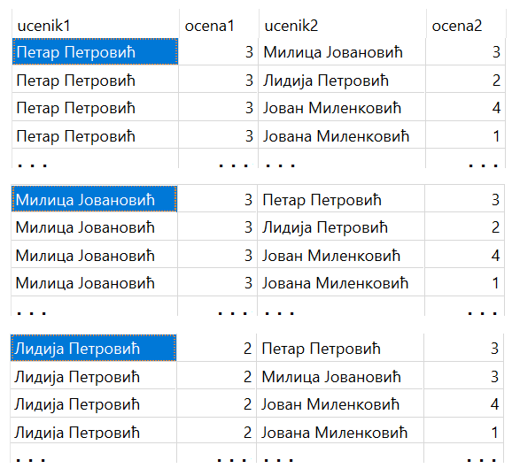

.. -*- mode: rst -*-

Имплицитно спајање
------------------

Још један начин да се две или више табела споје је тзв. **имплицитно
спајање**. Наиме, ако се након ``FROM`` наведе више табела раздвојених
зарезима, израчунава се њихов **Декартов производ**. У случају две 
табеле то значи да се свака врста прве табеле комбинује са сваком врстом 
друге табеле. У случају више табела свака таква врста би се комбиновала 
са сваком врстом наредне табеле, итд. 

Можемо, на пример, да пишемо:

.. code-block:: sql
                
   SELECT *
   FROM izostanak, ucenik;

Уколико табела izostanak има 10194 реда, а табела ucenik има 346 редова, 
извршавањем упита се добија 10194 * 346 = 3527124 реда, од којих је већина 
потпуно бесмислена зато што је изостанак, на пример, Петра Петровића, додељен и, 
на пример, Милици Јовановић, која га није направила. Дакле, буквално сваки 
изостанак се везује за свих 346 ученика, и тако редом. 

Од свих ових редова, за нас заправо имају смисла само они у којима 
је идентификатор ученика из табеле изостанака једнак идентификатору из 
табеле ученика, и њих можемо издвојити клаузулом ``WHERE``.

.. code-block:: sql
                
   SELECT *
   FROM izostanak, ucenik;
   WHERE i.id_ucenik = u.id;
  
Извршавањем овог упита се заправo добија смислени резултат и сваком изостанку су 
придодати подаци баш о ученику који је тај изостанак направио.   

За разлику од спајања ``... JOIN ... ON ...``, где услов спајања наводимо у клаузули ``ON``, 
у овом случају смо услов по којем спајамо редове из различитих табела пребацили у клаузулу ``WHERE``. 
Наравно, како у клаузули ``WHERE`` може да се наведе и неки услов селекције, то чини целу клаузулу ``WHERE`` 
већом и непрегледнијом. 

Следи пример у којем, у клаузули WHERE наводимо и додатан услов, на пример такав да се додатно ограничимо само на жељени датум.

.. code-block:: sql
                
   SELECT *
   FROM izostanak, ucenik;
   WHERE i.id_ucenik = u.id AND datum = '2021-05-14';

Извршавањем упита добија се следећи резултат:

.. csv-table::
   :header:  "id", "id_ucenik", "datum", "cas", "status", "id", "ime", "prezime", "pol", "datum_rodjenja", "razred", "odeljenje"
   :align: left

   "1", "1", "2021-05-14", "1", "оправдан", "1", "Петар", "Петровић", "м", "2006-07-01", "1", "1"
   "2", "1", "2021-05-14", "2", "неоправдан", "1", "Петар", "Петровић", "м", "2006-07-01", "1", "1"
   "3", "1", "2021-05-14", "1", "нерегулисан", "4", "Петар", "Миловановић", "м", "2005-12-08", "2", "1"
   "4", "1", "2021-05-14", "2", "нерегулисан", "4", "Петар", "Миловановић", "м", "2005-12-08", "2", "1"
   "6", "1", "2021-05-14", "3", "оправдан", "1", "Петар", "Петровић", "м", "2006-07-01", "1", "1"
   ..., ..., ..., ..., ..., ..., ..., ..., ..., ..., ..., ...

Ипак, експлицитно спајање (помоћу ``JOIN``) је пожељније користити од имплицитног. Упити који користе 
експлицитно спајање издвајају услов за спајање у посебну целину па се лакше разумеју, а на неким 
системима за управљање базама података могу да буду и ефикаснији.

Имплицитно спајање има у неким ретким ситуацијама смисла, па ћемо овде илустровати једну такву ситуацију. 

Рецимо да, након одржаног писменог задатка из математике у првом разреду, 15. октобра 2020. године, 
наставник жели да направи парове ученика за пројектни рад, али приликом прављења парова, 
жели да има у виду и њихову управо добијену оцену. Можда жели да направи такве парове у којима 
је један ученик знатно бољи у управо савладаној области из математике, па може да помогне другом, у пару. 
А можда жели да направи парове ученика који имају исту или приближну оцену, тако да сваком пару дâ 
задатак који одговара њиховом нивоу знања. У сваком случају, наставнику би итекако користио извештај у 
којем би прегледно видео све могуће парове, како би изгледало да сваког ученика стави у пар са сваким 
другим учеником, а поред тога да су видљиве и њихове управо добијене оцене на писменом из математике. 
Следећи упит управо то приказује. Повезује сваког ученика са сваким учеником. Првог ученика повезује са 
његовом оценом добијеном на писменом, а другог ученика повезује са његовом оценом добијеном на истом 
писменом (исти идентификатор предмета, исти датум). На крају се из извештаја елиминише пар који се 
формира од ученика и истог ученика (ученик не може да буде у пару сам са собом). 

.. code-block:: sql
                
   SELECT u1.ime||' '||u1.prezime AS ucenik1, o1.ocena AS ocena1, 
   u2.ime||' '||u2.prezime AS ucenik2, o2.ocena AS ocena2
   FROM ucenik AS u1, ucenik AS u2,
   ocena o1, ocena o2
   WHERE o1.id_ucenik=u1.id AND o2.id_ucenik=u2.id 
   AND o1.id_predmet=1 AND o1.datum='2020-10-15' 
   AND o2.id_predmet=1 AND o2.datum='2020-10-15'
   AND u1.id!=u2.id

На следећој слици се види део резултата овог упита.

Услови спајања сваког ученика са његовом оценом су наведени у клаузули ``WHERE``:

.. code-block:: sql
                
   o1.id_ucenik=u1.id AND o2.id_ucenik=u2.id 
   
За разлику од овог смисленог спајања ученика са оценом коју је добио, изостављен је било 
који услов којим би се на неки одређени начин повезали први и други ученик, и на тај начин 
добијамо све могуће парове, односно Декартов производ. 
   
Вежба
.....

Покушај да наредни упит напишеш самостално.

.. questionnote::
   
   Приказати све регулисане изостанке у читљивом формату (у ком се
   види име и презиме ученика и датум, час и статус изостанка), али
   тако да упит користи имплицитно, а не експлицитно спајање.

.. dbpetlja:: db_implicitno_spajanje_01
   :dbfile: dnevnik.sql
   :solutionquery: SELECT u.ime, u.prezime, u.razred, u.odeljenje, p.naziv
                   FROM ucenik u, predmet p
                   WHERE u.razred = p.razred
