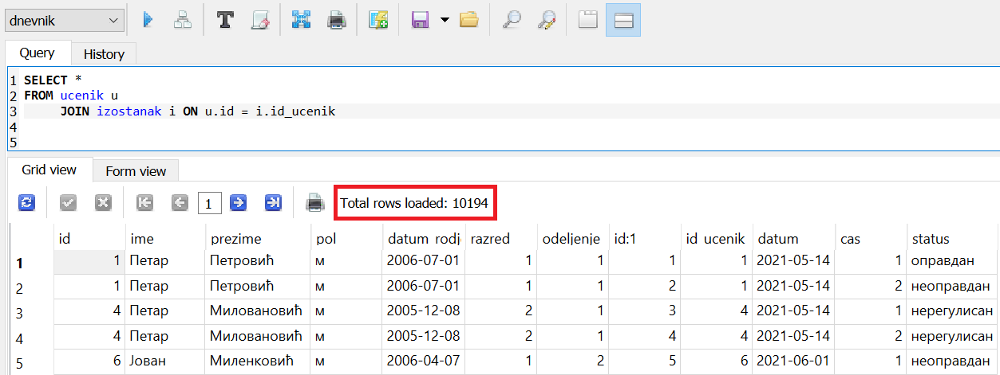
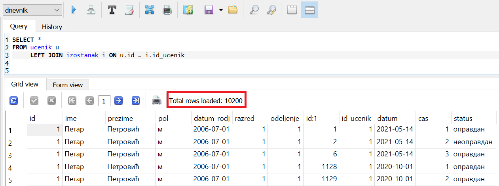
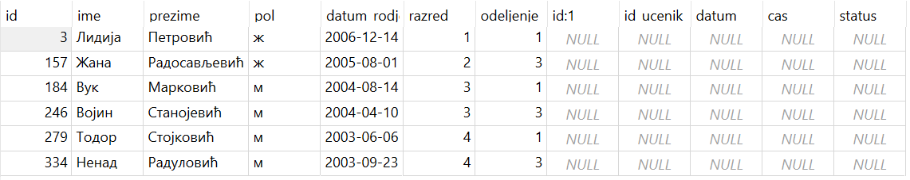
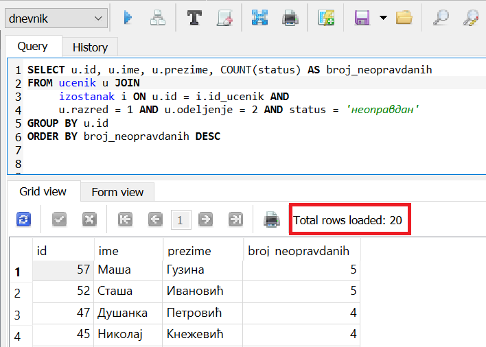
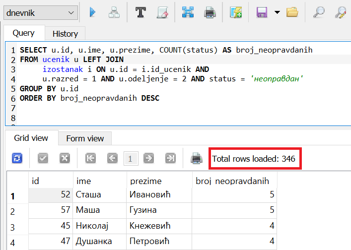

.. -*- mode: rst -*-

Врсте спајања
-------------

У базама података постоји неколико различитих оператора спајања:
``INNER JOIN``, ``CROSS JOIN``, ``LEFT JOIN``, ``RIGHT JOIN``, ``FULL
JOIN`` који се углавном разликују по томе шта се дешава када у једној
од спојених табела не постоји ред који би требало да се
споји. Оператор ``JOIN`` који смо приказали је заправо оператор
``INNER JOIN`` (тзв. унутрашње спајање). То је најчешће коришћена
врста спајања, па се стога назнака о којој врсти спајања је реч може
изоставити.

Природно је очекивати да се у табели изостанака налазе само они
идентификатори ученика за које у табели ученика постоје одговарајући
подаци. То је осигурано постављањем *страног кључа* између колоне
``id_ucenik`` у табели изостанака и колоне ``id`` у табели ученика.

Међутим, сасвим је могуће да се вредност колоне ``id`` из неких редова
табеле ученика уопште не појављује у колони ``id_ucenik`` у табели
изостанака (јер могу да постоје ученици који немају ниједан
изостанак). Размотримо тада следећи задатак.

.. questionnote::

   Приказати списак свих ученика са њиховим изостанцима.

Ако бисмо извршили обично (унутрашње) спајање табеле ученика и табеле
изостанака, добили бисмо податке само о оним ученицима који имају
изостанке.

.. code-block:: sql
                
   SELECT *
   FROM ucenik u
        JOIN izostanak i ON u.id = i.id_ucenik;

На следећој слици може да се види овај упит у систему SQLite Studio. Види се само првих неколико 
редова и информација о томе да има укупно 10194 редова, односно толико има евидентираних изостанака 
у овој бази података.

Ако желимо да се прикажу подаци и о ученицима који немају изостанке,
потребно је да применимо тзв. лево спољашње спајање које се постиже
оператором ``LEFT OUTER JOIN`` или скраћено ``LEFT JOIN``.

.. code-block:: sql
                
   SELECT *
   FROM ucenik u
        LEFT JOIN izostanak i ON u.id = i.id_ucenik;

На следећој слици може да се види овај упит у систему SQLite Studio. 
Види се само првих неколико редова и информација о томе да има укупно 10200 редова.

 
До разлике у броју редова које враћају претходна два упита је дошло због тога што има ученика 
који немају изостанке и које први упит није приказао. 

Код ученика који имају изостанака, за сваки изостанак постоји одговарајућа врста у резултату. 
Код ученика који немају изостанака у пољима који описују изостанак стоје специјалне **недостајуће вредности** (``NULL``). 
Ово је илустровано на следећој слици на којој видимо управо тих 6 редова за које се разликују 
резултати првог и другог упита. 

   
Иако на први поглед делује да ово нема пуно смисла, кључна ствар је то
што смо у табели задржали податке о свим ученицима, што омогућава
да у извештајима о укупном броју изостанака пријавимо и податке о
ученицима који нису правили изостанке. Илуструјмо то наредним паром
примера.

.. questionnote::

   Приказати укупан број изостанака за сваког ученика (укључујући и
   оне ученике који немају изостанака). Списак уредити
   опадајуће по укупном броју изостанака.

Кључни елемент решења је то да агрегатне функције приликом агрегирања
елемената задате колоне потпуно игноришу недостајуће вредности у тој
колони. Тако агрегатна функција ``COUNT`` броји само оне врсте које не
садрже вредности ``NULL``. Зато се применом груписања по
идентификатору ученика и применом функције ``COUNT`` на табелу
добијену левим спољашњим спајањем табеле ученика и изостанака лако
може генерисати извештај који садржи податке о свим ученицима, при
чему ће се код оних који немају изостанака појавити број 0.

.. code-block:: sql
                
   SELECT u.id, u.ime, u.prezime, COUNT(status) AS broj_izostanaka
   FROM ucenik u
        LEFT JOIN izostanak i ON u.id = i.id_ucenik
   GROUP BY u.id
   ORDER BY broj_izostanaka DESC;

Извршавањем упита добија се следећи резултат:

.. csv-table::
   :header:  "id", "ime", "prezime", "broj_izostanaka"
   :align: left

   "185", "Угљеша", "Милановић", "71"
   "61", "Елена", "Радивојевић", "69"
   "40", "Емилија", "Рељин", "68"
   "220", "Михајло", "Гајић", "67"
   "24", "Ивана", "Пејчев", "63"
   ..., ..., ..., ...

.. questionnote::

   Приказати број неоправданих изостанака за сваког ученика одељења I2
   (укључујући и оне ученике који немају неоправданих
   изостанака). Списак уредити опадајуће по броју неоправданих
   изостанака.

Овај пример само проширује претходни тиме што се захтева додатно
филтрирање.

.. code-block:: sql
                
   SELECT u.id, u.ime, u.prezime, COUNT(status) AS broj_neopravdanih
   FROM ucenik u LEFT JOIN
        izostanak i ON u.id = i.id_ucenik AND
        u.razred = 1 AND u.odeljenje = 2 AND status = 'неоправдан'
   GROUP BY u.id
   ORDER BY broj_neopravdanih DESC

Извршавањем упита добија се следећи резултат:

.. csv-table::
   :header:  "id", "ime", "prezime", "broj_neopravdanih"
   :align: left

   "52", "Сташа", "Ивановић", "5"
   "57", "Маша", "Гузина", "5"
   "45", "Николај", "Кнежевић", "4"
   "47", "Душанка", "Петровић", "4"
   "53", "Анђелка", "Вељковић", "3"
   ..., ..., ..., ...
   "344", "Тијана", "Илић", "0"
   "345", "Виолета", "Урошевић", "0"
   "346", "Адам", "Пауновић", "0"

Уколико покренемо упит без левог спајања, тј. ако изоставимо реч ``LEFT``, 
добићемо 20 редова што може да се види на следећој слици. 

   
Покренут упит са левим спајањем приказује 346 редова, што одговара укупном 
броју ученика чије податке чувамо у овој бази, на на дну списка се налазе они 
који немају неоправдане изостанке. 

Приметимо да смо услов селекције (филтрирања) навели у склопу услова
спајања, а не у склопу клаузуле ``WHERE``, јер бисмо издвајањем само
неоправданих изостанака након спајања изгубили податке о ученицима
који немају изостанака (јер у колони статус не пише ``neopravdan``,
већ ``NULL``). Алтернативно, услов филтрирања у клаузули ``WHERE`` би
се могао записати као ``status = 'неоправдан' OR status IS NULL``,
чиме би се задржале врсте које одговарају неоправданим изостанцима
ученика који их имају, као и врсте које одговарају ученицима који
немају изостанке.

Десно спољашње спајање је симетрично левом (задржавају се све колоне
друге уместо прве табеле).  Детаљније изучавање осталих врста спајања
превазилази градиво овог предмета и тиме се нећемо бавити у
наставку. У већини примера ћемо користити унутрашње спајање
(``JOIN``), а с времена на време ћемо употребити и лево спољашње
спајање (``LEFT JOIN``). Резимирајмо на једном малом примеру како та
два спајања функционишу. Претпоставимо да спајамо следеће две табеле
(``autor`` и ``knjiga``).

.. csv-table::
   :header:  "id", "ime", "prezime"
   :align: left

   1, Петар, Јовановић
   2, Лазар, Бошковић
   3, Милена, Шумановић

.. csv-table::
   :header: "id_knjiga", "knjiga", "id_autor"
   :align: left

   1, Увод у HTML, 1
   2, Стилизовање веб-страна, 1
   3, Програмирање у Python-у,3

Као што видимо, аутор 1, Петар Јовановић је написао две књиге, аутор 2
није написао ни једну, док је ауторка 3 написала једну књигу.

Унутрашњим спајањем (по услову ``autor.id = knjiga.id_autor``) добили
бисмо следећу табелу.

.. csv-table::
   :header: "id", "ime", "prezime", "id_autor", "књига"
   :align: left

   1, Петар, Јовановић, 1, Увод у HTML
   1, Петар, Јовановић, 1, Стилизовање веб-страна
   3, Милена, Шумановић, 3, Програмирање у Python-у

Левим спољашњим спајањем (по услову ``autor.id = knjiga.id_autor``)
добили бисмо следећу табелу.

.. csv-table::
   :header: "id", "ime", "prezime", "id_autor", "књига"
   :align: left

   1, Петар, Јовановић, 1, Увод у HTML
   1, Петар, Јовановић, 1, Стилизовање веб-страна
   2, Лазар, Бошковић, NULL, NULL
   3, Милена, Шумановић, 3, Програмирање у Python-у

Вежба
.....

Покушај да самостално напишеш наредни упит.

.. questionnote::

   За сваког ученика приказати просек свих уписаних оцена. Табела
   треба да прикаже имена, презимена и просечне оцене свих ученика
   заокружене на две децимале (код оних који немају ниједну уписану
   оцену уместо просечне оцене треба да буде уписана недостајућа
   вредност).

.. dbpetlja:: db_spajanje_02
   :dbfile: dnevnik.sql
   :showresult:
   :solutionquery: SELECT ime, prezime, ROUND(AVG(ocena), 2)
                   FROM ucenik LEFT JOIN
                        ocena ON ucenik.id = ocena.id_ucenik
                   GROUP BY ucenik.id   
