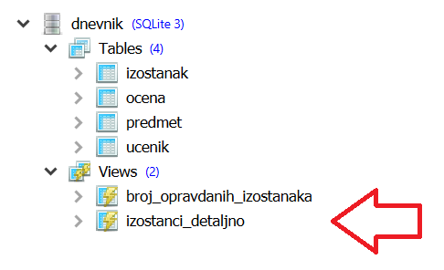

Погледи
-------

Приметили смо да се неки упити често користе као основа за издвајање
одређених података. На пример, често је потребно спојити две или
више табела, да би се над спојеним табелама вршили различити даљи
упити. На пример, приликом скоро сваке анализе изостанака врши се
спајање табеле ученика и табеле изостанака, да би се над резултатом
спајања вршиле даље анализе. На пример, резултат спајања нам је
потребан да бисмо израчунали укупан број изостанака сваког ученика,
али и да бисмо пронашли број неоправданих изостанака у сваком одељењу.

.. code-block:: sql

   SELECT ucenik.id, ucenik.ime, ucenik.prezime, COUNT(*) AS broj_izostanaka
   FROM izostanak JOIN
        ucenik ON izostanak.id_ucenik = ucenik.id
   GROUP BY ucenik.id;

Извршавањем упита добија се следећи резултат:

.. csv-table::
   :header:  "id", "ime", "prezime", "broj_izostanaka"
   :align: left

   "1", "Петар", "Петровић", "42"
   "2", "Милица", "Јовановић", "37"
   "4", "Петар", "Миловановић", "34"
   "5", "Ана", "Пекић", "8"
   "6", "Јован", "Миленковић", "27"
   ..., ..., ..., ...

.. code-block:: sql

   SELECT razred, odeljenje, COUNT(*) AS broj_neopravdanih
   FROM izostanak JOIN
        ucenik ON izostanak.id_ucenik = ucenik.id
   WHERE izostanak.status = 'неоправдан'
   GROUP BY razred, odeljenje;

Извршавањем упита добија се следећи резултат:

.. csv-table::
   :header:  "razred", "odeljenje", "broj_neopravdanih"
   :align: left

   "1", "1", "35"
   "1", "2", "49"
   "1", "3", "39"
   "2", "1", "71"
   "2", "2", "37"
   ..., ..., ...

База података која је могла у целости да се преузме раније током овог курса и отвори у систему SQLite Studio, 
већ у себи има креиран описан поглед.

   
Системи за управљање базама података омогућавају да се често
коришћени упити запамте као посебни **погледи** на базу података. 
Погледе можемо да схватимо као фиктивне табеле, које се у каснијим упитима
``SELECT`` могу користити као и све остале табеле. Погледи нису 
заиста сачувани у бази као табеле, већ се упит који их користи интегрише
са упитом којим се поглед  дефинише и тако добијени комбиновани
упит се оптимизује и извршава. Погледи се могу користити само за
читање података и упис података у поглед није могућ (јер погледи нису
праве табеле). Креирање погледа врши се упитом наредног облика:

.. code-block:: sql

   CREATE VIEW naziv_pogleda AS
     SELECT upit;

На пример, можемо креирати поглед ``izostanci_detaljno`` на следећи начин:

.. code-block:: sql

   CREATE VIEW izostanci_detaljno AS
     SELECT izostanak.id,
            izostanak.id_ucenik,
            ucenik.ime,
            ucenik.prezime,
            ucenik.razred,
            ucenik.odeljenje,
            izostanak.datum,
            izostanak.status
     FROM izostanak JOIN
          ucenik ON izostanak.id_ucenik = ucenik.id;

Након тога, претходна два упита се могу извршити на следећи начин:

.. code-block:: sql

   SELECT id, ime, prezime, COUNT(*) AS broj_izostanaka
   FROM izostanci_detaljno
   GROUP BY id_ucenik;

Извршавањем упита добија се следећи резултат:

.. csv-table::
   :header:  "id", "ime", "prezime", "broj_izostanaka"
   :align: left

   "1128", "Петар", "Петровић", "42"
   "1350", "Милица", "Јовановић", "37"
   "2140", "Петар", "Миловановић", "34"
   "2007", "Ана", "Пекић", "8"
   "2875", "Јован", "Миленковић", "27"
   ..., ..., ..., ...

.. code-block:: sql

   SELECT razred, odeljenje, COUNT(*) AS broj_neopravdanih
   FROM izostanci_detaljno
   WHERE status = 'неоправдан'
   GROUP BY razred, odeljenje;

Извршавањем упита добија се следећи резултат:

.. csv-table::
   :header:  "razred", "odeljenje", "broj_neopravdanih"
   :align: left

   "1", "1", "35"
   "1", "2", "49"
   "1", "3", "39"
   "2", "1", "71"
   "2", "2", "37"
   ..., ..., ...

Угнежђени упити (ако нису корелисани) могу се избећи креирањем погледа
за унутрашњи подупит (што нарочито има смисла ако се за унутрашњи упит
очекује да може бити коришћен више пута). Разматрали смо већ упит који
за свако одељење приказује највећи број оправданих изостанака и
установили смо да је прво пожељно креирати табелу која за сваког
ученика садржи идентификатор, разред и одељење и број оправданих
изостанака. Њу можемо креирати као посебан поглед.

.. code-block:: sql

   CREATE VIEW broj_opravdanih_izostanaka AS
     SELECT id_ucenik AS id, razred, odeljenje, COUNT(*) as broj_opravdanih
     FROM izostanci_detaljno
     WHERE status = 'оправдан'
     GROUP BY id_ucenik;

На основу овог погледа је веома једноставно одредити највећи број
оправданих изостанака за свако одељење.

.. code-block:: sql

   SELECT razred, odeljenje, MAX(broj_opravdanih)
   FROM broj_opravdanih_izostanaka
   GROUP BY razred, odeljenje;

Извршавањем упита добија се следећи резултат:

.. csv-table::
   :header:  "razred", "odeljenje", "MAX(broj_opravdanih)"
   :align: left

   "1", "1", "55"
   "1", "2", "67"
   "1", "3", "60"
   "2", "1", "53"
   "2", "2", "60"
   ..., ..., ...

.. comment

    c# D#  E  f# g#  A   H   c#
    a H    C   d  e  F   G   a
    i ii0 III iv  v  VI VII  i

