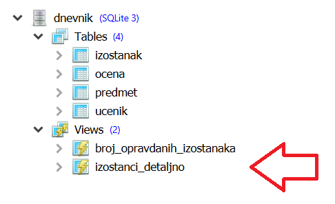

Погледи --- задаци
------------------

У систему SQLite Studio поглед такође може да се креира након што се кликне на 
жељену базу података *dnevnik* у прозору ``Databases`` и потом изабере команда менија 
``Tools → Open SQL Editor``. Када се напише команда за креирање погледа, 
кликне се на дугме ``Execute query (F9)`` (плави троуглић). 

Савет је да се у прозору ``Databases`` увек прво провере тачни називи табела, 
као и колона. Посебно је важно да проверимо називе страног кључа и примарног 
кључа који му одговара у другој табели када желико да извршимо спајање, 
тј. да прикажемо податке из више табела које су повезане.  

1. Креирај поглед који садржи резултат спајања ученика, оцена и
   предмета. Коришћењем тог погледа прикажи просечне оцене из свих
   предмета у читљивом формату (назив предмета, разред, просечна
   оцена).

2. Креирај поглед који садржи просечне оцене свих ученика из свих
   предмета (колоне су идентификатор ученика, идентификатор предмета и
   просечна оцена). Спајањем тог погледа са табелом предмета,
   приказати називе и разреде пет предмета са најнижим просеком.
