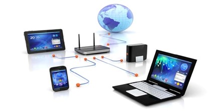
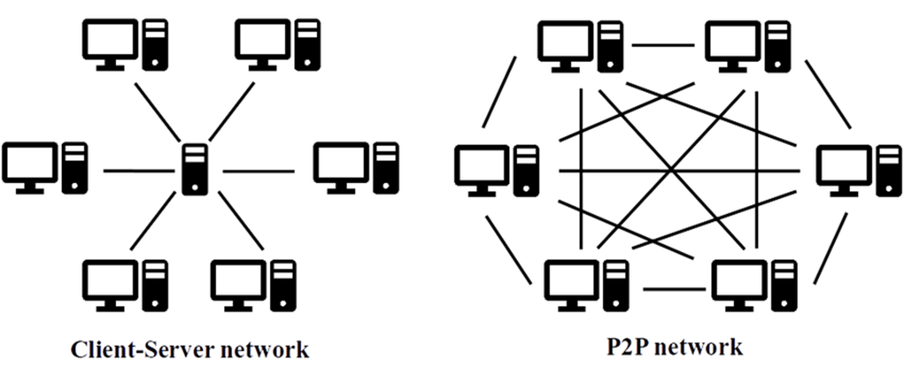
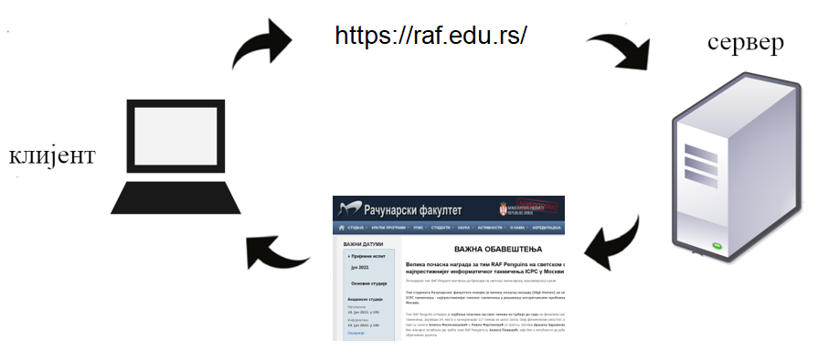

Рачунарске мреже и интернет
===========================

Скоро сви рачунари и уређаји које данас користимо су повезани са другим
рачунарима и дигиталним уређајима. Повезивање рачунара, изградња рачунарских
мрежа, а затим и развој интернета и његових сервиса (нарочито веба и
електронске поште) су донеле сасвим нове примене рачунара и информационе
технологије, довели су до знатног повећања броја корисника и променили начин
на који се рачунари користе.

Посебну улогу имају и рачунари на којима се складиште подаци и информације које
преузимамо (на пример, веб-сервери) и на којима се извршавају тзв. апликације
„у облаку”. Између наших уређаја и таквих сервера у мрежама учествују и многи
уређаји чија је улога да посредују у тој комуникацији (такви су, на пример,
мостови, хабови, свичеви, рутери). Уређаји су повезани комуникационом опремом
која је жичана или бежична. Комуникација у мрежи одвија се под контролом
софтвера – од системског софтвера (на пример, драјвера за комуникационе
уређаје) до апликативног софтвера, који корисник користи у раду са мрежом (на
пример, прегледача веба или програма за рад са електронском поштом). Дакле,
мреже можемо дефинисати на следећи начин:

**Рачунарска мрежа** је систем који се састоји од скупа хардверских уређаја
међусобно повезаних комуникационом опремом, снабдевених одговарајућим
комуникационим софтвером, којим се остварује контрола система тако да је
омогућен пренос података између повезаних уређаја.

Два повезана уређаја довољна су да оформе мрежу, међутим, мреже обично
обухватају више од два уређаја, а са ширењем интернета дошло се до тога да су
скоро сви рачунари, паметни телефони, телевизори и слични дигитални уређаји на
свету међусобно повезани.

Рачунарске мреже не треба поистовећивати са интернетом. На пример, дешава се да
су у школском кабинету рачунари умрежени (и да је могуће пребацивати податке
између њих), али да ова мрежа није повезана са интернетом. Повезивање са
интернетом могло би се остварити тако што би неки истакнути уређај у тој мрежи
остварио везу са интернетом, док би остали рачунари интернет везу остваривали
преко њега. Зато је, уместо као мрежу појединачних рачунара, **интернет** боље
схватити као глобалну мрежу која повезује различите рачунарске мреже (а тиме и
рачунаре умрежене у њих).

У мреже се данас поред рачунара и паметних телефона везују и други уређаји, као
што су, на пример, телевизори, паметни кућни апарати, аутомобили итд. чиме
настаје такозвани **интернет ствари**.

Архитектура мрежа
-----------------

Често се мреже организују по једном од следећа два модела:
- модел **мреже равноправних рачунара** (енгл. *peer-to-peer, P2P*),
- модел **клијент-сервер**.

У клијент-сервер моделу **сервер** је систем који пружа своје ресурсе (податке,
софтвер, хардвер), док је **клијент** систем који иницира контакт са сервером
да би користио ресурсе које сервер пружа.

Нагласимо да су клијент и сервер само улоге рачунара у процесу комуникације.
Рачунари нису предодређени само за једну врсту улоге (додуше, за сервере се
користе моћнији рачунари). Улога је одређена софтвером који се извршава и који
контролише комуникацију. Рачунар чак истовремено може да има различите улоге.
На пример, на рачунару који служи као веб-сервер администратор може да
проверава електронску пошту (чиме рачунар игра улогу клијента), док у позадини
исти рачунар учествује и у некој Bittorent размени, чиме је део p2p мреже.

Већина интернет сервиса углавном користи модел клијент–сервер. На пример,
дигитални уређај на којем прегледате садржај веба је клијент. Када унесете
адресу у прегледач, ваш уређај се обраћа неком веб-серверу – удаљеном рачунару
на коме се налазе веб-стране које захтевате (или програми који их генеришу).
Сервер клијенту шаље документе (веб-странице, слике итд.) и клијент их
приказује кориснику.

Слично томе, електронска пошта се чува на серверима електронске поште, а шаље
се, преузима и прегледа на клијентским рачунарима тј. дигиталним уређајима.
Изузетак представљају P2P сервиси за дељење датотека какав је Bittorent. Не
постоји централни сервер на којем се налази датотека коју сви преузимају, већ
сваки од рачунара у мрежи има део датотеке и једни од других преузимају делове
који им недостају, тако да ти сервиси функционишу по моделу P2P.