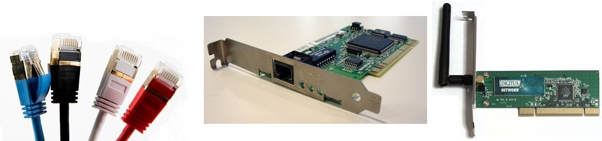
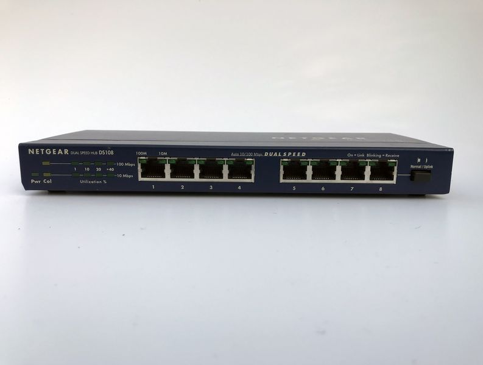
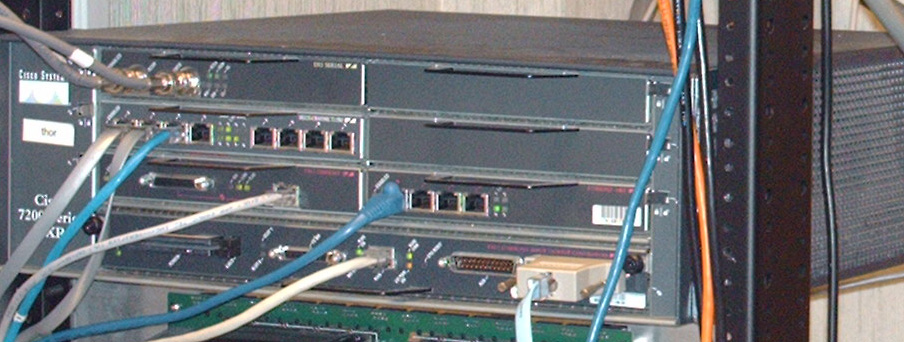
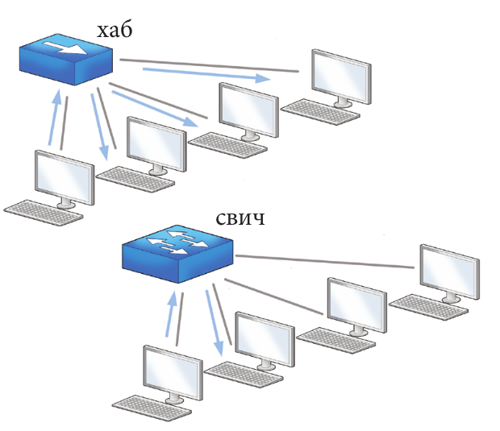
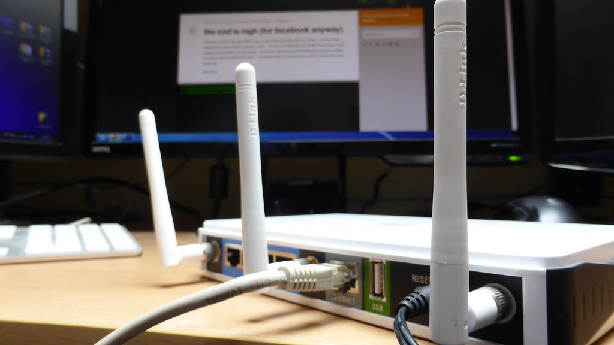
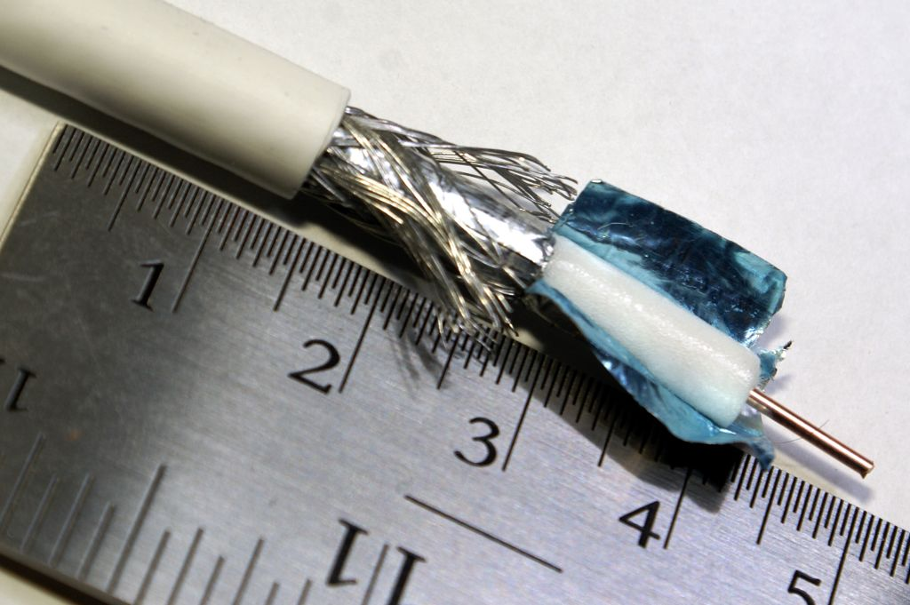
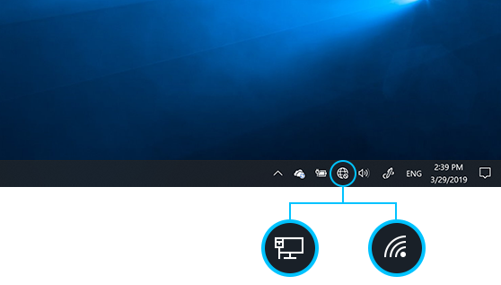
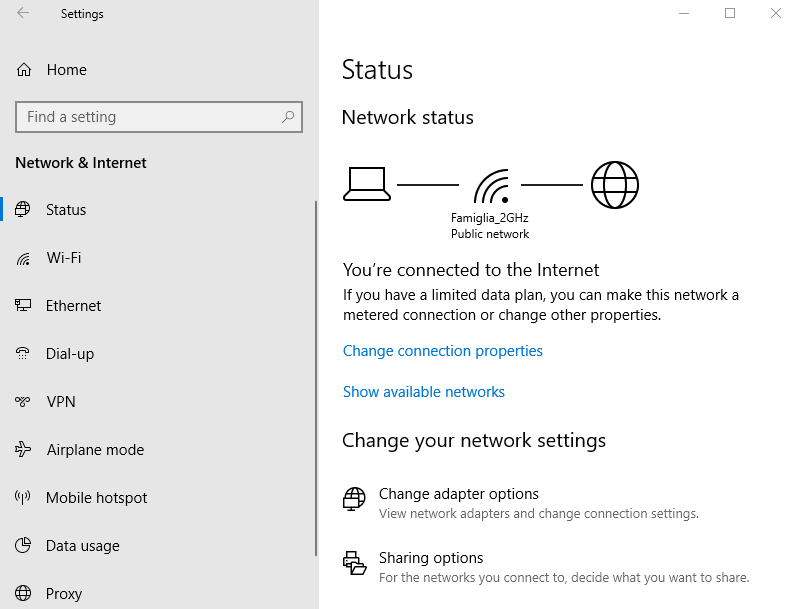
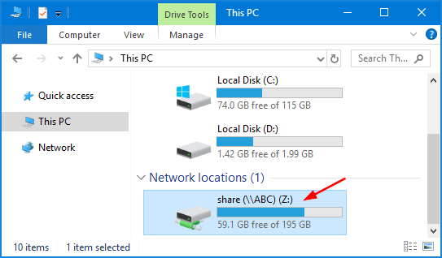

Мрежни хардвер и софтвер
========================

У наставку ћемо описати типове хардверских уређаја, комуникационих
медијума и софтвер који се користи у данашњим рачунарским мрежама.

Мрежни хардвер
--------------

Да би рачунар тј. дигитални уређај могао да буде укључен у рачунарску
мрежу и прикључен на интернет, потребно је да има **мрежну картицу**
тј. **мрежни контролер** (енгл. *network interface controller*,
NIC). Данас су у употреби мрежни контролери за жичано и за бежично
повезивање. За жичано повезивање се обично користи *RJ45* прикључак на
који се прикључује *UTP* кабл (ови каблови су толико уобичајени данас,
да је довољно рећи само мрежни прикључак и мрежни кабл). Скоро сви
стони рачунари имају уграђену ову картицу (веома често интегрисану на
матичној плочи), док преносни рачунари поред ње имају уграђен и
контролер за бежично повезивање (енгл. *wireless network interface
controller*, *WNIC*). Стони рачунари обично немају контролер за
бежично повезивање, али ако није већ уграђен, он може да се угради накнадно.
Овај контролер се прикључује или у облику картице на матичну плочу, 
или као екстерни уређај на USB порт. Преносни
уређаји (мобилни телефони, таблети) поседују обично само контролер за
бежично повезивање, док новији телевизори имају котролере и за жичано
и за бежично повезивање.

   
   лево: UTP каблови са конекторима RJ45; 
   средина: мрежна картица за повезивање UTP каблом; 
   десно: мрежна картица за бежично повезивање (са антеном)

У многим кућним мрежама присутни су **модеми**
(енгл. *modulator-demodulator*, modem). То су уређаји који конвертују
дигитални сигнал из рачунара у аналогни, који може бити пренет кроз
постојеће аналогне инсталације (нпр. кроз телефонске или каблове за
пренос кабловске телевизије), а затим и обратно, конвертују пренети
аналогни сигнал у дигитални. Некада су се модеми користили за спор
приступ интернету преко класичне фиксне телефоније, а данас се обично
користе за кабловски или ADSL приступ интернету, о чему ће више речи
бити у наставку.

**Појачивачи** (енгл. repeater) служе само да појачају мрежни сигнал
да не би дошло до губитака и да би могли да се повежу уређаји који су
физички прилично удаљени. Они исти сигнал који приме емитују у
појачаном облику.
         
Поред рачунара, у мрежама учествују и уређаји чија је улога да
посредују у комуникацији: **хабови** (енгл. *hub*), **свичеви** (енгл.
*switch*) и **рутери** (енгл. *router*).

**Хабови** (енгл. hub) све поруке које добије, хаб без анализе и
обраде прослеђује свим прикљученим уређајима. Хабови су данас ређе у
употреби и уместо њих се користе напреднији мрежни уређаји (свичеви и
рутери).

**Свичеви** повезују више уређаја (па и више независних мрежа) и
пакете прослеђују само примаоцу (или оној мрежи у којој се налази
прималац). Пошто поруке не стижу до уређаја којима нису намењене,
смањује се мрежна комуникација и тиме постаје ефикаснија. Хабови и
свичеви функционишу на нижим мрежним слојевима и користе физичке (MAC)
адресе уређаја које повезују. Уређаји који се повезују морају да
користе исте методе комуникације и није могуће спојити више различитих
мрежа.

**Рутери** су сложенији уређаји намењени повезивању разнородних мрежа
(нпр. WiFi и Ethernet мреже) и повезивању мрежа са интернетом. Рутери
функционишу на мрежном слоју, анализирају пакете које прослеђују,
одређују путање, преводе адресе (да би могли да споје разнородне
мреже) итд. Рутери обично целу рачунарску мрежу у којој су постављени
повезују са другим мрежама у већу целину (најчешће интернет) и имају
улогу **"капије"** (енгл. *gateway*) те мреже ка остатку света. Када
рутер прими пакет, он прво на основу IP адресе примаоца записане у том
пакету одређује да ли је пакет намењен неком рачунару у његовој мрежи
или не. Ако јесте, пакет се шаље том рачунару (тако што се достави
свичу или тако што рутер обави улогу свича), а ако није, рутер на
основу IP адресе прослеђује тај пакет неком од суседних рутера са
којима је повезан који ће најефикасније тај пакет доставити на
одредиште. Путем тако формиране мреже рутера пакет стиже до мреже у
којој је рачунар коме је пакет намењен, да би на крају био достављен и
том рачунару.

На наредним сликама су приказани хаб, свич и рутер. Као што се види,
ови уређаји споља изгледају слично, али им се принципи рада и улога
доста разликују.

         
.. image:: ../../_images/mreze_switch.jpg
   :width: 250
   :alt: Свич

Наредна слика објашњава принцип рада хаба и свича. Једно још лепше
објашњење принципа функционисања ових уређаја је приказано у наредном
видео-снимку <https://www.youtube.com/watch?v=1z0ULvg_pW8>.

Уређаји данас често обављају више задатака. Тако, на пример, уређај
који се обично користи за успостављање бежичне комуникације у кући
истовремено има улогу бежичне приступне тачке (на коју се бежично могу
повезивати уређаји), свича (на који се жичано може повезати неколико
уређаја), рутера (јер омогућава даљу везу са интернетом), свича (јер
преусмерава пакете унутар локалне мреже), DHCP сервера (јер додељу
аутоматски IP адресе прикљученим уређајима) и евентуално неког модема
(за ADSL или кабловски интернет). Такви уређаји које добављачи
интернета инсталирају својим корисницима се данас називају **кућни
рутери**, **бежични рутери** или просто само **рутери** (па се каже
"ресетуј рутер", "немој да спаваш близу рутера" и слично), иако се у
стручном свету термин рутер углавном користи за велике рутере који
чине унутрашњост мрежа и кичму интернета.

На наредној слици је приказан један кућни бежични рутер. Упореди његов
изглед, са изгледом великог рутера приказаног на претходној слици.

Комуникациони медијуми
----------------------

Важан део мрежног хардвера су и комуникациони медијуми (каблови или
бежични медијуми), који преносе податке електромагнетним таласима
(радио-таласима, оптичким таласима, микроталасима). Као и у сваком
другом облику рачунарске комуникације, основни параметри медијума су
проток и кашњење. Данас се проток у мрежама обично изражава у
мегабитима по секунди (Mbps). Подсетимо се да се проток у оквиру
рачунара изражава већим бројем мегабајта по секунди (MBps), па чак
гигабајта по секунди (GBps), што указује на то да је комуникација
између различитих рачунара много спорија него комункација унутар
рачунара. Кашњење (време које је потребно да прође пре него што се
први податак пренесе) се мери микросекундама (у оквиру локалних мрежа)
и милисекундама (у оквиру споријих, већих мрежа).

**Упредене парице** (енгл. *twisted pair*) јесу упарене изоловане
бакарне жице, увијене да би се смањиле сметње у комуникацији. **UTP**
(енгл. *unshielded twisted pair*) каблови категорије 3 користе се у
фиксној телефонији, а каблови категорије 5 (или 6) користе се у
локалним рачунарским мрежама. Пошто немају специјалну изолацију,
осетљиви су на спољна зрачења. Проток кроз овакве каблове је обично
100 Mbps (тзв. брзи Ethernet), па и 1 Gbps (тзв. гигабитни
Ethernet). Постоје и скупљи **STP** (енгл. *shielded twisted pair*)
каблови, који су заштићени од електромагнетног зрачења, па смањују
сметње и омогућавају пренос података на већим раздаљинама.

**Коаксијални каблови** (енгл. *coaxial cable*) обично се користе за
пренос радио и телевизијског сигнала (зато се називају и антенски
каблови), али су са појавом кабловског интернета постали значајан део
рачунарских мрежа. Коаксијални каблови су се некада користили и у
локалним мрежама. Састоје се од централне бакарне или алуминијумске
жице обмотане савитљивим изолаторским слојем, а он је обмотан мрежицом
од танких бакарних или алуминијумских жица која штити централни
преносни кабл од спољног зрачења, и све је заједно изоловано.

**Оптички каблови** (енгл. optical fibеr cable) праве се од пуно
танких стаклених влакана умотаних у заштитни слој. Подаци се преносе
светлосним таласима које емитује ласер диода. На овакве каблове не
утичу сметње проузроковане електромагнетним зрачењем. Недостатак је то
што су скупи и тешко се постављају, па се углавном користе за
осовински део мреже, тзв. кичму (енгл. backbone), на који се
коаксијалним кабловима или упреденим жицама повезују групе уређаја,
мада је у последње време све чешће у понуди довођење оптичког кабла
директно до крајњих корисника. Брзина преноса је велика (пре свега
због великог броја влакана која могу паралелно да преносе податке,
због високих фреквенција светлосних таласа, али и због отпорности на
сметње) и може да буде и до неколико Tbps.

На наредној слици су приказани пресек UTP кабла (виде се четири пара
упредених парица), коаксијалног кабла (види се главна жица у средини и
слојеви заштите и изолације) и оптички кабл (виде се снопови
оптичких влакана).

.. image:: ../../_images/mreze_utp.jpg
   :width: 250
   :alt: UTP кабл

.. image:: ../../_images/mreze_fiber_optic.jpg
   :width: 250
   :alt: Оптички кабл
         
У бежичној комуникацији за пренос података не користе се каблови. То
је погодно код преносивих рачунара и мобилних уређаја, али и удаљених
локација, за које би успостављање кабловске мреже било недопустиво
скупо. Уместо каблова користе се радио-таласи, микроталаси или
инфрацрвени зраци.

**Bluetooth** је бежична технологија која се користи за комуникацију
на малим раздаљинама (десетак метара), углавном за комуникацију
рачунара са периферијским уређајима или мобилним телефонима. Брзина
преноса је мала (до 3 Mbps).

**Бежичне локалне мреже** (*WLAN*, *WiFi*) користе радио-таласе за
бежичну комуникацију више уређаја на ограниченом растојању (неколико
десетина или стотина метара). Приступ мрежи врши се преко приступних
тачака (енгл. access point), а простор у коме је мрежа
доступна назива се врућа тачка (енгл. hot spot). У зависности од
стандарда, брзина преноса је неколико десетина Mbps (код јачих уређаја
то може да иде и до неколико стотина Mbps). **Бежичне градске мреже**
(*WiMAX*) покривају шира подручја.

За повезивање удаљених тачака и пренос података, али и телефонског и
телевизијског сигнала, користе се и **комуникациони сателити**
постављени у орбиту на висини од 36 000 километара. Брзина
комуникације је релативно мала у поређењу с оптичким кабловима (нa
пример, 100 Mbps), али ипак има случајева у којима је сателитска
комуникација погоднија (пре свега, када је постављање кабла скупо или
неизводљиво).

Бежични пренос података користи се и у **мрежама ћелија мобилне
телефоније** (енгл. cellular network), које су основа мобилне
телефоније.

Мрежни софтвер
--------------

Коришћење рачунарских мрежа не би било могуће без мрежног
софтвера. Мрежни софтвер је веома комплексан и обухвата различите
слојеве: од системског софтвера ниског нивоа (на пример, драјвера за
мрежне картице) задуженог за пренос појединачних бајтова и детекцију и
корекцију грешака, па све до апликативног софтвера (на пример,
прегледача веба и клијената електронске поште).

Сви савремени оперативни системи нуде и софтвер (контролне табле)
којима се контролишу појединачне мрежне конекције (на пример, подешава
се бежична мрежа на коју ће се рачунар повезивати, уноси се лозинка за
приступ, контролише се начин додељивања IP адреса и слично).

На слици је приказана иконица која служи за подешавање жичане и
бежичне мреже у систему Windows 10, као и пано који служи за преглед
статуса и подешавање параметара мрежне конекције.

Основна подешавања (избор мреже, унос лозинке и слично) су веома
јасна, док напреднија подешавања параметара (на пример, подешавање
DHCP и DNS сервера, статичких IP адреса или мрежних маски) захтевају
дубље разумевање појмова и параметара умрежавања.
У савременим мрежама просечан корисник ретко кад има потребу да ручно 
мења било који од тих параметара, па их нећемо овде објашњавати.

Оперативни систем тј. његов интегрисани програм за рад са датотекама
(какав је, на пример, Windows Explorer у систему Windows 10 или
Nautilus у систему Ubuntu Linux) пружају подршку и за приступ
датотекама и директоријумима на рачунарима који су у локалној мрежи.

Мрежне локације у Windows мрежи имају и своје адресе које се
препознају по томе што почињу са ``\\`` иза чега се наводи назив
рачунара. На пример ``\\GIMNAZIJA\CetvrtiRazred`` је адреса дељеног
директоријума ``CetvrtiRazred`` који се налази на рачунару који је у
локалној мрежи прикључен под називом ``GIMNAZIJA`` (назив рачунара се
може променити у подешавањима у секцији ``System/About/Rename PC``).
У систему Windows се често подешава да се одређене адресе којима се
често приступа виде као "мрежни дискови". На пример, ``C:`` је обично
ознака за први хард-диск на локалном рачунару, док је ``Z:`` обично
ознака неког мрежног диска ком се често приступа (ово повезивање се
лако врши опцијом ``Map Network Drive``).

Са коришћењем апликативног софтвера који користи рачунарске мреже и
интернет (прегледача веба, клијената електронске поште, софтвера за
ћаскање, програма за рад у облаку и слично) сте сигурно већ детаљно
упознати, па такав софтвер нећемо описивати.

Слојевитост знатно олакшава програмирање мрежног софтвера. Данашњи
оперативни системи већ садрже скоро све нивое мрежног софтвера, осим
највишег, апликативног. Ово је испраћено библиотекама савремених
програмских језика, које пружају веома удобне интерфејсе за писање
апликација које користе мрежну комуникацију, сакривајући многе
техничке детаље од програмера. Тако аутори апликативног софтвера не
морају да брину о детаљима мрежне комуникације, већ могу да се
концентришу на функционалност апликације и на апликативне протоколе,
док за све детаље нижих слојева комуникације могу да користе услуге
оперативног система и библиотека програмских језика.
