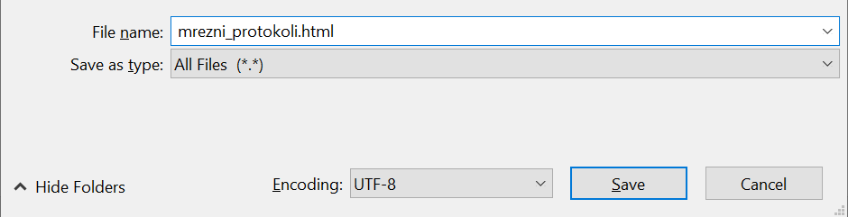
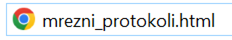
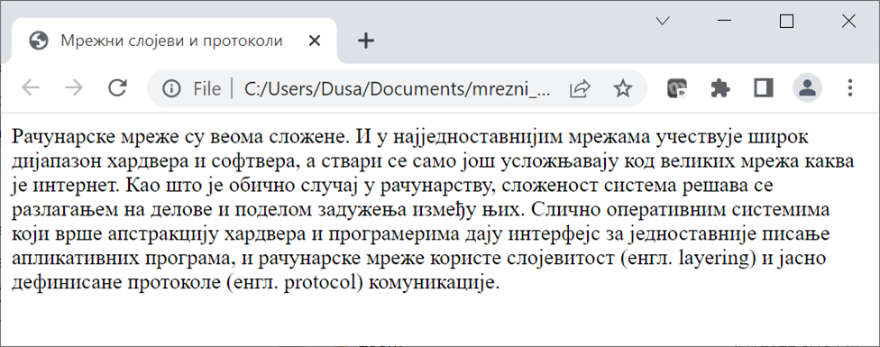
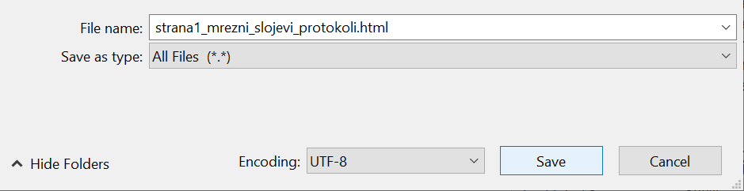
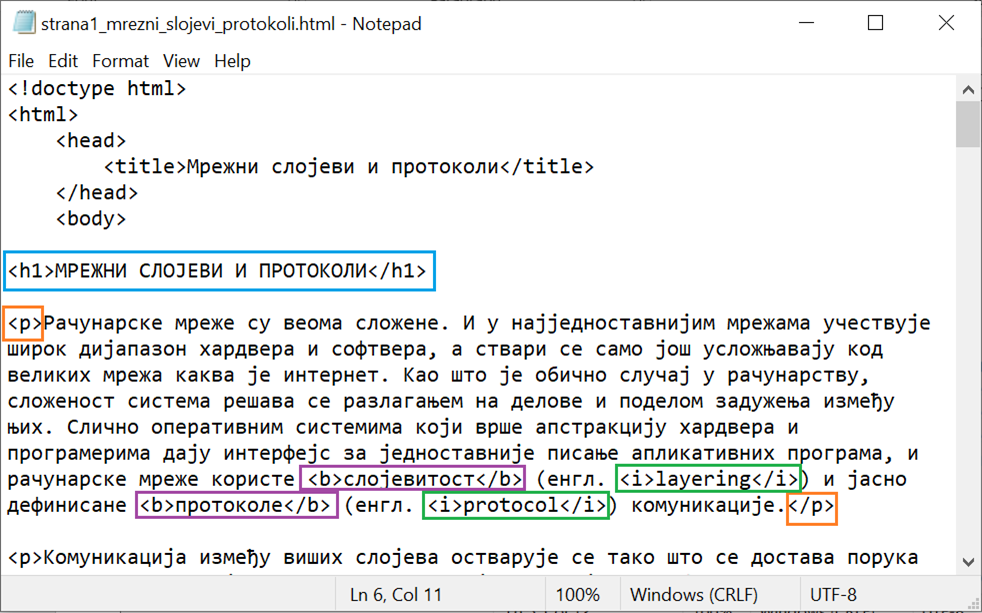
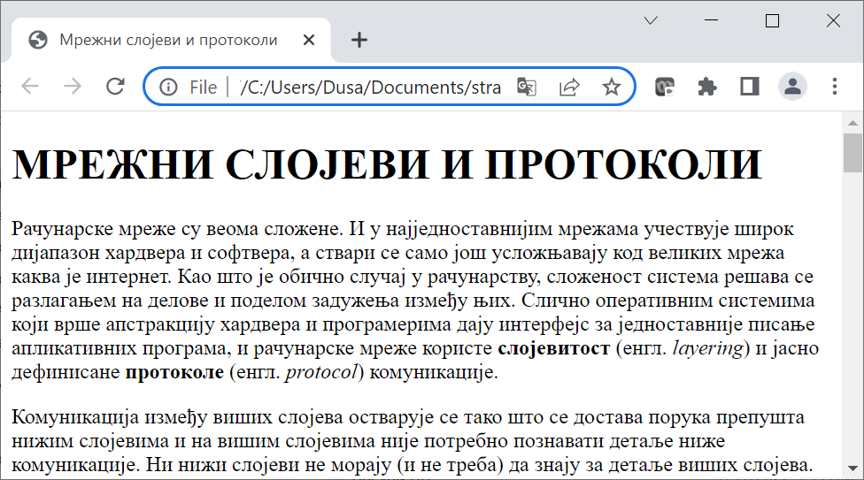
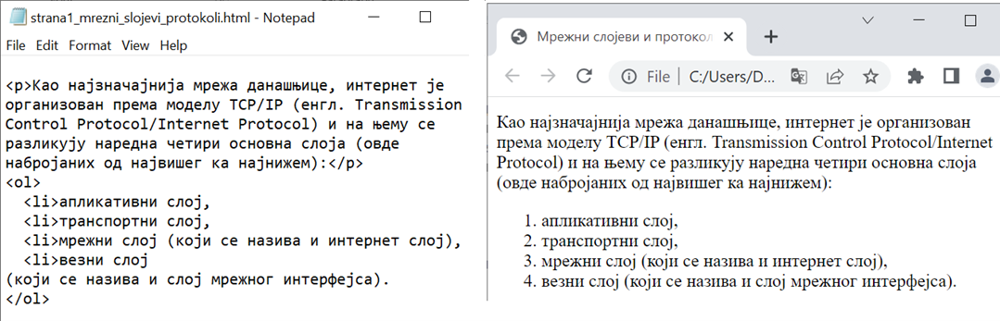

Статичке веб-стране и HTML/CSS
==============================

На почетку развоја веба, веб-стране је углавном чинио само унапред припремљен
садржај који су корисници могли само да прегледају и евентуално прате везе ка
другим странама. Такве стране се називају **статичке веб-стране** и оне не
омогућавају никакву нарочиту интеракцију са корисницима. Сваки корисник
приликом приступа таквој веб-страни види потпуно исту страну, може само да чита
њен садржај и након тога да пређе на неку другу страну (најчешће праћењем неког
линка унутар стране). У овом случају, и клијент и сервер имају веома
једноставне улоге: клијент шаље захтев серверу, сервер проналази статичку
страну у свом систему датотека и враћа је клијенту без икакве обраде. На крају
клијент приказује добијену страну и ту се сва интеракција завршава, све до
наредног захтева.

За креирање статичких веб-страна су потребне само основне веб-технологије, а то
су језици за обележавање *HTML* и *CSS*. Обновићемо кроз пример креирање
једноставних веб-страница, тему која је детаљно обрађена у трећем разреду.

`https://petlja.org/kurs/488/1/2054 <https://petlja.org/kurs/488/1/2054>`

Креирање веб-стране – HTML
--------------------------

*HTML* документи су текстуални фајлови написани језиком HTML, који разуме сваки
прегледач (*Chrome, Microsoft Internet Explorer, FireFox, Microsoft Edge и
други*). Прегледач који добије неки *HTML* документ може да прикаже информације
које су у њему. Пример једноставног *HTML* документа је приказан у следећем
листингу:

.. code-block:: html

 <!doctype html>
 <html>
     <head>
         <title>Мрежни слојеви и протоколи</title>
     </head>
     <body>
         Рачунарске мреже су веома сложене. И у најједноставнијим мрежама учествује широк дијапазон хардвера и софтвера, а ствари се само још усложњавају код великих мрежа каква је интернет. Као што је обично случај у рачунарству, сложеност система решава се разлагањем на делове и поделом задужења између њих. Слично оперативним системима који врше апстракцију хардвера и програмерима дају интерфејс за једноставније писање апликативних програма, и рачунарске мреже користе слојевитост (енгл. layering) и јасно дефинисане протоколе (енгл. protocol) комуникације.
     </body>
 </html>
 
Делови документа између ознака ``<title>`` и ``</title>``, као и између ознака
``<body>`` и ``</body>`` представљају садржај стране. **Таг** је други назив за
ове ознаке које користимо у HTML документима.

Сваки *HTML* документ се састоји од **HTML елемената**. *HTML* елементи су
делови веб страна или компоненте које се приказују на веб страни. *HTML*
елементи могу да буду наслов стране који видите у прегледачу, пасус (параграф)
текста, табела, или слика која је приказана на страни. Пар ознака, тј. тагова
(нпр. отворени таг ``<title>`` и затворени таг ``</title>``) и садржај између
чине један елемент.

Текстуалне фајлове који чине *HTML* документе можете да напишете у било ком
едитору текста као што је *Notepad*. Потребно је да:

- изаберете ``All Files`` под ``Save as type``,
- наведете назив фајла са .html (у овом примеру: mrezni_protokoli.html), 
- проверите да ли је под ``Encoding`` изабран ``UTF-8``.



Када фајл сачувате, моћи ћете да га отворите помоћу прегледача као што је
Chrome.



Пример како би се приказао овај фајл у прегледачу Chrome је приказан на
следећој слици:



Име између ознака ``<title>`` и ``</title>`` у *HTML* документу из претходног
примера је приказано као наслов веб стране у прегледачу. Текст између
ознака ``<body>`` и ``</body>`` је приказан као садржај стране.

Уколико желимо да мењамо веб-страну, фајл морамо поново да отворимо у едитору
текста на један од следећа два начина:

- отворимо едитор, па изаберемо са менија ``File/Open`` и пронађемо фајл (обавезно изабрати ``All Files`` и ``Encoding/UTF-8``),
- урадимо десни клик мишем над фајлом и изаберемо ``Open with/Notepad``.

Можемо да отворимо фајл са већ припремљеним текстом, а затим да га обликујемо у
веб-страну додавањем ознака.

Фајл за рад можеш да преузмеш овде:

`strana1_mrezni_slojevi_protokoli.txt <https://petljamediastorage.blob.core.windows.net/root/Media/Default/Kursevi/baze_IV/strana1_mrezni_slojevi_protokoli.txt>`_

Преузети фајл сачувати у другом формату да бисмо могли од њега да добијемо
веб-страницу. У едитору текста изабрати са менија ``File/Save As...``, а затим
је потребно да:

- изаберете ``All Files`` под ``Save as type``,
- наведете назив фајла са .html (у овом примеру: mrezni_protokoli.html), 
- проверите да ли је под ``Encoding`` изабран ``UTF-8``.



У *HTML* језику постоји велики број ознака којима можете окружити текст и тако
му дати специјално значење, као на пример:

- ``<p> … </p>``, којима се окружују пасуси текста.
- ``<h1> … </h1>``, ``<h2> … </h2>``, … ``<h6> … </h6>``, које представљају поднаслове различитих нивоа у тексту.
- ``<b> … </b>``, ``<i> … </i>``, ``<u> … </u>``, које представљају текст који је подебљан (енгл. *bold*), искошен (енгл. *italic*) или подвучен (енгл. *underline*).

Потребно је да додамо одговарајуће парове ознака у документ на којем радимо и
на тај начин обележимо шта је наслов, шта су пасуси, које речи треба да буду
исписане подебљано (нпр. нови појмови), а које искошено (нпр. речи на
енглеском).



На крај документа обавезно додати и затворене тагове:

.. code-block:: html

     </body>
 </html>

Обавезно сачувати измене на документу, а онда га отворити помоћу прегледачу
Chrome. Након сваке сачуване измене је потребно освежити веб-страну учитану у
прегледачу или поново отворити ту страну да би измене биле видљиве.

На следећој слици може да се види како изгледа овај *HTML* документ, са
насловом, текстом подељеним на пасусе, јасно обележеним речима које су нови
појмови и речима које су на енглеском језику.



У *HTML* језику се за представљање неке листе најчешће користи један од ова два
елемента:

- ``<ul>`` елемент, који представља неуређену листу (енгл. *unordered list*), у којој се елементи приказују без индексирања. Садржај у оваквим листама се окружује ``<ul>`` и ``</ul>`` ознакама.
- ``<ol>`` елемент, који представља уређену, односно нумерисану листу (енгл. *ordered list*), у којој се елементи листе приказују у неком редоследу обележени словима (а, б, ц) или редним бројевима (1, 2, 3). Садржај у овим листама се окружује ``<оl>`` и ``</оl>`` ознакама.



Слике су, у највећем броју случајева, фајлови који се чувају одвојено од *HTML*
докумената (најћешће у неком поддиректоријуму). Слике се постављају помоћу
елемента ````, који у свом атрибуту ``src`` садржи име слике коју треба
приказати:

.. code-block:: html

 </img>

Елемент ```` нема садржај, тј. ништа не наводимо између отварајућег и
затварајућег тага. Зато се овај елемент може написати и као самозатварајући
таг, овако:

.. code-block:: html

 
