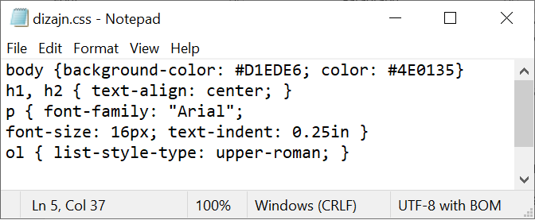
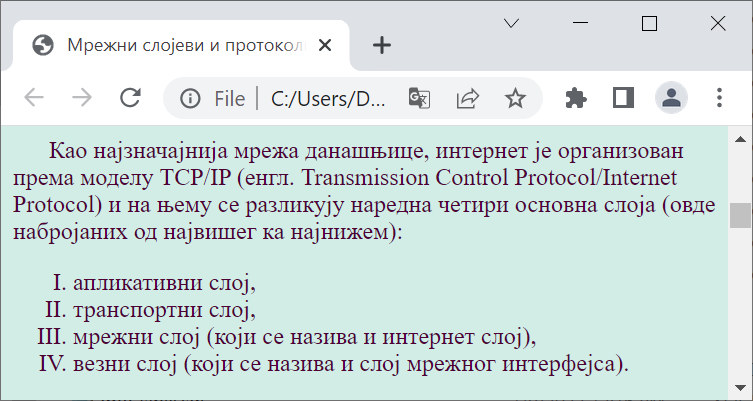

Дизајн веб-стране – CSS
=======================

Ако распоредите *HTML* елементе у документу као што је раније описано, ти
елементи ће бити постављени један испод другог и прегледач ће користити неке
подразумеване стилове (боје, величине слова, размаке) како би их приказао.

Елементе на правим веб странама је често потребно распоредити и стилизовати у
складу са наменом сајта. **Веб дизајн** је активност којом се описује како ће
страна и елементи на њој изгледати. Веб дизајн је тесно повезан и са другим
областима дизајна као што је организација информација на сајту и правила за
једноставно коришћење сајта (енгл. *User Experience*).

Као што је *HTML* језик којим се описује структура и садржај елемената који ће
бити приказани на веб страни, тако постоји и посебан језик који се користи за
описивање изгледа и геометријског распореда ових елемената. Овај језик се
назива *CSS* (енгл. *Cascading Style Sheets*).

Језиком CSS се представљају правила која дефинишу како треба да изгледају
елементи на веб страни.

Текстуалне фајлове који чине *CSS* документе можете да напишете у било ком
едитору текста као што је *Notepad*. Потребно је да:

- изаберете ``All Files`` под ``Save as type``,
- наведете назив фајла са .css (у овом примеру: dizajn.css).

На следећој слици се види пример фајла у којем смо описали дизајн веб-странице.

У *CSS* документу наводимо правила тако што наведемо назив HTML елемента, а
затим у витичастим заградама својства која се на њега односе.

Могуће је за исти елемент дефинисати и више својства. Тако, на пример, имамо за
тело веб-странице, тј. елемент ``body``, дефинисану и боју позадине и боју
слова:

.. code-block:: css

 body {background-color: #D1EDE6; color: #4E0135}

Исто својство, или скуп својства, можемо применити истовремено и на више
елемената. Тако, на пример, и за наслове нивоа 1 и за наслове нивоа 2 имамо
дефинисано да треба да се позиционирају централно:

.. code-block:: css

 h1, h2 { text-align: center; }

Више о начину писања правила се може наћи у материјалима за трећи разред, као
и на интернету, на пример на сајту `W3 schools
<https://www.w3schools.com/css/>`.

У *HTML* документ морамо да додамо следећи ред да би се дизајн применио на
веб-страницу.

.. code-block:: html

 <link rel="stylesheet" href="dizajn.css">

Сада ће почетак нашег HTML документа изгледати овако:

.. code-block:: html

 <!doctype html>
 <html>
     <head>
         <title>Мрежни слојеви и протоколи</title>
         <link rel="stylesheet" href="dizajn.css">
     </head>
     <body>
     . . . 

Када сачувамо измене и покренемо поново страницу у прегледачу, можемо да
приметимо да су промењене боје, да је први ред пасуса увучен и да се
користе римски бројеви за листу.

.. questionnote::

 **Задатак**

 Направити фолдер за веб-сајт и у њега ставити *HTML* документ на којем смо
 почели да радимо: ``strana1_mrezni_slojevi_protokoli.html``.

 У исти фолдер ставити и слике које можеш да преузмеш овде:

 `strana1_slika1.jpg  <https://petljamediastorage.blob.core.windows.net/root/Media/Default/Kursevi/baze_IV/strana1_slika1.jpg>`_

 `strana1_slika2.jpg <https://petljamediastorage.blob.core.windows.net/root/Media/Default/Kursevi/baze_IV/strana1_slika2.jpg>`_

 Креирати у истом фолдеру и документ ``dizajn.css`` како је управо описано.

 У документ ``strana1_mrezni_slojevi_protokoli.html`` додати ознаке, тј. тагове,
 за све наслове, пасусе, набрајања, слике, речи које треба да буду приказане
 подебљано (нпр. нове појмове) и речи које треба да буду приказане искошено
 (нпр. речи на енглеском језику). Обавезно додати ред којим се овај документ
 повезује са креираним дизајном.

 Погледати како креирана веб-страна изгледа у прегледачу, нпр. прегледачу
 Chrome. Уколико има неких недостатака, вратити се у едитор текста и поправити
 уочене пропусте.
