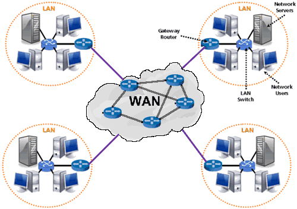
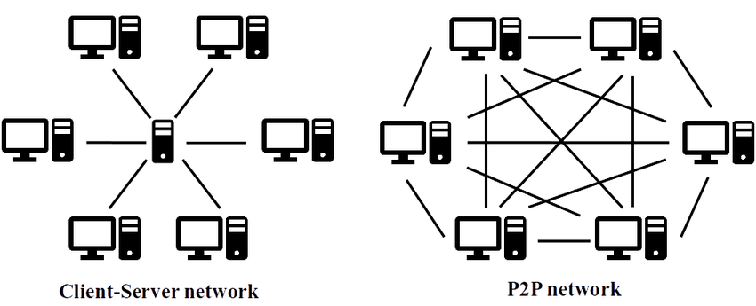

Рачунарске мреже
================

Скоро сви рачунари и уређаји које данас користимо су повезани са
другим рачунарима и дигиталним уређајима. Повезивање рачунара,
изградња рачунарских мрежа, а затим и развој интернета и његових
сервиса (нарочито веба и електронске поште) су донеле сасвим нове
примене рачунара и информационе технологије, довели су до знатног
повећања броја корисника и променили начин на који се рачунари
користе. Често се каже да је појава савремених
информационо-комуникационих технологија довела до револуције сличне по
значају индустријској револуцији коју је изазвала појава парне машине
у 18. веку. С временом, све већи број различитих уређаја постајe
умрежен и све је више услуга које нам нуди мрежно окружење. У мреже се
данас поред рачунара и паметних телефона везују и други уређаји, као
што су, на пример, телевизори, паметни кућни апарати, аутомобили
итд. чиме настаје такозвани **интернет ствари**.

**Рачунарска мрежа** подразумева постојање најмање два уређаја који
међусобно могу да комуницирају и размењују податке. Уређаји
комуницирају разменом дигиталних порука (можемо рећи да рачунари
комуницирају тако што један другом диктирају нуле и јединице којима су
дигитално записани подаци). Често је у мрежу повезано више рачунара, а
ширењем интернета дошло се до тога да су скоро сви рачунари, паметни
телефони, телевизори и слични дигитални уређаји на свету међусобно
повезани. Посебну улогу имају и рачунари на којима се складиште подаци
и информације које преузимамо (на пример, веб-сервери) и на којима се
извршавају тзв. апликације "у облаку". Између наших уређаја и таквих
сервера у мрежама учествују и многи уређаји чија је улога да посредују
у тој комуникацији (такви су, на пример, мостови, хабови, свичеви,
рутери). Уређаји су повезани комуникационом опремом која је жичана или
бежична. Комуникација у мрежи одвија се под контролом софтвера -- од
системског софтвера (на пример, драјвера за комуникационе уређаје) до
апликативног софтвера, који корисник користи у раду са мрежом (на
пример, прегледача веба или програма за рад са електронском
поштом). Дакле, мреже можемо дефинисати на следећи начин:

.. infonote::

   Рачунарска мрежа је систем који се састоји од скупа хардверских
   уређаја међусобно повезаних комуникационом опремом, снабдевених
   одговарајућим комуникационим софтвером, којим се остварује контрола
   система тако да је омогућен пренос података између повезаних
   уређаја.

.. image:: ../../_images/mreze_mreza.jpg
   :width: 500
   :align: center
   :alt: Пример кућне рачунарске мреже
   
Два повезана уређаја довољна су да оформе мрежу, међутим, мреже обично
обухватају више од два уређаја, а са ширењем интернета већина
рачунарских уређаја на свету међусобно је повезана. Рачунарске мреже
не треба поистовећивати са интернетом. На пример, дешава се да су у
школском кабинету рачунари умрежени (и да је могуће пребацивати
податке између њих), али да ова мрежа није повезана са
интернетом. Повезивање са интернетом могло би се остварити тако што би
неки истакнути уређај у тој мрежи остварио везу са интернетом, док би
остали рачунари интернет везу остваривали преко њега. Зато је, уместо
као мрежу појединачних рачунара, интернет боље схватити као глобалну
мрежу која повезује различите рачунарске мреже (а тиме и рачунаре
умрежене у њих), како је и приказано на наредној слици.

   

За шта користимо рачунарске мреже?
..................................

Данас је практично незамисливо коришћење рачунара који нису повезани
са другим рачунарима и умреженост нам омогућава многе ствари које не
бисмо могли да урадимо на дигиталним уређајима који нису умрежени.

- Умрежени дигитални уређаји су изменили начин на који људи
  комуницирају (некада су се размењивала руком писана писма, а данас
  имамо мејл, друштвене мреже, сервисе за ћаскање и размену порука и
  слично).

- Интернет и посебно веб данас су најзначајнији извор
  информација. Великим базама података често можемо приступити преко
  интернета, а са интернета можемо преузети и све већу количину
  отворених података.

- Дељење података и информација могуће је и у оквиру мањих мрежа (на
  пример, учениcи у школи могу да преко мреже приступају наставним
  материјалима које наставници са њима поделе коришћењем локалне мреже
  и мрежних дискова).

- Све чешће се догађа да софтвер не инсталирамо на своје рачунаре, већ
  га користимо преко мреже "у облаку" (најчешће из прегледача
  веба). Све је више бесплатних сервиса који функционишу на интернету
  и који полако одмењују улогу мањих, локалних мрежа (на пример,
  наставници ће данас чешће поделити са ученицима наставне материјале
  преко Гугл учионице, него преко локалне рачунарске
  мреже).

- Захваљујући умрежености, више корисника може заједнички да
  употребљава неке хардверске ресурсе (нпр. штампач или скенер). На
  пример, у компанијама или домовима често постоји квалитетнији
  штампач који је преко мреже повезан са неколико рачунара, а са
  сваког од тих рачунара може се покренути штампање на њему.

- Мреже омогућују и расподелу посла на више рачунара, што доприноси
  бржој обради података. Уколико више рачунара обавља заједнички
  посао, отказивање једног од њих не мора потпуно да прекине
  извршавање тог посла.

Улога уређаја у мрежној комуникацији
....................................

У породичној мрежи сваки члан породице може да преузима податке са
рачунара других чланова и сви могу да штампају на заједничком
штампачу, па су у таквој мрежи сви рачунари равноправни. Са друге
стране, у рачунарским учионицама је наставнички рачунар често истакнут
и ученици могу да узимају податке само са њега. Често се мреже
организују или по моделу **мреже равноправних рачунара**
(енгл. *peer-to-peer*, *P2P*) или по моделу **клијент-сервер**. У том
моделу **сервер** је систем који пружа своје ресурсе (податке,
софтвер, хардвер), док је **клијент** систем који иницира контакт са
сервером да би користио ресурсе које сервер пружа.

Нагласимо да су клијент и сервер само улоге рачунара у процесу
комуникације. Рачунари нису предодређени само за једну врсту улоге
(додуше, за сервере се користе моћнији рачунари). Улога је одређена
софтвером који се извршава и који контролише комуникацију. Рачунар чак
истовремено може да има различите улоге. На пример, на рачунару који
служи као веб-сервер администратор може да проверава електронску пошту
(чиме рачунар игра улогу клијента), док у позадини исти рачунар
учествује и у некој Bittorent размени, чиме је део p2p мреже.

Већина интернет сервиса углавном користи модел клијент–сервер. На
пример, дигитални уређај на којем прегледате садржај веба је
клијент. Када унесете адресу у прегледач, ваш уређај се обраћа неком
веб-серверу -- удаљеном рачунару на коме се налазе веб-стране које
захтевате (или програми који их генеришу). Сервер клијенту шаље
документе (веб-странице, слике итд.) и клијент их приказује
кориснику. Слично томе, електронска пошта се чува на серверима
електронске поште, а шаље се, преузима и прегледа на клијентским
рачунарима тј. дигиталним уређајима. Изузетак представљају P2P сервиси
за дељење датотека какав је Bittorent. Не постоји централни сервер на
којем се налази датотека коју сви преузимају, већ сваки од рачунара у
мрежи има део датотеке и једни од других преузимају делове који им
недостају, тако да ти сервиси функционишу по моделу P2P.

Распон мрежа
............

Мреже се разликују по величини, тј. географском распону који
покривају. Најмања мрежа повезује само два рачунара тј. дигитална
уређаја, а највећа мрежа је интернет, која обједињује скоро све
рачунаре, паметне телефоне и таблете данашњице, али укључује и огромну
ифраструктуру комуникационих уређаја који ту повезаност
омогућавају. Између ове две крајности постоји широк дијапазон распона
мрежа. У зависности од распона мреже, за комуникацију се користе
различите технологије (на пример, у породичној мрежи која обухвата
кућу или стан користе се другачији уређаји и каблови него у мрежи која
покрива целу компанију или државу). Мреже малог распона повезују
појединачне уређаје, док мреже великог распона повезују мање мреже,
чиме се постиже хијерархијско умрежавање. Најчешће се разликују
**локалне мреже** (енгл. *local area network*, *LAN*) и **мреже
широког распона** (енгл. *wide area network*, *WAN*).

LAN мреже повезују уређаје на малим удаљеностима (у стану, рачунарском
кабинету или пословној згради) и традиционално користе посебне мрежне
каблове, иако нове технологије омогућавају коришћење и постојећих
инсталација (коаксијалних каблова, телефонских и електричних линија),
као и бежичну комуникацију.

WAN мреже повезују велике географске просторе, често шире од граница
једног града, области, па и државе. Обично су у саставу интернета и
одржавају их телекомуникационе компаније које изнајмљују услуге
њиховог коришћења. За комуникацију се обично користе брзе (најчешће
оптичке) везе за удаљене уређаје, али се, када није могуће успоставити
оптичке каблове користе и другачије технологије (на пример, изолована
острва се некада повезују коришћењем сателитских веза).

Мрежни слојеви и протоколи
..........................

Рачунарске мреже су веома сложене. И у најједноставнијим мрежама
учествује широк дијапазон хардвера и софтвера, а ствари се само још
усложњавају код великих мрежа каква је интернет. Као што је обично
случај у рачунарству, сложеност система решава се разлагањем на делове
и поделом задужења између њих. Слично оперативним системима који врше
апстракцију хардвера и програмерима дају интерфејс за једноставније
писање апликативних програма, и рачунарске мреже користе
**слојевитост** (енгл. *layering*) и јасно дефинисане **протоколе**
(енгл. *protocol*) комуникације.  Комуникација између виших слојева
остварује се тако што се достава порука препушта нижим слојевима и на
вишим слојевима није потребно познавати детаље ниже комуникације. Ни
нижи слојеви не морају (и не треба) да знају за детаље виших
слојева. Пошиљаоци и примаоци на појединачним слојевима морају
међусобно да се разумеју, што се постиже коришћењем прецизираних
протокола -- начина и језика комуникације.

.. topic:: 🤓 Занимљивост

   И класична комуникација је слојевита. Онај ко шаље писмо не мора да
   брине о детаљима доставе, већ је довољно да писмо адресира и преда
   га пошти. Могуће је да ће то писмо заједно са осталим писмима која
   путују у исту земљу бити упаковано у пакет на коме ће писати нешто
   попут „доставити возом у поштанску испоставу број 12345”. Тако
   пошта чини један слој комуникације који пружа услугу слоју изнад
   себе, док се за даље извршење свог задатка обраћа слоју испод себе
   (у овом случају железници). Радници који раде на неком слоју не
   морају да знају детаље осталих слојева (на пример, радника поште не
   занима ни садржај писма ни то у који вагон воза ће пакет бити
   утоварен, док радника железнице не занима адреса крајњег
   примаоца). Протоколи (својеврсни језици комуникације) дефинишу
   комуникацију на засебним слојевима. Радник поште не мора да разуме
   језик на коме је писмо написано, али прималац мора. Поштански
   протокол дефинише формат адресе и један од протокола (обичаја добре
   комуникације) дефинише на којој страни коверте ће бити написана
   адреса примаоца, а на којој адреса пошиљаоца. Ако се овај протокол
   (договор) не би следио, могло би да се деси да писмо дође до онога
   ко га је и послао.

Као најзначајнија мрежа данашњице, интернет је организован према
моделу **TCP/IP** (енгл. *Transmission Control Protocol/Internet
Protocol*) и на њему се разликују наредна четири основна слоја (овде
набројаних од највишег ка најнижем):

1. апликативни слој,
2. транспортни слој,
3. мрежни слој (који се назива и интернет слој),
4. везни слој (који се назива и слој мрежног интерфејса).

На најнижем, **везном слоју** решава се питање како да се изврши
поуздан пренос података између два конкретна уређаја. Одређују се
физички детаљи комуникације (електрични и радио сигнали који се
користе, конверзија дигиталног у аналогне сигнале и
слично). Поузданост комуникације се постиже коришћењем додавања
"заштитних" битова порукама које се шаљу, а које примаоцу омогућавају да
са великом вероватноћом провери да ли је сваки бит основне поруке стигао у
исправном облику и редоследу, па чак и да аутоматски неке грешке
исправи (користе се тзв. кодови за детекцију и кодови за корекцију
грешака).

На наредном, **мрежном слоју** се са комуникације два фиксирана
уређаја прелази на уређивање питања комуникације унутар шире
рачунарске мреже. Предуслов за то је адресирање тј. додељивање система
адреса који омогућује да се наведе ком тачно рачунару су поруке које
се шаљу намењене. Јако важно питање које се на овом слоју решава је и
питање рутирања тј. одређивање путање тј. низа успутних рутера преко
којих поруке пролазе док не стигну до одредишта (рутери су ти који су
заправо основа алгоритма рутирања јер они на основу адресе одредишта
одређују ком од својих суседних рутера треба да проследе поруку).
Основни протокол на овом слоју је протокол IP.

Један од основних задатака **транспортног слоја** је да веће поруке
(које му стигну са вишег, апликативног слоја) подели на ситније пакете
и те пакете проследи тако да појединачни пакети могу истовремено да
путују кроз мрежу. На транспортном слоју се уводе **портови**, који
помажу да се одреди софтвер на коме одређене поруке које стигну до
уређаја треба да буду покренуте (наиме, IP адресе које се уводе на
мрежном слоју одређују само уређаје, а портови су додатни елементи
адреса који онда омогућавају да се тачно одреди софтвер који треба да
прихвати послату поруку). Основни протоколи на овом слоју су протокол
**TCP** и **UDP**. Протокол TCP обезбеђује механизме сигурне
комуникације, који раде тако што прималац потврђује пријем свих
пакета, на основу чега пошаљилац зна да ли је неки пакет "залутао" и
треба да буде поново послат. Води се рачуна и брзини слања пакета и
контроли загушења (да се не би десило да се слањем превеликог броја
пакета у мрежу која је прилично загушена она још додатно загуши).
Протокол UDP је намењен мање сигурној, али много бржој комуникацији
(користи се углавном за апликације у реалном времену, попут преноса
аудио и видео сигнала и слично, јер нпр. за говорни сигнал је најважније 
да се довољно брзо преноси, па и по цену да неки делићи секунде говора 
буду изгубљени или пренети са малом грешком).

На врху се налази **апликативни слој** и апликативни протоколи, који
су специфични за појединачне апликације тј. сервисе интернета -- свака
апликација тј. сервис одређује формате порука које се шаљу током рада те
апликације.  На пример, за преузимање докумената са веба користе се
протоколи **HTTP** (енгл. *HyperText Transfer Protocol*) и **HTTPS**
(енгл. *HyperText Transfer Protocol Secure*), за преузимање
електронске поште протоколи **POP3** (енгл. *Post Office Protocol*) и
**IMAP** (енгл. *Internet Message Access Protocol*), за слање
електронске поште протокол **SMTP** (енгл. *Simple Mail Transfer
Protocol*), за пренос датотека протокол **FTP** (енгл. *File Transfer
Protocol*) и слично.  Протоколи прецизно дефинишу формат порука које
се размењују (њихов облик и садржај). Поруке дефинисане на
апликативном нивоу се онда размењују коришћењем услуга нижих слојева
(транспортни слој дели те поруке на пакете, који се онда адресирају и
шаљу коришћењем услуга мрежног и везног слоја).

За успешно коришћење, па чак и успостављање савремених рачунарских
мрежа није неопходно познавати све детаље мрежних слојева и протокола
који се на њима користе. Стога ћемо у наставку описати само оне
појмове који крајњем кориснику могу бити значајни, док ћемо датаљнији
приказ оставити за посебно поглавље, намењено ученицима који су
заинтересовани за ову тематику.

Адресе
......

Јако важан детаљ приликом рада у мрежном окружењу је постојање система
адресирања. Наиме, пожељно је да сваки ресурс коме можемо приступити
преко мреже (датотека, уређај, сервис) добије своју неку своју
јединствену адресу. Пошто су мреже изграђене слојевито, постоји
неколико различитих система адреса који се користе у мрежној
комуникацији. У данашњим мрежама се обично користе

1. MAC тј. физичке адресе.
2. IP адресе,
3. имена домена тј. DNS адресе и URL-ови,

Физичке (MAC) адресе
.....................
   
Сваки мрежни уређај има своју физичку адресу која се одређује приликом
производње тог уређаја. Те адресе се називају **MAC адресе**
(енгл. *Media Access Control*) и могу се сматрати непроменљивим (мада
постоје начини да се измене на силу). Обично су у питању 48-битне или
64-битне адресе које се записују помоћу парова хексадекадних цифара
(нпр. 01-23-45-67-89-AB). MAC адресе имају улогу на нижим слојевима и
помажу комуникацију унутар локалних мрежа, али њихова структура није
погодна за коришћење у већим мрежама јер нису погодне за рутирање
тј. за достављање података рачунарима који се налазе у удаљеним
мрежама. Наиме, предуслов за ефикасно рутирање је тај да систем
адресирања прати хијерархијски начин организације рачунарских
мрежа. Кључни захтев је да сви уређаји у истој подмрежи на неки начин
имају сличне адресе (слично као што су све адресе у једној улици
сличне, јер имају исти назив и земље и града и улице, као што су
адресе у том граду сличне јер имају исти назив земље и назив града
тј. поштански број). MAC адресе не могу да испуне тај захтев (јер су
одређене у тренутку производње уређаја, а не у тренутку његовог
укључивања у неку мрежу) и због тога је уведен посебан систем

.. topic:: 🤓 Занимљивост

   Систем поштанских адреса у традиционалном поштанском саобраћају
   направљен је по хијерархијском моделу. На врху хијерархије налазе
   се државе, на следећем нивоу су градови, затим улице, кућни
   бројеви, спратови, бројеви стана и слично. Све адресе станова у
   истој згради веома су сличне (разликује се само број стана), све
   адресе у једној улици такође су сличне (разликују се још и кућни бројеви)
   и тако даље. Замислите колико би било тешко да се достави пошта ако
   не би постојао хијерархијски систем адреса, већ да се писма
   адресирају, на пример, на основу ЈМБГ.  Пошто ЈМБГ не даје никакву
   информацију о томе где неко живи, у свакој пошти би био потребан
   попис ЈМБГ свих грађана са прецизним географским локацијама на
   којима се ти грађани налазе.  Потпуно аналогна ситуација је и са
   MAC адресама, па је због тога било неопходно да се поред њих уведе
   и нови систем адресирања одређен IP адресама. Такав попис је могуће
   направити за мали скуп људи, као што се у локалним мрежама у којима
   је број рачунара мали одржава попис MAC адреса прикључених рачунара
   и где се MAC адресе и користе.

IP адресе
.........

IPv4 адресе су 32-битни бројеви, али се традиционално представљају као
декадне репрезентације својих појединачних бајтова тј. као четири
декадна броја између 0 и 255. На пример, адреса ``11000000 10101000
000000010 00000001`` представља се као ``192.168.2.1``. Број битова у
IPv4 адресама ограничава укупан број могућих адреса на :math:`2^{32}`, 
што је око 4,2 милијарде. Број уређаја тренутно прикључених на интернет
је већ већи од овог броја. Због тога се прелази на новије, IPv6 адресе, 
које су 128-битни бројеви. Ове адресе се обично представљају као осам
четвороцифрених хексадекадних бројева, раздвојених по једном цртицом
(на пример, 2001:db8:3333:4444:CCCC:DDDD:EEEE:FFFF).

Основна особина IP адреса је да су структуриране
хијерархијски. Приликом мрежне комуникације, подела на битове који
чине адресу мреже (то су обично водећи битови) и битове који чине
адресу уређаја у оквиру мреже изразито је важна. Наиме, на основу тога
се одређује да ли пакет треба доставити на одредиште коришћењем
локалног мрежног саобраћаја или га треба послати ван локалне мреже, „у
свет”. Пакет се у другом случају, коришћењем локалног мрежног
саобраћаја, доставља посебно одређеном уређају (рутеру), који се
назива излазна капија или гејтвеј (енгл. gateway).

.. topic:: 🤓 Занимљивост

   Локални мрежни саобраћај можемо замислити као курира који разуме
   само адресе у граду у којем ради. Јасно је да преко таквог курира
   можемо да пошаљемо оно писмо за које се на основу адресе може
   утврдити да му је одредиште у том граду. Међутим, ако препознамо да
   је одредиште у другом граду, онда ћемо локалном куриру рећи да
   писмо достави на адресу наше локалне поште (коју он разуме), а на
   коверти ће и даље писати адреса одредишта у другом граду, коју ће
   службеници у пошти разумети и проследиће писмо ван града. Локална
   пошта тада игра улогу излазне капије из града.

Уређаји прикључени на интернет добијају IP адресе. Оне могу бити
додељене **статички**, тако да уређај има фиксну IP адресу када год се
прикључи на интернет. Ипак, чешћа варијанта је **динамичка** додела IP
адреса, када се уређају додељује нека слободна IP адреса сваки пут
када се прикључује на интернет, при чему нема гаранције да ће сваки
пут добити исту адресу (тј. веома је вероватно да ће приликом сваког
поновног прикључивања добити другачију адресу). Иако су статичке
адресе неизбежне у неким случајевима (на пример, пожељно је да се
адреса сервера никад не мења како би клијенти могли да му увек
приступају на исти начин), у великом броју случајева пожељнија је
динамичка додела адреса јер се смањује могућност грешака услед
погрешно подешених статичких IP адреса и постиже се једноставније
администрирање мреже. Динамичка додела адреса заснива се на протоколу
**DHCP** (енгл. *Dynamic Host Confi guration Protocol*). Један или
више уређаја у мрежи (било рутера, било рачунара) играју улогу DHCP
сервера, и када се нови уређај прикључује у локалну мрежу, он шаље
поруку у којој захтева да му се додели IP адреса. DHCP сервер тада
одговара шаљући неку слободну адресу (из скупа адреса које он одржава), а
уз њу може да достави још неке конфигурационе параметре, попут адресе
DNS сервера или адресе подразумеване излазне капије (гејтвеја).

Домени и URL
............

Крајњи корисник најчешће има додира са **URL** адресама
(енгл. *Uniform Resource Locator*). Рецимо и да се некада јавља и
појам **URI** (енгл. *Uniform Resource Identifier*) и да постоји
суптилна разлика између појмова URL и URI, међутим, она је прилично
техничка и нема потребе да је објашњавамо. URL-ови су тзв. веб-адресе
и њих сте сигурно често користили да бисте приступили одређеним
веб-сајтовима.  На пример, да бисте приступили сајту Универзитета у
Новом Саду користите URL ``https://www.uns.ac.rs``, а да бисте
приступили првој веб-страници икада направљеној можете користити URL
``http://info.cern.ch/hypertext/WWW/TheProject.html``. У овом
последњем примеру видимо да URL има ознаку протокола који се користи
за приступ ресурсу (користи се протокол ``http`` који је уобичајени
протокол за преузимање веб-страна и који ће касније бити много
детаљније објашњен), да се након тога користи назив сервера на ком се
ресурс налази (у овом случају то је ``info.cern.ch``) и на крају је
наведена путања до ресурса унутар тог сервера (у овом примеру то је
``hypertext/WWW/TheProject.html``. У поглављу о веб-програмирању ћемо
видети да URL-ови могу бити још сложенији од наведених, али за сада је
и ово довољно да се стекне представа о томе шта су URL-ови.

Јако важан део сваког URL-а је адреса сервера. У ова два примера то су
адресе ``www.uns.ac.rs`` и ``info.cern.ch``. Ове адресе се називају
**домени**. Домени се користе и у склопу URL-ова, али и у склопу
адреса електронске поште (нпр. ``petar.petrovic@uns.ac.rs``). Домени
су хијерархијски организовани и састоје од неколико делова раздвојених
тачкама. На пример, домен ``pmf.uns.ac.rs`` указује да се сервер
налази у Србији (``.rs``), да је део академске мреже (``.ac.rs``), да
је на универзитету Новом Саду (``uns.ac.rs``) и да је на
Природно-математичком факултету (``pmf.uns.ac.rs``). Последњи део
домена често указује на земљу у којој је домен регистрован
(нпр. ``.rs`` за Србију). Велики број домена није везан за земљу, већ
указује на тип организације у чијем је власништву домен (на пример,
``.com`` је комерцијални домен који може свако да закупи, ``.org``
углавном користе непрофитне организације, ``.edu`` користе образовне
институције, ``.aero`` користе авиопревозници и аеродроми).  За доделу
домена у Србији је задужена невладина организација *"Регистар
националног интернет домена Србије, РНИДС"*. Закуп домена врши и
већина добављача интернета, па ако сте заинтересовани за закуп домена
све детаље можете сазнати од свог добављача интернета.

Пошто су за интерно функционисање мрежне комуникације неопходне
нумеричке IP адресе, а не текстуалне адресе, сваком имену домена
придружена је IP адреса одговарајућег уређаја регистрованог за тај
домен (на пример, имену сервера ``www.pmf.uns.ac.rs`` придружена је IP
адреса ``147.91.177.44``). Ово придруживање бележи се на посебним
серверима, који се називају **сервери за имена домена** (енгл. *Domain
Name Server*, *DNS*). DNS се често назива *телефонским имеником
интернета*. Пре започињања мрежне комуникације, софтвер који подржава
имена домена (на пример, прегледач у који корисник уноси веб-адресу)
обраћа се DNS серверу и од њега тражи IP адресу на основу имена домена
које му пошаље. Комуникација са DNS сервером одвија се преко протокола
DNS (он је један од протокола апликативног слоја који је део скупа
протокола TCP/IP). Да би могла да се пошаље порука DNS серверу,
неопходно је да се зна његова IP адреса. Она се задаје ручно приликом
конфигурације рачунара или се, чешће, аутоматски добија од посебног
DHCP сервера.
