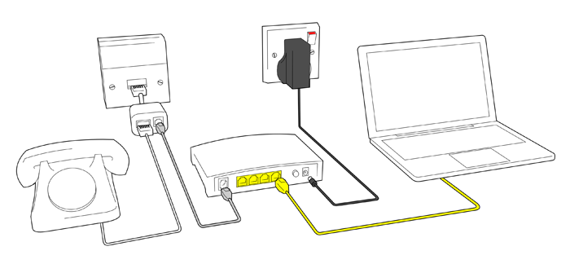
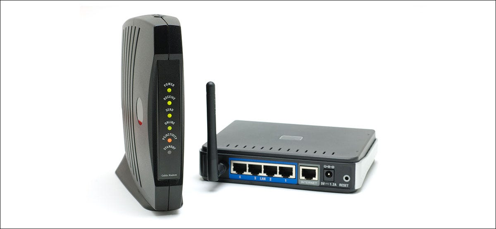
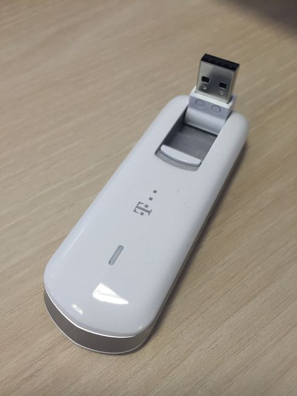
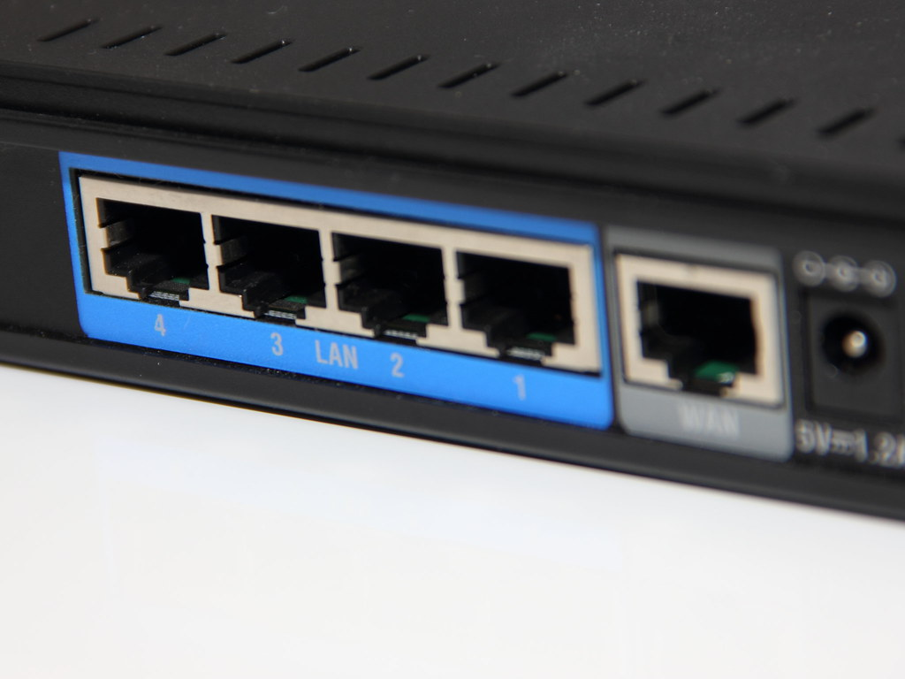
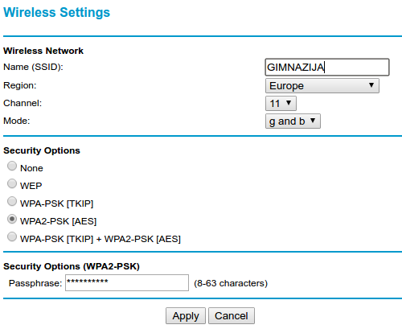

Повезивање на интернет и успостављање кућне мреже
=================================================

Кућни и пословни рачунари повезују се на интернет коришћењем услуга
**добављача интернета** тј. **интернет провајдера** (енгл. *internet
service providers*, *ISP*). Провајдери су организације (често приватне
компаније) које физичким и правним лицима омогућавају повезивање са
интернетом, тако што омогућавају укључивање рачунара и мањих мрежа у
њихове мреже које су већ повезане са интернетом. Поред овога,
добављачи често нуде и услуге веб-хостинга (чувања веб-сајтова на
серверима провајдера), електронске поште, закупа домена и слично.

Веза између кућних односно канцеларијских рачунара и добављача
интернета сматра се најспоријим сегментом у комуникацији преко
интернета. Ипак, данашње приступне технологије пружају све бржи проток
података. Данас се уређаји повезују на интернет коришћењем такозваног
**широкопојасног приступа** (енгл. *broadband internet
access*). Четири доминантна начина повезивања кућних и мањих
канцеларијских мрежа на интернет данас су:

1. ADSL приступ преко линија фиксне телефоније,
2. приступ преко линија кабловске телевизије (HFC), тзв. кабловски интернет,
3. приступ преко оптичких каблова
4. приступ преко мреже мобилне телефоније.

Брзина преузимања података с интернета у кућним условима креће се од
неколико мегабита по секунди па све до неколико гигабита по секунди
(Gbps), док је брзина слања података на интернет обично мања (до
неколико десетина Mbps).

Крајњи корисник се одлучује за пакет којим бира брзину и цену услуга.
Телекомуникационе услуге су данас обично обједињене, па се тако
корисници опредељују за пакете који поред брзине везе са интернетом
нуде и избор телевизијских канала, приступ дигиталним видео-клубовима
(колекцијама филмова и серија), фиксну телефонију (одређени број
бесплатних минута) и сличне телекомуникационе услуге. Добављач
интернета препоручује начин повезивања у складу са техничким
могућностима на локацији на коју се интернет уводи и након избора
пакета и потписивања уговора, инсталира сву потребну опрему довољну да
се у кући успостави једноставна локална мрежа која омогућава
умрежавање свих дигиталних уређаја које једно просечно домаћинство
користи. Наравно, у канцеларијама, пословним зградама, школама,
факултетима и слично је потребно изградити озбиљније локалне мреже,
међутим, то обично раде професионалци, па се у наставку нећемо бавити
описом успостављања таквих мрежа.

Опишимо у наставку како обично изгледа успостављање кућних мрежа за
сваку од најчешће коришћених начина повезивања.

ADSL интернет
.............

**Дигитална претплатна линија** (енгл. *digital subscriber line*,
*DSL*) је технологија за истовремени пренос гласовног сигнала и
дигиталних података преко парица фиксне телефонске мреже. Да би се
повећао фреквенцијски опсег (а тиме и пропусна моћ), не врши се
одсецање фреквенција изван уобичајених фреквенција људског говора.
Тиме се постиже да фреквенцијски опсег везе зависи само од дужине
кабла (на дугачким парицама долази до слабљења високофреквенцијских
сигнала којима се преносе подаци). Зато DSL не може да се успостави на
местима која су физички превише удаљена од телефонске централе (DSL
пристојне брзине обично се може уградити на растојањима до 4
km). Фреквенцијски распон дели се на појасеве и сваки појас се
независно користи за комуникацију. Један појас се резервише за пренос
телефонског (гласовног) сигнала, два појаса за контролу преноса
података, док се остали појасеви (њих око 250) користе за пренос
података (тако да се истовремено могу преносити и глас и
подаци). Пошто се обично подаци више преузимају него што се шаљу, више
појасева се одваја за долазни саобраћај (енгл. *download*) него за
одлазни (енгл. *upload*). Таква организација се назива **асиметрична
дигитална претплатна линија** (*asymmetric DSL*, *ADSL*). Брзина
преноса износи до неколико десетина мегабита по секунди у долазном
саобраћају и неколико мегабита по секунди у одлазном.

На корисниковом крају линије инсталира се разделник
(енгл. *splitter*), који један појас усмерава ка телефонском уређају,
а остале појасеве ка дигиталним уређајима (рачунару или локалној
рачунарској мрежи). Тај излаз из разделника се уводи у уређај који
обично комбинује функционалност ADSL модема, рутера са више кабловских
мрежних прикључака и бежинчне приступне тачке и на њега се могу жичано
и бежично повезати сви дигитални уређаји који се користе у том
домаћинству (рачунари и телевизори обично жичано, а остали уређаји
најчешће бежично). Уређај сличан ADSL модему (који се назива DSLAM)
инсталира се на другом крају жице (у телефонској централи). Он
прихвата податке од великог броја корисника, обједињује информације и
шаље их ка провајдеру.

    
    Класично ADSL повезивање (између разделника и рачунара постављен 
    је ADSL модем који је уједно и кућни рутер)

Кабловски интернет
..................

**Оптичко-кабловске мреже** (енгл. *hybrid fibre-coaxial*) заснивају
се на комбинованом преносу података кроз оптичка влакна и коаксијалне
каблове који се користе за истовремени пренос телевизијског сигнала,
радио-сигнала и дигиталних података. Централни рутери провајдера
повезују се оптичким кабловима са чвориштима, која су даље са
корисницима повезана коаксијалним кабловима (обично већ постојећим
кабловима кабловске телевизије). На једно чвориште повезује се
неколико стотина корисника (обично станара једне или више суседних
зграда). Коаксијалним кабловима преносе се радио и ТВ сигнал (данас
често и дигитални) и дигитални подаци. Веза са рачунаром остварује се
преко кабловског модема. Слично као код DSL, фреквенцијски опсег се
дели на појасеве. Неки појасеви (најчешће знатно мањи број) користе се
за одлазни саобраћај, а неки за долазни саобраћај. Сви корисници
повезани на чвориште деле комуникациони канал и долазни пакети се
достављају истовремено свим кабловским модемима прикљученим на
чвориште. Стога брзина преноса може да варира у зависности од
активности прикључених корисника. Брзина долазног саобраћаја за
појединачне кориснике је обично до стотинак мегабита по секунди, а
брзина одлазног неколико мегабита по секунди (под претпоставком да
чвориште није преоптерећено).

Некада се и у кабловској кућној мрежи користио разделник, који је делио сигнал 
из коаксијалног кабла на аналогни телевизијски сигнал који је ишао у телевизор и
сигнал који је ишао у модем. Данас се коаксијални кабл који уђе у стан
често директно прикључује у кабловски модем, па одатле у кућни
бежични рутер, којим се успоставља локална мрежа. На локалну мрежу се жичано
прикључују рачунари и телевизори, а бежично преносиви уређаји попут
паметних телефона и таблета.

    
    Кабловски модем и кућни (бежични) рутер

Оптички интернет
................

У већим градовима корисницима се данас нуди могућност коришћења
**оптичког интернета**, што подразумева довођење оптичког кабла све до
простора (стана, пословног простора) у који се интернет уводи. Ово је
сигурно најбржа и најквалитетнија приступна технологија која је данас
доступна. Корисницима се нуде брзине од неколико стотина мегабита по
секунди, па и до неколико гигабита по секунди. Корисник обично добија
уређај који обједињава функционалност модема, рутера са више
кабловских мрежних прикључака и бежинчне приступне тачке. На овај уређај
могу жичано и бежично да се повежу сви дигитални уређаји који се користе у
домаћинству (рачунари и телевизори обично жичано, коришћењем UTP
кабла, а остали уређаји најчешће бежично). Оптички кабл који улази у
стан се директно укључује у поменути уређај, при чему треба водити рачуна
о томе да су оптички каблови ломљиви и да их никако не треба пресавијати, 
јер може доћи до оштећења.

Мобилни интернет
................

Развој мобилне телефоније карактерише се **генерацијама**. У првој
генерацији (1G) вршен је аналогни пренос гласа, а у другој генерацији
(2G) дигитални пренос гласа и мање количине података (на пример,
уведене су SMS поруке), док се у трећој генерацији (3G) дигитално
преносе глас и веће количине података (омогућен је и приступ вебу и
осталим интернет сервисима). Данас се све више користи четврта
генерација (4G) са неколико различитих технологија преноса података
(HSPA+, WiMAX, LTE), која допушта брзине преноса од преко 100 Mbps, а
веома је актулено и питање увођења пете генерације (5G) која би
допуштала брзине преноса и од неколико Gbps. Да би се појединачни
рачунар (стони или преносни) прикључио на мобилну мрежу, потребно је
да се користи модем, који се најчешће прикључује на USB порт. Уређај
који се додаје рачунару за обезбеђивање бежичне везе обично се назива
**донгл** (енгл. *dongle*), па се и уређај за приступ мобилном
интернету са рачунара стога назива тако. Паметни мобилни телефони и
неки таблети не захтевају додатке, већ њихов уграђени хардвер
омогућава директан приступ мобилном интернету.

         
Конфигурисање кућног рутера
...........................

Без обзира на то који се начин повезивања са интернетом користи, кућна
мрежа подразумева постојање кућног рутера, тј. уређаја који успоставља
кућну мрежу комбинујући функционалности различитих класичних мрежних
уређаја. Сваки уређај који се повезује у мрежу помоћу UTP кабла
(рачунар, телевизор, играчка конзола) повезује се са кућним рутером
тако што се сваки од пристиглих каблова прикључује на један од многих
излазних RJ45 прикључака свича (обично су сви излазни прикључци
равноправни и често су обележени ознаком LAN). Један прикључак (често
обележен ознаком WAN) је улазни и на њега се прикључује UTP кабл који
излази из кабловског тј. ADSL модема. Пошто савремени кућни рутери
често обједињују и функционалност одговарајућег модема, уместо UTP
кабла који води из модема у њих се директно прикључује ADSL вод,
коаксијални кабл или данас све чешће оптички кабл. Преносни уређаји
(преносни рачунари, таблети, мобилни телефони)
повезују се са бежичним рутером коришћењем бежичне Wi-Fi комуникације.

На наредној слици су приказани прикључци са задње стране кућног рутера
-- јасно се разликују излазни (LAN) прикључци и улазни (WAN)
прикључак.

         
Кућни рутери се често могу конфигурисати и подешавати. То обично уради
техничко лице приликом њихове инсталације, док власник мреже накнандно
једино мења назив мреже и лозинку за бежичну приступну тачку (мада се
и то ретко ради). Конфигурација се обично врши кроз веб-интерфејс који
се покреће на неком од рачунара који је повезан са тим рутером
тј. који се налази у локалној мрежи која је помоћу тог рутера
успостављена. Довољно је у прегледачу унети специјалну IP адресу за
приступ тој веб-апликацији. Она се разликује од уређаја до уређаја и
увек је наведена у техничком упутству које се добија уз сам уређај
(често је то адреса ``192.168.1.1``). Лозинка потребна за приступ том
веб-интерфејсу се обично добија као део техничког упутства, а може се
променити унутар самог веб-интерфејса.

У основну конфигурацију бежичног рутера уноси
се његова IP адреса и адреса DNS сервера, као и евентуално корисничко
име и лозинка за приступ мрежи добављача интернета. Већина добављача
данас омогућава DHCP, због чега је данас вероватно најбоља опција да
се изабере аутоматско конфигурисање тих података (то је обично нека
опција попут ``Get Dynamically From ISP`` или ``Obtain Automatically
Via DHCP``).

Функционалност бежичног рутера као бежичне приступне тачке се подешава
тако што се унесу име бежичне мреже (у поље означено са ``SSID``),
затим облик заштите мреже (нпр. ``WPA2-PSK [AES]``) и лозинка за
приступ мрежи (обично у поље означено са ``Passphrase``). Препоручује
се да се користе мало дуже и сложеније лозинке.

   
   Подешавање параметара бежичне приступне тачке

Ако не желите никаква специфична подешавања ваше мреже, сва остала
подешавања могу да остану подразумевана. На пример, најчешће је
подразумевано подешено да бежични рутер функционише као DHCP сервер и
да свим повезаним уређајима аутоматски додељује приватне IP адресе из
неког подразумеваног опсега (обично је то од ``192.168.1.2`` до
``192.168.1.255``), при чему он има неку приватну IP адресу у локалној
мрежи (најчешће је то ``192.168.1.1``).

Већина данашњих кућних бежичних рутера допушта и неке напредније
опције. То су, на пример, подешавање статичких IP адреса за неке
уређаје који се укључују, блокирање појединих веб-сајтова уношењем
листе IP адреса којима се не може приступити, искључивање бежичне
приступне тачке да би се у мрежу повезали само рачунари повезани
каблом (преко свича који је уграђен у бежични рутер), прослеђивање
свих захтева који иду ка неком порту уређају на некој фиксираној IP
адреси (тзв. прослеђивање портова) и слично. Просечни корисници
интернета ретко када имају потребу за овим подешавањима, па их нећемо
детаљно објашњавати.

         
         
