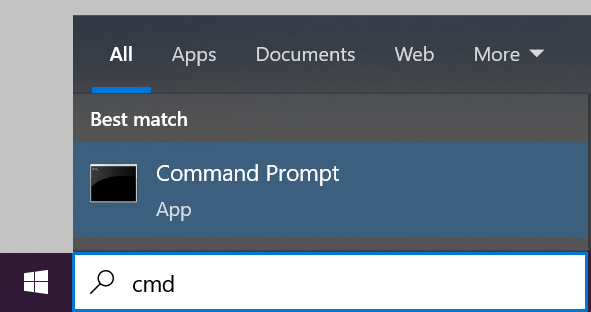
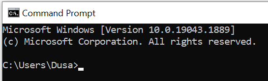
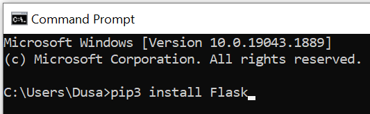
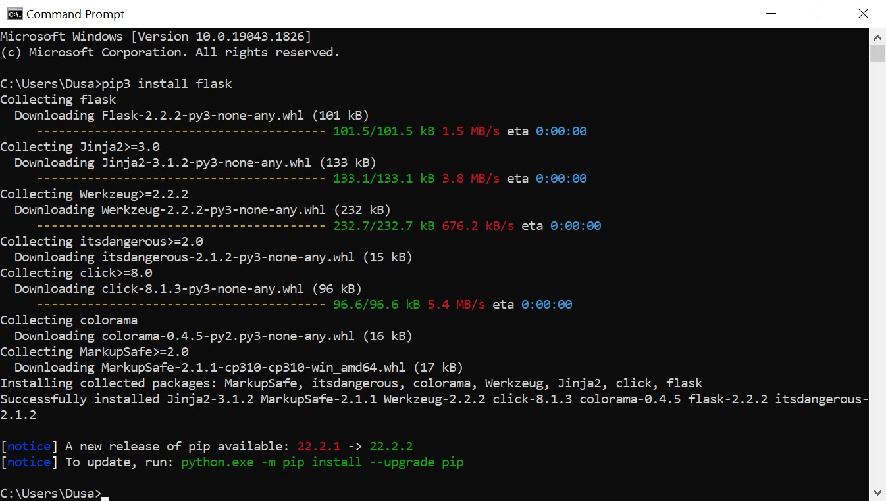
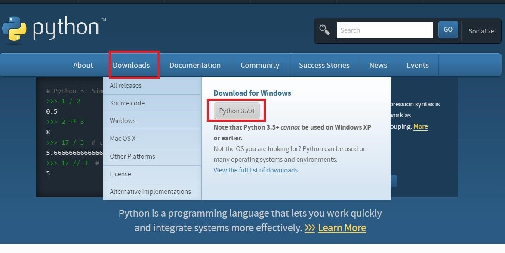
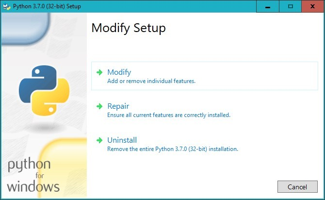
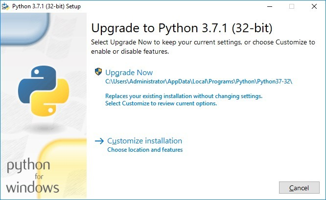
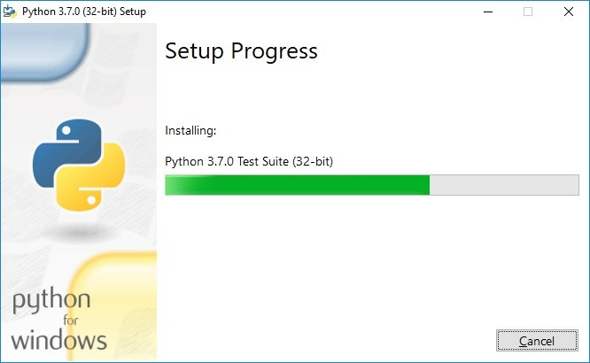
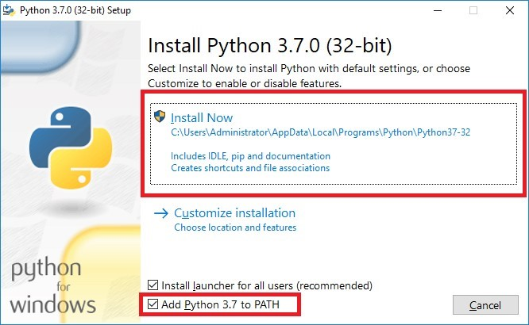

Библиотека Flask
================

**Flask** (https://flask.palletsprojects.com/) је библиотека
програмског језика Python намењена креирању веб-апликација. Постоје и
друге библиотеке овог језика, нпр. веома популарна је библиотека
**Django** - https://www.djangoproject.com/. Међутим, Flask је
библиотека која је писана тако да је веома једноставна за коришћење и
самим тим погодна за почетнике.

У овом поглављу ћемо приказати неке основне функционалности које нам
библиотека Flask нуди, пре него што у наставку пређемо на опис развоја
неколико комплетних веб-апликација.

Инсталација
-----------

Инсталација библиотеке Flask је веома једноставна и врши се помоћу подразумеваног механизма 
за инсталацију пакета у програмском језику Python (користи се алатка која се назива ``pip`` (PyPI - Python Package Installer)). 
Покренути командну линију. Најлакше је унети ``cmd`` у претрагу рачунара.

 
Отвориће се командни прозор.  

   
Под претпоставком да је на рачунару инсталирана подршка за програмски језик Python 3, 
довољно је у командној линији унети следећу команду и сачекати да се Flask инсталира.

::

 pip3 install Flask
 

На следећој слици може да се види како изгледа покренут и успешно спроведен:

Уколико на рачунару није инсталиран програмски језик Python, прво њега инсталирати према упутству које следи, 
па се вратити на инсталацију библиотеке Flask. 

Инсталација језика Python
-------------------------

Текст који следи је део упутства које је доступно у материјалима за други разред:
https://petljamediastorage.blob.core.windows.net/root/Media/Default/Help/Uputstvo%20Python%20pygame.pdf 

Да бисте инсталирали Python прво је потребно да одете на сајт https://www.python.org/ на коме ћете наћи 
актуелну верзију језика Python. Идите на секцију Downloads и ту кликните на дугме на коме ће бити актуелена 
верзија језика Python (у овом случају верзија „Python 3.7.0“) да бисте започели са преузимањем инсталационог 
програма за Windows, као на слици испод.

У тренутку писања упутства за инсталацију актуелна верзија језика Python је била 3.7.1, а вама може бити 
понуђена нека новија верзија која је у међувремену објављена и препоручујемо да у сваком случају инсталирате 
актуелну верзију која вам се нуди.  

Kада се преузимање заврши, потребно је покренути програм који сте управо преузели (на пример python-3.7.1.exe). 
То ће покренути инсталацију језика Python. Уколико се затим отвори прозор у коме пише ``Modify Setup`` то значи да је 
Python већ инсталиран и тада можете да прекинете нову инсталацију кликом на дугме ``Close`` и користите већ инсталиран Python.

Ако већ имате инсталирану верзију језика Python која има прва два броја иста као и актуелна верзија 
(на пример имате инсталирану верзију 3.7.0 а актуелна верзија је 3.7.1), инсталациони прозор ће вам понудити да унапредите 
верзију језика Python. Потребно је да кликнете на дугме ``Upgrade Now`` као на слици испод.

   
Уколико немате већ инсталирану актуелну верзију језика Python, онда ће вам се појавити прозор у коме пише ``Setup Python…``. 
У том прозору штриклирајте опцију ``Add Python 3.7 to PATH`` и затим кликните на ``Install Now`` као на слици испод.

Након тога треба да сачекате да се заврши инсталација (тај процес изгледаће као на слици испод).

Ако је све у реду, на крају инсталације ће се појавити порука да је инсталација успешно обављена. 
Тада можете слободно затворити инсталацију кликом на дугме ``Close``.  