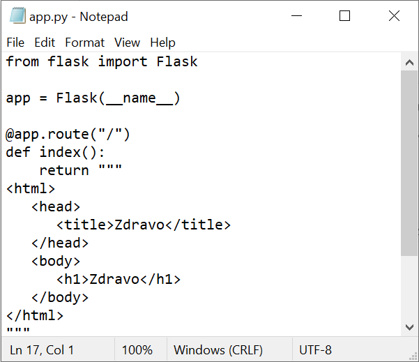
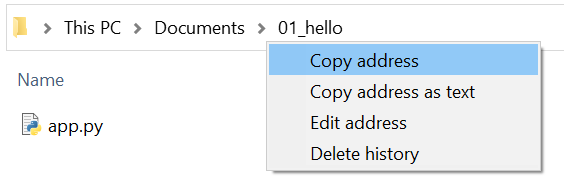
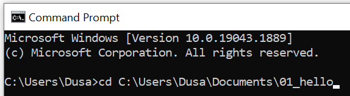
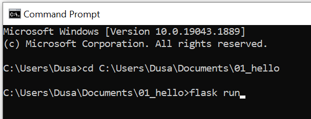
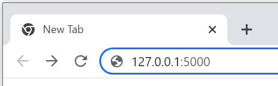
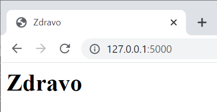
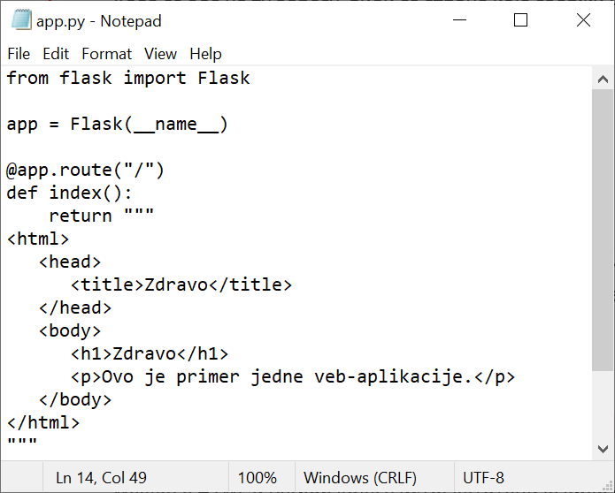
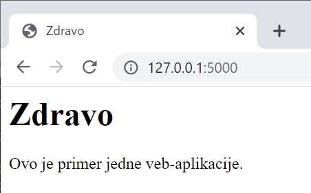
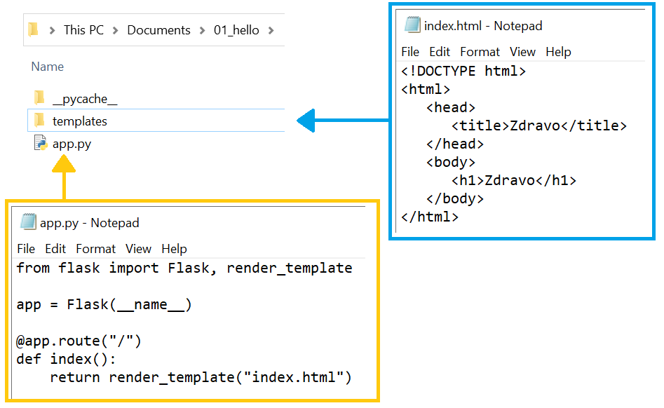

Шаблони
-------

Веб-апликације као одговор најчешће шаљу HTML стране. Навођење иоле
дужег HTML-а у оквиру ниски директно у изворном кôду програмског
језика је непрегледно и тешко за одржавање.  Стога већина програмских
библиотека за писање веб-апликација омогућава да делови HTML кôда
смештају у посебне датотеке (тзв. **шаблоне**).

Неки од примера који следе су јако обимни. Имајте у виду да, када правите овакве веб-апликације, 
не морате да пишете комплетан програмски кôд од почетка. Препоручена пракса је да узмете већ 
припремљене примере програмског кôда и да га прилагодите на начин на који вам је потребно. 

Приметимо да у претходним примерима одговор који је наша веб
апликација послала клијенту не представља исправан HTML запис, већ
обичан текст. Стога функцију ``index`` можемо проширити тако да врати
праву HTML страну.

.. literalinclude:: /../_src/02_hello_html/app.py
    :language: python

Можемо да изменимо програмски кôд већ креиране апликације. 
Фајл који смо креирали у претходној лекцији, морамо поново да отворимо у едитору текста:
- отворимо едитор ``Notepad``, 
- изаберемо са менија ``File/Open`` и,
- пронађемо фајл (обавезно изабрати ``All Files`` и ``Encoding/UTF-8``).

Изменимо садржај фајла и сачувамо измене. 

   
Као што смо већ рекли, да бисмо имали тачну путању до фајла која нам је неопходна да покренемо програм, 
можемо да употребимо опцију Copy ``adress`` када урадимо десни клик мишем у прозору ``File Explorer``. 
   
   

   
Након тога, у командној линији се постављамо у директоријум у коме смо креирали датотеку ``app.py`` тако што напишемо 
следеће:    

::

 cd naziv_fajla_sa_putanjom

На пример:

Покрећемо Flask апликацију командом ``flask run``.  
   

Ако је све у реду, добићемо одговарајућу поруку и можемо да у адресну линију прегледача унесемо 
управо адресу ``http://127.0.0.1:5000/``. (довољно је само унети бројеве који чине адресу).   
   

Када се оде на ту адресу, види се страна која садржи наслов првог нивоа ``Zdravo``.

У командној линији можемо прекинути веб-апликацију комбинацијом тастера ``Ctrl + C``.
Можемо да се вратимо на програмски кôд и, на пример, додамо и један пасус у HTML део тако што ћемо испод елемента 
за наслов додати следеће:

::

     
Ovo je primer jedne veb-aplikacije.

	 
Измењен програмски кôд може да се види на следећој слици: 

    
Након што сачувамо измене, вратимо се у командну линију и поново покренемо Flask апликацију командом ``flask run``. 
 

Приметимо да смо ниску која садржи HTML кôд навели између наводника
облика ``"""..."""`` уместо између наводника облика ``"..."`` или
``'...'``, чиме је омогућено да се ниска простире кроз више редова.

Мешање HTML и Python кода у истој датотеци је врло непрактично. Стога
библиотека ``Flask`` користи библиотеку ``Jinja``
(https://jinja.palletsprojects.com/), која омогућава да се HTML кôд
држи одвојено у тзв. **шаблонима** (енгл. **templates**) и да Python
програм коришћењем тих шаблона једноставно креира HTML стране које ће
се слати као одговор клијенту. Библиотека ``Flask`` подразумева да се
сви шаблони чувају у фолдеру ``templates``.  Претходни програм
се може прилагодити на следећи начин. Нашу апликацију ће чинити два
фајла: фајл``app.py`` у кореном директоријуму апликације и
шаблон ``index.html`` који се налази у његовом поддиректоријуму
``templates``.

::
   
    .
    ├── app.py
    └── templates
        └── index.html

У том случају би фајл ``app.py`` имао следећи садржај:

.. literalinclude:: /../_src/03_hello_template/app.py
    :language: python

Са друге стране фајл ``templates/index.html`` има садржај:

.. literalinclude:: /../_src/03_hello_template/templates/index.html
    :language: html+jinja

Фајл ``templates/index.html`` се креира у едитору текста Notepad, као што смо креирали и статичке веб-стране. 
  

У самом фолдеру ће се можда аутоматски појавити још неки поддиректоријум након покретања апликације. 

Анализирајмо сада програмски кôд. 

   
У функцији ``index`` која ће одговарати на HTTP захтев, позивамо
функцију ``render_template`` библиотеке ``Flask`` (да би могла да буде
позвана, потребно је да буде претходно увезена, тј. наведена у склопу
директиве ``import``). Функција ``render_template`` је та која чита
садржај шаблона (у овом случају из датотеке ``index.html``), обрађује
шаблон и враћа резултујућу ниску.

Шаблони и шаблонске директиве
.............................

Иако је у претходном примеру садржај шаблона враћен у свом
оригиналном, неизмењеном облику, онакав какав је и написан, основно
богатство механизма шаблона долази кроз то да се функцијом
``render_template`` шаблони могу обрађивати. Наиме, шаблони могу да
садрже директиве на специјализованом језику, који доста подсећа на
програмски језик Python, на основу којих се зна како да се подаци који
се додатно проследе функцији ``render_template`` интегришу у садржај
HTML стране. Прикажимо ово на једном једноставном примеру. Поново ћемо
претпоставити да се апликација састоји од датотеке ``app.py`` у
кореном директоријуму и датотеке ``index.html`` у његовом
поддиректоријуму ``templates``.

Датотека ``app.py`` има следећи садржај:

.. literalinclude:: /../_src/04_hello_template_params/app.py
    :language: python

Приметимо да се функцији ``render_template`` након обавезног, првог
аргумента који представља назив датотеке шаблона, прослеђују и два
додатна именована аргумента: први је ``naslov``, коме је придружена
ниска ``Predmeti``, а други је ``spisak``, коме је придружена листа
која садржи 4 наслова предмета.

Погледајмо садржај датотеке ``templates/index.html``.

.. literalinclude:: /../_src/04_hello_template_params/templates/index.html
    :language: html+jinja
                 
Приметимо да елемент ``h1`` не садржи конкретан текст наслова, већ је
у елементу наведено ``{{ naslov }}``. То значи да приликом обраде
шаблона, функција ``render_template`` треба да тај садржај замени
вредношћу именованог аргумента ``naslov``, који јој је прослеђен
приликом позива (у овом примеру то ће бити ниска
``Predmeti``). Генерално, када се између заграда ``{{`` и ``}}``
пронађе неки Python израз, он се мења својом вредношћу. Нагласимо да
ови изрази ипак не могу да садрже позиве произвољних Python операција
и функција, већ само неких основних. Ипак, постоји начин да се омогући
коришћење и функција које нису аутоматски подржане, али то излази из
оквира овог курса.

Још интересантније, из овог примера се може видети да шаблони могу да
садрже и наредбе контроле тока, попут правих програмских језика (у
овом примеру, то су петља ``for`` и наредба гранања ``if``, а
допуштене су још неке наредбе).

Наредбом ```` се проверава да ли је приликом позива
функције ``render_template`` наведена вредност променљиве
``naslov``. Ако јесте, тада се тај наслов приказују у склопу елемента
``h1`` (а ако није, елемент ``h1`` се просто изоставља).

Унутар елемента ``ul``, креирана је петља ``for`` која пролази кроз
елементе листе ``spisak`` (подсетимо се, у позиву функције
``render_template`` прослеђен је списак 4 предмета) и сваки од њих
приказује у склопу HTML елемента ``li`` (садржај елемента ``li`` је
``{{ stavka }}``, што значи да се у сваком кораку петље као садржај
елемента ``li`` уписује текућа вредност променљиве
``stavka``). Приметимо да синтакса наредбе гранања и синтакса петље
подсећа на програмски језик Python, али да није потпуно идентична (на
пример, на крају петље ``for`` није потребно ставити двотачку,
назубљивање се не користи да би се одредило тело петље, али се зато,
на крају петље мора навести ``endfor``).

Након обраде шаблона ``index.html``, на основу вредности наведених у
позиву, функција ``render_template`` производи следећи HTML садржај
који се затим прослеђује клијенту (прегледачу веба) и приказује.

.. code-block:: html

   <!doctype HTML>
   <html>
   <head>
      <meta charset="utf-8" />
      <title>Jinja šabloni</title>
   </head>
   <body>
     <h1>Predmeti</h1>
     <ul>
         <li>Matematika</li>
         <li>Srpski jezik</li>
         <li>Informatika</li>
         <li>Fizika</li>
     </ul>
   </body>
   </html>

На слици је приказан изглед стране унутар прегледача веба:
   

   
Наравно, у реалним апликацијама подаци који се прослеђују функцији
``render_template`` се обично читају из база података (иако је могуће
навести конкретне податке, попут листе предмета у претходном примеру,
то се не ради често).

Вежба -- списак ученика
***********************

Вежбе ради, дефинишимо још једну једноставну апликацију која на основу
листе парова ``(ime, prezime)`` гради и приказује табелу која садржи
имена и презимена.

Подсетимо се како се у језику HTML креира табела. **Табела** је сложени HTML елемент, који садржи више других 
елемената различитих врста. HTML елементи садржани у табели представљају различите делове табеле:

- Цела табела је окружена ознакама ``<table>`` и ``</table>``. Унутар табеле се налазе редови.

::

 <table>
 </table>

- Сваки ред је окружен таговима ``<tr>`` и ``</tr>`` (енгл. *table row*) и у њему се налазе ћелије колона табеле.
- Први ред садржи ћелије заглавља табеле (енгл. *table heading*), где се текст налази између ознака ``<th>`` и ``</th>`` (енгл. *table heading*) и мало je подебљан у односу на текст у осталим ћелијама.

::

    <tr>
        <th>Naziv1</th><th>Naziv2</th><th>Naziv3</th>
    <tr>

- Унутар тела табеле, редови имају ћелије табеле окружене ознакама ``<td>`` и ``</td>`` (енгл. *table data*).

::

    <tr>
        <td>Podatak1</td><td>Podatak2</td><td>Podatak3</td>
    </tr>

Датотека ``app.py`` има следећи садржај:

.. literalinclude:: /../_src/04b_hello_template_params/app.py
    :language: python

Шаблон смо овај пут сместили у датотеку ``templates/ucenici.html``.

.. literalinclude:: /../_src/04b_hello_template_params/templates/ucenici.html
    :language: html+jinja

Уместо парова, ученике можемо представити речницима.

Датотека ``app.py`` има следећи садржај:

.. literalinclude:: /../_src/04c_hello_template_params/app.py
    :language: python

Шаблон ``templates/ucenici.html`` има следећи садржај:

.. literalinclude:: /../_src/04c_hello_template_params/templates/ucenici.html
    :language: html+jinja

На слици је приказан изглед стране унутар прегледача веба.

.. figure:: ../../_images/flask_03_spisak_ucenika.png
   :align: center
   :width: 500
   :alt: Апликација покренута у прегледачу веба

Вежба -- таблица множења
************************
         
С обзиром на то да подржавају петље и израчунавање вредности израза,
шаблони се могу користити као програми. На пример, наредна
веб-апликација помоћу угнежђених петљи приказује таблицу множења
бројева од 1 до 10 (наравно, исти ефекат се може постићи и клијентским
скриптом написаним у програмском језику JavaScript).

Функција која обрађује HTTP захтев (дефинисана у датотеци ``app.py``)
је веома једноставна (позива функцију ``render_template``,
прослеђујући димензију таблице ``n=10``).

.. literalinclude:: /../_src/09_tablica_mnozenja/app.py
    :language: python
    :lines: 5-

Скоро целокупна функционалност апликације је испрограмирана унутар шаблона.

.. literalinclude:: /../_src/09_tablica_mnozenja/templates/tablica.html
    :language: html+jinja

У спољашњој петљи се набраја једна по једна врста таблице, а у
унутрашњој једна по једна колона. У телу унутрашње петље су познати
бројеви ``i`` и ``j`` које треба помножити, тако да се креира нова
ћелија табеле (елемент ``td``) и у њу се уписује вредност израза
``i*j``.

На слици је приказан изглед стране унутар прегледача веба.
   

Наравно, исту функционалност је било могуће постићи и без коришћења
шаблона, у чистом Python-у, међутим, такав програм је доста мање
елегантан, па овакав приступ нећемо убудуће користити.

.. literalinclude:: /../_src/09a_tablica_mnozenja/app.py
    :language: python
    :lines: 5-

Наслеђивање шаблона
...................

Веб-апликације се често састоје од више страна (свака се налази на
посебној путањи, тј. приступа јој се на основу посебног URL-а). Пошто
стране настају на основу шаблона, природно је да свака таква страна
има свој шаблон. На пример, можемо дефинисати стране ``home`` и
``about``.

Датотека ``app.py`` има следећи садржај:

.. literalinclude:: /../_src/10_template_inherit/app.py
    :language: python

Шаблон ``templates/home.html`` има следећи садржај:
               
.. literalinclude:: /../_src/10_template_inherit/templates/home.html
    :language: html+jinja

Шаблон ``templates/about.html`` има следећи садржај:
               
.. literalinclude:: /../_src/10_template_inherit/templates/about.html
    :language: html+jinja

Наравно, испод наслова ``Home`` и ``About`` треба да буде попуњен и
текст који се приказује на тим странама, али је то у овом примеру,
једноставности ради, прескочено.
               
Примећујемо велико преклапање између два шаблона, што је непожељно. 
Ствар је погоршана (тј. преклапање је повећано) тиме што се користи 
библиотека Bootstrap, тако да се и у једном и у
другом шаблону укључују елементи те библиотеке.
               
Ствар можемо прилично поправити ако заједничке делове две html
датотеке (тј. шаблона) издвојимо у посебну датотеку ``index.html``.

.. literalinclude:: /../_src/10a_template_inherit/templates/index.html
    :language: html+jinja

На месту које се разликује дефинишемо **блок**, коришћењем директиве
````. Блоку можемо дати назив какав желимо (у овом
примеру смо му дали назив ``content``). У датотеци која садржи
заједнички кôд блок ће бити празан и у свакој датотеци која дели тај
заједнички кôд, садржај тог блока ће бити дефинисан засебно, на начин
специфичан за ту датотеку.

Шаблон ``templates/home.html`` сада може да има само следећи садржај:

.. literalinclude:: /../_src/10a_template_inherit/templates/home.html
    :language: html+jinja

Шаблон ``templates/about.html`` сада може да има следећи садржај:
               
.. literalinclude:: /../_src/10a_template_inherit/templates/about.html
    :language: html+jinja

Текст који би се приказивао на овим странама би сада био уписан у ова
два шаблона.
               
Директивом ```` постижемо то да ова два
шаблона **наслеђују** изворни кôд из шаблонске датотеке
``index.html``, при чему само дефинишу садржај блока (или више
блокова) који су у тој датотеци уведени. У нашем случају то је блок
под називом ``content``.

Наслеђивање шаблона је важна техника, јер омогућава да се садржај
заједнички за цео сајт или неколико његових страна наведе и одржава
само једном (у то обично спада укључивање CSS и JS датотека, заглавље
и подножје страна са логотипом, менијем за навигацију и слично).

.. questionnote::

   Допуни шаблон који генерише таблицу множења тако да се генеришу и
   врста и колона заглавља у којима се приказују бројеви који се
   множе.
   
.. questionnote::

   Дефинисати веб-апликацију у којој се у табели приказују квадрати
   свих природних бројева од 1 до 20. Користити шаблон у ком се у
   петљи набрајају сви бројеви и њихови квадрати се аутоматски
   израчунавају и приказују. Покушај да поред квадрата прикажеш и
   квадратне корене. Покушај да на интернету пронађеш како можеш да у
   шаблонима користиш математичке функције попут ``math.sqrt``
   (погледај Flask документацију за ``@app.context_processor``).
   
.. mchoice:: 02_flask_sabloni_1
   :answer_a: templates
   :answer_b: sabloni
   :answer_c: app.py
   :answer_d: index.html
   :correct: a

   У склопу Flask апликације шаблони се чувају у директоријуму:

.. mchoice:: 02_flask_sabloni_2
   :answer_a: У шаблону на жељеном месту навести
              pera123.
   :answer_b: Функцију render_template позвати помоћу
              render_template("index.html", username="pera123"), а
              у шаблону на жељеном месту навести {{ username
              }}.
   :answer_c: Функцију render_template позвати помоћу
              render_template("index.html", username), где је
              username променљива која садржи корисничко име, а
              у шаблону на жељеном месту навести {{ username
              }}.
   :answer_d: У шаблону, на жељеном месту навести {{ username }}.
   :correct: b

   Веб-страна треба да приказује корисничко име тренутно улогованог
   корисника. Како то постићи коришћењем шаблона?
   
.. mchoice:: 02_flask_sabloni_3
   :answer_a: {{ ... }}
   :answer_b: 
   :answer_c: {- ... -}
   :answer_d: {@ ... @}
   :correct: b

   Које се заграде у Jinja шаблонима користе за навођење наредби
   (``for``, ``if``, ...) ?

.. mchoice:: 02_flask_sabloni_4
   :answer_a: {{ ... }}
   :answer_b: 
   :answer_c: {- ... -}
   :answer_d: {@ ... @}
   :correct: a

   Које се заграде у Jinja шаблонима користе за навођење променљивих
   које се приликом обраде шаблона мењају својим вредностима?

