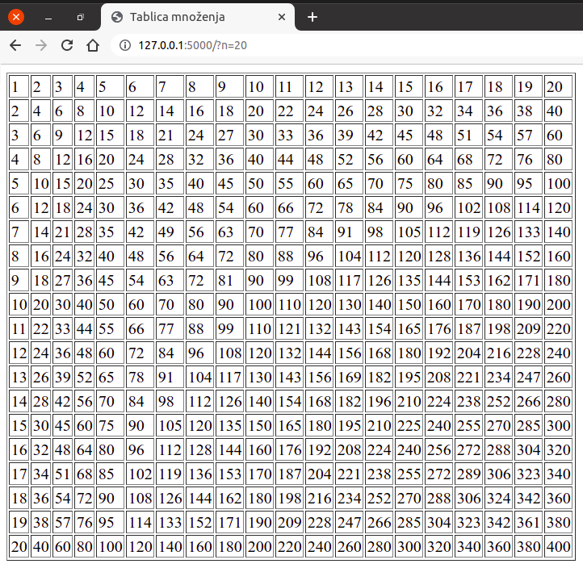
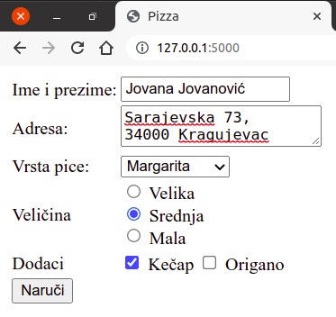

Прослеђивање података серверској апликацији
-------------------------------------------

Веб-апликације стално примају податке од својих корисника. На пример,
приликом логовања на систем корисник уноси и шаље своје корисничко име
и лозинку, који се онда проверавају на серверу и у зависности од
резултата провере кориснику се допушта или ускраћује приступ
веб-апликацији. Приликом претраге веб-сајта, параметри претраге се
такође прослеђују серверској веб-апликацији (на пример, приликом
претраге електронске веб-продавнице, клијент бира врсту производа и
распон цена и те податке шаље на сервер). Дакле, у различитим
ситуацијама корисник уноси одређене податке у формулар који се налази
на веб-страни и након попуњавања формулара на веб-страни, ти подаци се
преносе веб-апликацији која их онда обрађује (на пример, складишти у
базу података).

Постоји више различитих начина да се серверској апликацији доставе
подаци и сви се, заправо, заснивају на томе да се на неки начин ти
подаци проследе у склопу HTTP захтева. Протокол HTTP подразумева два
основна метода за прослеђивање података у склопу захтева: **GET** и
**POST**. Метода GET је на неки начин елементарнија, јер се користи и
приликом свих захтева за странама у којима се не преносе никакви
подаци (на пример, када отворите страну ``http://petlja.org``, ваш
прегледач шаље GET захтев серверу ``petlja.org`` тражећи његову
почетну страну, при чему не шаље никакве додатне податке).

Нагласимо да су методе GET и POST дефинисане протоколом комуникације
HTTP и самим тим нису ни по чему специфичне за програмски језик Python
и библиотеку Flask (тај начин комуникације користе све веб-апликације,
без обзира на технологију у којој су имплементиране).

**Ко жели да зна више?** Протокол HTTP дефинише и друге методе, које
се користе ређе него GET и POST (то су PUT, DELETE и PATCH).

Метода GET
**********

Метода **GET** подразумева да су подаци које клијент прослеђује
серверу саставни део URL-a. На пример, URL може бити облика

``http://www.moja-prodavnica.com?vrsta=TV&max_cena=30000``

и тада се у склопу HTTP захтева клијенту прослеђују два податка
(такозвана **URL параметра** или **GET параметра**):

- први се назива ``vrsta`` и има вредност ``TV`` (претражују се
  телевизори),
- други се назива ``max_cena`` и има вредност ``30000`` (претражују се
  производи који нису скупљи од 30 хиљада динара).

Дакле, метода GET подразумева да се подаци наводе на крају URL-а иза
упитника (карактера ``?``), облика су ``naziv=vrednost`` и раздвајају
се амперсандима (карактерима ``&``). Подаци су задати у форми речника
(назив податка тј. кључ се пресликава у сам податак тј. у вредност). И
кључеви и вредности у таквом речнику се тумаче као текст тј. као ниске
карактера. Ако кључ или вредност садржи неки специјални карактер, он
се кодира и записује нумерички. На пример, пошто URL-ови не могу
садржати размаке, сви размаци се представљају помоћу ``%20`` (наиме,
ASCII тј. Unicode кôд размака је 32, што се хексадекадно записује као
20). Тако се путем URL-а
``http://www.naucnici.com/naucnik=Nikola%20Tesla`` преноси податак
(кључ) ``naucnik`` чија је вредност ниска ``Nikola Tesla``.

Метода GET се користи када је потребно пренети малу количину података
(дужина URL-а је ограничена на највише око 2000 карактера) и када
подаци који се преносе нису тајни (лозинке се, на пример, никада не
преносе методом GET). Погодност механизма GET је то што је URL који
садржи прослеђене податке могуће упамтити (на пример, међу омиљеним
локацијама, као *bookmark*), поделити са другима (на пример, мејлом
или друштвеним мрежама), направити везу (линк) на другој веб-страни,
такве веб-стране се могу појавити међу резултатима претраге
претраживача веба и слично.

Опишимо сада како Flask скрипт може да приступи GET параметрима. За то
се користи објекат ``request`` библиотеке Flask (који је, такође,
потребно навести у склопу директиве ``import``). Методом
``request.args.get(...)`` скрипт може прочитати вредност на основу
задатог назива параметра (уместо параметара понекад се користи и
термин аргументи, па се објекат који их садржи назива
``request.args``). Размотримо наредни пример, који садржи основну
функционалност која би се употребила у склопу претраге производа у
некој електронској веб-продавници.

Датотека ``app.py`` има следећи садржај:

.. literalinclude:: /../_src/06_hello_request/app.py
    :language: python

Очекује се да се методом GET скрипту проследе две вредности:

- ``vrsta`` означава врсту производа који се претражују,
- ``max_cena`` означава њихову највишу допуштену цену.

Пошто је могуће да се скрипт позове и без навођења параметара, у
скрипту се претпостављају њихове подразумеване вредности. Наиме,
метода ``request.args.get`` се најчешће позива два аргумента.

- Први представља назив GET параметра
- Други представља подразумевану вредност за случај да GET параметар
  није наведен. Ако се други аргумент изостави, а податак није
  прослеђен, функција ће вратити вредност ``None``.

Тако ће у случају коришћења URL-а
``http://127.0.0.1/pretraga&vrsta=TV`` вредност Python променљиве
``vrsta`` бити ``TV``, док ће у случају URL-а
``http://127.0.0.1/pretraga`` вредност те променљиве бити
``svi_proizvodi``. Ако променљива ``max_cena`` није прослеђена у
склопу GET захтева (као параметар), променљива ``max_cena`` у скрипту
ће имати вредност бесконачно (у језику Python она је наведена помоћу
израза ``float("inf")`` и то је број који ће бити већи од било ког
другог броја, при чему је додатно наглашено да се променљивој max_cena
додели вредност типа ``float``).

Шаблон ``templates/search.html`` је веома једноставан и само приказује
прочитане податке (наравно, у реалној веб-апликацији би се на основу
ових вредности извршила претрага производа из базе, па би се онда
шаблон дефинисао тако да се прикажу подаци о свим тим производима).

.. literalinclude:: /../_src/06_hello_request/templates/search.html
    :language: html+jinja

Неколико речи о сигурности. Не постоји гаранција да су сви подаци које
нека веб-апликација прими (у склопу HTTP захтева) подаци поуздани и
безбедни за употребу.  На пример, злонамерни корисник као вредност
променљиве ``vrsta`` може да проследи ниску облика
````, где је уместо ``...`` наведен неки
злонамерни скрипт у језику JavaScript. На срећу, функција
``render_template`` је тако испрограмирана да пре употребе и приказа
све податке преведе у облик безбедан за коришћење (нпр. тако што ће се
карактери ``<`` и ``>`` заменити са ``&lt;`` и ``&gt;``, чиме ће се
осигурати да се садржај исправно прикаже, а да се не изврши као
JavaScript скрипт). Ако се подаци пристигли у склопу захтева не
прослеђују функцији ``render_template``, тада је пожељно да се пре
коршћења трансформишу функцијом ``escape``, која је део пакета
``markupsafe``.

Вежба -- таблица множења
************************

Прилагодимо, вежбе ради, скрипт који исписује таблицу множења бројева
од 1 до 10 GET параметром који одређује димензију те таблице. Нека се
тај параметар назива ``n``. Ако се тај параметар не проследи,
подразумеваћемо да му је вредност 10. Тако се посетом URL-у
``http://127.0.0.1`` приказује таблица множења бројева од 1 до 10, а
URL-у ``http://127.0.0.1?n=20`` приказује таблица множења бројева од 1
до 20.

.. literalinclude:: /../_src/09b_tablica_mnozenja_get/app.py
    :language: python

Подсетимо се, шаблон који креира таблицу је дефинисан на следећи
начин.

.. literalinclude:: /../_src/09b_tablica_mnozenja_get/templates/tablica.html
    :language: html+jinja

Скренимо пажњу на један важан детаљ у претходном скрипту. Наиме,
унутар шаблона се подразумева да је променљива ``n`` целобројна (јер
се користи у петљи облика ``for i in range(1, n+1)``). Због тога је у
позиву ``request.args.get`` наведен и трећи аргумент ``int``, којим се
наглашава да се вредност GET параметра ``n`` конвертује у целобројну
вредност. Ако се други аргумент методе ``request.args.get``
(подразумевана вредност) изостави, тада је трећи аргумент потребно
наводити у облику именованог аргумента ``type``, а не позиционог
аргумента (нпр. позив би могао бити ``request.args.get("n",
type=int)``).
               
На слици је приказан изглед стране унутар прегледача веба.

Пренос података из формулара
****************************

Пренос података са клијента на сервер је често у веома тесној вези са
формуларима унутар веб-стране. Подсетимо се, формулари се дефинишу
коришћњем језика HTML. Формулар може да садржи разне врсте контрола
графичког корисничког интерфејса (поља за унос текста, радио-дугмад,
поља за штриклирање, падајуће листе и слично). Формулари често садрже
и дугме специјалног типа ``submit``. Када се кликне на такво дугме,
сви подаци који су унети у формулар се прикупљају, пакују у GET или
POST захтев и тај захтев се шаље серверу. Врста захтева која ће бити
употребљена зависи од тога како је формулар подешен тј. да ли је и на
коју је вредност постављена вредност атрибута ``method`` елемента
``form``. Помоћу атрибута ``action`` се може подесити и веб-страна
тј. URL адреса на коју се захтев шаље (ако се овај атрибут не наведе,
захтев се шаље ка страни која је тренутно отворена).

У следећем једноставном примеру користимо формулар у који корисник у
два поља за унос текста треба да унесе два броја. Унети бројеви се
шаљу на сервер, на серверу се сабирају и кориснику се враћа веб-страна
на којој се приказује збир, али и формулар у који може да унесе нова
два броја. Наравно, овако једноставну апликацију је много боље
реализовати као чисто клијентску апликацију (у језику JavaScript),
међутим, технике програмирања које сада упознајемо ћемо користити
касније, у напреднијим серверским веб-апликацијама.

Датотека ``app.py`` има следећи садржај:

.. literalinclude:: /../_src/07_calculator_request/app.py
    :language: python

Дефинише се путања ``/calculator``, што значи да страни на локалном
рачунару приступамо путем URL-а
``http://127.0.0.1/calculator``. Унутар функције ``calculator`` која
се тада покреће покушавамо да прочитамо вредности GET параметара
``sab1`` и ``sab2`` (први и други сабирак). Ако оне нису дефинисане,
променљивама ``sab1`` и ``sab2`` се додељују празне ниске. Након тога
покушавамо да вредности конвертујемо у целе бројеве (подсетимо се,
подаци прочитани из захтева, било GET, било POST, увек су ниске
карактера) и да их саберемо. Ако то успе, променљива ``zbir`` ће
садржати вредност збира. Ако то не успе (јер ниске ``sab1`` и ``sab2``
не садрже исправно записане целобројне вредности), променљивој збир се
додељује специјална вредност ``None``, коју ћемо употребити као сигнал
да нешто није у реду. На овом месту је употребљен механизам **обраде
изузетака** (енгл. exception handling) програмског језика Python
(``try-except``) који ради тако што се покуша извршавање кода у блоку
``try``, а ако при том дође до неке грешке прелази се на извршавање
блока ``except``. На крају скрипта позивамо функцију
``render_template`` да на основу шаблона формира страну и тако
формирану страну враћамо клијенту.
                 
Шаблон ``templates/index.html`` је дефинисан на следећи начин:

.. literalinclude:: /../_src/07_calculator_request/templates/index.html
    :language: html+jinja

На почетку стране се налази формулар (елемент ``form``) за унос
сабирака. Пошто је код тог елемента изостављен атрибут ``method``,
подразумева се да ће се подаци преносити методом GET. Пошто је
изостављен и атрибут ``action``, кликом на дугме ``saberi`` (елемент
типа ``submit``) биће послат захтев за веб-страном која је тренутно
отворена (а то је страна повезана са путањом
``http://127.0.0.1/calculator``). Пошто формулар садржи два именована
елемента (то су два елемента ``input`` са атрибутима ``name="sab1"`` и
``name="sab2"``), вредности уписане у те елементе ће аутоматски бити
послате серверу као део GET захтева. Ако се у поља, на пример, упишу
вредности 3 и 5, тада ће након клика на дугме ``submit`` бити послат
захтев са URL-ом ``http://127.0.0.1/calculator?sab1=3&sab2=5``.

На слици је приказан изглед стране унутар прегледача веба.

.. image:: ../../_images/flask_07_calculator.png
   :align: center
   :width: 400
   :alt: Апликација покренута у прегледачу веба

Генерално, након клика на дугме ``submit``, прави се речник који
садржи податке облика ``name=value``, за све контроле на формулару
које имају постављене вредности атрибута ``name`` (а ``value`` је
вредност која је често аутоматски одређена оним што је корисник
унео). Код напреднијих контрола (листа за избор, радио дугмади и
слично), ово може бити мало другачије и коришћење таквих контрола ће
бити описано засебно.

На крају, скренимо пажњу на још један детаљ. Након клика на дугме
``submit``, шаље се нови захтев и веб-страна се поново приказује, што
би довело до тога да се вредности које су биле унете у поља за унос
текста аутоматски обришу. Да би се то спречило, поља за унос текста
имају наведене атрибуте ``value`` који у овом случају служе за
навођење иницијалних вредности у пољима за унос текста. Те иницијалне
вредности су управо старе вредности тих поља, које су прослеђене као
део GET захтева, које су прихваћене и обрађене унутар функције
``calculator`` и које су до шаблона стигле у облику променљивих
``sab1`` и ``sab2``.

Након формулара, у шаблону се налази наредба ``if``, којом се
проверава да ли променљива ``zbir`` има вредност различиту од
специјалне вредности ``None``. Ако има, то значи да је збир успешно
израчунат и он се приказује у посебном пасусу (а ако нема, тај пасус
се једноставно изоставља).

Вежба -- наручивање пице
************************

Прикажимо још један пример слања и прихватања података преко формулара
и GET захтева. Дефинисаћемо формулар који корисник попуњава приликом
наручивања пице (претпоставимо да је он дефинисан унутар шаблона
``templates/formular.html``).

.. literalinclude:: /../_src/12_pica_form/templates/formular.html
    :language: html+jinja

На слици је приказан изглед попуњеног формулара унутар прегледача веба.

               
Скренимо пажњу на употребу различитих врста контрола у овом формулару.

- Основна контрола је поље за унос текста (``input type="text"``).
- Контрола (HTML елемент) ``textarea`` се користи за унос веће
  количине текста.
- Контрола (HTML елемент) ``select`` се користи као падајућа
  листа. Појединачне ставке се наводе унутар HTML елемената
  ``option``. Прликом слања података комбинује се атрибут ``name``
  елемента ``select`` и атрибут ``value`` одабраног елемента
  ``option``.
- Радио-дугмад се реализују помоћу контрола ``input type="radio"``.
  Сва дугмад која има исту вредност атрибута ``name`` су повезана
  (када се једно дугме укључи, остала дугмад се искључе). Свако дугме
  има свој атрибут ``value`` и приликом слања података комбинују се
  вредност атрибута ``name`` и ``value`` укљученог дугмета. Дугме које
  има постављен атрибут ``checked`` је иницијално одабрано.
- Поља за штриклирање се реализују помоћу контрола ``input
  type="checkbox"``. Ако је поље штриклирано, приликом слања података
  комбинују се његови атрибути ``name`` и ``value``. Ако атрибут
  ``value`` није наведен, подразумева се вредност ``on``.

Поред ових, постоје и друге контроле које се могу користити унутар
HTML формулара, али ми их нећемо користити.
  
Апликација (дефинисана у датотеци ``app.py``) прима податке из
формулара који јој се шаљу преко GET захтева и затим их шаље функцији
``render_template`` која их на основу шаблона ``narudzbenica.html``
табеларно приказује. Пошто се и иницијални GET захтев за формуларом
који треба попунити и GET захтев који садржи поља наруджбенице шаљу ка
кореној путањи веб-сајта, унутар функције ``index`` проверавамо да ли
се унутар параметара захтева налази кључ ``naruci`` (то је име
дугмента ``input type="submit"``, па ће бити прослеђен као GET
параметар кад год се то дугме притисне). Очитавамо један по један
податак помоћу ``request.args.get``. Додатке (кечап, оригано итд.)
смештамо у листу.
               
.. literalinclude:: /../_src/12_pica_form/app.py
    :language: python

Шаблон ``templates/narudzbenica.html`` има следећи садржај:

.. literalinclude:: /../_src/12_pica_form/templates/narudzbenica.html
    :language: html+jinja

Сваки прослеђени податак се приказује у одговарајућој ћелији табеле.
Пошто су додаци смештени у листу, приказују се помоћу петље ``for``.
Изразом ``{{ ", " if not loop.last else "" }}`` се постиже да се зарез
дода иза сваке ставке, осим последње (израз ``loop.last`` има вредност
тачно само у последњој итерацији петље).

На слици је приказан изглед наруџбенице (извештаја о наруџбини) унутар
прегледача веба.

.. image:: ../../_images/flask_08b_pica_narudzbenica.png
   :align: center
   :width: 350
   :alt: Наруџбеница прикзана у прегледачу веба
