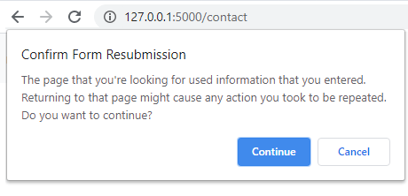

Метода POST
***********

За разлику од методе GET која користи садржај URL-a за уписивање
додатних података, метода **POST** користи тело HTTP захтева за слање
додатних података.

У лекцији о HTTP протоколу смо учили да HTTP одговор има тело одговора
које се од сервера према клијенту шаље након заглавља. На исти начин
клијент према серверу у HTTP захтеву иза заглавља може слати тело
захтева са произвољном количином додатних података. Код методе GET се
претпоставља да се не користи тело захтева.

На тај начин је методом POST могуће проследити много више података јер
URL има ограничену дужину (око 2000 карактера). При томе се подаци не
виде у URL-y, што може бити предност када поверљиви подаци (као на
пример лозинка) треба да буду што мање видљиви.

Поред наведеног, генерална препорука за избор између методе GET и POST
је да GET користимо када нешто узимамо са сервера и тиме не остављамо
трајне промене на серверу, док POST користимо када желимо да на север
пошаљемо податке са могућношћу да се тиме промени стање на страни
сервера. Када на страни сервера користимо базу података, упрошћено би
се могло рећи да обрада GET захтева чита из базе и приказује прочитане
податке у HTML страни, док обрада POST захтева уписује податке у бази.

Метода GET се дешава и када кликнемо на обичну везу (при чему у URL-у
могу бити "спаковани" GET параметри) а може се десити и као резултат
попуњавања формулара (када се поља из формулара аутоматски смештају у
GET параметре). Са друге стране метода POST се првенствено користи у
комбинацији са формуларима. У том случају је у формулару потребно
навести атрибут ``method="POST"``. На пример,

.. code-block:: html

   <form method="POST">
     ...
   </form>

Замислимо, на пример, формулар помоћу којег корисник шаље неку поруку
на форум или објаву на друштвену мрежу. У случају да се два пута
пошаље исти POST захтев, његова порука би два пута била објављена, што
сигурно није пожељно. Прегледачи зато аутоматски упозоравају кориснике
када командом ``Back`` ili ``Reload`` дођу у ситуацију да треба
поновити POST захтев који је раније већ био послат. На слици је пример
таквог упозорења:

Када форма предвиђа слање датотека као што су слике или документи,
онда обавезно користимо POST због величине података који се шаљу.
         
Резимирајмо основне разлике између GET и POST метода.

.. csv-table::
   :header:  "акција", "GET", "POST"
   :align: left

   "Поновно учитавање стране (*Back/Reload*)", "захтев се поново шаље", "прегледач упозорава на поновно слање захтева"
   "Обележавање омиљене стране (*Bookmark*)", "погодно за *bookmark*", "није погодно за *bookmark* због података који иду ван URL-a"
   "Прављење везе (*Link*)", "може се направити", "не може се направити линк који производи POST захтев"
   "Кеширање стране (*Cache*)", "прегледач може да кешира страну", "прегледач не може да кешира страну"
   "Историја посећених страна (*History*)", "параметри се памте у историји прегледача", "параметри се не памте у историји прегледача"
   "Видљивост параметара (*Visibility*)", "параметри су видљиви свима у склопу URL-а", "параметри нису видљиви у URL-у"
   "Дужина података (*Data length*)", "дужина података је ограничена", "дужина података није ограничена"
   "Тип податка (*Data type*)", "непосредно се шаљу текстуални подаци, а бинарни морају бити преведени у текстуалне", "бинарни подаци могу да се шаљу непосредно"

   
Када захтев стигне на сервер, Flask апликација која обрађује захтев
зна да ли је у питању GET или POST метода (променљива
``request.method`` одређује која је метода употребљена). За сваку
функцију која обрађује HTTP захтев који доспе на неку путању је могуће
подесити на које методе ће одговарати и то се ради приликом навођења
декоратора рутирања ``@app.route(...)``. Flask подразумева методу GET
код навођења декоратора рутирања. Ако желимо да функција прима POST
захтеве, онда је потребно да у аргументима декоратора то нагласимо. На
пример, наредним кодом се постиже да се функција ``login`` позива само
када се проследи HTTP POST захтев на путању ``/login`` (на пример, на
адресу ``http://127.0.0.1/login``).

.. code-block:: py

   @app.route("/login", methods=["POST"])
   def login():
       ...

Могуће је подесити и да се на некој путањи прихватају и GET и POST
захтеви (и по правилу функције које одговарају на POST захтеве
одговарају и на GET захтеве). На пример, наредним кодом се постиже да
се функција ``index`` позива када год се проследи било GET, било POST
захтев:

.. code-block:: py

   @app.route("/", methods=["GET", "POST"])
   def index():
       ...

Код оваквих функција је често потребно проверити о којој се врсти
захтева ради (да ли је пристигли захтев GET или POST), што је могуће
урадити испитивањем вредности ``request.method``. На пример,

.. code-block:: py

   @app.route("/login", methods=["GET", "POST"])
   def logovanje():
       if request.method == "POST":
          return uloguj_korisnika()
       else:
          return prikazi_formular_za_logovanje()

Подаци који стижу са формулара у склопу POST захтева се, као и код GET
захтева, могу посматрати као скуп параметара који имају називе и
вредности. Свако поље форме постаје један параметар. У функцијама за
обраду захтева тим параметрима приступамо помоћу
``request.form.get(...)`` слично као што користимо
``request.args.get(...)`` за параметре уписане у URL.
