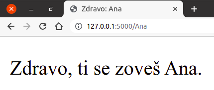

Путање са параметрима
*********************

У случају методе GET, видели смо како се подаци са клијента на сервер
преносе у склопу URL-а коришћењем GET параметара. Поред тих
"класичних" GET параметара, могуће је и да се сегменти путање у URL-у
користе као да су параметри.

На пример, URL за приказ одређеног производа уз коришћење 
класичних GET параметара би могао да изгледа

``http://www.moja-prodavnica.com/prikazi_proizvod?id=159``

а алтернативно решење би било да идентификатор производа стоји на
месту другог сегмента путање

``http://www.moja-prodavnica.com/prikazi_proizvod/159``

Рутирање у Flask-y даје могућност да путања у рути буде
параметризована, тако да једном дефиницијом руте обухватамо путање са
било којом вредношћу променљивог сегмента.

На пример, ако у декоратору рутирања наведемо путању облика
``"/<ime>"``, то значи да ће декорисана функција бити позвана када год
се наведе путања тог облика, при чему ће јој оно што следи иза косе
црте бити прослеђено као параметар. То је приказано у следећем
примеру.

.. literalinclude:: /../_src/05_hello_route_params/app.py
    :language: python

Ако се овом скрипту приступи преко URL-а ``http://127.0.0.1/Petar``,
биће позвана функција ``pozdravi("Petar")``, а ако се приступи преко
URL-а ``http://127.0.0.1/Ana``, биће позвана функција
``pozdravi("Ana")``. Податак о имену је, дакле, извучен из URL-а,
прослеђен функцији и надаље се слободно може користити. На пример,
можемо га проследити шаблону који садржи HTML опис стране која
поздравља корисника са тим именом.

.. literalinclude:: /../_src/05_hello_route_params/templates/index.html
    :language: html+jinja

На слици је приказан изглед стране унутар прегледача веба.
   

               
Да смо путању навели у облику ``"pozdravi/<ime>"``, поздравној страни
би се приступало преко URL-ова облика
``http://127.0.0.1/pozdravi/Petar``.

Могуће је и ограничити формат неког податка. На пример, ако желимо да
проследимо нумерички идентификатор производа, можемо у склопу путање
навести да прихватамо само целе бројеве тј. податке типа
``int``. Путања би тада могла бити
``"prikazi_proizvod/<int:id_proizvod>"``. Овим странама би се тада
приступало преко URL-а облика
``http://127.0.0.1/prikazi_proizvod/1234``
тј. ``http://www.moja-prodavnica.com/prikazi_proizvod/1234``, под
претпоставком да смо наш сајт поставили на интернет и повезали га са
доменом ``www.moja-prodavnica.com``.

Приметимо да овај начин прослеђивања података даје мало лепши облик
URL-ова него када се користе класични GET параметри, али није
практичан када имамо већи број параметара и посебно када су неки
опциони.

Такође, ако HTTP захтев долази из формулара, онда параметре са
подацима из формулара морамо да читамо са ``request.args.get(...)``
или ``request.form.get(...)`` (у зависности од тога да ли се користи
метода GET или POST).
