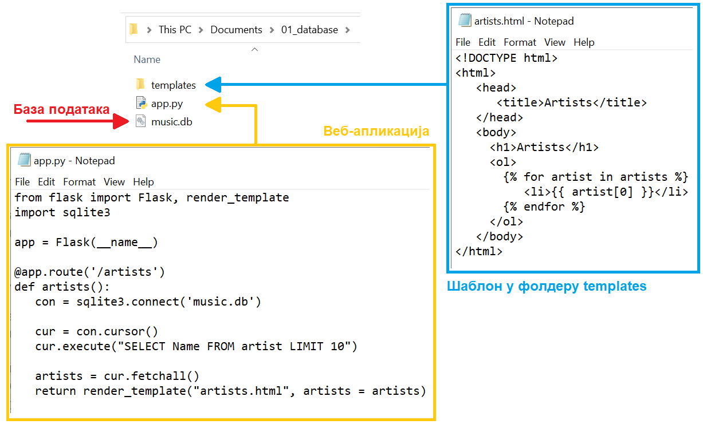
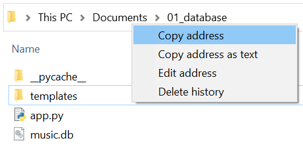
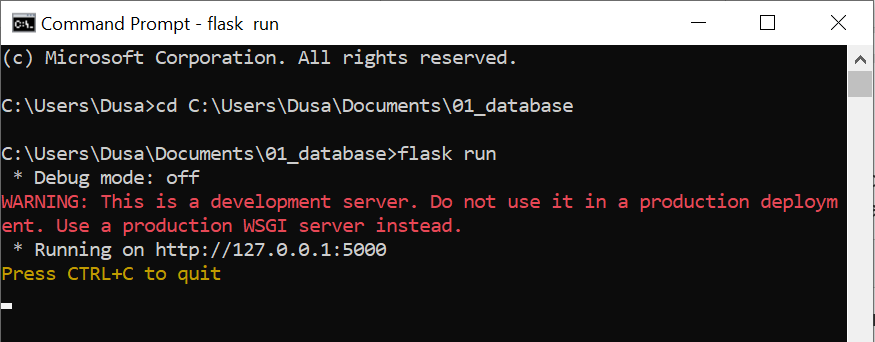
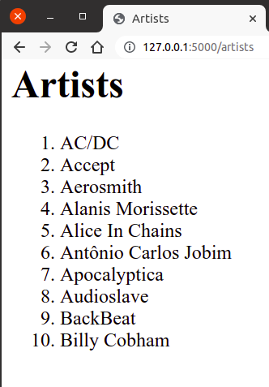
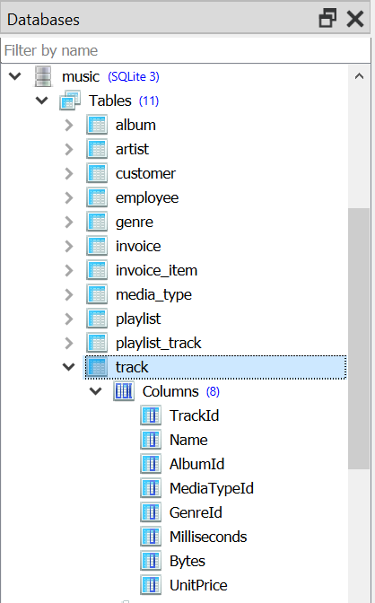

Коришћење база података из Flask апликација
===========================================

На самом почетку нашег рада са базама података, рекли смо да је један од начина интеракције са 
системом за управљање базама података (СУБП) управо апликативни интерфејс.
 
Сваки сајт за пуштање музике, свака онлајн продавница, електронски дневник, свака апликација на мобилном 
уређају путем које се плаћају рачуни и тако даље, користи неку базу података. Да би то било могуће, 
неопходно је да постоји начин интеракције са СУБП који ће се уградити у апликацију која се креира. 
Програмери, када из својих програма приступају базама података, користе  апликативни програмски интерфејс, 
**АПИ** (енгл. *application programming interface*). 

Да би наши програми преко АПИ-ја могли да приступају СУБП-у, обично је потребно да у програм укључимо посебан модул, 
односно програмску библиотеку која имплементира АПИ за приступ бази. 

Када је у питању програмски језик Python, већ у стандардној инсталацији програмског језика долази модул za 
SQLite који се зове ``sqlite3``, и то са уграђеним СУБП за SQLite. То значи да, ако програмирате у програмском језику 
Python, није потребно ништа додатно да инсталирате да бисте користили SQLite. Модул ``sqlite3`` имплементира стандардну 
спецификацију АПИ-ја за приступ бази која се зове DB-API 2.0, што значи да када научите као у Python-у да користите 
SQLite, на сличан начин ћете моћи да користите и друге релационе базе.

Унутар Python кôда веб-апликације (код једноставних апликација он се налази у датотеци ``app.py``) вршимо повезивање 
са базом података и читање података из базе, смештајући резултат упита у листу, која се затим прослеђује функцији 
``render_template``, при чему се у шаблону налази петља for која чита и приказује један по један податак из те листе 
(наравно, ситуација може бити једноставнија, ако је резултат упита само један податак).

.. suggestionnote::

   Неки од примера који следе су јако обимни. Имајте у виду да, када правите овакве веб-апликације, не морате да пишете комплетан програмски кôд од почетка. Препоручена пракса је да узмете већ припремљене примере програмског кôда и да га прилагодите на начин на који вам је потребно.

Повезивање са базом и постављање упита
--------------------------------------

Као што смо већ нагласили, свака иоле сложенија веб-апликација укључује неколико различитих фајлова (
датотека, докумената), па је логична конвенција да се све оне чувају унутар једног фолдера (директоријума, фасцикле) 
намењеног тој веб-апликацији. За први пример веб-апликације која се повезује на базу података направићемо фолдер 
под именом ``01_database`` и у њему ћемо креирати фајл ``app.py`` са програмским кôдом. 

У исти фолдер треба да ставимо и базу података. У овом примеру ћемо користити базу података фиктивне компаније за 
продају музичких композиција коју смо већ спомињали и коју можете да преузмете овде: 

`music.db <https://petljamediastorage.blob.core.windows.net/root/Media/Default/Kursevi/OnlineNastava/kurs-gim-cetvrti-prirodni-inf/_static/db/music.sql>`_

Да би се могло приступити SQLite бази података, потребно је прво повезати се са базом коришћењем функције 
``sqlite3.connect``. Потребно је да наведемо назив базе података (у нашем случају назив је: music.db). 
Конекцију је на крају потребно затворити. 

.. code-block:: py
                
   import os
   import sqlite3
   from flask import Flask

   app = Flask(__name__)
   
   conn = sqlite3.connect(os.path.join(app.root_path, 'baza.db'))
   # ...
   conn.close()

Приказаћемо називе првих 10 извођача. 
Да би могао да се постави упит, потребно је креирати објекат који се назива курсор. 
То се ради тако што се над објектом конекције позове метод ``cursor()``. На пример:

::

 cur = conn.cursor()

Упит затим можемо да извршимо позивом методе ``execute`` на креираном курсору. Параметар је ниска која садржи текст упита на језику SQL.

::

 cur.execute("SELECT Name FROM artist LIMIT 10")

Листу у којој се чува цео резултат можемо да добијемо коришћењем метода ``fetchall`` над курсором над којим је извршен упит. 

::

 artists = cur.fetchall()
 
Направићемо шаблон ``templates/artists.html``, а унутар шаблона у петљи исписујемо податке из низа ``artists``:

::

 <!DOCTYPE html>
 <html>
    <head>
       <title>Artists</title>
    </head>
    <body>
      <h1>Artists</h1>
      <ol>
        
           <li>{{ artist[0] }}</li>
        
      </ol>
    </body>
 </html>

Следи комплетан програмски код ``app.py``:

:: 

 import sqlite3
 from flask import Flask, render_template

 app = Flask(__name__)

 @app.route('/artists')
 def artists():
    con = sqlite3.connect('music.db')
   
    cur = con.cursor()
    cur.execute("SELECT Name FROM artist LIMIT 10")
   
    artists = cur.fetchall()
    return render_template("artists.html", artists = artists)

Следeћа слика илуструје фолдер у којем се налази наша веб-апликација. 

Да бисмо имали тачну путању до фајла која нам је неопходна да покренемо програм, можемо да употребимо опцију 
``Copy adress`` када урадимо десни клик мишем у прозору ``File Explorer``. 

  
Након тога, као што смо и раније радили, у командној линији се постављамо у директоријум у коме смо 
креирали датотеку ``app.py`` тако што напишемо:

::

 cd naziv_fajla_sa_putanjom

Након покретања Flask апликацију командом ``flask run``, апликацији можемо приступити из прегледача веба:

На слици је приказан изглед апликације када се покрене ``http://127.0.0.1:5000/artists`` из прегледача веба:

Уколико је потребно да нешто изменимо у нашој апликацији и да видимо измене, потребно је да урадимо следеће:
- у командној линији у којој смо покренули веб-апликацију помоћу ``Flask Run`` прекинути је комбинацијом тастера ``Ctrl + C``;
- поново отворити програмски кôд у едитору текста Notepad тако што отворимо едитор Notepad, изаберемо са менија ``File/Open``, и пронађемо фајл (обавезно изабрати ``All Files`` и ``Encoding/UTF-8``);
- унети измене у фајл и сачувати;
- вратити се у командну линију на исту локацију где се налази ``app.py`` и поново покренути веб-апликацију помоћу ``Flask Run``;
- отворити одговарајућу адресу (у овом случају ``http://127.0.0.1:5000/artists``) у прегледачу Chrome (или освежити страницу ако је већ била отворена и нисмо је затворили).

Погледајмо још неке начине да различитим програмским кôдовима добијемо исти резултат.

Путања ``db`` датотеке може да се одреди и помоћу променљиве ``app.root_path``.

::

 import os
 import sqlite3
 from flask import Flask

 app = Flask(__name__)
 
 conn = sqlite3.connect(os.path.join(app.root_path, 'music.db'))
 # ...
 conn.close()
 
Подразумеваћемо убудуће да глобална променљива ``DATABASE`` садржи
путању до датотеке у којој се чува SQLite база података.
          
.. code-block:: py

   DATABASE = os.path.join(app.root_path, 'baza.db')

Повезивање је могуће урадити на самом почетку рада апликације, а везу
је могуће затворити на самом крају рада апликације, тако да све
функције које одговарају на захтеве клијената користе ту конекцију са
базом, репрезентовану глобалном променљивом. Мало елегантније решење
је то да се уместо глобалне променљиве ``conn``, веза ка бази
складишти унутар објекта (речника) ``flask.g``, који служи да чува све
глобалне податке у Flask апликацији, тако да им се онда једноставно
може приступити из било ког дела изворног кôда те апликације. Глобални
подаци се чувају тако што се додели вредност произвољном пољу тог
објекта (списак поља није унапред дефинисан и програмер може да
користи која год поља жели). За складиштење конекције ка бази ми ћемо
користити поље које ћемо назвати ``flask.g._db_conn``. Можемо
дефинисати функцију ``get_db()``, која први пут када се позове
успоставља везу са базом (позивом функције ``sqlite3.connect``) и
складишти је у објекат ``flask.g``. У сваком наредном позиву те
функције, враћаће се конекција која је упамћена у ``flask.g._db_conn``
(неће се поново позивати ``sqlite3.connect``). Уместо да корисник
самостално позива функцију за затварање конекције ка бази ка крају
рада апликације, анотацијом ``@app.teardown_appcontext`` могуће је
постићи да се то аутоматски догоди.

.. literalinclude:: /../_src/02_baze/01_artist_list/app.py
    :language: python
    :lines: 9-17

       
Са овако дефинисаним функцијама, курсор који се може користити за
постављање упита се може једноставно добити позивом
``get_db().cursor()``. На пример, на наредни начин можемо приказати
списак првих 10 извођача песама (претпоставићемо да је ``db`` датотека
која садржи базу података компаније за продају музичких композиција
налази у кореном директоријуму Flask веб-апликације и да је приликом
дефинисања променљиве ``DATABASE`` наведено име ``db`` те датотеке):

.. code-block:: py

   @app.route("/artists")
   def artists():
       cur = get_db().cursor()
       artists = cur.execute("SELECT naziv FROM izvodjac LIMIT 10").fetchall()
       return render_template("artists.html", artists=artists)
       
Унутар шаблона у петљи исписујемо податке из низа ``artists``

.. literalinclude:: /../_src/02_baze/01_artist_list/templates/artists.html
    :language: html+jinja

На слици је приказан изглед апликације када се покрене из прегледача
веба.
               
.. image:: ../../_images/flask_10_artists.png
   :align: center
   :width: 350
   :alt: Апликација покренута у прегледачу веба
               
Поновно можемо дефинисати и помоћну функцију за постављање
упита. Функцији се прослеђује упит, параметри упита и податак о томе
да ли се жели само један ред из резултата или цео резултат упита.

.. literalinclude:: /../_src/02_baze/01_artist_list/app.py
    :language: python
    :lines: 19-26

Тада је скирпт који чита податке о првих 10 извођача још једноставнији.

.. literalinclude:: /../_src/02_baze/01_artist_list/app.py
    :language: python
    :lines: 28-

База података music.db
----------------------

Приликом креирања веб-апликација које се повезују на базу података, важно је добро се упознати са том базом.  
Преузету SQLite базу података ``music.db``  можемо да отовримо из програма SQLite Studio командом менија 
``Database → Add a database``. Пронаћи фајл са базом на рачунару под ``File``. У прозору ``Databases`` погледати 
списак табела, а за сваку табелу и списак колона. 

   
.. questionnote::

 Дефинисати веб-апликацију у којој се приказују називи песама жанра са идентификационим бројем 5. Користити дату базу. 
 Креирати одговарајући шаблон ``tracks.html``. 