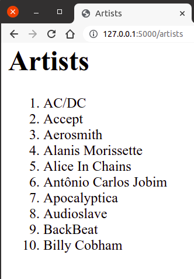

Коришћење база података из Flask апликација
===========================================

У ранијим поглављима смо видели како се из Python програма може
приступити SQLite бази података. Иста техника се може употребити и у
склопу Flask веб-апликација. Унутар Python кода веб-апликације (код
једноставних апликација он се налази у датотеци ``app.py``) вршимо
повезивање са базом података и читање података из базе, смештајући
резултат упита у листу, која се затим прослеђује функцији
``render_template``, при чему се у шаблону налази петља ``for`` која
чита и приказује један по један податак из те листе (наравно,
ситуација може бити једноставнија, ако је резултат упита само један
податак).

Повезивање са базом и постављање упита
--------------------------------------

Да би се могло приступити SQLite бази података, потребно је прво
повезати се са базом коришћењем функције ``sqlite3.connect``. За то је
потребно да знамо апсолутну путању на којој се налази ``db`` датотека.
Једно могуће место је корени директоријум Flask апликације. Путању до
њега можемо одредити помоћу променљиве ``app.root_path``.

.. code-block:: py
                
   import os
   import sqlite3
   from flask import Flask

   app = Flask(__name__)
   
   conn = sqlite3.connect(os.path.join(app.root_path, 'baza.db'))
   # ...
   conn.close()

Подразумеваћемо убудуће да глобална променљива ``DATABASE`` садржи
путању до датотеке у којој се чува SQLite база података.
          
.. code-block:: py

   DATABASE = os.path.join(app.root_path, 'baza.db')

Повезивање је могуће урадити на самом почетку рада апликације, а везу
је могуће затворити на самом крају рада апликације, тако да све
функције које одговарају на захтеве клијената користе ту конекцију са
базом, репрезентовану глобалном променљивом. Мало елегантније решење
је то да се уместо глобалне променљиве ``conn``, веза ка бази
складишти унутар објекта (речника) ``flask.g``, који служи да чува све
глобалне податке у Flask апликацији, тако да им се онда једноставно
може приступити из било ког дела изворног кода те апликације. Глобални
подаци се чувају тако што се додели вредност произвољном пољу тог
објекта (списак поља није унапред дефинисан и програмер може да
користи која год поља жели). За складиштење конекције ка бази ми ћемо
користити поље које ћемо назвати ``flask.g._db_conn``. Можемо
дефинисати функцију ``get_db()``, која први пут када се позове
успоставља везу са базом (позивом функције ``sqlite3.connect``) и
складишти је у објекат ``flask.g``. У сваком наредном позиву те
функције, враћаће се конекција која је упамћена у ``flask.g._db_conn``
(неће се поново позивати ``sqlite3.connect``). Уместо да корисник
самостално позива функцију за затварање конекције ка бази ка крају
рада апликације, анотацијом ``@app.teardown_appcontext`` могуће је
постићи да се то аутоматски догоди.

.. literalinclude:: /../_src/02_baze/01_artist_list/app.py
    :language: python
    :lines: 9-17

       
Са овако дефинисаним функцијама, курсор који се може користити за
постављање упита се може једноставно добити позивом
``get_db().cursor()``. На пример, на наредни начин можемо приказати
списак првих 10 извођача песама (претпоставићемо да је ``db`` датотека
која садржи базу података компаније за продају музичких композиција
налази у кореном директоријуму Flask веб-апликације и да је приликом
дефинисања променљиве ``DATABASE`` наведено име ``db`` те датотеке)).

.. code-block:: py

   @app.route("/artists")
   def artists():
       cur = get_db().cursor()
       artists = cur.execute("SELECT naziv FROM izvodjac LIMIT 10").fetchall()
       return render_template("artists.html", artists=artists)
       
Унутар шаблона у петљи исписујемо податке из низа ``artists``

.. literalinclude:: /../_src/02_baze/01_artist_list/templates/artists.html
    :language: html+jinja

На слици је приказан изглед апликације када се покрене из прегледача
веба.
               

               
Поновно можемо дефинисати и помоћну функцију за постављање
упита. Функцији се прослеђује упит, параметри упита и податак о томе
да ли се жели само један ред из резултата или цео резултат упита.

.. literalinclude:: /../_src/02_baze/01_artist_list/app.py
    :language: python
    :lines: 19-26

Тада је скирпт који чита податке о првих 10 извођача још једноставнији.

.. literalinclude:: /../_src/02_baze/01_artist_list/app.py
    :language: python
    :lines: 28-
