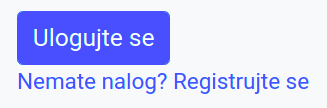

Регистрација и логовање
=======================

Формулар за регистрацију новог корисника и његова стилизација
.............................................................

Започнимо опис ове функционалности тако што ћемо прво приказати
клијентску страну дела апликације за регистрацију нових корисника.
Формулар у који нови корисник уноси своје податке дефинисан је у
засебном шаблону ``templates/register.html``.

.. literalinclude:: /../_src/03_projekat/templates/register.html
    :language: html+jinja
    :start-after: [register-form]
    :end-before: [register-form]

Изглед формулара за регистрацију је приказан на следећој слици.
       

                 
Формулар садржи следеће елементе:

- поље за унос текста у које се уноси корисничко име (``username``),
- поље за унос лозинке (``password``),
- поље за проверу лозинке тиме што се поново унесе
  (``confirm-password``),
- поље за унос имена и презимена (``name``) и
- поље за унос мејл адресе (``email``).

За унос лозинки се користи елемент ``input type="password"``, чиме се
постиже да се унети карактери не виде, за унос мејл адресе елемент
``input type="email"``, чиме се постиже аутоматска провера исправности
унете мејл адресе, док се за остале податке користи ``input
type="text"``. Уз свако поље за унос текста налази се и посебан
елемент ``div`` који садржи поруку која ће се приказати у случају да
се након валидације на клијентској утврди да нешто није коректно унето
(више речи о валидацији биће дато у наставку).

Уз елементе за унос података наводимо и атрибуте ``autocomplete``,
којима прегледачу указујемо на значење података које се у то поље
уписује (да ли је у питању поље за унос имена, адресе, мејл адресе,
лозинке и слично). Ти атрибути корисницима омогућавају да већину поља
аутоматски попуне. Наиме, савремени прегледачи могу да упамте основне
податке о сваком кориснику, попут имена, адресе, мејл адресе и
слично. Када је коришћењем атрибута ``autocomplete`` експлицитно
означено чему служи које поље, прегледач који зна личне податке
корисника може једноставно аутоматски до попуни та поља.

Стилизација формулара урађена је помоћу библиотеке Bootstrap.

- За сваки појединачни податак који се уноси креиран је елемент
  ``div`` који садржи контроле за унос тог податка (то је пар контрола
  које чини натпис тј. елемент ``label`` и поље за унос текста
  тј. елемент ``input``). Сваки такав елемент ``div`` добио је класу
  ``form-group`` која служи за груписање елемената формулара и класу
  ``row`` којом се подешава да садржај треба да се приказује у врсти
  тј. натписи треба да стоје у истом реду као и поље за унос текста,
  уместо једно испод другог).

- Сваком натпису је постављена класа ``col-form-label`` која се
  користи за натписе у формулару и класа ``col-md-2`` којом се постиже
  да ширина натипса буде једна шестина ширине окружујућег контејнера
  (подсетимо се, Bootstrap дели контејнер на 12 колона, а ширина
  натписа је овом класом постављена на две колоне).

- Поља за унос текста су стављена у посебан елемент ``div`` класе
  ``col-md-4`` чиме се постиже да њихова ширина буде трећина ширине
  окружујућег контејнера (заузимају 4 од 12 колона). Пошто се у том
  елементу налазе и поље за унос података и порука о грешци, вероватно
  је да оне неће моћи да се сложе једно поред другог, већ ће се поруке
  о грешкама приказивати испод поља за унос података.

- Дугме ``submit`` добија Bootstrap класе ``btn`` и ``btn-primary``
  које одређују његов изглед (али не и функционалност).

Неки атрибути који су употребљени у овом формулару се односе на
валидацију података из тог формулара и биђе описани у наставку (такви
су, на пример, ``required``, ``minlength`` и ``invalid-feedback``).

Валидација формулара на клијентској страни
..........................................

Имплементирајмо и валидацију формулара на клијентској страни, помоћу
језика JavaScript. На наредној слици приказан је изглед формулара
након валидације.
  
.. image:: ../../_images/projekat_04_validacija_formulara.png
   :width: 450
   :align: center
   :alt: Изглед формулара након валидације

За основну валидацију користићемо уграђену подршку језика HTML5, док
ћемо за напреднију валидацију користити провере које сами ручно
имплементирамо у језику JavaScript.

- Ниједно поље не сме да остане празно, па свим пољима додајемо
  атрибут ``required``.

- Провера исправности мејл адресе се аутоматски врши тиме што за унос
  мејл адресе користимо поље типа ``input type="email"``.

- Инсистираћемо и да лозинка мора да садржи бар 8 карактера, што
  можемо осигурати постављањем атрибута ``minlength="8"`` у поље за
  унос лозинке.

Прегледач приликом слања података из формулара тј. притска на дугме
``submit`` аутоматски врши све провере исправности одређене HTML5
дефиницијама и приказује своје подразумеване поруке о грешкама које се
појављују у искачућим прозорчићима изнад поља за унос података (тачан
текст порука зависи од самог прегледача). Библиотека Bootstrap пружа
могућност да се у случају грешке корисницима не прикажу те
подразумеване, већ да се прикажу прилагођене поруке о грешкама и то у
за то посебно намењеним HTML елементима (уместо у искачућим
прозоричићима). У овом примеру користимо такву могућност, тако што
поред свако поља за унос података постављамо елемент ``div`` који
садржи прилагођену поруку о грешци, на српском језику. Елементи који
садрже прилагођене поруке о грешкама морају да имају класу
``invalid-feedback`` и јако је важно да буду "браћа" поља за унос (у
нашем примеру су оба деца истог окружујућег помоћног елемента
``div``). Могуће је и да се у случају иправног уноса података у поља
формулара кориснику прикажу прилагођене поруке о томе. Ти елементи
треба да имају класу ``valid-feedback`` и такође треба да буду "браћа"
поља за унос.

Пошто ми не желимо да се слањем формулара аутоматски прикажу
подразумеване поруке о грешкама (јер смо припремили прилагођене
поруке), формулару додајемо атрибут ``novalidate``. Када то урадимо
провера и приказ подразумеваних порука о грешакама се неће вршити
аутоматски приликом слања података из формулара тј. притиска на дугме
``submit``, али ћемо и даље у склопу JavaScript скрипта моћи да
одреагујемо на догађај ``submit`` и тада позовемо функцију
``checkValidity``, којом ћемо активирати уграђену HTML5 валидацију. Та
функција ће нам вратити ``true`` ако и само ако су сва поља исправно
попуњена. Приликом провере валидности, током позива функције
``checkValidity``, прегледач ће поља која су исправна означити
псеудокласом ``:valid`` а она која нису исправна псеудокласом
``:invalid`` и аутоматски ће свим пољима придружити подразумеване
поруке о грешкама (у случају исправних података подразумевано се не
приказује никаква порука). Библиотека Bootstrap неће те поруке
приказати (приказаће се поруке које се налазе у елементима означеним
класама ``valid-feedback`` и ``invalid-feedback``), али ће на основу
псеудокласа ``:valid`` и ``:invalid`` додељених пољима за унос
података стилизовати та поља и одабраће које поруке треба да се
прикажу.

Поред уграђене валидације попуњености свих поља, исправности мејл
адресе и дужине лозинке, желимо да осигурамо да се лозинка и поновљена
лозинка поклапају.

Проверу тог додатног услова ћемо вршити у склопу JavaScript функције
``checkPassword``, коју ћемо ручно имплементирати и позивати након
позива функције ``checkValidity``. У функцији ``checkPassword`` ћемо
имати потребу да променимо статус исправности неког поља
(тј. псеудокласу која му је додељена). Заиста, могуће је, на пример,
да је прегледач поље за поновљену лозинку означио као исправно, јер је
непразно, а ми желимо да га означимо као неисправно, јер смо накнадном
провером утврдили да се лозинке не поклапају. То можемо да урадимо
методом ``setCustomValidity``. Ако овој методи проследимо неку
непразну ниску, поље се означава као неисправно (добија псеудокласу
``:invalid``) и та ниска му се придружује као порука о грешци (додуше,
ми те поруке не приказујемо). Ако проследимо празну ниску, то поље се
означава као исправно (добија псеудокласу ``:valid``).

Да резимирамо, валидацију формулара вршићемо када се притисне дугме
``submit``. Реаговаћемо на тај догађај и у склопу његове обраде позове
метода ``checkValidity()`` којом се врши уграђена валидација. Одмах
након уграђених провера, позваћемо и функцију ``checkPassword`` којом
ћемо проверити једнакост лозинки. Ако било која провера валидности не
успе, методом ``event.preventDefault()`` зауставићемо слање података
из формулара.

Да би библиотека Bootstrap кренула да стилизује поља и приказује
поруке у складу са исходом провере о грешкама, формулар мора да добије
класу ``was-validated``. Тај атрибут ћемо формулару доделити након што
је извршена валидација (било успешно, било неуспешно), на крају
функције којом се реагује на догађај ``submit``.

На крају, додајмо да се провера једнакости лозинки не врши само када
се шаљу подаци из формулара, већ сваки пут када се нека од две унете
лозинке промени. То можемо остварити тако што позив функције
``checkPassword`` региструјемо као реакцију на догађај подизања
тастера тастатуре у неком од поља за унос лозинке.

Иако у функцији ``checkPassword`` променимо статус валидације методом
``setCustomValidity``, тај статус се неће приказивати све док се
формулару не дода класа ``was-validated``, тј. док се не притисне
дугме ``submit``. Ако бисмо класу ``was-validated`` формулару додали
унутар функције ``checkPassword``, приказале би се грешке за сва поља
у формулару, а то не желимо, јер док попуњавамо лозинку остала поља
нису још попуњена и нема потребе да се због тога приказују
грешке. Један начин да се прикаже статус исправности само за поља за
унос лозинки је да уместо коришћења псеудокласа ``valid`` и
``invalid`` које су део уграђеног HTML5 механизма валидације,
употребимо посебне Bootstrap класе за стилизацију поља за унос
података. Исправним пољима ћемо додати класу ``is-valid``, а
неисправним класу ``is-invalid``. Додељивањем ових класа, статус
исправности поља се приказује одмах, без обзира на то да ли формулар
има класу ``was-validated`` или нема. У случају конфликта предност
имају пседуокласе које су део HTML5 валидације. Дакле, ако елемент има
Bootstrap класу ``is-valid``, али псеудокласу ``invalid`` која му је
постављена током рада методе ``checkValidity`` или методом
``setCustomValidity``, он ће бити приказан као неисправан. Зато је уз
додељивање класа ``is-valid`` тј. ``is-invalid`` и даље потребно
позивати и методу ``setCustomValidity`` (до тренутка док се не кликне
дугме ``submit``, класе су те које одређују стилизацију, а након тог
тренутка, када се формулару дода класа ``was-validated``, псеудокласе
преузимају ту улогу).

На основу свега реченог долазимо до следећег JavaScript скрипта за
клијентску валидацију.

.. literalinclude:: /../_src/03_projekat/templates/register.html
    :language: html+jinja
    :start-after: [register-form-client-validation]
    :end-before: [register-form-client-validation]

Табела о корисницима
....................

Податке о свим регистрованим корисницима ћемо чувати у склопу базе
података у табели ``user``, која је дефинисана на следећи начин.

.. code-block:: sql

   CREATE TABLE user (
       username VARCHAR (60) PRIMARY KEY,
       password VARCHAR (32),
       name     VARCHAR (50),
       email    VARCHAR (50) 
   );

                 
Серверски скрипт за регистрацију
................................

Прикажимо сада серверски део апликације. Регистрација корисника ће се
вршити путем путање ``/register``. Ако се на ту путању пошаље захтев
GET, тада се само приказује формулар за регистрацију. Са друге стране,
ако се пошаље захтев POST, тада се прво врши основна валидација тих
података на серверској страни (без обзира на то што је валидација већ
урађена на клијентској страни) и ако је све успешно, проверава се да
ли је одабрано корисничко име расположиво. Ако јесте, корисник се
региструје, пријављује се порука о успешној валидацији (коришћењем
флешованих порука), корисник се одмах логује (коришћењем сесије) и
пребацује се на главну страну сајта (коришћењем редирекције). Ако дође
до било какве грешке (серверска валидација не прође или је корисничко
име већ одабрано), пријављује се грешка (коришћењем флешованих
порука).

.. literalinclude:: /../_src/03_projekat/app.py
    :language: python
    :start-after: [register]
    :end-before: [register]

Анализирајмо укратко претходну функцију. У првој линији се она везује
за путању ``/register`` и допушта се слање захтева и преко метода GET
и преко метода POST. Основно гранање је на основу употребљеног метода.
Ако је метод очитан из поља ``request.method`` једнак ``"POST"``
обрађују се подаци из формулара, а ако није, тада знамо да је у питању
метода GET и помоћу ``render_template`` приказујемо раније описани
шаблон који садржи формулар за регистрацију (он је коришћењем
наслеђивања шаблона уклопљен у ширу веб-страну). Ако су подаци послати
преко методе POST, позивамо функцију ``validate_register_form`` којом
се врши основна провера провера тих података. Наредна, веома
једноставна, имплементација те функције само проверава да ли су сви
потребни подаци послати (наравно, овде је могуће додати додатне
провере).
                 
.. literalinclude:: /../_src/03_projekat/app.py
    :language: python
    :start-after: [validate-register-form]
    :end-before: [validate-register-form]
                 
Ако је валидација успешно извршена, очитава се предложено корисничко
име и проверава се да ли је корисничко име доступно. То се врши
наредном функцијом, која врши упит ка бази података којим се проналази
број корисника у табели ``user`` који имају то корисничко
име. Корисничко име је слободно ако и само ако је тај број корисника
једнак нули.

.. literalinclude:: /../_src/03_projekat/app.py
    :language: python
    :start-after: [username-available]
    :end-before: [username-available]

Ако је корисничко име слободно, тада прикупљамо остале податке из POST
захтева и позивамо функцију ``register_user`` која ће регистровати
корисника тако што ће податке о њему уписати у базу, у табелу
``user``. Имплементацију ове функције ћемо описати касније.

Након што региструјемо корисника аутоматски ћемо га улоговати, тако
што ћемо његово корисничко име уписати у сесију (наредбом
``session["username"] = username``). На многим сајтовима се након
регистрације очекује да корисник потврди своју мејл адресу, тако да се
логовање не врши аутоматски, већ тек након потврде мејл адресе.

На крају, позивом ``return redirect(url_for("index"))`` преусмеравамо
корисника на долазну страну сајта, која је везана за путању ``/`` и
која се приказује функцијом ``index`` (та функција само приказује
шаблон ``index.html`` који садржи опис долазне стране). Пошто смо пре
тога поставили флеш-поруку о успешном логовању, она ће бити приказана
у склопу долазне стране.

.. literalinclude:: /../_src/03_projekat/app.py
    :language: python
    :start-after: [index]
    :end-before: [index]

Ако приликом регистрације дође до неке грешке, поставља се флеш-порука
која ближе описује ту грешку и поново се приказује формулар за
регистрацију (тако што се позове ``render_html("registration.html",
...)`` чиме се шаље GET захтев за том страном). Функцији
``render_html`` се као додатни параметри шаљу подаци које је корисник
раније унео у формулар (сви осим лозинки), да би се приликом поновног
приказа формулара очувале вредности у тим пољима (изузетак је приказ
формулара након што се установи да је корисничко име већ заузето, када
се корисничко име које је било унето у формулар брише).
                 
Хеширање лозинки
................
                 
Да бисмо описали имплементацију функције за регистрацију, потребно је
да објаснимо како се лозинке обично складиште у бази. Прва идеја је да
табела садржи сирове лозинке, онакве какве су корисници унели. То
решење је катастрофално лоше са становишта безбедности података, јер
би било који упад на сајт који би омогућио злонамерним корисницима
увид у вашу базу података открио лозинке свих ваших корисника. Пошто
корисници често користе исте (или сличне) лозинке на више сајтова,
тиме би они били озбиљно угрожени.  Стога се користи техника
**хеширања лозинки**. Пре него што се лозинка упише у базу, на њу се
примени трансформација одређена неком познатом криптографском
хеш-функцијом (такве су функције md5, sha1, ...). На пример, када се
на лозинку ``pera123`` примени функција sha1, добија се хеш-вредност
``be105a6ee5530d17d9f234baa85ac846b463edd6``. Хеш-функције имају
особину да је јако лако на основу лозинке добија хеш-вредност, а да је
јако тешко (практично немогуће) на основу хеш-вредности одредити
лозинку која је дала ту хеш-вредност. Додатно, иако ове функције нису
бијективне, јако је мала вероватноћа да две различите лозинке дају
исту хеш вредност. Мале промене лозинке доводе до потпуно другачијих
хеш-вредности. Ово омогућава да се провера коректности лозинке изврши
тако што се за лозинку коју корисник унесе приликом логовања израчуна
хеш-вредност и да се онда тако добијена хеш-вредност упореди са оном
која је складиштена у бази података. Ако се хеш-вредности не поклопе,
тада је лозинка сигурно неисправна, а ако се поклопе, тада је са
вероватноћом од преко 99,99...99% лозинка исправна (каже се да је већа
вероватноћа да хардвер рачунара погреши у неком израчунавању, него да
две различите лозинке дају исту хеш вредност).

Иако хеширање наизглед решава проблем хакерског упада у табелу са
информацијама о вашим корисницима, нажалост, проблем није у потпуности
решен. Наиме, људи јако често користе неке лозинке које су правилне и
које се једноставно памте. Истраживања показују да су 10 најчешће
коришћених лозинки ``123456``, ``123456789``, ``qwerty``,
``password``, ``12345``, ``qwerty123``, ``1q2w3e`` и
``12345678``. Често се користе и имена, комбинације имена и година или
датума рођења и слично. На интернету су доступне табеле (тзв. *rainbow
tables*) које садрже огромне листе хеш-вредности за огроман број
лозинки за које се могу претпоставити да ће бити често коришћене.
Помоћу тих табела и откривених хеш-вредности јако лако могу
реконструисати често коришћене лозинке.

Заштита од напада овог типа је да се пре хеширања лозинке „засоле”. То
значи да се лозинкама дода нека помоћна ниска карактера тј. бајтова
(тзв. „со”). Препоручује се да се за сваку лозинку употреби посебна,
насумично генерисана „со”. „Со” није тајни податак, па се може
сачувати у бази података уз саму лозинку.

У нашој имплементацији хеширање и „сољење” лозинки је извршено
коришћењем библиотеке ``bcrypt``. Функција ``bcrypt.gensalt()``
насумично генерише „со” за тренутну лозинку (добијена „со” је низ
бајтова). Након тога функција ``bcrypt.hashpw`` на основу лозинке и
соли гради ниску која садржи хеш-вредност и „со” (оне се спајају у
једну ниску карактера), која се може уписати у базу на поље предвиђено
за унос лозинке.

На основу свега изреченог, долазимо до следеће имплементације функције
за регистрацију новог корисника.

.. literalinclude:: /../_src/03_projekat/app.py
    :language: python
    :start-after: [register-user]
    :end-before: [register-user]

Приликом логовања врши се провера коректности лозинке. Из базе читамо
ту ниску за дато корисничко име. Ако читање не успе (јер корисничко не
постоји), пријављујемо да логовање није успело. Ако успе, онда знамо
хеш-вредност лозинке и употребљену "со" и позивом функције
``bcrypt.checkpw`` проверавамо коректност унете лозинке. Њој се
прослеђује лозинка коју је кориснику унео (у облику низа бајтова) и
ниска која чува "со" и хеш-вредност праве лозинке коју смо прочитали
из базе и она аутоматски из те ниске издваја "со", израчунава
хеш-вредност унете лозинке и упоређује је са хеш-вредношћу праве
лозинке која је издвојена из ниске прочитане из базе.

.. literalinclude:: /../_src/03_projekat/app.py
    :language: python
    :start-after: [check-login]
    :end-before: [check-login]

Дугмад за логовање/излогивање
.............................

На свакој страни сајта ћемо корисницима пружити могућност да се
улогују (ако нису улоговани) тј. да се излогују (ако су
улоговани). Проверу да ли је корисник тренутно улогован можемо
извршити провером да ли корисничко име уписано у сесију тј. да ли је
дефинисана променљива ``session["username"]``. Ако јесте, приказаћемо
дугме којим ће се активирати формулар за логовање и испод њега линк
који води ка путањи за регистрацију новог корисника
(``url_for("register")``), а ако није, приказаћемо линк који води ка
путањи за коју је везана функција за излогивање
(``url_for("logout")``).

.. literalinclude:: /../_src/03_projekat/templates/layout.html
    :language: html+jinja
    :start-after: [login-logout]
    :end-before: [login-logout]
    :dedent: 6

             
Дугме за логовање је приказано на наредној слици.
             

                 
Формулар за логовање и његова стилизација
.........................................

Кренимо од описа формулара за унос корисничког имена и лозинке. Тај
формулар ће бити приказан у оквиру модалног прозора, који се веома
једноставно реализује уз помоћ библиотеке Boostrap.

Изглед формулара у модалном прозору је приказан на следећој слици.
             

         
Модални прозор се реализује као елемент ``div`` који има класу
``modal``. Унутар њега се налази елемент ``div`` који има класу
``modal-dialog``, а унутар њега три елемента ``div``: заглавље које
има класу ``modal-header``, централни део који има класу
``modal-body`` и подножје које има класу ``modal-footer``. У заглављу
је приказан наслов и дугменце са ознаком ``×`` којом се модални прозор
може искључити (што је подешено атрибутом ``data-dismiss="modal"``). У
централном делу се налазе два поља за унос података: једно за унос
корисничког имена, а друго за унос лозинке. У подножју се налази дугме
за слање података из формулара (дугме ``submit``) и дугме за затварање
модалног прозора (што је подешено атрибутом ``data-dismiss="modal"``).

.. literalinclude:: /../_src/03_projekat/templates/layout.html
    :language: html+jinja
    :start-after: [login-form]
    :end-before: [login-form]
    :dedent: 3

Модални прозор је подразумевано сакривен и приказује се притиском на
дугме за логовање. Подсетимо се, оно је реализовано на следећи начин:

.. code-block:: html+jinja
                
      <button type="button" class="btn btn-outline-primary btn-sm"
              data-toggle="modal" data-target="#loginModal">

Параметром ``data-toggle`` постављено је да то дугме буде оно које
укључује модални прозор, док је параметром ``data-target`` постављен
идентификатор модалног прозора који ће се укључивати на ово дугме.

Валидацију овог формулара нећемо вршити на клијентској страни. Наиме,
ако се не унесу подаци или се унесу погрешни подаци одмах ће се
утврдити да корисник не може да се улогује и биће свакако пријављена
грешка.
             
Серверски скрипт за логовање и излогивање
.........................................

Логовање је везано за путању ``/login`` и функцију ``login``. Она
податке (корисничко име и лозинку прихвата преко метода POST). Ако се
овој путањи приступи преко методе GET, биће пријављена грешка (помоћу
флеш-поруке).

.. literalinclude:: /../_src/03_projekat/app.py
    :language: python
    :start-after: [login]
    :end-before: [login]

Валидација форме на серверској страни само проверава да ли су унети
корисничко име и лозинка.
                 
.. literalinclude:: /../_src/03_projekat/app.py
    :language: python
    :start-after: [validate-login-form]
    :end-before: [validate-login-form]

Ако валидација успе, тада проверавамо коректност лозинке коришћењем
функције ``check_login``, коју смо раније описали. Ако су корисничко
име и лозинка исправни, уписујемо корисничко име у сесију. У
зависности од тога да ли је корисник успешно улогован или је дошло до
неке грешке, постављамо одговарајућу флеш-поруку. У оба случаја
корисника шаљемо поново на долазну страну сајта, где ће му се та
порука приказати.

Функција којом тренутно улоговани корисник може да се излогује назива
се ``logout`` и повезана је са путањом ``/logout`` (којој се може
приступити преко GET метода, пошто јој се не преносе никакви подаци).
Из сесије се брише корисничко име и корисник се пребацује на долазну
страну сајта.

.. literalinclude:: /../_src/03_projekat/app.py
    :language: python
    :start-after: [logout]
    :end-before: [logout]
                 
