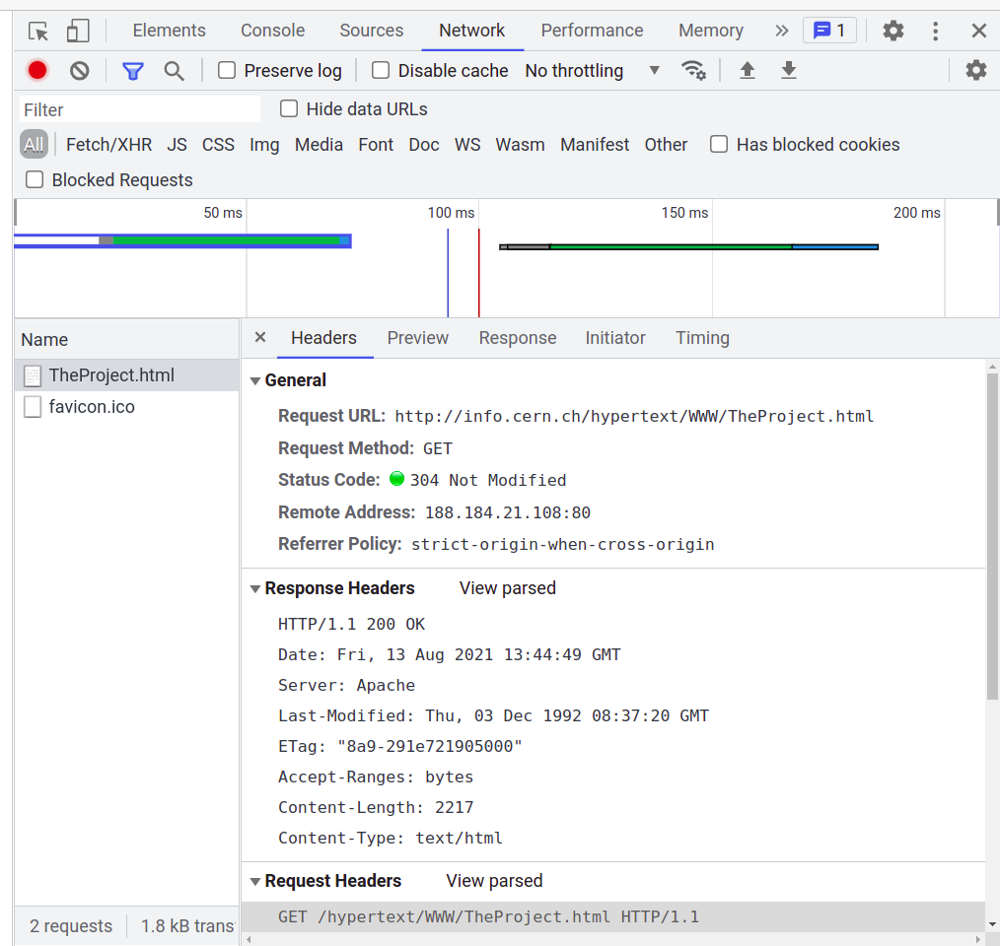

Протокол HTTP
=============

Размена информација између клијената и сервера на вебу врши се помоћу
протокола **HTTP** (енгл. **HyperText Transfer Protocol**) или
**HTTPS** (енгл. **HyperText Transfer Protocol Secure**), који пружа
додатну сигурност јер податке шаље преко мреже у криптованом
(шифрованом) облику. Ово су протоколи апликативног слоја и за даљу
комуникацију они користе услуге нижих мрежних слојева. Пошто у данашње 
време о комуникацији на нижим мрежним слојевима брине оперативни систем, 
веб-програмер не мора да води
рачуна о томе како се HTTP захтеви и HTTP одговори заиста размењују
између клијента и сервера. Са друге стране, познавање одређених детаља
протокола HTTP неопходно је за разумевање функционисања веба и за
прављење веб-апликација, па ћемо се у наставку позабавити објашњењем
основних појмова протокла HTTP.

Када се у прегледач веба унесе веб-адреса, односно URL, или се просто
кликне на неку везу, прегледач најпре рашчлањује адресу на њене саставне 
делове. На пример, ако је URL адреса 
``http://www.moja-prodavnica.com/site/products?page=3``, њени делови су:

- ``http`` -- ознака протокола који се користи за комуникацију
- ``www.moja-prodavnica.com`` -- назив веб-сервера
- ``/site/products`` -- путања до веб-стране на серверу
- ``page=3`` -- додатни параметри

На основу овога, веб прегледач зна да помоћу протокола HTTP треба да 
успостави комуникацију са веб сервером ``www.moja-prodavnica.com``. Први 
корак је прибављање IP адресе тог веб сервера слањем упита серверу имена 
домена (DNS). Након тога, веб серверу се шаље такозвани HTTP захтев с 
путањом до стране која се захтева (у овом примеру то је ``/site/products``)
и евентуално са неким додатним параметрима, ако су наведени. У нашем примеру, 
додатни параметар је ``page=3``, коју ће веб сервер очигледно да протумачи
као захтев да пошаље трећу страну списка производа.

Сервер проверава да ли постоји тражена веб-страна тј. да ли постоји
скрипт који може да је генерише и, ако постоји, шаље је клијенту у
склопу HTTP одговора. Клијент (тј. веб-прегледач) затим анализира HTML
опис стране коју је добио, приказује је и, ако се у опису спомиње
слика, аудио-запис или видео-снимак, шаљу се нови HTTP захтеви за тим
ресурсима. Зато на споријим везама можете приметити да се прво учитава
и приказује текст веб-стране, а тек касније стижу слике. Ако
веб-сервер не може да пружи захтевану страну, HTTP одговор садржи
информацију о томе. Наиме, сваки HTTP одговор садржи статус, који
клијента информише о исходу његовог захтева.

Коришћење протокола HTTP из командне линије
...........................................

Прикажимо како HTTP комуникација функционише на примеру дохватања
првог веб-сајта који је икад направљен. Веб-је настао у истраживачком
центру CERN у Швајцарској (његов творац је Тим Бернерс Ли) и први
веб-сајт је и даље доступан на сајту CERN-а, на адреси
``http://info.cern.ch/hypertext/WWW/TheProject.html``. Прва ствар коју
треба да урадимо је да отворимо HTTP конекцију ка серверу
``info.cern.ch``. То можемо урадити коришћењем апликације **telnet**.
У командној линији можемо откуцати

::

   telnet info.cern.ch 80

Број 80 је ознака порта (80 се традиционално користи као порт за HTTP
комуникацију). Добијамо следеће поруке:

::

   Trying 188.184.21.108...
   Connected to webafs706.cern.ch.
   Escape character is '^]'.

Прво нас је наш telnet клијент обавестио да је открио IP адресу
сервера (то је урадио коришћењем сервиса DNS) и након тога је покушао
да успостави комуникацију са сервером на тој IP адреси. Успешно је
успео да се повеже и након тога чека да унесемо HTTP
захтев. Најједноставнији могући захтев који можемо унети је следећи.

.. code-block:: http

   GET /hypertext/WWW/TheProject.html HTTP/1.1
   Host: info.cern.ch

Захтев почиње ознаком методе која ће се користити. У овом случају то
је метода GET, која се користи када желимо да дохватимо неку страну са
сервера (касније ће бити више речи о различитим методама). Након
тога се наводи путања до те стране. Њу можемо прочитати из
URL-а. Након тога се наводи ознака верзије HTTP протокола која ће се
користити за комуникацију (HTTP протокол се јако мало мењао кроз
историју и већ дуго година уназад се користи верзија 1.1). Након тога,
у посебној линији наводимо адресу хоста -- наиме, могуће је да
веб-сервер на некој адреси истовремено сервира више сајтова, па се
ознаком хоста појашњава ком веб-сајту (тзв. хосту) приступамо. Крај
HTTP захтева означава се једном празном линијом. Дакле, захтев шаљемо тако
што унесемо горе приказани текст и након тога два пута притиснемо
Enter. Ако смо све урадили како треба, добићемо одговор од
сервера. Прикажимо овде само један његов део.

.. code-block:: http

   HTTP/1.1 200 OK
   Date: Fri, 13 Aug 2021 09:43:35 GMT
   Server: Apache
   Last-Modified: Thu, 03 Dec 1992 08:37:20 GMT
   ETag: "8a9-291e721905000"
   Accept-Ranges: bytes
   Content-Length: 2217
   Connection: close
   Content-Type: text/html

   <HEADER>
   <TITLE>The World Wide Web project</TITLE>
   <NEXTID N="55">
   </HEADER>
   <BODY>
   <H1>World Wide Web</H1>
   The WorldWideWeb (W3) is a wide-area
   <A NAME=0 HREF="WhatIs.html">hypermedia</A> information retrieval
   initiative aiming to give universal access to a large universe of documents.
   ...
   </BODY>
   Connection closed by foreign host.

Видимо да се одговор састоји из два дела: заглавља и тела. Прва линија 
заглавља садржи статус одговора. У овом примеру све је прошло како 
треба и статусна линија је ``HTTP/1.1 200 OK``. Тело поруке је HTML опис 
веб-стране, који у својој структури такође има заглавље и тело. Узгред, 
можемо да приметимо да је овде у питању стара верзија језика HTML.
На крају је исписана порука ``Connection closed by foreign host.``.
Ова порука није део одговора, већ нас њоме наш telnet клијент 
обавештава да је сервер након слања одговора прекинуо везу. 

У случају да пошаљемо захтев за страном која не постоји, добијамо чувени 
одговор 404 (страна није пронађена). На пример, ако откуцамо:

.. code-block:: http
                
   GET /TheProject.html HTTP/1.1
   Host: info.cern.ch

на овај захтев, добијамо следећи одговор.
   
.. code-block:: http

   HTTP/1.1 404 Not Found
   Date: Fri, 13 Aug 2021 13:18:31 GMT
   Server: Apache
   Content-Length: 213
   Connection: close
   Content-Type: text/html; charset=iso-8859-1

   <!DOCTYPE HTML PUBLIC "-//IETF//DTD HTML 2.0//EN">
   <html><head>
   <title>404 Not Found</title>
   </head><body>
   <h1>Not Found</h1>
   
The requested URL /TheProject.html was not found on this server.

   </body></html>
   Connection closed by foreign host.

Статусни кодови су увек троцифрени и груписани су на основу прве
цифре.

.. csv-table::
   :header:  "кодови", "објашњење", "пример"
   :align: left

   "1xx", "информације", "100 continue, 101 switching protocols, ..."
   "2xx", "захтев је успешно обрађен", "200 OK, 201 created, 202 accepted, ..."
   "3xx", "редирекција", "301 moved permanently, ..."
   "4xx", "грешка на страни клијента", "400 bad request, 401 unathorized, 403 forbidden, 404 not found, ..."
   "5xx", "грешка на страни сервера", "500 internal sever error, ..."

Након линије у којој је описан статус одговора, обично следи неколико
линија у којима се описује сервер који је одговор послао и неки
параметри одговора. Ту је датум тј. време када је одговор послат (поље
``Date``), датум тј. време када је страна последњи пут промењена (поље
``Last-Modified``), дужина одговора у бајтовима (поље
``Content-Length``), тип одговора (поље ``Content-Type``) и
слично. Иако корисник веба не види ове податке, они су прегледачу
веома важни да би умео да протумачи садржај који следи и исправно га
приказао.

И захтев може да садржи нека додатна поља. На пример, наш прегледач
веба приликом отварања стране
``http://info.cern.ch/hypertext/WWW/TheProject.html`` шаље следећи
захтев.

.. code-block:: http

   GET /hypertext/WWW/TheProject.html HTTP/1.1
   Host: info.cern.ch
   Connection: keep-alive
   Cache-Control: max-age=0
   Upgrade-Insecure-Requests: 1
   User-Agent: Mozilla/5.0 (X11; Linux x86_64) AppleWebKit/537.36 (KHTML, like Gecko) Chrome/92.0.4515.131 Safari/537.36
   Accept: text/html,application/xhtml+xml,application/xml;q=0.9,image/avif,image/webp,image/apng,*/*;q=0.8,application/signed-exchange;v=b3;q=0.9
   Accept-Encoding: gzip, deflate
   Accept-Language: sr-RS,sr;q=0.9,en-US;q=0.8,en;q=0.7,hr;q=0.6,fr;q=0.5
   If-None-Match: "8a9-291e721905000"
   If-Modified-Since: Thu, 03 Dec 1992 08:37:20 GMT                

Основа је иста као минимални захтев који смо "пешке" формирали, међутим,
овај садржи и многа додатна поља. На пример, ``Connection:
keep-alive`` говори серверу да не треба да прекине везу када пошаље
одговор, јер ће вероватно уследити нови захтеви за додатним ресурсима
(сликама, CSS датотекама и слично), који су део веб-стране која се
добија у овом одговору. Кроз поље ``User-Agent`` прегледач се
представља серверу, кроз поља ``Accept`` наводи формате које очекује у
одговору (видимо да је први жељени формат ``text/html`` тј. HTML, а
први жељени језик ``sr-RS`` тј. српски). Веома је интересантно и поље
``If-Modified-Since: Thu, 03 Dec 1992 08:37:20 GMT``. Наиме, пошто је
ова веб-страна већ раније отварана у овом прегледачу, прегледач је у
заглављу одговора добио информацију да је страна коју је тад добио
последњи пут мењана 3. децембра 1992. године у 8 сати 37 минута и 20
секунди и сада серверу јавља да му пошаље страну поново само ако је
модификована после тог датума. Пошто није (на серверу се намерно чува
ова најстарија веб-страна у оригиналном облику), сервер не шаље
поново HTML кôд целе стране, већ само следећи одговор:

.. code-block:: http

   HTTP/1.1 304 Not Modified
   Date: Fri, 13 Aug 2021 13:56:47 GMT
   Server: Apache
   Connection: close
   ETag: "8a9-291e721905000"

Овим одговором се прегледач обавештава да страна није модификована и
да може слободно да прикаже верзију коју је раније примио и сачувао
(тзв. кеширану верзију стране). Тиме се штеди на мрежној комуникацији
и убрзава приказ веб-страна.

Многи веб-сајтови данас користе протокол **HTTPS** (*Hypertext
Transfer Protocol Secure*). Он подразумева да је пренос података
криптован тј. да се подаци шифрују пре него што се пошаљу и дешифрују
када се приме, тако да злонамерни корисник који пресретне податке
током њиховог преноса не може да разуме шта ти подаци значе. Пошто
програм telnet не користи шифровање, не можемо да га искористимо за
комуникацију коришћењем протокола HTTPS. Можемо, међутим, да употребимо
програм openssl. На пример, можемо да успоставимо HTTPS конекцију са
сајтом Википедије.

::

   openssl s_client -connect en.wikipedia.org:443

Приметимо да се уместо порта 80 користи порт 443. Након успешног
отварања конекције, можемо да пошаљемо уобичајени захтев за страном.

.. code-block:: http
                
   GET / HTTP/1.1
   Host: en.wikipedia.org

На овај захтев добијамо одговор који почиње са:

.. code-block:: http
                
   HTTP/1.1 301 Moved Permanently
   Date: Fri, 13 Aug 2021 13:25:59 GMT
   Server: mw2254.codfw.wmnet
   Location: https://en.wikipedia.org/wiki/Main_Page

Из заглавља се види да је у питању редирекција тј. да нам сервер
указује да је почетна страна на URL-у
``https://en.wikipedia.org/wiki/Main_Page`` и да до ње можемо доћи
слањем новог захтева (прегледач веба то уради не обавештавајући
корисника о томе -- ви ћете унети URL адресу ``en.wikipedia.org``, а
уместо ње ће се отворити страна
``https://en.wikipedia.org/wiki/Main_Page`` и та адреса ће бити
приказана у адресној линији).

Праћење HTTP комуникације из прегледача
.......................................

Савремени прегледачи пружају програмерима могућност да детаљно испрате
све HTTP захтеве и HTTP одговоре које прегледач шаље и прима. То се
ради у склопу конзоле за веб-програмере (енгл. web developer
console). Она се обично може укључити пречицом ``F12`` или пречицом
``Ctrl + Shift + j`` на тастатури. HTTP комуникација се може испратити
на картици ``Network``.

На наредној слици је приказана комуникација приликом захтева за
страном ``http://info.cern.ch/hypertext/WWW/TheProject.html``. Одатле
се може видети заглавље захтева (Request Headers) и статус одговора
(види се да је статус био ``304 Not Modified``, па је приказана раније
дохваћена страна и у том одговору је статус био ``200 OK`` и заглавље
је приказано у делу Response Headers).

Од како прегледачи нуде могућност детаљног прегледа HTTP комуникације,
командна линија се све мање користи у ову сврху.
