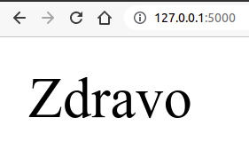

Први програм, путање
--------------------

Кренимо приказ библиотеке Flask тако што ћемо приказати
најједноставнију могућу апликацију, која само у прегледачу приказује
текст ``Zdravo`` (приликом учења програмских језика обично се крене од
ове апликације, која се на енглеском назива Hello world).

Свака иоле сложенија веб-апликација укључује неколико различитих
датотека, па је логична конвенција да се све оне чувају унутар једног
директоријума (једне фасцикле) намењеног тој
веб-апликацији. Направићемо стога директоријум под именом ``01_hello``
и у њему ћемо креирати датотеку ``app.py`` следеће садржине.

.. literalinclude:: /../_src/01_hello/app.py
    :language: python

Након тога, у командној линији се постављамо у директоријум у коме смо
креирали датотеку ``app.py`` и покрећемо Flask апликацију командом
``flask run``. Ако је све у реду, добићемо поруку

::
   
   * Environment: production
     WARNING: This is a development server. Do not use it in a production deployment.
     Use a production WSGI server instead.
   * Debug mode: off
   * Running on http://127.0.0.1:5000/ (Press CTRL+C to quit)

То значи да је наша апликација покренута на локалном рачунару и да јој
се може приступити из прегледача веба преко адресе
``http://127.0.0.1:5000/``. Када се оде на ту адресу, види се страна
која садржи само текст ``Zdravo``. Наш веб-сервер све време ради у
позадини, а можемо га прекинути комбинацијом тастера ``Ctrl + C`` у
командој линији у којој је покренут.

На слици је приказан изглед стране унутар прегледача веба.

**Ко жели да зна више?** IP адреса ``127.0.0.1`` је специјална и
означава локални рачунар. Ту IP адресу користимо када се веб-сервер
и прегледач извршавају на истом рачунару. Уместо IP адресе,
можемо користити и назив ``localhost`` који замењује име локалног рачунара. 
Број ``5000`` означава тзв. порт који ближе одређује да желимо да приступимо баш Flask
серверу тј. Flask веб-апликацији коју смо покренули. Наиме, могуће је
да на локалном рачунару ради више веб-сервера (као и других сервера) истовремено, па онда
сваки сервер бира порт на коме "слуша",
а навођењем порта се одређује којем се серверу приступа. 
Број ``5000`` је
одређен прилично произвољно и у оквиру подешавања Flask апликације је
могуће променити га (ако се, на пример, покаже да је на порту 5000 већ
покренута нека друга веб-апликација). Ако се питате шта се дешава када се у URL-у не
наведе порт, одговор је једноставан: ако на почетку URL-а стоји "http:" подразумева се порт
80 и исто тако постоји подразумеван порт за друге протоколе. Веб сервери који су јавно доступни 
обично користе подразумеване портове да би URL био једноставнији.

Анализирајмо сада изворни кôд ове једноставне апликације. Напоменимо
да је назив ``app.py`` подразумеван назив за главну програмску датотеку Flask
апликације (то може и да се промени, али у првим примерима то нећемо
радити). Свака Flask апликација је у програму представљена објектом
klase ``Flask``. Уобичајено је да тај објекат доделимо променљивој ``app`` након
што га конструишемо позивом конструктора ``Flask(...)``, коме ћемо
увек проследити вредност специјалне променљиве ``__name__`` (значење
овог параметра нема потребе да објашњавамо детаљно). Дакле, свака
Flask апликација ће почињати кодом следећег облика

.. code-block:: py

   from flask import Flask
   
   app = Flask(__name__)

Путање и рутирање
*****************

Веб-апликације обично имају више веб-страна и која страна ће бити
приказана зависи од путање у URL-y. На пример, ако
се веб-апликација налази на основној URL адреси
``http://www.moja-prodavnica.com``, посетом тој адреси се отвара
долазна страна апликације (енгл. landing page), а ако се приступи
адреси ``http://www.moja-prodavnica.com/proizvodi``, приступа се, на пример,
страни са приказом свих производа. 

Када се кроз прегледач приступа некој URL адреси, прегледач шаље HTTP захтев ка 
веб серверу у оквиру кога се извршава веб апликација. Веб апликација добија
да обради све HTTP захтеве који почињу са основном URL адресом за ту апликацију
и даље се унутар веб апликације решава који садржај ће бити враћен. 

Када користимо Flask за израду веб апликације, обрада HTTP захтева се дешава
у функцијама које смо дефинисали за ту намену, па оно што врати функција
као резултат постаје садржај HTTP одговора и приказује се у прегледачу (у сценарију када захтев долази од прегледача).

Избор функције која ће бити позвана да обради пристигли HTTP захтев у Flask-у се назива
**рутирање**. Да бисмо означили шта желимо да се рутира према одређеној функцији
потребно је да у линији
изнад дефиниције функције наведемо тзв. декоратер за рутирање који има облик ``@app.route(...)``. 

Дакле, функције које су намењене за обраду HTTP захтева препознајемо по томе
што изнад дефиниције функције стоји један или више декоратера за рутирање, као што
видимо у почетном примеру ове лекције.

У приказаном примеру, декоратером ``@app.route("/")``, функција
``index`` је повезана са захтевом облика ``"/"``, што значи да ће та
функција бити позвана када се наведе адреса нашег веб-сајта, без
икавких додатних путања унутар URL-a (кажемо да је ово адреса корена
нашег веб-сајта). То значи да ће функција ``index`` бити позвана ако
се Flask апликација покрене на локалном рачунару помоћу ``flask run``
(без постављања на неки сервер на интернету), и ако се у прегледачу
откуца URL адреса ``http://127.0.0.1:5000/``. Исто би се десило и ако
би се наша апликација поставила на интернет, на пример на домен
``www.moja-prodavnica.com`` и ако се би се у прегледачу навела адреса
``http://www.moja-prodavnica.com`` или адреса
``http://www.moja-prodavnica.com/``. Да је испред функције наведено
``@app.route("/index.html")``, функција ``index`` би била повезана са
URL-ом ``http://127.0.0.1:5000/index.html`` тј. URL-ом
``http://www.moja-prodavnica.com/index.html``.

Пошто функција ``index`` враћа ниску ``Zdravo``, то је одговор који се
шаље назад прегледачу и који се приказује.

Ако испред функције наведемо више различитих 
декоратера за рутирање онда се функција повезује са свим наведеним путањама.

Као што смо рекли, веб-апликација обично одговара на захтеве са различитим 
путањама. У наредном примеру се дефинишу две функције, при
чему се првој од њих, функцији ``home()``, придружују путање ``/``,
``/index.html`` и ``/home``, што значи да ће се приликом посета
адресама ``http://127.0.0.1:5000``,
``http://127.0.0.1:5000/index.html`` или
``http://127.0.0.1:5000/home`` у прегледачу приказати текст ``Home``.
Другој функцији (функцији ``about()``) придружена је путања
``/about``, што значи да ће се посетом адреси
``http://127.0.0.1:5000/about`` у прегледачу приказати текст
``About``.

.. literalinclude:: /../_src/01b_hello_routes/app.py
    :language: python

.. mchoice:: 01_flask_rutiranje
   :answer_a: @app.route("about")
   :answer_b: @app.route("/about")
   :answer_c: @app.route("5000/about")
   :answer_d: @app.url("/about")
   :correct: b

   Којом декорацијом треба декорисати функцију која ће се позвати када
   се унесе URL ``http://127.0.0.1:5000/about``?

.. mchoice:: 01_flask_funkcije
   :answer_a: податак типа ``bool`` и то ``True`` ако је све у реду тј.
              ``False`` ако је дошло до неке грешке
   :answer_b: нумеричку ознаку статуса захтева (нпр. 404 - page not found)
   :answer_c: не враћа ништа, него садржај стране која је одговор на
              захтев треба да испише помоћу функције ``print``
   :answer_d: ниску карактера која представља садржај стране која се
              шаље са сервера на клијент
   :correct: d

   Функције које одговарају на HTTP захтеве враћају:
   
