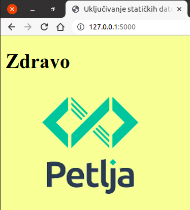

Пратеће статичке датотеке и линкови унутар веб-апликације
---------------------------------------------------------

Од раније знамо да веб-страну не чини само HTML, већ и пратеће
датотеке које се наводе у HTML-у и укључују у веб-страну (слике, видео
и аудио записи, CSS датотеке, JavaScript датотеке и слично). Чак и
када су у питању динамичке веб-стране (оне које су настале као рад
неког серверског скрипта), те пратеће датотеке често остају
**статичке** тј. сачуване су негде на серверу и према клијенту се
испоручују у неизмењеном облику. Поставља се питање како у склопу
Flask веб-апликације додајемо и користимо пратеће статичке датотеке.

Подсетимо се да се шаблони за HTML садржај страна налазе у
поддиректоријуму ``templates``. Пратеће статичке датотеке треба да
стоје у поддиректоријуму ``static``. Пример структуре и садржаја
директоријума веб-апликације би могао бити:

::

   .
   ├── app.py
   ├── templates
   │   └── index.html
   └── static
       ├── style.css
       └── logo.png

У наведеном примеру имамо две статичке датотеке, CSS стил
``style.css`` и слику ``logo.png``.

У крајњој HTML страни пратеће датотеке се наводе по релативној или
апсолутној путањи.  Међутим у оквиру HTML штаблона ми не морамо да
унапред знамо коју путању ће имати веб страна у оквиру које ће бити
примењен шаблон. Чак је могуће да се исти шаблон примени у оквиру веб
страна на различитим путањама. Због тога у шаблону не можемо да
наведемо релативан линк јер не знамо одакле креће релативна путања у
линку.  Не препоручује се ни коришћење апсолутних линкова јер постоје
ситуације када ни апсолутне путање нису унапред познате.

Зато се у шаблону може користити посебна функција под називом
``url_for`` која ће аутоматски генерисати одговарајући URL у тренутку
примене шаблона.  За линкове према статичким датотекама први аргумент
функције ``url_for`` треба да буде ниска ``'static'``, а поред тога
треба навести именовани аргумент ``filename`` са именом статичке
датотеке, на пример ``url_for('static',filename='style.css')``. Пракса
је да за запис ниске у изразима користимо апострофе, а да за вредности
HTML атрибута користимо двоструке наводнике.

Прикажимо сада цео шаблон ``index.html`` у коме се у заглављу укључује CSS
датотека ``style.css`` (из поддиректоријума ``static``), а у телу се
укључује слика ``logo.png`` (такође из поддиректоријума ``static``).

.. literalinclude:: /../_src/08_hello_url_for/templates/index.html
    :language: html+jinja

Након примене шаблона, добија се крајњи HTML садржај:

.. code-block:: html

   <!DOCTYPE html>
   <html>
      <head>
        <title>Uključivanje statičkih datoteka</title>
        <meta charset="utf-8" />
        <link rel="stylesheet" href="/static/style.css" />
      </head>
      <body>
        <h1>Zdravo</h1>
    
        
      </body>
   </html>                

Што би у прегледачу изгледало овако:
   

   
Приметимо да је функција ``url_for`` за датотеке из директоријума
``static`` генерисала URL путање ``/static/style.css`` и
``/static/log.png``. Конкретан пример би радио и да су URL-ови
директно у шаблону били написани на овај начин, али то се не
препоручује (увек је боље користити функцију ``url_for``).

Линкови унутар веб апликације
.............................

Још једна препоручена употреба функције ``url_for`` је за креирање
веза (линкова) ка другим странама исте веб-апликације. Наиме, увек је
линк могуће направити навођењем апсолутне или релативне путање до
жељене стране, међутим, пошто се путање могу мењати током одржавања
сајта, препоручује се да се URL-ови тј. путање аутоматски одреде
коришћењем функције ``url_for``. На пример, претпоставићемо да сајт
има страну ``Home``, која се добија позивом Python функције ``home()``
у датотеци ``app.py``, и страну ``About``, која се добија позивом
Python функције ``about()`` у датотеци ``app.py``.

Ако бисмо требали да направимо заједнички шаблон ``osnovni.html``
(који се наслеђује за све веб-стране на сајту) са навигационим
линковима на врху стране, шаблон би могао изгледати овако:

.. literalinclude:: /../_src/11_url_for/templates/index.html
    :language: html+jinja

Питања и задаци за вежбу
........................

.. questionnote::

   Коришћењем спољашње CSS датотеке стилизуј веб-страну која садржи
   таблицу множења (она је описана у лекцији о шаблонима).

.. fillintheblank:: flask-static-1

   Слике које се укључују у динамичке веб-стране које се граде помоћу
   библиотеке Flask би требало да се налазе унутар директоријума:

   - :static: Тачно
     :x: Покушај поново
