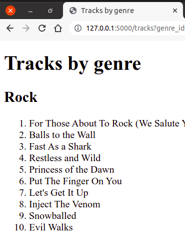

Пренос параметара упита
-----------------------

И у случају веб-апликација упити често зависе од неких параметара. На
пример, желимо да прикажемо списак композиција одабраног
жанра. Параметар је у том случају идентификатор жанра. Већ смо видели
како се креирају упити са параметрима, а видели смо и како се подаци
могу проследити са клијента до серверске апликације. Спајањем те две
технике можемо једноставно решити жељени задатак.

Претпоставимо да се идентификатор жанра прослеђује нашем северском
скрипту у склопу GET HTTP захтева. Страну ћемо отварати помоћу URL-ова
облика ``http://127.0.0.1:5000/tracks?genre_id=3``, где је
``genre_id`` идентификатор жанра. Тада у главном скрипту можемо прво
проверити да ли се заиста кључ ``genre_id`` налази међу GET
параметрима. Ако се не налази, тада пријављујемо грешку. У супротном,
читамо вредност GET параметра придружену том кључу (то је
идентификатор жанра), и затим из базе података читамо назив жанра са
тим идентификатором, као и списак од највише 10 композиција тог
жанра. Приметимо да је функција ``query_db`` коју смо дефинисали у
претходном поглављу дефинисана тако да подржава и рад са
параметризованим упитима (вредности параметара тј. аргументи упита се
наводе као њен други аргумент), као и да прослеђујући вредност
``True`` на месту њеног трећег аргумента постижемо да она врати само
један прочитани ред из базе (што користимо приликом читања назива
жанра из базе, јер може постојати само један жанр са датим
идентификатором). Након читања назива жанра из базе, проверавамо да ли
он успешно прочитан и ако није, пријављујемо грешку, јер то значи да
прослеђени идентификатор жанра није исправан. На крају прослеђујемо
податке прочитане из базе функцији ``render_template``, која на основу
шаблона формира веб-страну која се враћа као резултат упита.

.. literalinclude:: /../_src/02_baze/02_songs_by_genre/app.py
    :language: python
    :lines: 30-

Веб-страна која је одговор на овај захтев садржи или списак
композиција или поруку о грешци. И једно и друго можемо формирати
коришћењем истог шаблона ``tracks.html``.

.. literalinclude:: /../_src/02_baze/02_songs_by_genre/templates/tracks.html
    :language: html+jinja

На почетку проверавамо да ли променљива ``error`` има вредност тачно
(што се дешава када није наведен идентификатор жанра или када је
наведен идентификатор жанра) и у том случају пријављујемо грешку уз
поруку која је прослеђена кроз променљиву ``error_msg``. Ако није
дошло до грешке, тада у наслову ``h2`` приказујемо назив жанра, а
затим у петљи приказујемо један по један наслов композиције.

Након покретања ове Flask апликације, посетом адресе
``http://127.0.0.1/tracks?genre_id=1`` добија се списак првих 10 рок
композиција из базе података.

Генерисање листе линкова
************************

Променом вредности идентификатора мења се и жанр. Тренутно није јасно
како корисник треба да одабере жанр који га занима, осим да мења ручно
URL и покушава разне идентификаторе. Ово је, наравно, потребно
поправити. Једна могућност је да се направи веб-страна која садржи
линкове ка разним жанровима.

.. code-block:: html

   <ul>
      <li><a href="/tracks?genre_id=1">Rock</li>
      <li><a href="/tracks?genre_id=2">Jazz</li>
      ...
   </ul>

Наравно, називи и идентификатори жанрова зависе од садржаја у бази
података, па их није добро наводити у статичкој HTML датотеци, већ је
пожељно да се ова листа линкова динамички генерише, на основу садржаја
из базе података. Можемо дефинисати функцију ``genres`` (и
одговарајућу путању ``/genres``) која ће прочитати све идентификаторе
и називе жанрова из базе и затим их приказати коришћењем шаблона
``genres.html``).

.. literalinclude:: /../_src/02_baze/03_songs_by_genre_links/app.py
    :language: python
    :lines: 29-32

Шаблон за приказивање свих линкова се може дефинисати на следећи
начин.
            
.. literalinclude:: /../_src/02_baze/03_songs_by_genre_links/templates/genres.html
    :language: html+jinja

На слици је приказан почетак листе линкова ка жанровима која се
приказује када се страна отвори у прегледачу веба.
               
.. image:: ../../_images/flask_11_genres.png
   :align: center
   :width: 250
   :alt: Апликација покренута у прегледачу веба

         
Ово решење има неколико лоших страна. Прво, URL-ови унутар шаблона су
креирани "ручно" и ослањају се на то да ће се функција за приказ
песама одговарајућег жанра налазити на путањи ``/tracks``. Ако се то
промени, потребно је ажурирати и жаблон ``genres.html``. Ово се сматра
лошом праксом и бољи начин да се формирају URL-ови је да се користи
Flask функција ``url_for`` (њу смо већ користили, на пример, приликом
укључивања статичких датотека). Ако јој се као први параметар наведе
назив функције која обрађује захтев, функција ``url_for`` враћа путању
придружену тој функцији. Ако јој се након тога наведу још неки
именовани аргументи, они се додају као параметри URL-а који се
гради. Имајући то у виду, претходни шаблон је много боље реализовати
на следећи начин.

.. code-block:: html
                
     <ul>
       
          <li>
            <a href="{{ url_for('tracks_by_genre', genre_id=genre.GenreId) }}">
              {{ genre.naziv }}
            </a>
          </li>
       
     </ul>

Даље, постоји одређено преклапање између шаблона ``tracks.html`` и
``genres.html`` (оба шаблона садрже костур HTML датотеке, постављају
исти наслов стране и слично). Већ је речено да се овакво понављање
идентичног кода генерално сматра лошом праксом, јер отежава одржавање
(сваку промену је потребно унети на више места). Један начин да се
овај проблем реши је да уместо коришћења два шаблона, користимо само
један, тј. да унутар шаблона ``tracks.html`` гранањем (наредбом
``if``) одредимо да ли је потребно приказати листу линкова или листу
песама (то се може лако одредити на основу параметара прослеђених
функцији ``render_template``). Оваква решења, у којима се иста
функција и исти шаблон користе и за генерисање захтева и за одговор на
захтев, ћемо често користити убудуће користити, али сада, вежбе ради,
желимо да покажемо другачије решење, засновано на наслеђивању шаблона.

Заједничке делове две html датотеке издвојићемо у посебну датотеку
``index.html``.

.. literalinclude:: /../_src/02_baze/03b_songs_by_genre_links_template_inherit/templates/index.html
    :language: html+jinja

На месту који се разликује дефинишемо блок под називом ``content``,
коришћењем директиве ````. У датотеци која садржи
заједнички кôд блок ће бити празан и у свакој датотеци која дели тај
заједнички кôд, садржај тог блока ће бити дефинисан засебно, на начин
специфичан за ту датотеку.

Након тога дефинишемо датотеке ``tracks.html`` и
``genres.html``. Директивом ```` постижемо
то да оне наслеђују изворни кôд из шаблонске датотеке ``index.html``,
при чему само дефинишу садржај блока ``content``.

У датотеци ``genres.html`` блок ``content`` ће садржати списак линкова.

.. literalinclude:: /../_src/02_baze/03b_songs_by_genre_links_template_inherit/templates/genres.html
    :language: html+jinja

У датотеци ``tracks.html`` блок ``content`` ће садржати списак
композиција датог жанра (или евентуално поруку о грешци).

.. literalinclude:: /../_src/02_baze/03b_songs_by_genre_links_template_inherit/templates/tracks.html
    :language: html+jinja
