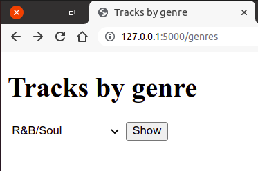
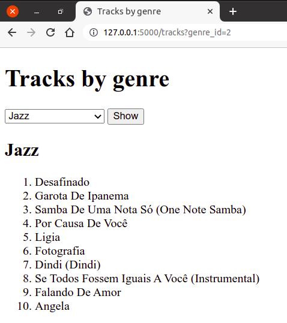

Формулари и упити ка бази података
----------------------------------

Јако често се параметри упита добијају на основу вредности које је
корисник унео у формулар. На пример, у текућем задатку уместо листе
линкова, одабир жанра можемо урадити коришћњем HTML формулара. Жанрове
је могуће бирати из падајуће листе. Подсетимо се, падајућу листу у
језику HTML можемо дефинисати на следећи начин.

.. code-block:: html

   <select name="genre_id">
     <option value="1">Rock</option>
     <option value="2">Jazz</option>
     <option value="3">Metal</option>
     ...
   </select>

Уз ову падајућу листу формулар треба да садржи и дугме ``submit``
чијим притиском проузрокујемо слање новог захтева. Приметимо да је
назив (атрибут ``name``) елемента ``select`` постављен на вредност
``genre_id``, док је вредност сваког елемента ``option`` (тј. његовог
атрибута ``value``) једнака идентификатору жанра. Тиме се постиже да
се у склопу захтева пошаље и GET параметар ``genere_id`` чија ће
вредност бити једнака идентификатору одабраног жанра (подсетимо се,
GET и POST параметри су увек комбинације ``name=value``). На крају,
нагласимо да се по тренутној организацији наше мале апликације захтев
за приказ композиција не шаље поново на путању ``/genres``, већ на
путању ``/tracks``, па је формулару (елементу ``form``) потребно
навести атрибут ``action``.
   
Имајући све ово у виду, шаблон ``genres.html`` можемо дефинисати на
следећи начин. Уместо да као вредност атрибута ``action`` напишемо
апсолутну путању ``/traks``, употребићемо функцију ``url_for`` и
навести функцију ``tracks_for_genre``, чиме постижемо мало већу
флексибилност (иако се путање промене, наша апликација ће и даље
коректно радити).

.. literalinclude:: /../_src/02_baze/04_songs_by_genre_select/templates/genres.html
   :language: html+jinja

На слици је приказан изглед формулара који садржи падајућу листу за
избор жанра и дугме ``submit``.
               

              

Апликација са само једном страном
*********************************

Наравно, апликацију можемо организовати и тако да постоји само једна
страна на којој се приказује и листа жанрова и одабране песме тог
жанра. Таква апликација може да има само једну путању (нека то буде
``/tracks``).  Када стигне захтев на ту путању, из базе се читају сви
подаци о жанровима, јер су нам они потребни за приказ формулара који
садржи падајућу листу за одабир жанрова. Ако је у захтеву није стигао
идентификатор жанра, тада приказујемо само формулар за одабир жанра. У
супротном се из базе читају и композиције тог жанра и функцији
``render_template`` се шаљу и информације о свим жанровима, али и
информација о тренутно одабраном жанру (идентификатор и назив) и
списак композиција тог жанра.

.. literalinclude:: /../_src/02_baze/04b_songs_by_genre_select_spa/app.py
   :language: python
   :lines: 29-

Шаблон је дефинисан тако да се на почетку прикаже формулар, а затим,
ако је дат идентификатор жанра онда и списак песама тог одабраног
жанра (или евентуално порука о грешци).

.. literalinclude:: /../_src/02_baze/04b_songs_by_genre_select_spa/templates/index.html
   :language: html+jinja

На слици је приказан изглед апликације када се покрене у прегледачу веба

              
Скренимо пажњу на један важан детаљ. Када се одабере жанр и притисне
дугме ``submit``, шаље се нови захтев и страна се поново учитава. У
њеном доњем делу се приказује списак композиција одабраног жанра,
међутим, у горњем делу, у формулару, у падајућој листи није одабран
тај жанр, већ онај први по реду, што може бити мало збуњујуће. Наиме,
када год се формулар учита, ако у падајућој листи није наведено да
неки елемент ``option`` треба да буде одабран, биће одабран први такав
елемент. Када се попуни формулар и резултат обраде формулара прикаже
на истој страни на којој је формулар, увек је добра пракса да тај
формулар буде попуњен на исти начин као што је био пре притиска на
дугме ``submit``.  Језик HTML омогућава да се наведе који елемент у
падајућој листи треба да буде одабран тако што се том елементу
``option`` наведе атрибут ``selected``. Зато приликом генерисања
елемената ``option`` у нашем шаблону проверавамо да ли је вредност
променљиве ``genre_id`` (то је идентификатор жанра који је био одабран
пре клика на дугме ``submit``) једнака вредности променљиве
``genre.GenreId`` (то је идентификатор жанра за који се тренутно
генерише елемент ``option``). Пошто је променљива ``genre.GenreId``
типа ``int``, тог типа треба да буде и променљива ``genre_id``. Ако се
не нагласи другачије, све променљиве прочитане из GET тј. POST захтева
имају тип ``string``. Стога приликом читања те променљиве наводимо
``request.args.get("genre_id", type=int)``, чиме се наглашава да
желимо да добијемо вредност типа ``int``.
