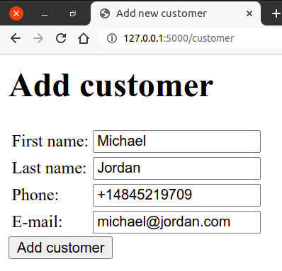
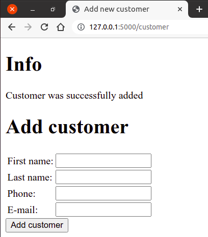

Упис података у базу
--------------------

У претходним примерима смо видели како је могуће извршити читање
података из базе, а у наредном једноставном примеру ћемо видети како
можемо извршити упис података у базу. Прикажимо како би се могла
направити страна која омогућава упис новог корисника у
базу. Претпоставићемо да се подаци о корисницима чувају у табели
``customer``, као и да за сваког корисника чувамо колоне
``CustomerId``, ``ime``, ``prezime``, ``Phone`` и ``Email`` (у
бази коју смо раније анализирали било је више колона, међутим,
једноставности ради у овом скрипту се нећемо бавити осталим колонама,
које углавном садрже податке о адреси корисника). Подаци који се
уписују у базу се најчешће прикупљају коришћењем формулара. Стога ћемо
креирати формулар у који ће корисник навести све податке о себи (осим
јединственог идентификатора, који се аутоматски додељује). Када се
попуни формулар притиска се дугме ``submit`` и шаље се POST захтев за
упис података. Захтев се прихвата, покушава се упис података у базу и
након тога се приказује страна која садржи информацију о томе да ли је
упис у базу био успешан или не и након тога формулар који омогућава
упис новог корисника.

Имајући ово у виду, можемо написати следећи шаблон стране.

.. literalinclude:: /../_src/02_baze/05_insert_customer/templates/customer.html
   :language: html+jinja

На слици је приказан изглед овог формулара када се отвори у прегледачу
веба.

              
Подразумеваћемо да се порука о томе да ли је упис успео или не
прослеђује преко променљиве ``msg``. У првом делу стране се проверава
да ли је та променљива дефинисана и ако јесте, приказује се њена
вредност. На слици је приказан изглед стране након успешног уписа
корисника у базу.

Наредни део стране садржи формулар. Приметимо да је метода којом се
преносе вредности тог формулара ``POST`` (то се постиже атрибутом
``method="POST"`` који је наведен уз елемент ``form``).

.. literalinclude:: /../_src/02_baze/05_insert_customer/app.py
   :language: python
   :lines: 20-

У Python програму дефинисана је путања ``/customer`` и функција
``customer`` која се позива када се пошаље захтев на ту путању.  Пошто
ће функција одговарати и на почетни GET захтев (тако што ће
приказивати формулар за унос новог корисника) и на касније POST
захтеве (тако што ће вршити упис података у базу), приликом
регистрације путање се наводе оба метода (наводи се ``methods=["GET",
"POST"]``). На почетку функције се проверава да ли је послат GET или
POST захтев. Ако је стигао GET захтев, само се, коришћењем шаблона,
приказује формулар. Ако је стигао POST захтев, тада је потребно
податке уписати у базу. Прво се подаци читају из параметара тог POST
захтева (подсетимо се, подацима из POST захтева се може приступити
кроз ``request.form``). Након тога се креира курсор, формира се и
извршава одговарајући упит ``INSERT`` (наравно, параметризовани, да би
се спречили напади уметања SQL-а) и врши се потврда трасакције
(позивом ``commit()``). У зависности од тога да ли је упит успео (што
утврђујемо механизмом изузетака ``try-except``) одређујемо поруку коју
је потребно приказати и позивамо ``render_template`` да прикаже ту
поруку и затим поново формулар.
