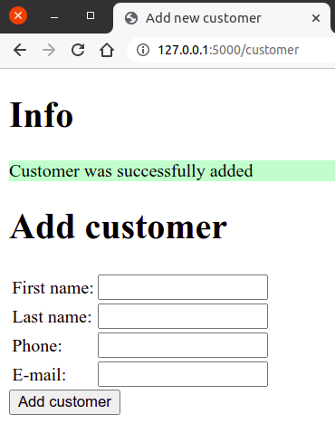

..
   Ovo nema veze sa bazama. Da li ga nekako pomeriti u poglavlje pre baza?

"Флешоване" поруке
------------------

Поруку о томе да ли је упис у базу успео смо у претходној апликацији
вршили тако што смо увели посебан параметар ``msg`` који смо
прослеђивали шаблону. Пошто је ситуација у којој кориснику треба да
буду приказане неке једнократне поруке прилично честа, библиотека
Flask нуди посебан механизам за то. У питању су такозване
**"флешоване" поруке** (енгл. *flashed messages* -- флеш означава
бљесак који се на тренутак појави и брзо нестане). Python функција
која одговара на HTTP захтев може да постави нову поруку позивом
функције ``flash``. Са друге стране, унтар шаблона се листа свих
порука може добити помоћу ``get_flashed_messages()``. Свака порука је
обична ниска карактера, при чему се порукама могу додатно придружити и
категорије које корисник дефнише (попут ``"error"``, ``"OK"`` и
слично), тако што се функцији ``flash`` проследе две ниске (прва је
текст поруке, а друга је категорија).  Тада је поруке унутар шаблона
потребно прихватити позивом функције
``get_flashed_messages(with_categories=True)``, која онда уместо листе
порука, враћа листу уређених парова где је први елемент категорија, а
други текст поруке. Када се користи наслеђивање шаблона, у главном
костуру стране се може предвидети неки простор на ком ће се
приказивати све флешоване поруке, без обзира на то из које функције
оне долазе. На тај начин се шаблони који приказују резултат рада
појединачних функција могу ослободити потребе да се баве приказивањем
једноструких порука корисницима. Прилагодимо претходну апликацију тако
да користи флешоване поруке.

Направићемо костур HTML стране у шаблону ``templates/index.html`` и на
почетку тела ћемо предвидети приказивање свих флешованих порука.

.. literalinclude:: /../_src/02_baze/05_insert_customer_flash/templates/index.html
    :language: html+jinja

Приметимо да смо употребили наредбу

.. code-block:: html+jinja

   
      ...
   

Њом постижемо да се вредност функције складишти у наведену променљиву
и користи унутар тела те наредбе (у нашем примеру смо на тај начин
формирали променљиву која садржи листу свих флешованих порука).
   
У датотеци ``templates/customer.html`` дефинишемо централни блок у ком
се само приказује формулар за унос података.
               
.. literalinclude:: /../_src/02_baze/05_insert_customer_flash/templates/customer.html
    :language: html+jinja

На крају, у самој апликацији флешоване поруке постављамо коришћењем
функције ``flash`` (наравно, она мора бити увезена у склопу директиве
``import``).

.. literalinclude:: /../_src/02_baze/05_insert_customer_flash/app.py
    :language: python
    :lines: 21-

На слици је приказан изглед флешоване поруке након успешног уписа
новог корисника у базу.

